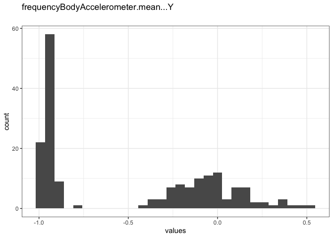
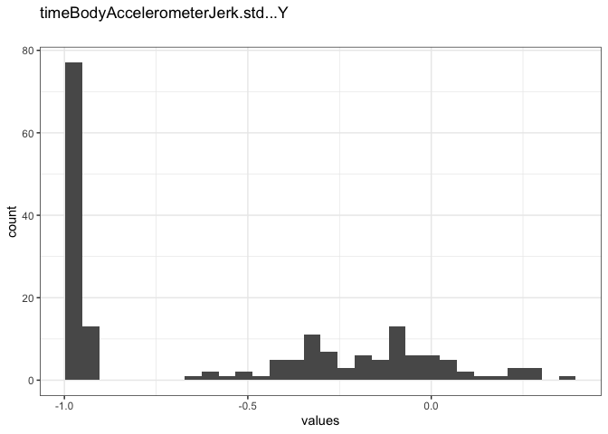
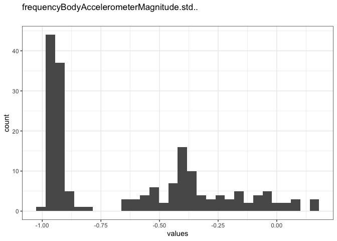

<!-- Here, we're just setting a few options. -->


<!-- Now, we're preparing our data for the codebook. -->


<!-- Create codebook -->
The file tidyDtaSet.txt contains a tidy data set with the average of each variable for each activity and each subject.

```
## No missing values.
```

```r
knitr::asis_output(data_info)
```


### Metadata

#### Description

```r
if (exists("name", meta)) {
  glue::glue(
    "__Dataset name__: {name}",
    .envir = meta)
}
```

__Dataset name__: codebook_data

```r
cat(description)
```

The dataset has N=180 rows and 81 columns.
180 rows have no missing values on any column.

<details>
<summary title="Expand this section to see some additional metadata in a structured format that is useful for search engines">Metadata for search engines</summary>


- __Date published__: 2020-04-12

```r
meta <- meta[setdiff(names(meta),
                     c("creator", "datePublished", "identifier",
                       "url", "citation", "spatialCoverage", 
                       "temporalCoverage", "description", "name"))]
pander::pander(meta)
```


  * **keywords**: _activityField_, _subject_, _timeBodyAccelerometer.mean...X_, _timeBodyAccelerometer.mean...Y_, _timeBodyAccelerometer.mean...Z_, _timeGravityAccelerometer.mean...X_, _timeGravityAccelerometer.mean...Y_, _timeGravityAccelerometer.mean...Z_, _timeBodyAccelerometerJerk.mean...X_, _timeBodyAccelerometerJerk.mean...Y_, _timeBodyAccelerometerJerk.mean...Z_, _timeBodyGyroscope.mean...X_, _timeBodyGyroscope.mean...Y_, _timeBodyGyroscope.mean...Z_, _timeBodyGyroscopeJerk.mean...X_, _timeBodyGyroscopeJerk.mean...Y_, _timeBodyGyroscopeJerk.mean...Z_, _timeBodyAccelerometerMagnitude.mean.._, _timeGravityAccelerometerMagnitude.mean.._, _timeBodyAccelerometerJerkMagnitude.mean.._, _timeBodyGyroscopeMagnitude.mean.._, _timeBodyGyroscopeJerkMagnitude.mean.._, _frequencyBodyAccelerometer.mean...X_, _frequencyBodyAccelerometer.mean...Y_, _frequencyBodyAccelerometer.mean...Z_, _frequencyBodyAccelerometer.meanFreq...X_, _frequencyBodyAccelerometer.meanFreq...Y_, _frequencyBodyAccelerometer.meanFreq...Z_, _frequencyBodyAccelerometerJerk.mean...X_, _frequencyBodyAccelerometerJerk.mean...Y_, _frequencyBodyAccelerometerJerk.mean...Z_, _frequencyBodyAccelerometerJerk.meanFreq...X_, _frequencyBodyAccelerometerJerk.meanFreq...Y_, _frequencyBodyAccelerometerJerk.meanFreq...Z_, _frequencyBodyGyroscope.mean...X_, _frequencyBodyGyroscope.mean...Y_, _frequencyBodyGyroscope.mean...Z_, _frequencyBodyGyroscope.meanFreq...X_, _frequencyBodyGyroscope.meanFreq...Y_, _frequencyBodyGyroscope.meanFreq...Z_, _frequencyBodyAccelerometerMagnitude.mean.._, _frequencyBodyAccelerometerMagnitude.meanFreq.._, _frequencyBodyAccelerometerJerkMagnitude.mean.._, _frequencyBodyAccelerometerJerkMagnitude.meanFreq.._, _frequencyBodyGyroscopeMagnitude.mean.._, _frequencyBodyGyroscopeMagnitude.meanFreq.._, _frequencyBodyGyroscopeJerkMagnitude.mean.._, _frequencyBodyGyroscopeJerkMagnitude.meanFreq.._, _timeBodyAccelerometer.std...X_, _timeBodyAccelerometer.std...Y_, _timeBodyAccelerometer.std...Z_, _timeGravityAccelerometer.std...X_, _timeGravityAccelerometer.std...Y_, _timeGravityAccelerometer.std...Z_, _timeBodyAccelerometerJerk.std...X_, _timeBodyAccelerometerJerk.std...Y_, _timeBodyAccelerometerJerk.std...Z_, _timeBodyGyroscope.std...X_, _timeBodyGyroscope.std...Y_, _timeBodyGyroscope.std...Z_, _timeBodyGyroscopeJerk.std...X_, _timeBodyGyroscopeJerk.std...Y_, _timeBodyGyroscopeJerk.std...Z_, _timeBodyAccelerometerMagnitude.std.._, _timeGravityAccelerometerMagnitude.std.._, _timeBodyAccelerometerJerkMagnitude.std.._, _timeBodyGyroscopeMagnitude.std.._, _timeBodyGyroscopeJerkMagnitude.std.._, _frequencyBodyAccelerometer.std...X_, _frequencyBodyAccelerometer.std...Y_, _frequencyBodyAccelerometer.std...Z_, _frequencyBodyAccelerometerJerk.std...X_, _frequencyBodyAccelerometerJerk.std...Y_, _frequencyBodyAccelerometerJerk.std...Z_, _frequencyBodyGyroscope.std...X_, _frequencyBodyGyroscope.std...Y_, _frequencyBodyGyroscope.std...Z_, _frequencyBodyAccelerometerMagnitude.std.._, _frequencyBodyAccelerometerJerkMagnitude.std.._, _frequencyBodyGyroscopeMagnitude.std.._ and _frequencyBodyGyroscopeJerkMagnitude.std.._

<!-- end of list -->

</details>

```r
knitr::asis_output(survey_overview)
```


## Variables

```r
if (detailed_variables || detailed_scales) {
  knitr::asis_output(paste0(scales_items, sep = "\n\n\n", collapse = "\n\n\n"))
}
```


### activityField {#activityField .tabset}


#### Distribution {#activityField_distribution}

```r
show_missing_values <- FALSE
if (has_labels(item)) {
  missing_values <- item[is.na(haven::zap_missing(item))]
  attributes(missing_values) <- attributes(item)
  if (!is.null(attributes(item)$labels)) {
    attributes(missing_values)$labels <- attributes(missing_values)$labels[is.na(attributes(missing_values)$labels)]
    attributes(item)$labels <- attributes(item)$labels[!is.na(attributes(item)$labels)]
  }
  if (is.double(item)) {
    show_missing_values <- length(unique(haven::na_tag(missing_values))) > 1
    item <- haven::zap_missing(item)
  }
  if (length(item_attributes$labels) == 0 && is.numeric(item)) {
    item <- haven::zap_labels(item)
  }
}
item_nomiss <- item[!is.na(item)]

# unnest mc_multiple and so on
if (
  is.character(item_nomiss) &&
  any(stringr::str_detect(item_nomiss, stringr::fixed(", "))) &&
  !is.null(item_info) &&
  (exists("type", item_info) && 
    any(stringr::str_detect(item_info$type, 
                            pattern = stringr::fixed("multiple"))))
  ) {
  item_nomiss <- unlist(stringr::str_split(item_nomiss, pattern = stringr::fixed(", ")))
}
attributes(item_nomiss) <- attributes(item)

old_height <- knitr::opts_chunk$get("fig.height")
non_missing_choices <- item_attributes[["labels"]]
many_labels <- length(non_missing_choices) > 7
go_vertical <- !is_numeric_or_time_var(item_nomiss) || many_labels
  
if ( go_vertical ) {
  # numeric items are plotted horizontally (because that's what usually expected)
  # categorical items are plotted vertically because we can use the screen real estate better this way

	if (is.null(choices) || 
	    dplyr::n_distinct(item_nomiss) > length(non_missing_choices)) {
		non_missing_choices <- unique(item_nomiss)
		names(non_missing_choices) <- non_missing_choices
	}
  choice_multiplier <- old_height/6.5
	new_height <- 2 + choice_multiplier * length(non_missing_choices)
	new_height <- ifelse(new_height > 20, 20, new_height)
	new_height <- ifelse(new_height < 1, 1, new_height)
	if(could_disclose_unique_values(item_nomiss) && is.character(item_nomiss)) {
	  new_height <- old_height
	}
	knitr::opts_chunk$set(fig.height = new_height)
}

wrap_at <- knitr::opts_chunk$get("fig.width") * 10
```

```r
# todo: if there are free-text choices mingled in with the pre-defined ones, don't show
# todo: show rare items if they are pre-defined
# todo: bin rare responses into "other category"
if (!length(item_nomiss)) {
  cat("No non-missing values to show.")
} else if (!could_disclose_unique_values(item_nomiss)) {
  plot_labelled(item_nomiss, item_name, wrap_at, go_vertical)
} else {
  if (is.character(item_nomiss)) {
      char_count <- stringr::str_count(item_nomiss)
      attributes(char_count)$label <- item_label
      plot_labelled(char_count, 
                    item_name, wrap_at, FALSE, trans = "log1p", "characters")
  } else {
	  cat(dplyr::n_distinct(item_nomiss), " unique, categorical values, so not shown.")
  }
}
```

<!-- -->

```r
knitr::opts_chunk$set(fig.height = old_height)
```

0 missing values.

#### Summary statistics {#activityField_summary}

```r
attributes(item) <- item_attributes
df = data.frame(item, stringsAsFactors = FALSE)
names(df) = html_item_name
escaped_table(codebook_table(df))
```


name            data_type   ordered   value_labels                                                                                                 n_missing   complete_rate   n_unique  top_counts                           label 
--------------  ----------  --------  ----------------------------------------------------------------------------------------------------------  ----------  --------------  ---------  -----------------------------------  ------
activityField   factor      FALSE     1. LAYING,<br>2. SITTING,<br>3. STANDING,<br>4. WALKING,<br>5. WALKING_DOWNSTAIRS,<br>6. WALKING_UPSTAIRS            0               1          6  LAY: 30, SIT: 30, STA: 30, WAL: 30   NA    

```r
if (show_missing_values) {
  plot_labelled(missing_values, item_name, wrap_at)
}
```

```r
if (!is.null(item_info)) {
  # don't show choices again, if they're basically same thing as value labels
  if (!is.null(choices) && !is.null(item_info$choices) && 
    all(names(na.omit(choices)) == item_info$choices) &&
    all(na.omit(choices) == names(item_info$choices))) {
    item_info$choices <- NULL
  }
  item_info$label_parsed <- 
    item_info$choice_list <- item_info$study_id <- item_info$id <- NULL
  pander::pander(item_info)
}
```

```r
if (!is.null(choices) && length(choices) && length(choices) < 30) {
	pander::pander(as.list(choices))
}
```


### subject {#subject .tabset}


#### Distribution {#subject_distribution}

```r
show_missing_values <- FALSE
if (has_labels(item)) {
  missing_values <- item[is.na(haven::zap_missing(item))]
  attributes(missing_values) <- attributes(item)
  if (!is.null(attributes(item)$labels)) {
    attributes(missing_values)$labels <- attributes(missing_values)$labels[is.na(attributes(missing_values)$labels)]
    attributes(item)$labels <- attributes(item)$labels[!is.na(attributes(item)$labels)]
  }
  if (is.double(item)) {
    show_missing_values <- length(unique(haven::na_tag(missing_values))) > 1
    item <- haven::zap_missing(item)
  }
  if (length(item_attributes$labels) == 0 && is.numeric(item)) {
    item <- haven::zap_labels(item)
  }
}
item_nomiss <- item[!is.na(item)]

# unnest mc_multiple and so on
if (
  is.character(item_nomiss) &&
  any(stringr::str_detect(item_nomiss, stringr::fixed(", "))) &&
  !is.null(item_info) &&
  (exists("type", item_info) && 
    any(stringr::str_detect(item_info$type, 
                            pattern = stringr::fixed("multiple"))))
  ) {
  item_nomiss <- unlist(stringr::str_split(item_nomiss, pattern = stringr::fixed(", ")))
}
attributes(item_nomiss) <- attributes(item)

old_height <- knitr::opts_chunk$get("fig.height")
non_missing_choices <- item_attributes[["labels"]]
many_labels <- length(non_missing_choices) > 7
go_vertical <- !is_numeric_or_time_var(item_nomiss) || many_labels
  
if ( go_vertical ) {
  # numeric items are plotted horizontally (because that's what usually expected)
  # categorical items are plotted vertically because we can use the screen real estate better this way

	if (is.null(choices) || 
	    dplyr::n_distinct(item_nomiss) > length(non_missing_choices)) {
		non_missing_choices <- unique(item_nomiss)
		names(non_missing_choices) <- non_missing_choices
	}
  choice_multiplier <- old_height/6.5
	new_height <- 2 + choice_multiplier * length(non_missing_choices)
	new_height <- ifelse(new_height > 20, 20, new_height)
	new_height <- ifelse(new_height < 1, 1, new_height)
	if(could_disclose_unique_values(item_nomiss) && is.character(item_nomiss)) {
	  new_height <- old_height
	}
	knitr::opts_chunk$set(fig.height = new_height)
}

wrap_at <- knitr::opts_chunk$get("fig.width") * 10
```

```r
# todo: if there are free-text choices mingled in with the pre-defined ones, don't show
# todo: show rare items if they are pre-defined
# todo: bin rare responses into "other category"
if (!length(item_nomiss)) {
  cat("No non-missing values to show.")
} else if (!could_disclose_unique_values(item_nomiss)) {
  plot_labelled(item_nomiss, item_name, wrap_at, go_vertical)
} else {
  if (is.character(item_nomiss)) {
      char_count <- stringr::str_count(item_nomiss)
      attributes(char_count)$label <- item_label
      plot_labelled(char_count, 
                    item_name, wrap_at, FALSE, trans = "log1p", "characters")
  } else {
	  cat(dplyr::n_distinct(item_nomiss), " unique, categorical values, so not shown.")
  }
}
```

<!-- -->

```r
knitr::opts_chunk$set(fig.height = old_height)
```

0 missing values.

#### Summary statistics {#subject_summary}

```r
attributes(item) <- item_attributes
df = data.frame(item, stringsAsFactors = FALSE)
names(df) = html_item_name
escaped_table(codebook_table(df))
```


name      data_type    n_missing   complete_rate  min   median   max    mean         sd  hist    label 
--------  ----------  ----------  --------------  ----  -------  ----  -----  ---------  ------  ------
subject   numeric              0               1  1     16       30     15.5   8.679585  ▇▇▇▇▇   NA    

```r
if (show_missing_values) {
  plot_labelled(missing_values, item_name, wrap_at)
}
```

```r
if (!is.null(item_info)) {
  # don't show choices again, if they're basically same thing as value labels
  if (!is.null(choices) && !is.null(item_info$choices) && 
    all(names(na.omit(choices)) == item_info$choices) &&
    all(na.omit(choices) == names(item_info$choices))) {
    item_info$choices <- NULL
  }
  item_info$label_parsed <- 
    item_info$choice_list <- item_info$study_id <- item_info$id <- NULL
  pander::pander(item_info)
}
```

```r
if (!is.null(choices) && length(choices) && length(choices) < 30) {
	pander::pander(as.list(choices))
}
```


### timeBodyAccelerometer.mean...X {#timeBodyAccelerometer_mean___X .tabset}


#### Distribution {#timeBodyAccelerometer_mean___X_distribution}

```r
show_missing_values <- FALSE
if (has_labels(item)) {
  missing_values <- item[is.na(haven::zap_missing(item))]
  attributes(missing_values) <- attributes(item)
  if (!is.null(attributes(item)$labels)) {
    attributes(missing_values)$labels <- attributes(missing_values)$labels[is.na(attributes(missing_values)$labels)]
    attributes(item)$labels <- attributes(item)$labels[!is.na(attributes(item)$labels)]
  }
  if (is.double(item)) {
    show_missing_values <- length(unique(haven::na_tag(missing_values))) > 1
    item <- haven::zap_missing(item)
  }
  if (length(item_attributes$labels) == 0 && is.numeric(item)) {
    item <- haven::zap_labels(item)
  }
}
item_nomiss <- item[!is.na(item)]

# unnest mc_multiple and so on
if (
  is.character(item_nomiss) &&
  any(stringr::str_detect(item_nomiss, stringr::fixed(", "))) &&
  !is.null(item_info) &&
  (exists("type", item_info) && 
    any(stringr::str_detect(item_info$type, 
                            pattern = stringr::fixed("multiple"))))
  ) {
  item_nomiss <- unlist(stringr::str_split(item_nomiss, pattern = stringr::fixed(", ")))
}
attributes(item_nomiss) <- attributes(item)

old_height <- knitr::opts_chunk$get("fig.height")
non_missing_choices <- item_attributes[["labels"]]
many_labels <- length(non_missing_choices) > 7
go_vertical <- !is_numeric_or_time_var(item_nomiss) || many_labels
  
if ( go_vertical ) {
  # numeric items are plotted horizontally (because that's what usually expected)
  # categorical items are plotted vertically because we can use the screen real estate better this way

	if (is.null(choices) || 
	    dplyr::n_distinct(item_nomiss) > length(non_missing_choices)) {
		non_missing_choices <- unique(item_nomiss)
		names(non_missing_choices) <- non_missing_choices
	}
  choice_multiplier <- old_height/6.5
	new_height <- 2 + choice_multiplier * length(non_missing_choices)
	new_height <- ifelse(new_height > 20, 20, new_height)
	new_height <- ifelse(new_height < 1, 1, new_height)
	if(could_disclose_unique_values(item_nomiss) && is.character(item_nomiss)) {
	  new_height <- old_height
	}
	knitr::opts_chunk$set(fig.height = new_height)
}

wrap_at <- knitr::opts_chunk$get("fig.width") * 10
```

```r
# todo: if there are free-text choices mingled in with the pre-defined ones, don't show
# todo: show rare items if they are pre-defined
# todo: bin rare responses into "other category"
if (!length(item_nomiss)) {
  cat("No non-missing values to show.")
} else if (!could_disclose_unique_values(item_nomiss)) {
  plot_labelled(item_nomiss, item_name, wrap_at, go_vertical)
} else {
  if (is.character(item_nomiss)) {
      char_count <- stringr::str_count(item_nomiss)
      attributes(char_count)$label <- item_label
      plot_labelled(char_count, 
                    item_name, wrap_at, FALSE, trans = "log1p", "characters")
  } else {
	  cat(dplyr::n_distinct(item_nomiss), " unique, categorical values, so not shown.")
  }
}
```

<!-- -->

```r
knitr::opts_chunk$set(fig.height = old_height)
```

0 missing values.

#### Summary statistics {#timeBodyAccelerometer_mean___X_summary}

```r
attributes(item) <- item_attributes
df = data.frame(item, stringsAsFactors = FALSE)
names(df) = html_item_name
escaped_table(codebook_table(df))
```


name                             data_type    n_missing   complete_rate  min    median   max         mean          sd  hist    label 
-------------------------------  ----------  ----------  --------------  -----  -------  ----  ----------  ----------  ------  ------
timeBodyAccelerometer.mean...X   numeric              0               1  0.22   0.28     0.3    0.2743027   0.0121646  ▁▁▂▇▂   NA    

```r
if (show_missing_values) {
  plot_labelled(missing_values, item_name, wrap_at)
}
```

```r
if (!is.null(item_info)) {
  # don't show choices again, if they're basically same thing as value labels
  if (!is.null(choices) && !is.null(item_info$choices) && 
    all(names(na.omit(choices)) == item_info$choices) &&
    all(na.omit(choices) == names(item_info$choices))) {
    item_info$choices <- NULL
  }
  item_info$label_parsed <- 
    item_info$choice_list <- item_info$study_id <- item_info$id <- NULL
  pander::pander(item_info)
}
```

```r
if (!is.null(choices) && length(choices) && length(choices) < 30) {
	pander::pander(as.list(choices))
}
```


### timeBodyAccelerometer.mean...Y {#timeBodyAccelerometer_mean___Y .tabset}


#### Distribution {#timeBodyAccelerometer_mean___Y_distribution}

```r
show_missing_values <- FALSE
if (has_labels(item)) {
  missing_values <- item[is.na(haven::zap_missing(item))]
  attributes(missing_values) <- attributes(item)
  if (!is.null(attributes(item)$labels)) {
    attributes(missing_values)$labels <- attributes(missing_values)$labels[is.na(attributes(missing_values)$labels)]
    attributes(item)$labels <- attributes(item)$labels[!is.na(attributes(item)$labels)]
  }
  if (is.double(item)) {
    show_missing_values <- length(unique(haven::na_tag(missing_values))) > 1
    item <- haven::zap_missing(item)
  }
  if (length(item_attributes$labels) == 0 && is.numeric(item)) {
    item <- haven::zap_labels(item)
  }
}
item_nomiss <- item[!is.na(item)]

# unnest mc_multiple and so on
if (
  is.character(item_nomiss) &&
  any(stringr::str_detect(item_nomiss, stringr::fixed(", "))) &&
  !is.null(item_info) &&
  (exists("type", item_info) && 
    any(stringr::str_detect(item_info$type, 
                            pattern = stringr::fixed("multiple"))))
  ) {
  item_nomiss <- unlist(stringr::str_split(item_nomiss, pattern = stringr::fixed(", ")))
}
attributes(item_nomiss) <- attributes(item)

old_height <- knitr::opts_chunk$get("fig.height")
non_missing_choices <- item_attributes[["labels"]]
many_labels <- length(non_missing_choices) > 7
go_vertical <- !is_numeric_or_time_var(item_nomiss) || many_labels
  
if ( go_vertical ) {
  # numeric items are plotted horizontally (because that's what usually expected)
  # categorical items are plotted vertically because we can use the screen real estate better this way

	if (is.null(choices) || 
	    dplyr::n_distinct(item_nomiss) > length(non_missing_choices)) {
		non_missing_choices <- unique(item_nomiss)
		names(non_missing_choices) <- non_missing_choices
	}
  choice_multiplier <- old_height/6.5
	new_height <- 2 + choice_multiplier * length(non_missing_choices)
	new_height <- ifelse(new_height > 20, 20, new_height)
	new_height <- ifelse(new_height < 1, 1, new_height)
	if(could_disclose_unique_values(item_nomiss) && is.character(item_nomiss)) {
	  new_height <- old_height
	}
	knitr::opts_chunk$set(fig.height = new_height)
}

wrap_at <- knitr::opts_chunk$get("fig.width") * 10
```

```r
# todo: if there are free-text choices mingled in with the pre-defined ones, don't show
# todo: show rare items if they are pre-defined
# todo: bin rare responses into "other category"
if (!length(item_nomiss)) {
  cat("No non-missing values to show.")
} else if (!could_disclose_unique_values(item_nomiss)) {
  plot_labelled(item_nomiss, item_name, wrap_at, go_vertical)
} else {
  if (is.character(item_nomiss)) {
      char_count <- stringr::str_count(item_nomiss)
      attributes(char_count)$label <- item_label
      plot_labelled(char_count, 
                    item_name, wrap_at, FALSE, trans = "log1p", "characters")
  } else {
	  cat(dplyr::n_distinct(item_nomiss), " unique, categorical values, so not shown.")
  }
}
```

<!-- -->

```r
knitr::opts_chunk$set(fig.height = old_height)
```

0 missing values.

#### Summary statistics {#timeBodyAccelerometer_mean___Y_summary}

```r
attributes(item) <- item_attributes
df = data.frame(item, stringsAsFactors = FALSE)
names(df) = html_item_name
escaped_table(codebook_table(df))
```


name                             data_type    n_missing   complete_rate  min      median   max              mean          sd  hist    label 
-------------------------------  ----------  ----------  --------------  -------  -------  --------  -----------  ----------  ------  ------
timeBodyAccelerometer.mean...Y   numeric              0               1  -0.041   -0.017   -0.0013    -0.0178755   0.0057712  ▁▂▇▇▁   NA    

```r
if (show_missing_values) {
  plot_labelled(missing_values, item_name, wrap_at)
}
```

```r
if (!is.null(item_info)) {
  # don't show choices again, if they're basically same thing as value labels
  if (!is.null(choices) && !is.null(item_info$choices) && 
    all(names(na.omit(choices)) == item_info$choices) &&
    all(na.omit(choices) == names(item_info$choices))) {
    item_info$choices <- NULL
  }
  item_info$label_parsed <- 
    item_info$choice_list <- item_info$study_id <- item_info$id <- NULL
  pander::pander(item_info)
}
```

```r
if (!is.null(choices) && length(choices) && length(choices) < 30) {
	pander::pander(as.list(choices))
}
```


### timeBodyAccelerometer.mean...Z {#timeBodyAccelerometer_mean___Z .tabset}


#### Distribution {#timeBodyAccelerometer_mean___Z_distribution}

```r
show_missing_values <- FALSE
if (has_labels(item)) {
  missing_values <- item[is.na(haven::zap_missing(item))]
  attributes(missing_values) <- attributes(item)
  if (!is.null(attributes(item)$labels)) {
    attributes(missing_values)$labels <- attributes(missing_values)$labels[is.na(attributes(missing_values)$labels)]
    attributes(item)$labels <- attributes(item)$labels[!is.na(attributes(item)$labels)]
  }
  if (is.double(item)) {
    show_missing_values <- length(unique(haven::na_tag(missing_values))) > 1
    item <- haven::zap_missing(item)
  }
  if (length(item_attributes$labels) == 0 && is.numeric(item)) {
    item <- haven::zap_labels(item)
  }
}
item_nomiss <- item[!is.na(item)]

# unnest mc_multiple and so on
if (
  is.character(item_nomiss) &&
  any(stringr::str_detect(item_nomiss, stringr::fixed(", "))) &&
  !is.null(item_info) &&
  (exists("type", item_info) && 
    any(stringr::str_detect(item_info$type, 
                            pattern = stringr::fixed("multiple"))))
  ) {
  item_nomiss <- unlist(stringr::str_split(item_nomiss, pattern = stringr::fixed(", ")))
}
attributes(item_nomiss) <- attributes(item)

old_height <- knitr::opts_chunk$get("fig.height")
non_missing_choices <- item_attributes[["labels"]]
many_labels <- length(non_missing_choices) > 7
go_vertical <- !is_numeric_or_time_var(item_nomiss) || many_labels
  
if ( go_vertical ) {
  # numeric items are plotted horizontally (because that's what usually expected)
  # categorical items are plotted vertically because we can use the screen real estate better this way

	if (is.null(choices) || 
	    dplyr::n_distinct(item_nomiss) > length(non_missing_choices)) {
		non_missing_choices <- unique(item_nomiss)
		names(non_missing_choices) <- non_missing_choices
	}
  choice_multiplier <- old_height/6.5
	new_height <- 2 + choice_multiplier * length(non_missing_choices)
	new_height <- ifelse(new_height > 20, 20, new_height)
	new_height <- ifelse(new_height < 1, 1, new_height)
	if(could_disclose_unique_values(item_nomiss) && is.character(item_nomiss)) {
	  new_height <- old_height
	}
	knitr::opts_chunk$set(fig.height = new_height)
}

wrap_at <- knitr::opts_chunk$get("fig.width") * 10
```

```r
# todo: if there are free-text choices mingled in with the pre-defined ones, don't show
# todo: show rare items if they are pre-defined
# todo: bin rare responses into "other category"
if (!length(item_nomiss)) {
  cat("No non-missing values to show.")
} else if (!could_disclose_unique_values(item_nomiss)) {
  plot_labelled(item_nomiss, item_name, wrap_at, go_vertical)
} else {
  if (is.character(item_nomiss)) {
      char_count <- stringr::str_count(item_nomiss)
      attributes(char_count)$label <- item_label
      plot_labelled(char_count, 
                    item_name, wrap_at, FALSE, trans = "log1p", "characters")
  } else {
	  cat(dplyr::n_distinct(item_nomiss), " unique, categorical values, so not shown.")
  }
}
```

<!-- -->

```r
knitr::opts_chunk$set(fig.height = old_height)
```

0 missing values.

#### Summary statistics {#timeBodyAccelerometer_mean___Z_summary}

```r
attributes(item) <- item_attributes
df = data.frame(item, stringsAsFactors = FALSE)
names(df) = html_item_name
escaped_table(codebook_table(df))
```


name                             data_type    n_missing   complete_rate  min     median   max             mean         sd  hist    label 
-------------------------------  ----------  ----------  --------------  ------  -------  -------  -----------  ---------  ------  ------
timeBodyAccelerometer.mean...Z   numeric              0               1  -0.15   -0.11    -0.075    -0.1091638   0.009582  ▁▁▇▅▁   NA    

```r
if (show_missing_values) {
  plot_labelled(missing_values, item_name, wrap_at)
}
```

```r
if (!is.null(item_info)) {
  # don't show choices again, if they're basically same thing as value labels
  if (!is.null(choices) && !is.null(item_info$choices) && 
    all(names(na.omit(choices)) == item_info$choices) &&
    all(na.omit(choices) == names(item_info$choices))) {
    item_info$choices <- NULL
  }
  item_info$label_parsed <- 
    item_info$choice_list <- item_info$study_id <- item_info$id <- NULL
  pander::pander(item_info)
}
```

```r
if (!is.null(choices) && length(choices) && length(choices) < 30) {
	pander::pander(as.list(choices))
}
```


### timeGravityAccelerometer.mean...X {#timeGravityAccelerometer_mean___X .tabset}


#### Distribution {#timeGravityAccelerometer_mean___X_distribution}

```r
show_missing_values <- FALSE
if (has_labels(item)) {
  missing_values <- item[is.na(haven::zap_missing(item))]
  attributes(missing_values) <- attributes(item)
  if (!is.null(attributes(item)$labels)) {
    attributes(missing_values)$labels <- attributes(missing_values)$labels[is.na(attributes(missing_values)$labels)]
    attributes(item)$labels <- attributes(item)$labels[!is.na(attributes(item)$labels)]
  }
  if (is.double(item)) {
    show_missing_values <- length(unique(haven::na_tag(missing_values))) > 1
    item <- haven::zap_missing(item)
  }
  if (length(item_attributes$labels) == 0 && is.numeric(item)) {
    item <- haven::zap_labels(item)
  }
}
item_nomiss <- item[!is.na(item)]

# unnest mc_multiple and so on
if (
  is.character(item_nomiss) &&
  any(stringr::str_detect(item_nomiss, stringr::fixed(", "))) &&
  !is.null(item_info) &&
  (exists("type", item_info) && 
    any(stringr::str_detect(item_info$type, 
                            pattern = stringr::fixed("multiple"))))
  ) {
  item_nomiss <- unlist(stringr::str_split(item_nomiss, pattern = stringr::fixed(", ")))
}
attributes(item_nomiss) <- attributes(item)

old_height <- knitr::opts_chunk$get("fig.height")
non_missing_choices <- item_attributes[["labels"]]
many_labels <- length(non_missing_choices) > 7
go_vertical <- !is_numeric_or_time_var(item_nomiss) || many_labels
  
if ( go_vertical ) {
  # numeric items are plotted horizontally (because that's what usually expected)
  # categorical items are plotted vertically because we can use the screen real estate better this way

	if (is.null(choices) || 
	    dplyr::n_distinct(item_nomiss) > length(non_missing_choices)) {
		non_missing_choices <- unique(item_nomiss)
		names(non_missing_choices) <- non_missing_choices
	}
  choice_multiplier <- old_height/6.5
	new_height <- 2 + choice_multiplier * length(non_missing_choices)
	new_height <- ifelse(new_height > 20, 20, new_height)
	new_height <- ifelse(new_height < 1, 1, new_height)
	if(could_disclose_unique_values(item_nomiss) && is.character(item_nomiss)) {
	  new_height <- old_height
	}
	knitr::opts_chunk$set(fig.height = new_height)
}

wrap_at <- knitr::opts_chunk$get("fig.width") * 10
```

```r
# todo: if there are free-text choices mingled in with the pre-defined ones, don't show
# todo: show rare items if they are pre-defined
# todo: bin rare responses into "other category"
if (!length(item_nomiss)) {
  cat("No non-missing values to show.")
} else if (!could_disclose_unique_values(item_nomiss)) {
  plot_labelled(item_nomiss, item_name, wrap_at, go_vertical)
} else {
  if (is.character(item_nomiss)) {
      char_count <- stringr::str_count(item_nomiss)
      attributes(char_count)$label <- item_label
      plot_labelled(char_count, 
                    item_name, wrap_at, FALSE, trans = "log1p", "characters")
  } else {
	  cat(dplyr::n_distinct(item_nomiss), " unique, categorical values, so not shown.")
  }
}
```

<!-- -->

```r
knitr::opts_chunk$set(fig.height = old_height)
```

0 missing values.

#### Summary statistics {#timeGravityAccelerometer_mean___X_summary}

```r
attributes(item) <- item_attributes
df = data.frame(item, stringsAsFactors = FALSE)
names(df) = html_item_name
escaped_table(codebook_table(df))
```


name                                data_type    n_missing   complete_rate  min     median   max          mean          sd  hist    label 
----------------------------------  ----------  ----------  --------------  ------  -------  -----  ----------  ----------  ------  ------
timeGravityAccelerometer.mean...X   numeric              0               1  -0.68   0.92     0.97    0.6974775   0.4872534  ▁▁▁▁▇   NA    

```r
if (show_missing_values) {
  plot_labelled(missing_values, item_name, wrap_at)
}
```

```r
if (!is.null(item_info)) {
  # don't show choices again, if they're basically same thing as value labels
  if (!is.null(choices) && !is.null(item_info$choices) && 
    all(names(na.omit(choices)) == item_info$choices) &&
    all(na.omit(choices) == names(item_info$choices))) {
    item_info$choices <- NULL
  }
  item_info$label_parsed <- 
    item_info$choice_list <- item_info$study_id <- item_info$id <- NULL
  pander::pander(item_info)
}
```

```r
if (!is.null(choices) && length(choices) && length(choices) < 30) {
	pander::pander(as.list(choices))
}
```


### timeGravityAccelerometer.mean...Y {#timeGravityAccelerometer_mean___Y .tabset}


#### Distribution {#timeGravityAccelerometer_mean___Y_distribution}

```r
show_missing_values <- FALSE
if (has_labels(item)) {
  missing_values <- item[is.na(haven::zap_missing(item))]
  attributes(missing_values) <- attributes(item)
  if (!is.null(attributes(item)$labels)) {
    attributes(missing_values)$labels <- attributes(missing_values)$labels[is.na(attributes(missing_values)$labels)]
    attributes(item)$labels <- attributes(item)$labels[!is.na(attributes(item)$labels)]
  }
  if (is.double(item)) {
    show_missing_values <- length(unique(haven::na_tag(missing_values))) > 1
    item <- haven::zap_missing(item)
  }
  if (length(item_attributes$labels) == 0 && is.numeric(item)) {
    item <- haven::zap_labels(item)
  }
}
item_nomiss <- item[!is.na(item)]

# unnest mc_multiple and so on
if (
  is.character(item_nomiss) &&
  any(stringr::str_detect(item_nomiss, stringr::fixed(", "))) &&
  !is.null(item_info) &&
  (exists("type", item_info) && 
    any(stringr::str_detect(item_info$type, 
                            pattern = stringr::fixed("multiple"))))
  ) {
  item_nomiss <- unlist(stringr::str_split(item_nomiss, pattern = stringr::fixed(", ")))
}
attributes(item_nomiss) <- attributes(item)

old_height <- knitr::opts_chunk$get("fig.height")
non_missing_choices <- item_attributes[["labels"]]
many_labels <- length(non_missing_choices) > 7
go_vertical <- !is_numeric_or_time_var(item_nomiss) || many_labels
  
if ( go_vertical ) {
  # numeric items are plotted horizontally (because that's what usually expected)
  # categorical items are plotted vertically because we can use the screen real estate better this way

	if (is.null(choices) || 
	    dplyr::n_distinct(item_nomiss) > length(non_missing_choices)) {
		non_missing_choices <- unique(item_nomiss)
		names(non_missing_choices) <- non_missing_choices
	}
  choice_multiplier <- old_height/6.5
	new_height <- 2 + choice_multiplier * length(non_missing_choices)
	new_height <- ifelse(new_height > 20, 20, new_height)
	new_height <- ifelse(new_height < 1, 1, new_height)
	if(could_disclose_unique_values(item_nomiss) && is.character(item_nomiss)) {
	  new_height <- old_height
	}
	knitr::opts_chunk$set(fig.height = new_height)
}

wrap_at <- knitr::opts_chunk$get("fig.width") * 10
```

```r
# todo: if there are free-text choices mingled in with the pre-defined ones, don't show
# todo: show rare items if they are pre-defined
# todo: bin rare responses into "other category"
if (!length(item_nomiss)) {
  cat("No non-missing values to show.")
} else if (!could_disclose_unique_values(item_nomiss)) {
  plot_labelled(item_nomiss, item_name, wrap_at, go_vertical)
} else {
  if (is.character(item_nomiss)) {
      char_count <- stringr::str_count(item_nomiss)
      attributes(char_count)$label <- item_label
      plot_labelled(char_count, 
                    item_name, wrap_at, FALSE, trans = "log1p", "characters")
  } else {
	  cat(dplyr::n_distinct(item_nomiss), " unique, categorical values, so not shown.")
  }
}
```

<!-- -->

```r
knitr::opts_chunk$set(fig.height = old_height)
```

0 missing values.

#### Summary statistics {#timeGravityAccelerometer_mean___Y_summary}

```r
attributes(item) <- item_attributes
df = data.frame(item, stringsAsFactors = FALSE)
names(df) = html_item_name
escaped_table(codebook_table(df))
```


name                                data_type    n_missing   complete_rate  min     median   max           mean          sd  hist    label 
----------------------------------  ----------  ----------  --------------  ------  -------  -----  -----------  ----------  ------  ------
timeGravityAccelerometer.mean...Y   numeric              0               1  -0.48   -0.13    0.96    -0.0162128   0.3452376  ▇▇▂▁▂   NA    

```r
if (show_missing_values) {
  plot_labelled(missing_values, item_name, wrap_at)
}
```

```r
if (!is.null(item_info)) {
  # don't show choices again, if they're basically same thing as value labels
  if (!is.null(choices) && !is.null(item_info$choices) && 
    all(names(na.omit(choices)) == item_info$choices) &&
    all(na.omit(choices) == names(item_info$choices))) {
    item_info$choices <- NULL
  }
  item_info$label_parsed <- 
    item_info$choice_list <- item_info$study_id <- item_info$id <- NULL
  pander::pander(item_info)
}
```

```r
if (!is.null(choices) && length(choices) && length(choices) < 30) {
	pander::pander(as.list(choices))
}
```


### timeGravityAccelerometer.mean...Z {#timeGravityAccelerometer_mean___Z .tabset}


#### Distribution {#timeGravityAccelerometer_mean___Z_distribution}

```r
show_missing_values <- FALSE
if (has_labels(item)) {
  missing_values <- item[is.na(haven::zap_missing(item))]
  attributes(missing_values) <- attributes(item)
  if (!is.null(attributes(item)$labels)) {
    attributes(missing_values)$labels <- attributes(missing_values)$labels[is.na(attributes(missing_values)$labels)]
    attributes(item)$labels <- attributes(item)$labels[!is.na(attributes(item)$labels)]
  }
  if (is.double(item)) {
    show_missing_values <- length(unique(haven::na_tag(missing_values))) > 1
    item <- haven::zap_missing(item)
  }
  if (length(item_attributes$labels) == 0 && is.numeric(item)) {
    item <- haven::zap_labels(item)
  }
}
item_nomiss <- item[!is.na(item)]

# unnest mc_multiple and so on
if (
  is.character(item_nomiss) &&
  any(stringr::str_detect(item_nomiss, stringr::fixed(", "))) &&
  !is.null(item_info) &&
  (exists("type", item_info) && 
    any(stringr::str_detect(item_info$type, 
                            pattern = stringr::fixed("multiple"))))
  ) {
  item_nomiss <- unlist(stringr::str_split(item_nomiss, pattern = stringr::fixed(", ")))
}
attributes(item_nomiss) <- attributes(item)

old_height <- knitr::opts_chunk$get("fig.height")
non_missing_choices <- item_attributes[["labels"]]
many_labels <- length(non_missing_choices) > 7
go_vertical <- !is_numeric_or_time_var(item_nomiss) || many_labels
  
if ( go_vertical ) {
  # numeric items are plotted horizontally (because that's what usually expected)
  # categorical items are plotted vertically because we can use the screen real estate better this way

	if (is.null(choices) || 
	    dplyr::n_distinct(item_nomiss) > length(non_missing_choices)) {
		non_missing_choices <- unique(item_nomiss)
		names(non_missing_choices) <- non_missing_choices
	}
  choice_multiplier <- old_height/6.5
	new_height <- 2 + choice_multiplier * length(non_missing_choices)
	new_height <- ifelse(new_height > 20, 20, new_height)
	new_height <- ifelse(new_height < 1, 1, new_height)
	if(could_disclose_unique_values(item_nomiss) && is.character(item_nomiss)) {
	  new_height <- old_height
	}
	knitr::opts_chunk$set(fig.height = new_height)
}

wrap_at <- knitr::opts_chunk$get("fig.width") * 10
```

```r
# todo: if there are free-text choices mingled in with the pre-defined ones, don't show
# todo: show rare items if they are pre-defined
# todo: bin rare responses into "other category"
if (!length(item_nomiss)) {
  cat("No non-missing values to show.")
} else if (!could_disclose_unique_values(item_nomiss)) {
  plot_labelled(item_nomiss, item_name, wrap_at, go_vertical)
} else {
  if (is.character(item_nomiss)) {
      char_count <- stringr::str_count(item_nomiss)
      attributes(char_count)$label <- item_label
      plot_labelled(char_count, 
                    item_name, wrap_at, FALSE, trans = "log1p", "characters")
  } else {
	  cat(dplyr::n_distinct(item_nomiss), " unique, categorical values, so not shown.")
  }
}
```

<!-- -->

```r
knitr::opts_chunk$set(fig.height = old_height)
```

0 missing values.

#### Summary statistics {#timeGravityAccelerometer_mean___Z_summary}

```r
attributes(item) <- item_attributes
df = data.frame(item, stringsAsFactors = FALSE)
names(df) = html_item_name
escaped_table(codebook_table(df))
```


name                                data_type    n_missing   complete_rate  min    median   max          mean          sd  hist    label 
----------------------------------  ----------  ----------  --------------  -----  -------  -----  ----------  ----------  ------  ------
timeGravityAccelerometer.mean...Z   numeric              0               1  -0.5   0.024    0.96    0.0741279   0.2887919  ▂▇▃▁▁   NA    

```r
if (show_missing_values) {
  plot_labelled(missing_values, item_name, wrap_at)
}
```

```r
if (!is.null(item_info)) {
  # don't show choices again, if they're basically same thing as value labels
  if (!is.null(choices) && !is.null(item_info$choices) && 
    all(names(na.omit(choices)) == item_info$choices) &&
    all(na.omit(choices) == names(item_info$choices))) {
    item_info$choices <- NULL
  }
  item_info$label_parsed <- 
    item_info$choice_list <- item_info$study_id <- item_info$id <- NULL
  pander::pander(item_info)
}
```

```r
if (!is.null(choices) && length(choices) && length(choices) < 30) {
	pander::pander(as.list(choices))
}
```


### timeBodyAccelerometerJerk.mean...X {#timeBodyAccelerometerJerk_mean___X .tabset}


#### Distribution {#timeBodyAccelerometerJerk_mean___X_distribution}

```r
show_missing_values <- FALSE
if (has_labels(item)) {
  missing_values <- item[is.na(haven::zap_missing(item))]
  attributes(missing_values) <- attributes(item)
  if (!is.null(attributes(item)$labels)) {
    attributes(missing_values)$labels <- attributes(missing_values)$labels[is.na(attributes(missing_values)$labels)]
    attributes(item)$labels <- attributes(item)$labels[!is.na(attributes(item)$labels)]
  }
  if (is.double(item)) {
    show_missing_values <- length(unique(haven::na_tag(missing_values))) > 1
    item <- haven::zap_missing(item)
  }
  if (length(item_attributes$labels) == 0 && is.numeric(item)) {
    item <- haven::zap_labels(item)
  }
}
item_nomiss <- item[!is.na(item)]

# unnest mc_multiple and so on
if (
  is.character(item_nomiss) &&
  any(stringr::str_detect(item_nomiss, stringr::fixed(", "))) &&
  !is.null(item_info) &&
  (exists("type", item_info) && 
    any(stringr::str_detect(item_info$type, 
                            pattern = stringr::fixed("multiple"))))
  ) {
  item_nomiss <- unlist(stringr::str_split(item_nomiss, pattern = stringr::fixed(", ")))
}
attributes(item_nomiss) <- attributes(item)

old_height <- knitr::opts_chunk$get("fig.height")
non_missing_choices <- item_attributes[["labels"]]
many_labels <- length(non_missing_choices) > 7
go_vertical <- !is_numeric_or_time_var(item_nomiss) || many_labels
  
if ( go_vertical ) {
  # numeric items are plotted horizontally (because that's what usually expected)
  # categorical items are plotted vertically because we can use the screen real estate better this way

	if (is.null(choices) || 
	    dplyr::n_distinct(item_nomiss) > length(non_missing_choices)) {
		non_missing_choices <- unique(item_nomiss)
		names(non_missing_choices) <- non_missing_choices
	}
  choice_multiplier <- old_height/6.5
	new_height <- 2 + choice_multiplier * length(non_missing_choices)
	new_height <- ifelse(new_height > 20, 20, new_height)
	new_height <- ifelse(new_height < 1, 1, new_height)
	if(could_disclose_unique_values(item_nomiss) && is.character(item_nomiss)) {
	  new_height <- old_height
	}
	knitr::opts_chunk$set(fig.height = new_height)
}

wrap_at <- knitr::opts_chunk$get("fig.width") * 10
```

```r
# todo: if there are free-text choices mingled in with the pre-defined ones, don't show
# todo: show rare items if they are pre-defined
# todo: bin rare responses into "other category"
if (!length(item_nomiss)) {
  cat("No non-missing values to show.")
} else if (!could_disclose_unique_values(item_nomiss)) {
  plot_labelled(item_nomiss, item_name, wrap_at, go_vertical)
} else {
  if (is.character(item_nomiss)) {
      char_count <- stringr::str_count(item_nomiss)
      attributes(char_count)$label <- item_label
      plot_labelled(char_count, 
                    item_name, wrap_at, FALSE, trans = "log1p", "characters")
  } else {
	  cat(dplyr::n_distinct(item_nomiss), " unique, categorical values, so not shown.")
  }
}
```

<!-- -->

```r
knitr::opts_chunk$set(fig.height = old_height)
```

0 missing values.

#### Summary statistics {#timeBodyAccelerometerJerk_mean___X_summary}

```r
attributes(item) <- item_attributes
df = data.frame(item, stringsAsFactors = FALSE)
names(df) = html_item_name
escaped_table(codebook_table(df))
```


name                                 data_type    n_missing   complete_rate  min     median   max          mean         sd  hist    label 
-----------------------------------  ----------  ----------  --------------  ------  -------  -----  ----------  ---------  ------  ------
timeBodyAccelerometerJerk.mean...X   numeric              0               1  0.043   0.076    0.13    0.0794736   0.012588  ▁▇▃▂▁   NA    

```r
if (show_missing_values) {
  plot_labelled(missing_values, item_name, wrap_at)
}
```

```r
if (!is.null(item_info)) {
  # don't show choices again, if they're basically same thing as value labels
  if (!is.null(choices) && !is.null(item_info$choices) && 
    all(names(na.omit(choices)) == item_info$choices) &&
    all(na.omit(choices) == names(item_info$choices))) {
    item_info$choices <- NULL
  }
  item_info$label_parsed <- 
    item_info$choice_list <- item_info$study_id <- item_info$id <- NULL
  pander::pander(item_info)
}
```

```r
if (!is.null(choices) && length(choices) && length(choices) < 30) {
	pander::pander(as.list(choices))
}
```


### timeBodyAccelerometerJerk.mean...Y {#timeBodyAccelerometerJerk_mean___Y .tabset}


#### Distribution {#timeBodyAccelerometerJerk_mean___Y_distribution}

```r
show_missing_values <- FALSE
if (has_labels(item)) {
  missing_values <- item[is.na(haven::zap_missing(item))]
  attributes(missing_values) <- attributes(item)
  if (!is.null(attributes(item)$labels)) {
    attributes(missing_values)$labels <- attributes(missing_values)$labels[is.na(attributes(missing_values)$labels)]
    attributes(item)$labels <- attributes(item)$labels[!is.na(attributes(item)$labels)]
  }
  if (is.double(item)) {
    show_missing_values <- length(unique(haven::na_tag(missing_values))) > 1
    item <- haven::zap_missing(item)
  }
  if (length(item_attributes$labels) == 0 && is.numeric(item)) {
    item <- haven::zap_labels(item)
  }
}
item_nomiss <- item[!is.na(item)]

# unnest mc_multiple and so on
if (
  is.character(item_nomiss) &&
  any(stringr::str_detect(item_nomiss, stringr::fixed(", "))) &&
  !is.null(item_info) &&
  (exists("type", item_info) && 
    any(stringr::str_detect(item_info$type, 
                            pattern = stringr::fixed("multiple"))))
  ) {
  item_nomiss <- unlist(stringr::str_split(item_nomiss, pattern = stringr::fixed(", ")))
}
attributes(item_nomiss) <- attributes(item)

old_height <- knitr::opts_chunk$get("fig.height")
non_missing_choices <- item_attributes[["labels"]]
many_labels <- length(non_missing_choices) > 7
go_vertical <- !is_numeric_or_time_var(item_nomiss) || many_labels
  
if ( go_vertical ) {
  # numeric items are plotted horizontally (because that's what usually expected)
  # categorical items are plotted vertically because we can use the screen real estate better this way

	if (is.null(choices) || 
	    dplyr::n_distinct(item_nomiss) > length(non_missing_choices)) {
		non_missing_choices <- unique(item_nomiss)
		names(non_missing_choices) <- non_missing_choices
	}
  choice_multiplier <- old_height/6.5
	new_height <- 2 + choice_multiplier * length(non_missing_choices)
	new_height <- ifelse(new_height > 20, 20, new_height)
	new_height <- ifelse(new_height < 1, 1, new_height)
	if(could_disclose_unique_values(item_nomiss) && is.character(item_nomiss)) {
	  new_height <- old_height
	}
	knitr::opts_chunk$set(fig.height = new_height)
}

wrap_at <- knitr::opts_chunk$get("fig.width") * 10
```

```r
# todo: if there are free-text choices mingled in with the pre-defined ones, don't show
# todo: show rare items if they are pre-defined
# todo: bin rare responses into "other category"
if (!length(item_nomiss)) {
  cat("No non-missing values to show.")
} else if (!could_disclose_unique_values(item_nomiss)) {
  plot_labelled(item_nomiss, item_name, wrap_at, go_vertical)
} else {
  if (is.character(item_nomiss)) {
      char_count <- stringr::str_count(item_nomiss)
      attributes(char_count)$label <- item_label
      plot_labelled(char_count, 
                    item_name, wrap_at, FALSE, trans = "log1p", "characters")
  } else {
	  cat(dplyr::n_distinct(item_nomiss), " unique, categorical values, so not shown.")
  }
}
```

<!-- -->

```r
knitr::opts_chunk$set(fig.height = old_height)
```

0 missing values.

#### Summary statistics {#timeBodyAccelerometerJerk_mean___Y_summary}

```r
attributes(item) <- item_attributes
df = data.frame(item, stringsAsFactors = FALSE)
names(df) = html_item_name
escaped_table(codebook_table(df))
```


name                                 data_type    n_missing   complete_rate  min      median   max           mean          sd  hist    label 
-----------------------------------  ----------  ----------  --------------  -------  -------  ------  ----------  ----------  ------  ------
timeBodyAccelerometerJerk.mean...Y   numeric              0               1  -0.039   0.0095   0.057    0.0075652   0.0135764  ▁▃▇▂▁   NA    

```r
if (show_missing_values) {
  plot_labelled(missing_values, item_name, wrap_at)
}
```

```r
if (!is.null(item_info)) {
  # don't show choices again, if they're basically same thing as value labels
  if (!is.null(choices) && !is.null(item_info$choices) && 
    all(names(na.omit(choices)) == item_info$choices) &&
    all(na.omit(choices) == names(item_info$choices))) {
    item_info$choices <- NULL
  }
  item_info$label_parsed <- 
    item_info$choice_list <- item_info$study_id <- item_info$id <- NULL
  pander::pander(item_info)
}
```

```r
if (!is.null(choices) && length(choices) && length(choices) < 30) {
	pander::pander(as.list(choices))
}
```


### timeBodyAccelerometerJerk.mean...Z {#timeBodyAccelerometerJerk_mean___Z .tabset}


#### Distribution {#timeBodyAccelerometerJerk_mean___Z_distribution}

```r
show_missing_values <- FALSE
if (has_labels(item)) {
  missing_values <- item[is.na(haven::zap_missing(item))]
  attributes(missing_values) <- attributes(item)
  if (!is.null(attributes(item)$labels)) {
    attributes(missing_values)$labels <- attributes(missing_values)$labels[is.na(attributes(missing_values)$labels)]
    attributes(item)$labels <- attributes(item)$labels[!is.na(attributes(item)$labels)]
  }
  if (is.double(item)) {
    show_missing_values <- length(unique(haven::na_tag(missing_values))) > 1
    item <- haven::zap_missing(item)
  }
  if (length(item_attributes$labels) == 0 && is.numeric(item)) {
    item <- haven::zap_labels(item)
  }
}
item_nomiss <- item[!is.na(item)]

# unnest mc_multiple and so on
if (
  is.character(item_nomiss) &&
  any(stringr::str_detect(item_nomiss, stringr::fixed(", "))) &&
  !is.null(item_info) &&
  (exists("type", item_info) && 
    any(stringr::str_detect(item_info$type, 
                            pattern = stringr::fixed("multiple"))))
  ) {
  item_nomiss <- unlist(stringr::str_split(item_nomiss, pattern = stringr::fixed(", ")))
}
attributes(item_nomiss) <- attributes(item)

old_height <- knitr::opts_chunk$get("fig.height")
non_missing_choices <- item_attributes[["labels"]]
many_labels <- length(non_missing_choices) > 7
go_vertical <- !is_numeric_or_time_var(item_nomiss) || many_labels
  
if ( go_vertical ) {
  # numeric items are plotted horizontally (because that's what usually expected)
  # categorical items are plotted vertically because we can use the screen real estate better this way

	if (is.null(choices) || 
	    dplyr::n_distinct(item_nomiss) > length(non_missing_choices)) {
		non_missing_choices <- unique(item_nomiss)
		names(non_missing_choices) <- non_missing_choices
	}
  choice_multiplier <- old_height/6.5
	new_height <- 2 + choice_multiplier * length(non_missing_choices)
	new_height <- ifelse(new_height > 20, 20, new_height)
	new_height <- ifelse(new_height < 1, 1, new_height)
	if(could_disclose_unique_values(item_nomiss) && is.character(item_nomiss)) {
	  new_height <- old_height
	}
	knitr::opts_chunk$set(fig.height = new_height)
}

wrap_at <- knitr::opts_chunk$get("fig.width") * 10
```

```r
# todo: if there are free-text choices mingled in with the pre-defined ones, don't show
# todo: show rare items if they are pre-defined
# todo: bin rare responses into "other category"
if (!length(item_nomiss)) {
  cat("No non-missing values to show.")
} else if (!could_disclose_unique_values(item_nomiss)) {
  plot_labelled(item_nomiss, item_name, wrap_at, go_vertical)
} else {
  if (is.character(item_nomiss)) {
      char_count <- stringr::str_count(item_nomiss)
      attributes(char_count)$label <- item_label
      plot_labelled(char_count, 
                    item_name, wrap_at, FALSE, trans = "log1p", "characters")
  } else {
	  cat(dplyr::n_distinct(item_nomiss), " unique, categorical values, so not shown.")
  }
}
```

<!-- -->

```r
knitr::opts_chunk$set(fig.height = old_height)
```

0 missing values.

#### Summary statistics {#timeBodyAccelerometerJerk_mean___Z_summary}

```r
attributes(item) <- item_attributes
df = data.frame(item, stringsAsFactors = FALSE)
names(df) = html_item_name
escaped_table(codebook_table(df))
```


name                                 data_type    n_missing   complete_rate  min      median    max            mean          sd  hist    label 
-----------------------------------  ----------  ----------  --------------  -------  --------  ------  -----------  ----------  ------  ------
timeBodyAccelerometerJerk.mean...Z   numeric              0               1  -0.067   -0.0039   0.038    -0.0049534   0.0134621  ▁▁▇▇▁   NA    

```r
if (show_missing_values) {
  plot_labelled(missing_values, item_name, wrap_at)
}
```

```r
if (!is.null(item_info)) {
  # don't show choices again, if they're basically same thing as value labels
  if (!is.null(choices) && !is.null(item_info$choices) && 
    all(names(na.omit(choices)) == item_info$choices) &&
    all(na.omit(choices) == names(item_info$choices))) {
    item_info$choices <- NULL
  }
  item_info$label_parsed <- 
    item_info$choice_list <- item_info$study_id <- item_info$id <- NULL
  pander::pander(item_info)
}
```

```r
if (!is.null(choices) && length(choices) && length(choices) < 30) {
	pander::pander(as.list(choices))
}
```


### timeBodyGyroscope.mean...X {#timeBodyGyroscope_mean___X .tabset}


#### Distribution {#timeBodyGyroscope_mean___X_distribution}

```r
show_missing_values <- FALSE
if (has_labels(item)) {
  missing_values <- item[is.na(haven::zap_missing(item))]
  attributes(missing_values) <- attributes(item)
  if (!is.null(attributes(item)$labels)) {
    attributes(missing_values)$labels <- attributes(missing_values)$labels[is.na(attributes(missing_values)$labels)]
    attributes(item)$labels <- attributes(item)$labels[!is.na(attributes(item)$labels)]
  }
  if (is.double(item)) {
    show_missing_values <- length(unique(haven::na_tag(missing_values))) > 1
    item <- haven::zap_missing(item)
  }
  if (length(item_attributes$labels) == 0 && is.numeric(item)) {
    item <- haven::zap_labels(item)
  }
}
item_nomiss <- item[!is.na(item)]

# unnest mc_multiple and so on
if (
  is.character(item_nomiss) &&
  any(stringr::str_detect(item_nomiss, stringr::fixed(", "))) &&
  !is.null(item_info) &&
  (exists("type", item_info) && 
    any(stringr::str_detect(item_info$type, 
                            pattern = stringr::fixed("multiple"))))
  ) {
  item_nomiss <- unlist(stringr::str_split(item_nomiss, pattern = stringr::fixed(", ")))
}
attributes(item_nomiss) <- attributes(item)

old_height <- knitr::opts_chunk$get("fig.height")
non_missing_choices <- item_attributes[["labels"]]
many_labels <- length(non_missing_choices) > 7
go_vertical <- !is_numeric_or_time_var(item_nomiss) || many_labels
  
if ( go_vertical ) {
  # numeric items are plotted horizontally (because that's what usually expected)
  # categorical items are plotted vertically because we can use the screen real estate better this way

	if (is.null(choices) || 
	    dplyr::n_distinct(item_nomiss) > length(non_missing_choices)) {
		non_missing_choices <- unique(item_nomiss)
		names(non_missing_choices) <- non_missing_choices
	}
  choice_multiplier <- old_height/6.5
	new_height <- 2 + choice_multiplier * length(non_missing_choices)
	new_height <- ifelse(new_height > 20, 20, new_height)
	new_height <- ifelse(new_height < 1, 1, new_height)
	if(could_disclose_unique_values(item_nomiss) && is.character(item_nomiss)) {
	  new_height <- old_height
	}
	knitr::opts_chunk$set(fig.height = new_height)
}

wrap_at <- knitr::opts_chunk$get("fig.width") * 10
```

```r
# todo: if there are free-text choices mingled in with the pre-defined ones, don't show
# todo: show rare items if they are pre-defined
# todo: bin rare responses into "other category"
if (!length(item_nomiss)) {
  cat("No non-missing values to show.")
} else if (!could_disclose_unique_values(item_nomiss)) {
  plot_labelled(item_nomiss, item_name, wrap_at, go_vertical)
} else {
  if (is.character(item_nomiss)) {
      char_count <- stringr::str_count(item_nomiss)
      attributes(char_count)$label <- item_label
      plot_labelled(char_count, 
                    item_name, wrap_at, FALSE, trans = "log1p", "characters")
  } else {
	  cat(dplyr::n_distinct(item_nomiss), " unique, categorical values, so not shown.")
  }
}
```

<!-- -->

```r
knitr::opts_chunk$set(fig.height = old_height)
```

0 missing values.

#### Summary statistics {#timeBodyGyroscope_mean___X_summary}

```r
attributes(item) <- item_attributes
df = data.frame(item, stringsAsFactors = FALSE)
names(df) = html_item_name
escaped_table(codebook_table(df))
```


name                         data_type    n_missing   complete_rate  min     median   max           mean          sd  hist    label 
---------------------------  ----------  ----------  --------------  ------  -------  -----  -----------  ----------  ------  ------
timeBodyGyroscope.mean...X   numeric              0               1  -0.21   -0.029   0.19    -0.0324372   0.0540518  ▁▂▇▁▁   NA    

```r
if (show_missing_values) {
  plot_labelled(missing_values, item_name, wrap_at)
}
```

```r
if (!is.null(item_info)) {
  # don't show choices again, if they're basically same thing as value labels
  if (!is.null(choices) && !is.null(item_info$choices) && 
    all(names(na.omit(choices)) == item_info$choices) &&
    all(na.omit(choices) == names(item_info$choices))) {
    item_info$choices <- NULL
  }
  item_info$label_parsed <- 
    item_info$choice_list <- item_info$study_id <- item_info$id <- NULL
  pander::pander(item_info)
}
```

```r
if (!is.null(choices) && length(choices) && length(choices) < 30) {
	pander::pander(as.list(choices))
}
```


### timeBodyGyroscope.mean...Y {#timeBodyGyroscope_mean___Y .tabset}


#### Distribution {#timeBodyGyroscope_mean___Y_distribution}

```r
show_missing_values <- FALSE
if (has_labels(item)) {
  missing_values <- item[is.na(haven::zap_missing(item))]
  attributes(missing_values) <- attributes(item)
  if (!is.null(attributes(item)$labels)) {
    attributes(missing_values)$labels <- attributes(missing_values)$labels[is.na(attributes(missing_values)$labels)]
    attributes(item)$labels <- attributes(item)$labels[!is.na(attributes(item)$labels)]
  }
  if (is.double(item)) {
    show_missing_values <- length(unique(haven::na_tag(missing_values))) > 1
    item <- haven::zap_missing(item)
  }
  if (length(item_attributes$labels) == 0 && is.numeric(item)) {
    item <- haven::zap_labels(item)
  }
}
item_nomiss <- item[!is.na(item)]

# unnest mc_multiple and so on
if (
  is.character(item_nomiss) &&
  any(stringr::str_detect(item_nomiss, stringr::fixed(", "))) &&
  !is.null(item_info) &&
  (exists("type", item_info) && 
    any(stringr::str_detect(item_info$type, 
                            pattern = stringr::fixed("multiple"))))
  ) {
  item_nomiss <- unlist(stringr::str_split(item_nomiss, pattern = stringr::fixed(", ")))
}
attributes(item_nomiss) <- attributes(item)

old_height <- knitr::opts_chunk$get("fig.height")
non_missing_choices <- item_attributes[["labels"]]
many_labels <- length(non_missing_choices) > 7
go_vertical <- !is_numeric_or_time_var(item_nomiss) || many_labels
  
if ( go_vertical ) {
  # numeric items are plotted horizontally (because that's what usually expected)
  # categorical items are plotted vertically because we can use the screen real estate better this way

	if (is.null(choices) || 
	    dplyr::n_distinct(item_nomiss) > length(non_missing_choices)) {
		non_missing_choices <- unique(item_nomiss)
		names(non_missing_choices) <- non_missing_choices
	}
  choice_multiplier <- old_height/6.5
	new_height <- 2 + choice_multiplier * length(non_missing_choices)
	new_height <- ifelse(new_height > 20, 20, new_height)
	new_height <- ifelse(new_height < 1, 1, new_height)
	if(could_disclose_unique_values(item_nomiss) && is.character(item_nomiss)) {
	  new_height <- old_height
	}
	knitr::opts_chunk$set(fig.height = new_height)
}

wrap_at <- knitr::opts_chunk$get("fig.width") * 10
```

```r
# todo: if there are free-text choices mingled in with the pre-defined ones, don't show
# todo: show rare items if they are pre-defined
# todo: bin rare responses into "other category"
if (!length(item_nomiss)) {
  cat("No non-missing values to show.")
} else if (!could_disclose_unique_values(item_nomiss)) {
  plot_labelled(item_nomiss, item_name, wrap_at, go_vertical)
} else {
  if (is.character(item_nomiss)) {
      char_count <- stringr::str_count(item_nomiss)
      attributes(char_count)$label <- item_label
      plot_labelled(char_count, 
                    item_name, wrap_at, FALSE, trans = "log1p", "characters")
  } else {
	  cat(dplyr::n_distinct(item_nomiss), " unique, categorical values, so not shown.")
  }
}
```

<!-- -->

```r
knitr::opts_chunk$set(fig.height = old_height)
```

0 missing values.

#### Summary statistics {#timeBodyGyroscope_mean___Y_summary}

```r
attributes(item) <- item_attributes
df = data.frame(item, stringsAsFactors = FALSE)
names(df) = html_item_name
escaped_table(codebook_table(df))
```


name                         data_type    n_missing   complete_rate  min    median   max            mean          sd  hist    label 
---------------------------  ----------  ----------  --------------  -----  -------  ------  -----------  ----------  ------  ------
timeBodyGyroscope.mean...Y   numeric              0               1  -0.2   -0.073   0.027    -0.0742596   0.0355415  ▁▁▇▃▁   NA    

```r
if (show_missing_values) {
  plot_labelled(missing_values, item_name, wrap_at)
}
```

```r
if (!is.null(item_info)) {
  # don't show choices again, if they're basically same thing as value labels
  if (!is.null(choices) && !is.null(item_info$choices) && 
    all(names(na.omit(choices)) == item_info$choices) &&
    all(na.omit(choices) == names(item_info$choices))) {
    item_info$choices <- NULL
  }
  item_info$label_parsed <- 
    item_info$choice_list <- item_info$study_id <- item_info$id <- NULL
  pander::pander(item_info)
}
```

```r
if (!is.null(choices) && length(choices) && length(choices) < 30) {
	pander::pander(as.list(choices))
}
```


### timeBodyGyroscope.mean...Z {#timeBodyGyroscope_mean___Z .tabset}


#### Distribution {#timeBodyGyroscope_mean___Z_distribution}

```r
show_missing_values <- FALSE
if (has_labels(item)) {
  missing_values <- item[is.na(haven::zap_missing(item))]
  attributes(missing_values) <- attributes(item)
  if (!is.null(attributes(item)$labels)) {
    attributes(missing_values)$labels <- attributes(missing_values)$labels[is.na(attributes(missing_values)$labels)]
    attributes(item)$labels <- attributes(item)$labels[!is.na(attributes(item)$labels)]
  }
  if (is.double(item)) {
    show_missing_values <- length(unique(haven::na_tag(missing_values))) > 1
    item <- haven::zap_missing(item)
  }
  if (length(item_attributes$labels) == 0 && is.numeric(item)) {
    item <- haven::zap_labels(item)
  }
}
item_nomiss <- item[!is.na(item)]

# unnest mc_multiple and so on
if (
  is.character(item_nomiss) &&
  any(stringr::str_detect(item_nomiss, stringr::fixed(", "))) &&
  !is.null(item_info) &&
  (exists("type", item_info) && 
    any(stringr::str_detect(item_info$type, 
                            pattern = stringr::fixed("multiple"))))
  ) {
  item_nomiss <- unlist(stringr::str_split(item_nomiss, pattern = stringr::fixed(", ")))
}
attributes(item_nomiss) <- attributes(item)

old_height <- knitr::opts_chunk$get("fig.height")
non_missing_choices <- item_attributes[["labels"]]
many_labels <- length(non_missing_choices) > 7
go_vertical <- !is_numeric_or_time_var(item_nomiss) || many_labels
  
if ( go_vertical ) {
  # numeric items are plotted horizontally (because that's what usually expected)
  # categorical items are plotted vertically because we can use the screen real estate better this way

	if (is.null(choices) || 
	    dplyr::n_distinct(item_nomiss) > length(non_missing_choices)) {
		non_missing_choices <- unique(item_nomiss)
		names(non_missing_choices) <- non_missing_choices
	}
  choice_multiplier <- old_height/6.5
	new_height <- 2 + choice_multiplier * length(non_missing_choices)
	new_height <- ifelse(new_height > 20, 20, new_height)
	new_height <- ifelse(new_height < 1, 1, new_height)
	if(could_disclose_unique_values(item_nomiss) && is.character(item_nomiss)) {
	  new_height <- old_height
	}
	knitr::opts_chunk$set(fig.height = new_height)
}

wrap_at <- knitr::opts_chunk$get("fig.width") * 10
```

```r
# todo: if there are free-text choices mingled in with the pre-defined ones, don't show
# todo: show rare items if they are pre-defined
# todo: bin rare responses into "other category"
if (!length(item_nomiss)) {
  cat("No non-missing values to show.")
} else if (!could_disclose_unique_values(item_nomiss)) {
  plot_labelled(item_nomiss, item_name, wrap_at, go_vertical)
} else {
  if (is.character(item_nomiss)) {
      char_count <- stringr::str_count(item_nomiss)
      attributes(char_count)$label <- item_label
      plot_labelled(char_count, 
                    item_name, wrap_at, FALSE, trans = "log1p", "characters")
  } else {
	  cat(dplyr::n_distinct(item_nomiss), " unique, categorical values, so not shown.")
  }
}
```

<!-- -->

```r
knitr::opts_chunk$set(fig.height = old_height)
```

0 missing values.

#### Summary statistics {#timeBodyGyroscope_mean___Z_summary}

```r
attributes(item) <- item_attributes
df = data.frame(item, stringsAsFactors = FALSE)
names(df) = html_item_name
escaped_table(codebook_table(df))
```


name                         data_type    n_missing   complete_rate  min      median   max          mean          sd  hist    label 
---------------------------  ----------  ----------  --------------  -------  -------  -----  ----------  ----------  ------  ------
timeBodyGyroscope.mean...Z   numeric              0               1  -0.072   0.085    0.18    0.0874446   0.0362125  ▁▁▃▇▂   NA    

```r
if (show_missing_values) {
  plot_labelled(missing_values, item_name, wrap_at)
}
```

```r
if (!is.null(item_info)) {
  # don't show choices again, if they're basically same thing as value labels
  if (!is.null(choices) && !is.null(item_info$choices) && 
    all(names(na.omit(choices)) == item_info$choices) &&
    all(na.omit(choices) == names(item_info$choices))) {
    item_info$choices <- NULL
  }
  item_info$label_parsed <- 
    item_info$choice_list <- item_info$study_id <- item_info$id <- NULL
  pander::pander(item_info)
}
```

```r
if (!is.null(choices) && length(choices) && length(choices) < 30) {
	pander::pander(as.list(choices))
}
```


### timeBodyGyroscopeJerk.mean...X {#timeBodyGyroscopeJerk_mean___X .tabset}


#### Distribution {#timeBodyGyroscopeJerk_mean___X_distribution}

```r
show_missing_values <- FALSE
if (has_labels(item)) {
  missing_values <- item[is.na(haven::zap_missing(item))]
  attributes(missing_values) <- attributes(item)
  if (!is.null(attributes(item)$labels)) {
    attributes(missing_values)$labels <- attributes(missing_values)$labels[is.na(attributes(missing_values)$labels)]
    attributes(item)$labels <- attributes(item)$labels[!is.na(attributes(item)$labels)]
  }
  if (is.double(item)) {
    show_missing_values <- length(unique(haven::na_tag(missing_values))) > 1
    item <- haven::zap_missing(item)
  }
  if (length(item_attributes$labels) == 0 && is.numeric(item)) {
    item <- haven::zap_labels(item)
  }
}
item_nomiss <- item[!is.na(item)]

# unnest mc_multiple and so on
if (
  is.character(item_nomiss) &&
  any(stringr::str_detect(item_nomiss, stringr::fixed(", "))) &&
  !is.null(item_info) &&
  (exists("type", item_info) && 
    any(stringr::str_detect(item_info$type, 
                            pattern = stringr::fixed("multiple"))))
  ) {
  item_nomiss <- unlist(stringr::str_split(item_nomiss, pattern = stringr::fixed(", ")))
}
attributes(item_nomiss) <- attributes(item)

old_height <- knitr::opts_chunk$get("fig.height")
non_missing_choices <- item_attributes[["labels"]]
many_labels <- length(non_missing_choices) > 7
go_vertical <- !is_numeric_or_time_var(item_nomiss) || many_labels
  
if ( go_vertical ) {
  # numeric items are plotted horizontally (because that's what usually expected)
  # categorical items are plotted vertically because we can use the screen real estate better this way

	if (is.null(choices) || 
	    dplyr::n_distinct(item_nomiss) > length(non_missing_choices)) {
		non_missing_choices <- unique(item_nomiss)
		names(non_missing_choices) <- non_missing_choices
	}
  choice_multiplier <- old_height/6.5
	new_height <- 2 + choice_multiplier * length(non_missing_choices)
	new_height <- ifelse(new_height > 20, 20, new_height)
	new_height <- ifelse(new_height < 1, 1, new_height)
	if(could_disclose_unique_values(item_nomiss) && is.character(item_nomiss)) {
	  new_height <- old_height
	}
	knitr::opts_chunk$set(fig.height = new_height)
}

wrap_at <- knitr::opts_chunk$get("fig.width") * 10
```

```r
# todo: if there are free-text choices mingled in with the pre-defined ones, don't show
# todo: show rare items if they are pre-defined
# todo: bin rare responses into "other category"
if (!length(item_nomiss)) {
  cat("No non-missing values to show.")
} else if (!could_disclose_unique_values(item_nomiss)) {
  plot_labelled(item_nomiss, item_name, wrap_at, go_vertical)
} else {
  if (is.character(item_nomiss)) {
      char_count <- stringr::str_count(item_nomiss)
      attributes(char_count)$label <- item_label
      plot_labelled(char_count, 
                    item_name, wrap_at, FALSE, trans = "log1p", "characters")
  } else {
	  cat(dplyr::n_distinct(item_nomiss), " unique, categorical values, so not shown.")
  }
}
```

<!-- -->

```r
knitr::opts_chunk$set(fig.height = old_height)
```

0 missing values.

#### Summary statistics {#timeBodyGyroscopeJerk_mean___X_summary}

```r
attributes(item) <- item_attributes
df = data.frame(item, stringsAsFactors = FALSE)
names(df) = html_item_name
escaped_table(codebook_table(df))
```


name                             data_type    n_missing   complete_rate  min     median   max             mean          sd  hist    label 
-------------------------------  ----------  ----------  --------------  ------  -------  -------  -----------  ----------  ------  ------
timeBodyGyroscopeJerk.mean...X   numeric              0               1  -0.16   -0.099   -0.022    -0.0960568   0.0233458  ▁▂▇▁▁   NA    

```r
if (show_missing_values) {
  plot_labelled(missing_values, item_name, wrap_at)
}
```

```r
if (!is.null(item_info)) {
  # don't show choices again, if they're basically same thing as value labels
  if (!is.null(choices) && !is.null(item_info$choices) && 
    all(names(na.omit(choices)) == item_info$choices) &&
    all(na.omit(choices) == names(item_info$choices))) {
    item_info$choices <- NULL
  }
  item_info$label_parsed <- 
    item_info$choice_list <- item_info$study_id <- item_info$id <- NULL
  pander::pander(item_info)
}
```

```r
if (!is.null(choices) && length(choices) && length(choices) < 30) {
	pander::pander(as.list(choices))
}
```


### timeBodyGyroscopeJerk.mean...Y {#timeBodyGyroscopeJerk_mean___Y .tabset}


#### Distribution {#timeBodyGyroscopeJerk_mean___Y_distribution}

```r
show_missing_values <- FALSE
if (has_labels(item)) {
  missing_values <- item[is.na(haven::zap_missing(item))]
  attributes(missing_values) <- attributes(item)
  if (!is.null(attributes(item)$labels)) {
    attributes(missing_values)$labels <- attributes(missing_values)$labels[is.na(attributes(missing_values)$labels)]
    attributes(item)$labels <- attributes(item)$labels[!is.na(attributes(item)$labels)]
  }
  if (is.double(item)) {
    show_missing_values <- length(unique(haven::na_tag(missing_values))) > 1
    item <- haven::zap_missing(item)
  }
  if (length(item_attributes$labels) == 0 && is.numeric(item)) {
    item <- haven::zap_labels(item)
  }
}
item_nomiss <- item[!is.na(item)]

# unnest mc_multiple and so on
if (
  is.character(item_nomiss) &&
  any(stringr::str_detect(item_nomiss, stringr::fixed(", "))) &&
  !is.null(item_info) &&
  (exists("type", item_info) && 
    any(stringr::str_detect(item_info$type, 
                            pattern = stringr::fixed("multiple"))))
  ) {
  item_nomiss <- unlist(stringr::str_split(item_nomiss, pattern = stringr::fixed(", ")))
}
attributes(item_nomiss) <- attributes(item)

old_height <- knitr::opts_chunk$get("fig.height")
non_missing_choices <- item_attributes[["labels"]]
many_labels <- length(non_missing_choices) > 7
go_vertical <- !is_numeric_or_time_var(item_nomiss) || many_labels
  
if ( go_vertical ) {
  # numeric items are plotted horizontally (because that's what usually expected)
  # categorical items are plotted vertically because we can use the screen real estate better this way

	if (is.null(choices) || 
	    dplyr::n_distinct(item_nomiss) > length(non_missing_choices)) {
		non_missing_choices <- unique(item_nomiss)
		names(non_missing_choices) <- non_missing_choices
	}
  choice_multiplier <- old_height/6.5
	new_height <- 2 + choice_multiplier * length(non_missing_choices)
	new_height <- ifelse(new_height > 20, 20, new_height)
	new_height <- ifelse(new_height < 1, 1, new_height)
	if(could_disclose_unique_values(item_nomiss) && is.character(item_nomiss)) {
	  new_height <- old_height
	}
	knitr::opts_chunk$set(fig.height = new_height)
}

wrap_at <- knitr::opts_chunk$get("fig.width") * 10
```

```r
# todo: if there are free-text choices mingled in with the pre-defined ones, don't show
# todo: show rare items if they are pre-defined
# todo: bin rare responses into "other category"
if (!length(item_nomiss)) {
  cat("No non-missing values to show.")
} else if (!could_disclose_unique_values(item_nomiss)) {
  plot_labelled(item_nomiss, item_name, wrap_at, go_vertical)
} else {
  if (is.character(item_nomiss)) {
      char_count <- stringr::str_count(item_nomiss)
      attributes(char_count)$label <- item_label
      plot_labelled(char_count, 
                    item_name, wrap_at, FALSE, trans = "log1p", "characters")
  } else {
	  cat(dplyr::n_distinct(item_nomiss), " unique, categorical values, so not shown.")
  }
}
```

<!-- -->

```r
knitr::opts_chunk$set(fig.height = old_height)
```

0 missing values.

#### Summary statistics {#timeBodyGyroscopeJerk_mean___Y_summary}

```r
attributes(item) <- item_attributes
df = data.frame(item, stringsAsFactors = FALSE)
names(df) = html_item_name
escaped_table(codebook_table(df))
```


name                             data_type    n_missing   complete_rate  min      median   max             mean         sd  hist    label 
-------------------------------  ----------  ----------  --------------  -------  -------  -------  -----------  ---------  ------  ------
timeBodyGyroscopeJerk.mean...Y   numeric              0               1  -0.077   -0.041   -0.013    -0.0426928   0.009532  ▁▂▇▃▁   NA    

```r
if (show_missing_values) {
  plot_labelled(missing_values, item_name, wrap_at)
}
```

```r
if (!is.null(item_info)) {
  # don't show choices again, if they're basically same thing as value labels
  if (!is.null(choices) && !is.null(item_info$choices) && 
    all(names(na.omit(choices)) == item_info$choices) &&
    all(na.omit(choices) == names(item_info$choices))) {
    item_info$choices <- NULL
  }
  item_info$label_parsed <- 
    item_info$choice_list <- item_info$study_id <- item_info$id <- NULL
  pander::pander(item_info)
}
```

```r
if (!is.null(choices) && length(choices) && length(choices) < 30) {
	pander::pander(as.list(choices))
}
```


### timeBodyGyroscopeJerk.mean...Z {#timeBodyGyroscopeJerk_mean___Z .tabset}


#### Distribution {#timeBodyGyroscopeJerk_mean___Z_distribution}

```r
show_missing_values <- FALSE
if (has_labels(item)) {
  missing_values <- item[is.na(haven::zap_missing(item))]
  attributes(missing_values) <- attributes(item)
  if (!is.null(attributes(item)$labels)) {
    attributes(missing_values)$labels <- attributes(missing_values)$labels[is.na(attributes(missing_values)$labels)]
    attributes(item)$labels <- attributes(item)$labels[!is.na(attributes(item)$labels)]
  }
  if (is.double(item)) {
    show_missing_values <- length(unique(haven::na_tag(missing_values))) > 1
    item <- haven::zap_missing(item)
  }
  if (length(item_attributes$labels) == 0 && is.numeric(item)) {
    item <- haven::zap_labels(item)
  }
}
item_nomiss <- item[!is.na(item)]

# unnest mc_multiple and so on
if (
  is.character(item_nomiss) &&
  any(stringr::str_detect(item_nomiss, stringr::fixed(", "))) &&
  !is.null(item_info) &&
  (exists("type", item_info) && 
    any(stringr::str_detect(item_info$type, 
                            pattern = stringr::fixed("multiple"))))
  ) {
  item_nomiss <- unlist(stringr::str_split(item_nomiss, pattern = stringr::fixed(", ")))
}
attributes(item_nomiss) <- attributes(item)

old_height <- knitr::opts_chunk$get("fig.height")
non_missing_choices <- item_attributes[["labels"]]
many_labels <- length(non_missing_choices) > 7
go_vertical <- !is_numeric_or_time_var(item_nomiss) || many_labels
  
if ( go_vertical ) {
  # numeric items are plotted horizontally (because that's what usually expected)
  # categorical items are plotted vertically because we can use the screen real estate better this way

	if (is.null(choices) || 
	    dplyr::n_distinct(item_nomiss) > length(non_missing_choices)) {
		non_missing_choices <- unique(item_nomiss)
		names(non_missing_choices) <- non_missing_choices
	}
  choice_multiplier <- old_height/6.5
	new_height <- 2 + choice_multiplier * length(non_missing_choices)
	new_height <- ifelse(new_height > 20, 20, new_height)
	new_height <- ifelse(new_height < 1, 1, new_height)
	if(could_disclose_unique_values(item_nomiss) && is.character(item_nomiss)) {
	  new_height <- old_height
	}
	knitr::opts_chunk$set(fig.height = new_height)
}

wrap_at <- knitr::opts_chunk$get("fig.width") * 10
```

```r
# todo: if there are free-text choices mingled in with the pre-defined ones, don't show
# todo: show rare items if they are pre-defined
# todo: bin rare responses into "other category"
if (!length(item_nomiss)) {
  cat("No non-missing values to show.")
} else if (!could_disclose_unique_values(item_nomiss)) {
  plot_labelled(item_nomiss, item_name, wrap_at, go_vertical)
} else {
  if (is.character(item_nomiss)) {
      char_count <- stringr::str_count(item_nomiss)
      attributes(char_count)$label <- item_label
      plot_labelled(char_count, 
                    item_name, wrap_at, FALSE, trans = "log1p", "characters")
  } else {
	  cat(dplyr::n_distinct(item_nomiss), " unique, categorical values, so not shown.")
  }
}
```

<!-- -->

```r
knitr::opts_chunk$set(fig.height = old_height)
```

0 missing values.

#### Summary statistics {#timeBodyGyroscopeJerk_mean___Z_summary}

```r
attributes(item) <- item_attributes
df = data.frame(item, stringsAsFactors = FALSE)
names(df) = html_item_name
escaped_table(codebook_table(df))
```


name                             data_type    n_missing   complete_rate  min      median   max              mean         sd  hist    label 
-------------------------------  ----------  ----------  --------------  -------  -------  --------  -----------  ---------  ------  ------
timeBodyGyroscopeJerk.mean...Z   numeric              0               1  -0.092   -0.053   -0.0069    -0.0548019   0.012347  ▁▅▇▁▁   NA    

```r
if (show_missing_values) {
  plot_labelled(missing_values, item_name, wrap_at)
}
```

```r
if (!is.null(item_info)) {
  # don't show choices again, if they're basically same thing as value labels
  if (!is.null(choices) && !is.null(item_info$choices) && 
    all(names(na.omit(choices)) == item_info$choices) &&
    all(na.omit(choices) == names(item_info$choices))) {
    item_info$choices <- NULL
  }
  item_info$label_parsed <- 
    item_info$choice_list <- item_info$study_id <- item_info$id <- NULL
  pander::pander(item_info)
}
```

```r
if (!is.null(choices) && length(choices) && length(choices) < 30) {
	pander::pander(as.list(choices))
}
```


### timeBodyAccelerometerMagnitude.mean.. {#timeBodyAccelerometerMagnitude_mean__ .tabset}


#### Distribution {#timeBodyAccelerometerMagnitude_mean___distribution}

```r
show_missing_values <- FALSE
if (has_labels(item)) {
  missing_values <- item[is.na(haven::zap_missing(item))]
  attributes(missing_values) <- attributes(item)
  if (!is.null(attributes(item)$labels)) {
    attributes(missing_values)$labels <- attributes(missing_values)$labels[is.na(attributes(missing_values)$labels)]
    attributes(item)$labels <- attributes(item)$labels[!is.na(attributes(item)$labels)]
  }
  if (is.double(item)) {
    show_missing_values <- length(unique(haven::na_tag(missing_values))) > 1
    item <- haven::zap_missing(item)
  }
  if (length(item_attributes$labels) == 0 && is.numeric(item)) {
    item <- haven::zap_labels(item)
  }
}
item_nomiss <- item[!is.na(item)]

# unnest mc_multiple and so on
if (
  is.character(item_nomiss) &&
  any(stringr::str_detect(item_nomiss, stringr::fixed(", "))) &&
  !is.null(item_info) &&
  (exists("type", item_info) && 
    any(stringr::str_detect(item_info$type, 
                            pattern = stringr::fixed("multiple"))))
  ) {
  item_nomiss <- unlist(stringr::str_split(item_nomiss, pattern = stringr::fixed(", ")))
}
attributes(item_nomiss) <- attributes(item)

old_height <- knitr::opts_chunk$get("fig.height")
non_missing_choices <- item_attributes[["labels"]]
many_labels <- length(non_missing_choices) > 7
go_vertical <- !is_numeric_or_time_var(item_nomiss) || many_labels
  
if ( go_vertical ) {
  # numeric items are plotted horizontally (because that's what usually expected)
  # categorical items are plotted vertically because we can use the screen real estate better this way

	if (is.null(choices) || 
	    dplyr::n_distinct(item_nomiss) > length(non_missing_choices)) {
		non_missing_choices <- unique(item_nomiss)
		names(non_missing_choices) <- non_missing_choices
	}
  choice_multiplier <- old_height/6.5
	new_height <- 2 + choice_multiplier * length(non_missing_choices)
	new_height <- ifelse(new_height > 20, 20, new_height)
	new_height <- ifelse(new_height < 1, 1, new_height)
	if(could_disclose_unique_values(item_nomiss) && is.character(item_nomiss)) {
	  new_height <- old_height
	}
	knitr::opts_chunk$set(fig.height = new_height)
}

wrap_at <- knitr::opts_chunk$get("fig.width") * 10
```

```r
# todo: if there are free-text choices mingled in with the pre-defined ones, don't show
# todo: show rare items if they are pre-defined
# todo: bin rare responses into "other category"
if (!length(item_nomiss)) {
  cat("No non-missing values to show.")
} else if (!could_disclose_unique_values(item_nomiss)) {
  plot_labelled(item_nomiss, item_name, wrap_at, go_vertical)
} else {
  if (is.character(item_nomiss)) {
      char_count <- stringr::str_count(item_nomiss)
      attributes(char_count)$label <- item_label
      plot_labelled(char_count, 
                    item_name, wrap_at, FALSE, trans = "log1p", "characters")
  } else {
	  cat(dplyr::n_distinct(item_nomiss), " unique, categorical values, so not shown.")
  }
}
```

<!-- -->

```r
knitr::opts_chunk$set(fig.height = old_height)
```

0 missing values.

#### Summary statistics {#timeBodyAccelerometerMagnitude_mean___summary}

```r
attributes(item) <- item_attributes
df = data.frame(item, stringsAsFactors = FALSE)
names(df) = html_item_name
escaped_table(codebook_table(df))
```


name                                    data_type    n_missing   complete_rate  min     median   max           mean          sd  hist    label 
--------------------------------------  ----------  ----------  --------------  ------  -------  -----  -----------  ----------  ------  ------
timeBodyAccelerometerMagnitude.mean..   numeric              0               1  -0.99   -0.48    0.64    -0.4972897   0.4728834  ▇▁▅▃▁   NA    

```r
if (show_missing_values) {
  plot_labelled(missing_values, item_name, wrap_at)
}
```

```r
if (!is.null(item_info)) {
  # don't show choices again, if they're basically same thing as value labels
  if (!is.null(choices) && !is.null(item_info$choices) && 
    all(names(na.omit(choices)) == item_info$choices) &&
    all(na.omit(choices) == names(item_info$choices))) {
    item_info$choices <- NULL
  }
  item_info$label_parsed <- 
    item_info$choice_list <- item_info$study_id <- item_info$id <- NULL
  pander::pander(item_info)
}
```

```r
if (!is.null(choices) && length(choices) && length(choices) < 30) {
	pander::pander(as.list(choices))
}
```


### timeGravityAccelerometerMagnitude.mean.. {#timeGravityAccelerometerMagnitude_mean__ .tabset}


#### Distribution {#timeGravityAccelerometerMagnitude_mean___distribution}

```r
show_missing_values <- FALSE
if (has_labels(item)) {
  missing_values <- item[is.na(haven::zap_missing(item))]
  attributes(missing_values) <- attributes(item)
  if (!is.null(attributes(item)$labels)) {
    attributes(missing_values)$labels <- attributes(missing_values)$labels[is.na(attributes(missing_values)$labels)]
    attributes(item)$labels <- attributes(item)$labels[!is.na(attributes(item)$labels)]
  }
  if (is.double(item)) {
    show_missing_values <- length(unique(haven::na_tag(missing_values))) > 1
    item <- haven::zap_missing(item)
  }
  if (length(item_attributes$labels) == 0 && is.numeric(item)) {
    item <- haven::zap_labels(item)
  }
}
item_nomiss <- item[!is.na(item)]

# unnest mc_multiple and so on
if (
  is.character(item_nomiss) &&
  any(stringr::str_detect(item_nomiss, stringr::fixed(", "))) &&
  !is.null(item_info) &&
  (exists("type", item_info) && 
    any(stringr::str_detect(item_info$type, 
                            pattern = stringr::fixed("multiple"))))
  ) {
  item_nomiss <- unlist(stringr::str_split(item_nomiss, pattern = stringr::fixed(", ")))
}
attributes(item_nomiss) <- attributes(item)

old_height <- knitr::opts_chunk$get("fig.height")
non_missing_choices <- item_attributes[["labels"]]
many_labels <- length(non_missing_choices) > 7
go_vertical <- !is_numeric_or_time_var(item_nomiss) || many_labels
  
if ( go_vertical ) {
  # numeric items are plotted horizontally (because that's what usually expected)
  # categorical items are plotted vertically because we can use the screen real estate better this way

	if (is.null(choices) || 
	    dplyr::n_distinct(item_nomiss) > length(non_missing_choices)) {
		non_missing_choices <- unique(item_nomiss)
		names(non_missing_choices) <- non_missing_choices
	}
  choice_multiplier <- old_height/6.5
	new_height <- 2 + choice_multiplier * length(non_missing_choices)
	new_height <- ifelse(new_height > 20, 20, new_height)
	new_height <- ifelse(new_height < 1, 1, new_height)
	if(could_disclose_unique_values(item_nomiss) && is.character(item_nomiss)) {
	  new_height <- old_height
	}
	knitr::opts_chunk$set(fig.height = new_height)
}

wrap_at <- knitr::opts_chunk$get("fig.width") * 10
```

```r
# todo: if there are free-text choices mingled in with the pre-defined ones, don't show
# todo: show rare items if they are pre-defined
# todo: bin rare responses into "other category"
if (!length(item_nomiss)) {
  cat("No non-missing values to show.")
} else if (!could_disclose_unique_values(item_nomiss)) {
  plot_labelled(item_nomiss, item_name, wrap_at, go_vertical)
} else {
  if (is.character(item_nomiss)) {
      char_count <- stringr::str_count(item_nomiss)
      attributes(char_count)$label <- item_label
      plot_labelled(char_count, 
                    item_name, wrap_at, FALSE, trans = "log1p", "characters")
  } else {
	  cat(dplyr::n_distinct(item_nomiss), " unique, categorical values, so not shown.")
  }
}
```

<!-- -->

```r
knitr::opts_chunk$set(fig.height = old_height)
```

0 missing values.

#### Summary statistics {#timeGravityAccelerometerMagnitude_mean___summary}

```r
attributes(item) <- item_attributes
df = data.frame(item, stringsAsFactors = FALSE)
names(df) = html_item_name
escaped_table(codebook_table(df))
```


name                                       data_type    n_missing   complete_rate  min     median   max           mean          sd  hist    label 
-----------------------------------------  ----------  ----------  --------------  ------  -------  -----  -----------  ----------  ------  ------
timeGravityAccelerometerMagnitude.mean..   numeric              0               1  -0.99   -0.48    0.64    -0.4972897   0.4728834  ▇▁▅▃▁   NA    

```r
if (show_missing_values) {
  plot_labelled(missing_values, item_name, wrap_at)
}
```

```r
if (!is.null(item_info)) {
  # don't show choices again, if they're basically same thing as value labels
  if (!is.null(choices) && !is.null(item_info$choices) && 
    all(names(na.omit(choices)) == item_info$choices) &&
    all(na.omit(choices) == names(item_info$choices))) {
    item_info$choices <- NULL
  }
  item_info$label_parsed <- 
    item_info$choice_list <- item_info$study_id <- item_info$id <- NULL
  pander::pander(item_info)
}
```

```r
if (!is.null(choices) && length(choices) && length(choices) < 30) {
	pander::pander(as.list(choices))
}
```


### timeBodyAccelerometerJerkMagnitude.mean.. {#timeBodyAccelerometerJerkMagnitude_mean__ .tabset}


#### Distribution {#timeBodyAccelerometerJerkMagnitude_mean___distribution}

```r
show_missing_values <- FALSE
if (has_labels(item)) {
  missing_values <- item[is.na(haven::zap_missing(item))]
  attributes(missing_values) <- attributes(item)
  if (!is.null(attributes(item)$labels)) {
    attributes(missing_values)$labels <- attributes(missing_values)$labels[is.na(attributes(missing_values)$labels)]
    attributes(item)$labels <- attributes(item)$labels[!is.na(attributes(item)$labels)]
  }
  if (is.double(item)) {
    show_missing_values <- length(unique(haven::na_tag(missing_values))) > 1
    item <- haven::zap_missing(item)
  }
  if (length(item_attributes$labels) == 0 && is.numeric(item)) {
    item <- haven::zap_labels(item)
  }
}
item_nomiss <- item[!is.na(item)]

# unnest mc_multiple and so on
if (
  is.character(item_nomiss) &&
  any(stringr::str_detect(item_nomiss, stringr::fixed(", "))) &&
  !is.null(item_info) &&
  (exists("type", item_info) && 
    any(stringr::str_detect(item_info$type, 
                            pattern = stringr::fixed("multiple"))))
  ) {
  item_nomiss <- unlist(stringr::str_split(item_nomiss, pattern = stringr::fixed(", ")))
}
attributes(item_nomiss) <- attributes(item)

old_height <- knitr::opts_chunk$get("fig.height")
non_missing_choices <- item_attributes[["labels"]]
many_labels <- length(non_missing_choices) > 7
go_vertical <- !is_numeric_or_time_var(item_nomiss) || many_labels
  
if ( go_vertical ) {
  # numeric items are plotted horizontally (because that's what usually expected)
  # categorical items are plotted vertically because we can use the screen real estate better this way

	if (is.null(choices) || 
	    dplyr::n_distinct(item_nomiss) > length(non_missing_choices)) {
		non_missing_choices <- unique(item_nomiss)
		names(non_missing_choices) <- non_missing_choices
	}
  choice_multiplier <- old_height/6.5
	new_height <- 2 + choice_multiplier * length(non_missing_choices)
	new_height <- ifelse(new_height > 20, 20, new_height)
	new_height <- ifelse(new_height < 1, 1, new_height)
	if(could_disclose_unique_values(item_nomiss) && is.character(item_nomiss)) {
	  new_height <- old_height
	}
	knitr::opts_chunk$set(fig.height = new_height)
}

wrap_at <- knitr::opts_chunk$get("fig.width") * 10
```

```r
# todo: if there are free-text choices mingled in with the pre-defined ones, don't show
# todo: show rare items if they are pre-defined
# todo: bin rare responses into "other category"
if (!length(item_nomiss)) {
  cat("No non-missing values to show.")
} else if (!could_disclose_unique_values(item_nomiss)) {
  plot_labelled(item_nomiss, item_name, wrap_at, go_vertical)
} else {
  if (is.character(item_nomiss)) {
      char_count <- stringr::str_count(item_nomiss)
      attributes(char_count)$label <- item_label
      plot_labelled(char_count, 
                    item_name, wrap_at, FALSE, trans = "log1p", "characters")
  } else {
	  cat(dplyr::n_distinct(item_nomiss), " unique, categorical values, so not shown.")
  }
}
```

<!-- -->

```r
knitr::opts_chunk$set(fig.height = old_height)
```

0 missing values.

#### Summary statistics {#timeBodyAccelerometerJerkMagnitude_mean___summary}

```r
attributes(item) <- item_attributes
df = data.frame(item, stringsAsFactors = FALSE)
names(df) = html_item_name
escaped_table(codebook_table(df))
```


name                                        data_type    n_missing   complete_rate  min     median   max           mean          sd  hist    label 
------------------------------------------  ----------  ----------  --------------  ------  -------  -----  -----------  ----------  ------  ------
timeBodyAccelerometerJerkMagnitude.mean..   numeric              0               1  -0.99   -0.82    0.43    -0.6079296   0.3965272  ▇▂▅▂▁   NA    

```r
if (show_missing_values) {
  plot_labelled(missing_values, item_name, wrap_at)
}
```

```r
if (!is.null(item_info)) {
  # don't show choices again, if they're basically same thing as value labels
  if (!is.null(choices) && !is.null(item_info$choices) && 
    all(names(na.omit(choices)) == item_info$choices) &&
    all(na.omit(choices) == names(item_info$choices))) {
    item_info$choices <- NULL
  }
  item_info$label_parsed <- 
    item_info$choice_list <- item_info$study_id <- item_info$id <- NULL
  pander::pander(item_info)
}
```

```r
if (!is.null(choices) && length(choices) && length(choices) < 30) {
	pander::pander(as.list(choices))
}
```


### timeBodyGyroscopeMagnitude.mean.. {#timeBodyGyroscopeMagnitude_mean__ .tabset}


#### Distribution {#timeBodyGyroscopeMagnitude_mean___distribution}

```r
show_missing_values <- FALSE
if (has_labels(item)) {
  missing_values <- item[is.na(haven::zap_missing(item))]
  attributes(missing_values) <- attributes(item)
  if (!is.null(attributes(item)$labels)) {
    attributes(missing_values)$labels <- attributes(missing_values)$labels[is.na(attributes(missing_values)$labels)]
    attributes(item)$labels <- attributes(item)$labels[!is.na(attributes(item)$labels)]
  }
  if (is.double(item)) {
    show_missing_values <- length(unique(haven::na_tag(missing_values))) > 1
    item <- haven::zap_missing(item)
  }
  if (length(item_attributes$labels) == 0 && is.numeric(item)) {
    item <- haven::zap_labels(item)
  }
}
item_nomiss <- item[!is.na(item)]

# unnest mc_multiple and so on
if (
  is.character(item_nomiss) &&
  any(stringr::str_detect(item_nomiss, stringr::fixed(", "))) &&
  !is.null(item_info) &&
  (exists("type", item_info) && 
    any(stringr::str_detect(item_info$type, 
                            pattern = stringr::fixed("multiple"))))
  ) {
  item_nomiss <- unlist(stringr::str_split(item_nomiss, pattern = stringr::fixed(", ")))
}
attributes(item_nomiss) <- attributes(item)

old_height <- knitr::opts_chunk$get("fig.height")
non_missing_choices <- item_attributes[["labels"]]
many_labels <- length(non_missing_choices) > 7
go_vertical <- !is_numeric_or_time_var(item_nomiss) || many_labels
  
if ( go_vertical ) {
  # numeric items are plotted horizontally (because that's what usually expected)
  # categorical items are plotted vertically because we can use the screen real estate better this way

	if (is.null(choices) || 
	    dplyr::n_distinct(item_nomiss) > length(non_missing_choices)) {
		non_missing_choices <- unique(item_nomiss)
		names(non_missing_choices) <- non_missing_choices
	}
  choice_multiplier <- old_height/6.5
	new_height <- 2 + choice_multiplier * length(non_missing_choices)
	new_height <- ifelse(new_height > 20, 20, new_height)
	new_height <- ifelse(new_height < 1, 1, new_height)
	if(could_disclose_unique_values(item_nomiss) && is.character(item_nomiss)) {
	  new_height <- old_height
	}
	knitr::opts_chunk$set(fig.height = new_height)
}

wrap_at <- knitr::opts_chunk$get("fig.width") * 10
```

```r
# todo: if there are free-text choices mingled in with the pre-defined ones, don't show
# todo: show rare items if they are pre-defined
# todo: bin rare responses into "other category"
if (!length(item_nomiss)) {
  cat("No non-missing values to show.")
} else if (!could_disclose_unique_values(item_nomiss)) {
  plot_labelled(item_nomiss, item_name, wrap_at, go_vertical)
} else {
  if (is.character(item_nomiss)) {
      char_count <- stringr::str_count(item_nomiss)
      attributes(char_count)$label <- item_label
      plot_labelled(char_count, 
                    item_name, wrap_at, FALSE, trans = "log1p", "characters")
  } else {
	  cat(dplyr::n_distinct(item_nomiss), " unique, categorical values, so not shown.")
  }
}
```

<!-- -->

```r
knitr::opts_chunk$set(fig.height = old_height)
```

0 missing values.

#### Summary statistics {#timeBodyGyroscopeMagnitude_mean___summary}

```r
attributes(item) <- item_attributes
df = data.frame(item, stringsAsFactors = FALSE)
names(df) = html_item_name
escaped_table(codebook_table(df))
```


name                                data_type    n_missing   complete_rate  min     median   max           mean          sd  hist    label 
----------------------------------  ----------  ----------  --------------  ------  -------  -----  -----------  ----------  ------  ------
timeBodyGyroscopeMagnitude.mean..   numeric              0               1  -0.98   -0.66    0.42    -0.5651631   0.3977338  ▇▁▅▂▁   NA    

```r
if (show_missing_values) {
  plot_labelled(missing_values, item_name, wrap_at)
}
```

```r
if (!is.null(item_info)) {
  # don't show choices again, if they're basically same thing as value labels
  if (!is.null(choices) && !is.null(item_info$choices) && 
    all(names(na.omit(choices)) == item_info$choices) &&
    all(na.omit(choices) == names(item_info$choices))) {
    item_info$choices <- NULL
  }
  item_info$label_parsed <- 
    item_info$choice_list <- item_info$study_id <- item_info$id <- NULL
  pander::pander(item_info)
}
```

```r
if (!is.null(choices) && length(choices) && length(choices) < 30) {
	pander::pander(as.list(choices))
}
```


### timeBodyGyroscopeJerkMagnitude.mean.. {#timeBodyGyroscopeJerkMagnitude_mean__ .tabset}


#### Distribution {#timeBodyGyroscopeJerkMagnitude_mean___distribution}

```r
show_missing_values <- FALSE
if (has_labels(item)) {
  missing_values <- item[is.na(haven::zap_missing(item))]
  attributes(missing_values) <- attributes(item)
  if (!is.null(attributes(item)$labels)) {
    attributes(missing_values)$labels <- attributes(missing_values)$labels[is.na(attributes(missing_values)$labels)]
    attributes(item)$labels <- attributes(item)$labels[!is.na(attributes(item)$labels)]
  }
  if (is.double(item)) {
    show_missing_values <- length(unique(haven::na_tag(missing_values))) > 1
    item <- haven::zap_missing(item)
  }
  if (length(item_attributes$labels) == 0 && is.numeric(item)) {
    item <- haven::zap_labels(item)
  }
}
item_nomiss <- item[!is.na(item)]

# unnest mc_multiple and so on
if (
  is.character(item_nomiss) &&
  any(stringr::str_detect(item_nomiss, stringr::fixed(", "))) &&
  !is.null(item_info) &&
  (exists("type", item_info) && 
    any(stringr::str_detect(item_info$type, 
                            pattern = stringr::fixed("multiple"))))
  ) {
  item_nomiss <- unlist(stringr::str_split(item_nomiss, pattern = stringr::fixed(", ")))
}
attributes(item_nomiss) <- attributes(item)

old_height <- knitr::opts_chunk$get("fig.height")
non_missing_choices <- item_attributes[["labels"]]
many_labels <- length(non_missing_choices) > 7
go_vertical <- !is_numeric_or_time_var(item_nomiss) || many_labels
  
if ( go_vertical ) {
  # numeric items are plotted horizontally (because that's what usually expected)
  # categorical items are plotted vertically because we can use the screen real estate better this way

	if (is.null(choices) || 
	    dplyr::n_distinct(item_nomiss) > length(non_missing_choices)) {
		non_missing_choices <- unique(item_nomiss)
		names(non_missing_choices) <- non_missing_choices
	}
  choice_multiplier <- old_height/6.5
	new_height <- 2 + choice_multiplier * length(non_missing_choices)
	new_height <- ifelse(new_height > 20, 20, new_height)
	new_height <- ifelse(new_height < 1, 1, new_height)
	if(could_disclose_unique_values(item_nomiss) && is.character(item_nomiss)) {
	  new_height <- old_height
	}
	knitr::opts_chunk$set(fig.height = new_height)
}

wrap_at <- knitr::opts_chunk$get("fig.width") * 10
```

```r
# todo: if there are free-text choices mingled in with the pre-defined ones, don't show
# todo: show rare items if they are pre-defined
# todo: bin rare responses into "other category"
if (!length(item_nomiss)) {
  cat("No non-missing values to show.")
} else if (!could_disclose_unique_values(item_nomiss)) {
  plot_labelled(item_nomiss, item_name, wrap_at, go_vertical)
} else {
  if (is.character(item_nomiss)) {
      char_count <- stringr::str_count(item_nomiss)
      attributes(char_count)$label <- item_label
      plot_labelled(char_count, 
                    item_name, wrap_at, FALSE, trans = "log1p", "characters")
  } else {
	  cat(dplyr::n_distinct(item_nomiss), " unique, categorical values, so not shown.")
  }
}
```

<!-- -->

```r
knitr::opts_chunk$set(fig.height = old_height)
```

0 missing values.

#### Summary statistics {#timeBodyGyroscopeJerkMagnitude_mean___summary}

```r
attributes(item) <- item_attributes
df = data.frame(item, stringsAsFactors = FALSE)
names(df) = html_item_name
escaped_table(codebook_table(df))
```


name                                    data_type    n_missing   complete_rate  min   median   max            mean          sd  hist    label 
--------------------------------------  ----------  ----------  --------------  ----  -------  ------  -----------  ----------  ------  ------
timeBodyGyroscopeJerkMagnitude.mean..   numeric              0               1  -1    -0.86    0.088    -0.7363693   0.2767541  ▇▃▃▁▁   NA    

```r
if (show_missing_values) {
  plot_labelled(missing_values, item_name, wrap_at)
}
```

```r
if (!is.null(item_info)) {
  # don't show choices again, if they're basically same thing as value labels
  if (!is.null(choices) && !is.null(item_info$choices) && 
    all(names(na.omit(choices)) == item_info$choices) &&
    all(na.omit(choices) == names(item_info$choices))) {
    item_info$choices <- NULL
  }
  item_info$label_parsed <- 
    item_info$choice_list <- item_info$study_id <- item_info$id <- NULL
  pander::pander(item_info)
}
```

```r
if (!is.null(choices) && length(choices) && length(choices) < 30) {
	pander::pander(as.list(choices))
}
```


### frequencyBodyAccelerometer.mean...X {#frequencyBodyAccelerometer_mean___X .tabset}


#### Distribution {#frequencyBodyAccelerometer_mean___X_distribution}

```r
show_missing_values <- FALSE
if (has_labels(item)) {
  missing_values <- item[is.na(haven::zap_missing(item))]
  attributes(missing_values) <- attributes(item)
  if (!is.null(attributes(item)$labels)) {
    attributes(missing_values)$labels <- attributes(missing_values)$labels[is.na(attributes(missing_values)$labels)]
    attributes(item)$labels <- attributes(item)$labels[!is.na(attributes(item)$labels)]
  }
  if (is.double(item)) {
    show_missing_values <- length(unique(haven::na_tag(missing_values))) > 1
    item <- haven::zap_missing(item)
  }
  if (length(item_attributes$labels) == 0 && is.numeric(item)) {
    item <- haven::zap_labels(item)
  }
}
item_nomiss <- item[!is.na(item)]

# unnest mc_multiple and so on
if (
  is.character(item_nomiss) &&
  any(stringr::str_detect(item_nomiss, stringr::fixed(", "))) &&
  !is.null(item_info) &&
  (exists("type", item_info) && 
    any(stringr::str_detect(item_info$type, 
                            pattern = stringr::fixed("multiple"))))
  ) {
  item_nomiss <- unlist(stringr::str_split(item_nomiss, pattern = stringr::fixed(", ")))
}
attributes(item_nomiss) <- attributes(item)

old_height <- knitr::opts_chunk$get("fig.height")
non_missing_choices <- item_attributes[["labels"]]
many_labels <- length(non_missing_choices) > 7
go_vertical <- !is_numeric_or_time_var(item_nomiss) || many_labels
  
if ( go_vertical ) {
  # numeric items are plotted horizontally (because that's what usually expected)
  # categorical items are plotted vertically because we can use the screen real estate better this way

	if (is.null(choices) || 
	    dplyr::n_distinct(item_nomiss) > length(non_missing_choices)) {
		non_missing_choices <- unique(item_nomiss)
		names(non_missing_choices) <- non_missing_choices
	}
  choice_multiplier <- old_height/6.5
	new_height <- 2 + choice_multiplier * length(non_missing_choices)
	new_height <- ifelse(new_height > 20, 20, new_height)
	new_height <- ifelse(new_height < 1, 1, new_height)
	if(could_disclose_unique_values(item_nomiss) && is.character(item_nomiss)) {
	  new_height <- old_height
	}
	knitr::opts_chunk$set(fig.height = new_height)
}

wrap_at <- knitr::opts_chunk$get("fig.width") * 10
```

```r
# todo: if there are free-text choices mingled in with the pre-defined ones, don't show
# todo: show rare items if they are pre-defined
# todo: bin rare responses into "other category"
if (!length(item_nomiss)) {
  cat("No non-missing values to show.")
} else if (!could_disclose_unique_values(item_nomiss)) {
  plot_labelled(item_nomiss, item_name, wrap_at, go_vertical)
} else {
  if (is.character(item_nomiss)) {
      char_count <- stringr::str_count(item_nomiss)
      attributes(char_count)$label <- item_label
      plot_labelled(char_count, 
                    item_name, wrap_at, FALSE, trans = "log1p", "characters")
  } else {
	  cat(dplyr::n_distinct(item_nomiss), " unique, categorical values, so not shown.")
  }
}
```

<!-- -->

```r
knitr::opts_chunk$set(fig.height = old_height)
```

0 missing values.

#### Summary statistics {#frequencyBodyAccelerometer_mean___X_summary}

```r
attributes(item) <- item_attributes
df = data.frame(item, stringsAsFactors = FALSE)
names(df) = html_item_name
escaped_table(codebook_table(df))
```


name                                  data_type    n_missing   complete_rate  min   median   max        mean          sd  hist    label 
------------------------------------  ----------  ----------  --------------  ----  -------  -----  --------  ----------  ------  ------
frequencyBodyAccelerometer.mean...X   numeric              0               1  -1    -0.77    0.54    -0.5758   0.4300214  ▇▁▃▂▁   NA    

```r
if (show_missing_values) {
  plot_labelled(missing_values, item_name, wrap_at)
}
```

```r
if (!is.null(item_info)) {
  # don't show choices again, if they're basically same thing as value labels
  if (!is.null(choices) && !is.null(item_info$choices) && 
    all(names(na.omit(choices)) == item_info$choices) &&
    all(na.omit(choices) == names(item_info$choices))) {
    item_info$choices <- NULL
  }
  item_info$label_parsed <- 
    item_info$choice_list <- item_info$study_id <- item_info$id <- NULL
  pander::pander(item_info)
}
```

```r
if (!is.null(choices) && length(choices) && length(choices) < 30) {
	pander::pander(as.list(choices))
}
```


### frequencyBodyAccelerometer.mean...Y {#frequencyBodyAccelerometer_mean___Y .tabset}


#### Distribution {#frequencyBodyAccelerometer_mean___Y_distribution}

```r
show_missing_values <- FALSE
if (has_labels(item)) {
  missing_values <- item[is.na(haven::zap_missing(item))]
  attributes(missing_values) <- attributes(item)
  if (!is.null(attributes(item)$labels)) {
    attributes(missing_values)$labels <- attributes(missing_values)$labels[is.na(attributes(missing_values)$labels)]
    attributes(item)$labels <- attributes(item)$labels[!is.na(attributes(item)$labels)]
  }
  if (is.double(item)) {
    show_missing_values <- length(unique(haven::na_tag(missing_values))) > 1
    item <- haven::zap_missing(item)
  }
  if (length(item_attributes$labels) == 0 && is.numeric(item)) {
    item <- haven::zap_labels(item)
  }
}
item_nomiss <- item[!is.na(item)]

# unnest mc_multiple and so on
if (
  is.character(item_nomiss) &&
  any(stringr::str_detect(item_nomiss, stringr::fixed(", "))) &&
  !is.null(item_info) &&
  (exists("type", item_info) && 
    any(stringr::str_detect(item_info$type, 
                            pattern = stringr::fixed("multiple"))))
  ) {
  item_nomiss <- unlist(stringr::str_split(item_nomiss, pattern = stringr::fixed(", ")))
}
attributes(item_nomiss) <- attributes(item)

old_height <- knitr::opts_chunk$get("fig.height")
non_missing_choices <- item_attributes[["labels"]]
many_labels <- length(non_missing_choices) > 7
go_vertical <- !is_numeric_or_time_var(item_nomiss) || many_labels
  
if ( go_vertical ) {
  # numeric items are plotted horizontally (because that's what usually expected)
  # categorical items are plotted vertically because we can use the screen real estate better this way

	if (is.null(choices) || 
	    dplyr::n_distinct(item_nomiss) > length(non_missing_choices)) {
		non_missing_choices <- unique(item_nomiss)
		names(non_missing_choices) <- non_missing_choices
	}
  choice_multiplier <- old_height/6.5
	new_height <- 2 + choice_multiplier * length(non_missing_choices)
	new_height <- ifelse(new_height > 20, 20, new_height)
	new_height <- ifelse(new_height < 1, 1, new_height)
	if(could_disclose_unique_values(item_nomiss) && is.character(item_nomiss)) {
	  new_height <- old_height
	}
	knitr::opts_chunk$set(fig.height = new_height)
}

wrap_at <- knitr::opts_chunk$get("fig.width") * 10
```

```r
# todo: if there are free-text choices mingled in with the pre-defined ones, don't show
# todo: show rare items if they are pre-defined
# todo: bin rare responses into "other category"
if (!length(item_nomiss)) {
  cat("No non-missing values to show.")
} else if (!could_disclose_unique_values(item_nomiss)) {
  plot_labelled(item_nomiss, item_name, wrap_at, go_vertical)
} else {
  if (is.character(item_nomiss)) {
      char_count <- stringr::str_count(item_nomiss)
      attributes(char_count)$label <- item_label
      plot_labelled(char_count, 
                    item_name, wrap_at, FALSE, trans = "log1p", "characters")
  } else {
	  cat(dplyr::n_distinct(item_nomiss), " unique, categorical values, so not shown.")
  }
}
```

<!-- -->

```r
knitr::opts_chunk$set(fig.height = old_height)
```

0 missing values.

#### Summary statistics {#frequencyBodyAccelerometer_mean___Y_summary}

```r
attributes(item) <- item_attributes
df = data.frame(item, stringsAsFactors = FALSE)
names(df) = html_item_name
escaped_table(codebook_table(df))
```


name                                  data_type    n_missing   complete_rate  min     median   max           mean          sd  hist    label 
------------------------------------  ----------  ----------  --------------  ------  -------  -----  -----------  ----------  ------  ------
frequencyBodyAccelerometer.mean...Y   numeric              0               1  -0.99   -0.59    0.52    -0.4887327   0.4806496  ▇▁▃▃▁   NA    

```r
if (show_missing_values) {
  plot_labelled(missing_values, item_name, wrap_at)
}
```

```r
if (!is.null(item_info)) {
  # don't show choices again, if they're basically same thing as value labels
  if (!is.null(choices) && !is.null(item_info$choices) && 
    all(names(na.omit(choices)) == item_info$choices) &&
    all(na.omit(choices) == names(item_info$choices))) {
    item_info$choices <- NULL
  }
  item_info$label_parsed <- 
    item_info$choice_list <- item_info$study_id <- item_info$id <- NULL
  pander::pander(item_info)
}
```

```r
if (!is.null(choices) && length(choices) && length(choices) < 30) {
	pander::pander(as.list(choices))
}
```


### frequencyBodyAccelerometer.mean...Z {#frequencyBodyAccelerometer_mean___Z .tabset}


#### Distribution {#frequencyBodyAccelerometer_mean___Z_distribution}

```r
show_missing_values <- FALSE
if (has_labels(item)) {
  missing_values <- item[is.na(haven::zap_missing(item))]
  attributes(missing_values) <- attributes(item)
  if (!is.null(attributes(item)$labels)) {
    attributes(missing_values)$labels <- attributes(missing_values)$labels[is.na(attributes(missing_values)$labels)]
    attributes(item)$labels <- attributes(item)$labels[!is.na(attributes(item)$labels)]
  }
  if (is.double(item)) {
    show_missing_values <- length(unique(haven::na_tag(missing_values))) > 1
    item <- haven::zap_missing(item)
  }
  if (length(item_attributes$labels) == 0 && is.numeric(item)) {
    item <- haven::zap_labels(item)
  }
}
item_nomiss <- item[!is.na(item)]

# unnest mc_multiple and so on
if (
  is.character(item_nomiss) &&
  any(stringr::str_detect(item_nomiss, stringr::fixed(", "))) &&
  !is.null(item_info) &&
  (exists("type", item_info) && 
    any(stringr::str_detect(item_info$type, 
                            pattern = stringr::fixed("multiple"))))
  ) {
  item_nomiss <- unlist(stringr::str_split(item_nomiss, pattern = stringr::fixed(", ")))
}
attributes(item_nomiss) <- attributes(item)

old_height <- knitr::opts_chunk$get("fig.height")
non_missing_choices <- item_attributes[["labels"]]
many_labels <- length(non_missing_choices) > 7
go_vertical <- !is_numeric_or_time_var(item_nomiss) || many_labels
  
if ( go_vertical ) {
  # numeric items are plotted horizontally (because that's what usually expected)
  # categorical items are plotted vertically because we can use the screen real estate better this way

	if (is.null(choices) || 
	    dplyr::n_distinct(item_nomiss) > length(non_missing_choices)) {
		non_missing_choices <- unique(item_nomiss)
		names(non_missing_choices) <- non_missing_choices
	}
  choice_multiplier <- old_height/6.5
	new_height <- 2 + choice_multiplier * length(non_missing_choices)
	new_height <- ifelse(new_height > 20, 20, new_height)
	new_height <- ifelse(new_height < 1, 1, new_height)
	if(could_disclose_unique_values(item_nomiss) && is.character(item_nomiss)) {
	  new_height <- old_height
	}
	knitr::opts_chunk$set(fig.height = new_height)
}

wrap_at <- knitr::opts_chunk$get("fig.width") * 10
```

```r
# todo: if there are free-text choices mingled in with the pre-defined ones, don't show
# todo: show rare items if they are pre-defined
# todo: bin rare responses into "other category"
if (!length(item_nomiss)) {
  cat("No non-missing values to show.")
} else if (!could_disclose_unique_values(item_nomiss)) {
  plot_labelled(item_nomiss, item_name, wrap_at, go_vertical)
} else {
  if (is.character(item_nomiss)) {
      char_count <- stringr::str_count(item_nomiss)
      attributes(char_count)$label <- item_label
      plot_labelled(char_count, 
                    item_name, wrap_at, FALSE, trans = "log1p", "characters")
  } else {
	  cat(dplyr::n_distinct(item_nomiss), " unique, categorical values, so not shown.")
  }
}
```

<!-- -->

```r
knitr::opts_chunk$set(fig.height = old_height)
```

0 missing values.

#### Summary statistics {#frequencyBodyAccelerometer_mean___Z_summary}

```r
attributes(item) <- item_attributes
df = data.frame(item, stringsAsFactors = FALSE)
names(df) = html_item_name
escaped_table(codebook_table(df))
```


name                                  data_type    n_missing   complete_rate  min     median   max           mean          sd  hist    label 
------------------------------------  ----------  ----------  --------------  ------  -------  -----  -----------  ----------  ------  ------
frequencyBodyAccelerometer.mean...Z   numeric              0               1  -0.99   -0.72    0.28    -0.6297388   0.3556469  ▇▂▅▁▁   NA    

```r
if (show_missing_values) {
  plot_labelled(missing_values, item_name, wrap_at)
}
```

```r
if (!is.null(item_info)) {
  # don't show choices again, if they're basically same thing as value labels
  if (!is.null(choices) && !is.null(item_info$choices) && 
    all(names(na.omit(choices)) == item_info$choices) &&
    all(na.omit(choices) == names(item_info$choices))) {
    item_info$choices <- NULL
  }
  item_info$label_parsed <- 
    item_info$choice_list <- item_info$study_id <- item_info$id <- NULL
  pander::pander(item_info)
}
```

```r
if (!is.null(choices) && length(choices) && length(choices) < 30) {
	pander::pander(as.list(choices))
}
```


### frequencyBodyAccelerometer.meanFreq...X {#frequencyBodyAccelerometer_meanFreq___X .tabset}


#### Distribution {#frequencyBodyAccelerometer_meanFreq___X_distribution}

```r
show_missing_values <- FALSE
if (has_labels(item)) {
  missing_values <- item[is.na(haven::zap_missing(item))]
  attributes(missing_values) <- attributes(item)
  if (!is.null(attributes(item)$labels)) {
    attributes(missing_values)$labels <- attributes(missing_values)$labels[is.na(attributes(missing_values)$labels)]
    attributes(item)$labels <- attributes(item)$labels[!is.na(attributes(item)$labels)]
  }
  if (is.double(item)) {
    show_missing_values <- length(unique(haven::na_tag(missing_values))) > 1
    item <- haven::zap_missing(item)
  }
  if (length(item_attributes$labels) == 0 && is.numeric(item)) {
    item <- haven::zap_labels(item)
  }
}
item_nomiss <- item[!is.na(item)]

# unnest mc_multiple and so on
if (
  is.character(item_nomiss) &&
  any(stringr::str_detect(item_nomiss, stringr::fixed(", "))) &&
  !is.null(item_info) &&
  (exists("type", item_info) && 
    any(stringr::str_detect(item_info$type, 
                            pattern = stringr::fixed("multiple"))))
  ) {
  item_nomiss <- unlist(stringr::str_split(item_nomiss, pattern = stringr::fixed(", ")))
}
attributes(item_nomiss) <- attributes(item)

old_height <- knitr::opts_chunk$get("fig.height")
non_missing_choices <- item_attributes[["labels"]]
many_labels <- length(non_missing_choices) > 7
go_vertical <- !is_numeric_or_time_var(item_nomiss) || many_labels
  
if ( go_vertical ) {
  # numeric items are plotted horizontally (because that's what usually expected)
  # categorical items are plotted vertically because we can use the screen real estate better this way

	if (is.null(choices) || 
	    dplyr::n_distinct(item_nomiss) > length(non_missing_choices)) {
		non_missing_choices <- unique(item_nomiss)
		names(non_missing_choices) <- non_missing_choices
	}
  choice_multiplier <- old_height/6.5
	new_height <- 2 + choice_multiplier * length(non_missing_choices)
	new_height <- ifelse(new_height > 20, 20, new_height)
	new_height <- ifelse(new_height < 1, 1, new_height)
	if(could_disclose_unique_values(item_nomiss) && is.character(item_nomiss)) {
	  new_height <- old_height
	}
	knitr::opts_chunk$set(fig.height = new_height)
}

wrap_at <- knitr::opts_chunk$get("fig.width") * 10
```

```r
# todo: if there are free-text choices mingled in with the pre-defined ones, don't show
# todo: show rare items if they are pre-defined
# todo: bin rare responses into "other category"
if (!length(item_nomiss)) {
  cat("No non-missing values to show.")
} else if (!could_disclose_unique_values(item_nomiss)) {
  plot_labelled(item_nomiss, item_name, wrap_at, go_vertical)
} else {
  if (is.character(item_nomiss)) {
      char_count <- stringr::str_count(item_nomiss)
      attributes(char_count)$label <- item_label
      plot_labelled(char_count, 
                    item_name, wrap_at, FALSE, trans = "log1p", "characters")
  } else {
	  cat(dplyr::n_distinct(item_nomiss), " unique, categorical values, so not shown.")
  }
}
```

<!-- -->

```r
knitr::opts_chunk$set(fig.height = old_height)
```

0 missing values.

#### Summary statistics {#frequencyBodyAccelerometer_meanFreq___X_summary}

```r
attributes(item) <- item_attributes
df = data.frame(item, stringsAsFactors = FALSE)
names(df) = html_item_name
escaped_table(codebook_table(df))
```


name                                      data_type    n_missing   complete_rate  min     median   max           mean          sd  hist    label 
----------------------------------------  ----------  ----------  --------------  ------  -------  -----  -----------  ----------  ------  ------
frequencyBodyAccelerometer.meanFreq...X   numeric              0               1  -0.64   -0.26    0.16    -0.2322661   0.1935684  ▂▇▆▆▃   NA    

```r
if (show_missing_values) {
  plot_labelled(missing_values, item_name, wrap_at)
}
```

```r
if (!is.null(item_info)) {
  # don't show choices again, if they're basically same thing as value labels
  if (!is.null(choices) && !is.null(item_info$choices) && 
    all(names(na.omit(choices)) == item_info$choices) &&
    all(na.omit(choices) == names(item_info$choices))) {
    item_info$choices <- NULL
  }
  item_info$label_parsed <- 
    item_info$choice_list <- item_info$study_id <- item_info$id <- NULL
  pander::pander(item_info)
}
```

```r
if (!is.null(choices) && length(choices) && length(choices) < 30) {
	pander::pander(as.list(choices))
}
```


### frequencyBodyAccelerometer.meanFreq...Y {#frequencyBodyAccelerometer_meanFreq___Y .tabset}


#### Distribution {#frequencyBodyAccelerometer_meanFreq___Y_distribution}

```r
show_missing_values <- FALSE
if (has_labels(item)) {
  missing_values <- item[is.na(haven::zap_missing(item))]
  attributes(missing_values) <- attributes(item)
  if (!is.null(attributes(item)$labels)) {
    attributes(missing_values)$labels <- attributes(missing_values)$labels[is.na(attributes(missing_values)$labels)]
    attributes(item)$labels <- attributes(item)$labels[!is.na(attributes(item)$labels)]
  }
  if (is.double(item)) {
    show_missing_values <- length(unique(haven::na_tag(missing_values))) > 1
    item <- haven::zap_missing(item)
  }
  if (length(item_attributes$labels) == 0 && is.numeric(item)) {
    item <- haven::zap_labels(item)
  }
}
item_nomiss <- item[!is.na(item)]

# unnest mc_multiple and so on
if (
  is.character(item_nomiss) &&
  any(stringr::str_detect(item_nomiss, stringr::fixed(", "))) &&
  !is.null(item_info) &&
  (exists("type", item_info) && 
    any(stringr::str_detect(item_info$type, 
                            pattern = stringr::fixed("multiple"))))
  ) {
  item_nomiss <- unlist(stringr::str_split(item_nomiss, pattern = stringr::fixed(", ")))
}
attributes(item_nomiss) <- attributes(item)

old_height <- knitr::opts_chunk$get("fig.height")
non_missing_choices <- item_attributes[["labels"]]
many_labels <- length(non_missing_choices) > 7
go_vertical <- !is_numeric_or_time_var(item_nomiss) || many_labels
  
if ( go_vertical ) {
  # numeric items are plotted horizontally (because that's what usually expected)
  # categorical items are plotted vertically because we can use the screen real estate better this way

	if (is.null(choices) || 
	    dplyr::n_distinct(item_nomiss) > length(non_missing_choices)) {
		non_missing_choices <- unique(item_nomiss)
		names(non_missing_choices) <- non_missing_choices
	}
  choice_multiplier <- old_height/6.5
	new_height <- 2 + choice_multiplier * length(non_missing_choices)
	new_height <- ifelse(new_height > 20, 20, new_height)
	new_height <- ifelse(new_height < 1, 1, new_height)
	if(could_disclose_unique_values(item_nomiss) && is.character(item_nomiss)) {
	  new_height <- old_height
	}
	knitr::opts_chunk$set(fig.height = new_height)
}

wrap_at <- knitr::opts_chunk$get("fig.width") * 10
```

```r
# todo: if there are free-text choices mingled in with the pre-defined ones, don't show
# todo: show rare items if they are pre-defined
# todo: bin rare responses into "other category"
if (!length(item_nomiss)) {
  cat("No non-missing values to show.")
} else if (!could_disclose_unique_values(item_nomiss)) {
  plot_labelled(item_nomiss, item_name, wrap_at, go_vertical)
} else {
  if (is.character(item_nomiss)) {
      char_count <- stringr::str_count(item_nomiss)
      attributes(char_count)$label <- item_label
      plot_labelled(char_count, 
                    item_name, wrap_at, FALSE, trans = "log1p", "characters")
  } else {
	  cat(dplyr::n_distinct(item_nomiss), " unique, categorical values, so not shown.")
  }
}
```

<!-- -->

```r
knitr::opts_chunk$set(fig.height = old_height)
```

0 missing values.

#### Summary statistics {#frequencyBodyAccelerometer_meanFreq___Y_summary}

```r
attributes(item) <- item_attributes
df = data.frame(item, stringsAsFactors = FALSE)
names(df) = html_item_name
escaped_table(codebook_table(df))
```


name                                      data_type    n_missing   complete_rate  min     median   max          mean          sd  hist    label 
----------------------------------------  ----------  ----------  --------------  ------  -------  -----  ----------  ----------  ------  ------
frequencyBodyAccelerometer.meanFreq...Y   numeric              0               1  -0.38   0.0079   0.47    0.0115289   0.1447051  ▁▅▇▂▁   NA    

```r
if (show_missing_values) {
  plot_labelled(missing_values, item_name, wrap_at)
}
```

```r
if (!is.null(item_info)) {
  # don't show choices again, if they're basically same thing as value labels
  if (!is.null(choices) && !is.null(item_info$choices) && 
    all(names(na.omit(choices)) == item_info$choices) &&
    all(na.omit(choices) == names(item_info$choices))) {
    item_info$choices <- NULL
  }
  item_info$label_parsed <- 
    item_info$choice_list <- item_info$study_id <- item_info$id <- NULL
  pander::pander(item_info)
}
```

```r
if (!is.null(choices) && length(choices) && length(choices) < 30) {
	pander::pander(as.list(choices))
}
```


### frequencyBodyAccelerometer.meanFreq...Z {#frequencyBodyAccelerometer_meanFreq___Z .tabset}


#### Distribution {#frequencyBodyAccelerometer_meanFreq___Z_distribution}

```r
show_missing_values <- FALSE
if (has_labels(item)) {
  missing_values <- item[is.na(haven::zap_missing(item))]
  attributes(missing_values) <- attributes(item)
  if (!is.null(attributes(item)$labels)) {
    attributes(missing_values)$labels <- attributes(missing_values)$labels[is.na(attributes(missing_values)$labels)]
    attributes(item)$labels <- attributes(item)$labels[!is.na(attributes(item)$labels)]
  }
  if (is.double(item)) {
    show_missing_values <- length(unique(haven::na_tag(missing_values))) > 1
    item <- haven::zap_missing(item)
  }
  if (length(item_attributes$labels) == 0 && is.numeric(item)) {
    item <- haven::zap_labels(item)
  }
}
item_nomiss <- item[!is.na(item)]

# unnest mc_multiple and so on
if (
  is.character(item_nomiss) &&
  any(stringr::str_detect(item_nomiss, stringr::fixed(", "))) &&
  !is.null(item_info) &&
  (exists("type", item_info) && 
    any(stringr::str_detect(item_info$type, 
                            pattern = stringr::fixed("multiple"))))
  ) {
  item_nomiss <- unlist(stringr::str_split(item_nomiss, pattern = stringr::fixed(", ")))
}
attributes(item_nomiss) <- attributes(item)

old_height <- knitr::opts_chunk$get("fig.height")
non_missing_choices <- item_attributes[["labels"]]
many_labels <- length(non_missing_choices) > 7
go_vertical <- !is_numeric_or_time_var(item_nomiss) || many_labels
  
if ( go_vertical ) {
  # numeric items are plotted horizontally (because that's what usually expected)
  # categorical items are plotted vertically because we can use the screen real estate better this way

	if (is.null(choices) || 
	    dplyr::n_distinct(item_nomiss) > length(non_missing_choices)) {
		non_missing_choices <- unique(item_nomiss)
		names(non_missing_choices) <- non_missing_choices
	}
  choice_multiplier <- old_height/6.5
	new_height <- 2 + choice_multiplier * length(non_missing_choices)
	new_height <- ifelse(new_height > 20, 20, new_height)
	new_height <- ifelse(new_height < 1, 1, new_height)
	if(could_disclose_unique_values(item_nomiss) && is.character(item_nomiss)) {
	  new_height <- old_height
	}
	knitr::opts_chunk$set(fig.height = new_height)
}

wrap_at <- knitr::opts_chunk$get("fig.width") * 10
```

```r
# todo: if there are free-text choices mingled in with the pre-defined ones, don't show
# todo: show rare items if they are pre-defined
# todo: bin rare responses into "other category"
if (!length(item_nomiss)) {
  cat("No non-missing values to show.")
} else if (!could_disclose_unique_values(item_nomiss)) {
  plot_labelled(item_nomiss, item_name, wrap_at, go_vertical)
} else {
  if (is.character(item_nomiss)) {
      char_count <- stringr::str_count(item_nomiss)
      attributes(char_count)$label <- item_label
      plot_labelled(char_count, 
                    item_name, wrap_at, FALSE, trans = "log1p", "characters")
  } else {
	  cat(dplyr::n_distinct(item_nomiss), " unique, categorical values, so not shown.")
  }
}
```

<!-- -->

```r
knitr::opts_chunk$set(fig.height = old_height)
```

0 missing values.

#### Summary statistics {#frequencyBodyAccelerometer_meanFreq___Z_summary}

```r
attributes(item) <- item_attributes
df = data.frame(item, stringsAsFactors = FALSE)
names(df) = html_item_name
escaped_table(codebook_table(df))
```


name                                      data_type    n_missing   complete_rate  min     median   max         mean          sd  hist    label 
----------------------------------------  ----------  ----------  --------------  ------  -------  ----  ----------  ----------  ------  ------
frequencyBodyAccelerometer.meanFreq...Z   numeric              0               1  -0.52   0.066    0.4    0.0437174   0.1850113  ▁▂▆▇▃   NA    

```r
if (show_missing_values) {
  plot_labelled(missing_values, item_name, wrap_at)
}
```

```r
if (!is.null(item_info)) {
  # don't show choices again, if they're basically same thing as value labels
  if (!is.null(choices) && !is.null(item_info$choices) && 
    all(names(na.omit(choices)) == item_info$choices) &&
    all(na.omit(choices) == names(item_info$choices))) {
    item_info$choices <- NULL
  }
  item_info$label_parsed <- 
    item_info$choice_list <- item_info$study_id <- item_info$id <- NULL
  pander::pander(item_info)
}
```

```r
if (!is.null(choices) && length(choices) && length(choices) < 30) {
	pander::pander(as.list(choices))
}
```


### frequencyBodyAccelerometerJerk.mean...X {#frequencyBodyAccelerometerJerk_mean___X .tabset}


#### Distribution {#frequencyBodyAccelerometerJerk_mean___X_distribution}

```r
show_missing_values <- FALSE
if (has_labels(item)) {
  missing_values <- item[is.na(haven::zap_missing(item))]
  attributes(missing_values) <- attributes(item)
  if (!is.null(attributes(item)$labels)) {
    attributes(missing_values)$labels <- attributes(missing_values)$labels[is.na(attributes(missing_values)$labels)]
    attributes(item)$labels <- attributes(item)$labels[!is.na(attributes(item)$labels)]
  }
  if (is.double(item)) {
    show_missing_values <- length(unique(haven::na_tag(missing_values))) > 1
    item <- haven::zap_missing(item)
  }
  if (length(item_attributes$labels) == 0 && is.numeric(item)) {
    item <- haven::zap_labels(item)
  }
}
item_nomiss <- item[!is.na(item)]

# unnest mc_multiple and so on
if (
  is.character(item_nomiss) &&
  any(stringr::str_detect(item_nomiss, stringr::fixed(", "))) &&
  !is.null(item_info) &&
  (exists("type", item_info) && 
    any(stringr::str_detect(item_info$type, 
                            pattern = stringr::fixed("multiple"))))
  ) {
  item_nomiss <- unlist(stringr::str_split(item_nomiss, pattern = stringr::fixed(", ")))
}
attributes(item_nomiss) <- attributes(item)

old_height <- knitr::opts_chunk$get("fig.height")
non_missing_choices <- item_attributes[["labels"]]
many_labels <- length(non_missing_choices) > 7
go_vertical <- !is_numeric_or_time_var(item_nomiss) || many_labels
  
if ( go_vertical ) {
  # numeric items are plotted horizontally (because that's what usually expected)
  # categorical items are plotted vertically because we can use the screen real estate better this way

	if (is.null(choices) || 
	    dplyr::n_distinct(item_nomiss) > length(non_missing_choices)) {
		non_missing_choices <- unique(item_nomiss)
		names(non_missing_choices) <- non_missing_choices
	}
  choice_multiplier <- old_height/6.5
	new_height <- 2 + choice_multiplier * length(non_missing_choices)
	new_height <- ifelse(new_height > 20, 20, new_height)
	new_height <- ifelse(new_height < 1, 1, new_height)
	if(could_disclose_unique_values(item_nomiss) && is.character(item_nomiss)) {
	  new_height <- old_height
	}
	knitr::opts_chunk$set(fig.height = new_height)
}

wrap_at <- knitr::opts_chunk$get("fig.width") * 10
```

```r
# todo: if there are free-text choices mingled in with the pre-defined ones, don't show
# todo: show rare items if they are pre-defined
# todo: bin rare responses into "other category"
if (!length(item_nomiss)) {
  cat("No non-missing values to show.")
} else if (!could_disclose_unique_values(item_nomiss)) {
  plot_labelled(item_nomiss, item_name, wrap_at, go_vertical)
} else {
  if (is.character(item_nomiss)) {
      char_count <- stringr::str_count(item_nomiss)
      attributes(char_count)$label <- item_label
      plot_labelled(char_count, 
                    item_name, wrap_at, FALSE, trans = "log1p", "characters")
  } else {
	  cat(dplyr::n_distinct(item_nomiss), " unique, categorical values, so not shown.")
  }
}
```

<!-- -->

```r
knitr::opts_chunk$set(fig.height = old_height)
```

0 missing values.

#### Summary statistics {#frequencyBodyAccelerometerJerk_mean___X_summary}

```r
attributes(item) <- item_attributes
df = data.frame(item, stringsAsFactors = FALSE)
names(df) = html_item_name
escaped_table(codebook_table(df))
```


name                                      data_type    n_missing   complete_rate  min     median   max           mean          sd  hist    label 
----------------------------------------  ----------  ----------  --------------  ------  -------  -----  -----------  ----------  ------  ------
frequencyBodyAccelerometerJerk.mean...X   numeric              0               1  -0.99   -0.81    0.47    -0.6139282   0.3982896  ▇▂▃▂▁   NA    

```r
if (show_missing_values) {
  plot_labelled(missing_values, item_name, wrap_at)
}
```

```r
if (!is.null(item_info)) {
  # don't show choices again, if they're basically same thing as value labels
  if (!is.null(choices) && !is.null(item_info$choices) && 
    all(names(na.omit(choices)) == item_info$choices) &&
    all(na.omit(choices) == names(item_info$choices))) {
    item_info$choices <- NULL
  }
  item_info$label_parsed <- 
    item_info$choice_list <- item_info$study_id <- item_info$id <- NULL
  pander::pander(item_info)
}
```

```r
if (!is.null(choices) && length(choices) && length(choices) < 30) {
	pander::pander(as.list(choices))
}
```


### frequencyBodyAccelerometerJerk.mean...Y {#frequencyBodyAccelerometerJerk_mean___Y .tabset}


#### Distribution {#frequencyBodyAccelerometerJerk_mean___Y_distribution}

```r
show_missing_values <- FALSE
if (has_labels(item)) {
  missing_values <- item[is.na(haven::zap_missing(item))]
  attributes(missing_values) <- attributes(item)
  if (!is.null(attributes(item)$labels)) {
    attributes(missing_values)$labels <- attributes(missing_values)$labels[is.na(attributes(missing_values)$labels)]
    attributes(item)$labels <- attributes(item)$labels[!is.na(attributes(item)$labels)]
  }
  if (is.double(item)) {
    show_missing_values <- length(unique(haven::na_tag(missing_values))) > 1
    item <- haven::zap_missing(item)
  }
  if (length(item_attributes$labels) == 0 && is.numeric(item)) {
    item <- haven::zap_labels(item)
  }
}
item_nomiss <- item[!is.na(item)]

# unnest mc_multiple and so on
if (
  is.character(item_nomiss) &&
  any(stringr::str_detect(item_nomiss, stringr::fixed(", "))) &&
  !is.null(item_info) &&
  (exists("type", item_info) && 
    any(stringr::str_detect(item_info$type, 
                            pattern = stringr::fixed("multiple"))))
  ) {
  item_nomiss <- unlist(stringr::str_split(item_nomiss, pattern = stringr::fixed(", ")))
}
attributes(item_nomiss) <- attributes(item)

old_height <- knitr::opts_chunk$get("fig.height")
non_missing_choices <- item_attributes[["labels"]]
many_labels <- length(non_missing_choices) > 7
go_vertical <- !is_numeric_or_time_var(item_nomiss) || many_labels
  
if ( go_vertical ) {
  # numeric items are plotted horizontally (because that's what usually expected)
  # categorical items are plotted vertically because we can use the screen real estate better this way

	if (is.null(choices) || 
	    dplyr::n_distinct(item_nomiss) > length(non_missing_choices)) {
		non_missing_choices <- unique(item_nomiss)
		names(non_missing_choices) <- non_missing_choices
	}
  choice_multiplier <- old_height/6.5
	new_height <- 2 + choice_multiplier * length(non_missing_choices)
	new_height <- ifelse(new_height > 20, 20, new_height)
	new_height <- ifelse(new_height < 1, 1, new_height)
	if(could_disclose_unique_values(item_nomiss) && is.character(item_nomiss)) {
	  new_height <- old_height
	}
	knitr::opts_chunk$set(fig.height = new_height)
}

wrap_at <- knitr::opts_chunk$get("fig.width") * 10
```

```r
# todo: if there are free-text choices mingled in with the pre-defined ones, don't show
# todo: show rare items if they are pre-defined
# todo: bin rare responses into "other category"
if (!length(item_nomiss)) {
  cat("No non-missing values to show.")
} else if (!could_disclose_unique_values(item_nomiss)) {
  plot_labelled(item_nomiss, item_name, wrap_at, go_vertical)
} else {
  if (is.character(item_nomiss)) {
      char_count <- stringr::str_count(item_nomiss)
      attributes(char_count)$label <- item_label
      plot_labelled(char_count, 
                    item_name, wrap_at, FALSE, trans = "log1p", "characters")
  } else {
	  cat(dplyr::n_distinct(item_nomiss), " unique, categorical values, so not shown.")
  }
}
```

<!-- -->

```r
knitr::opts_chunk$set(fig.height = old_height)
```

0 missing values.

#### Summary statistics {#frequencyBodyAccelerometerJerk_mean___Y_summary}

```r
attributes(item) <- item_attributes
df = data.frame(item, stringsAsFactors = FALSE)
names(df) = html_item_name
escaped_table(codebook_table(df))
```


name                                      data_type    n_missing   complete_rate  min     median   max           mean          sd  hist    label 
----------------------------------------  ----------  ----------  --------------  ------  -------  -----  -----------  ----------  ------  ------
frequencyBodyAccelerometerJerk.mean...Y   numeric              0               1  -0.99   -0.78    0.28    -0.5881631   0.4077491  ▇▁▃▃▁   NA    

```r
if (show_missing_values) {
  plot_labelled(missing_values, item_name, wrap_at)
}
```

```r
if (!is.null(item_info)) {
  # don't show choices again, if they're basically same thing as value labels
  if (!is.null(choices) && !is.null(item_info$choices) && 
    all(names(na.omit(choices)) == item_info$choices) &&
    all(na.omit(choices) == names(item_info$choices))) {
    item_info$choices <- NULL
  }
  item_info$label_parsed <- 
    item_info$choice_list <- item_info$study_id <- item_info$id <- NULL
  pander::pander(item_info)
}
```

```r
if (!is.null(choices) && length(choices) && length(choices) < 30) {
	pander::pander(as.list(choices))
}
```


### frequencyBodyAccelerometerJerk.mean...Z {#frequencyBodyAccelerometerJerk_mean___Z .tabset}


#### Distribution {#frequencyBodyAccelerometerJerk_mean___Z_distribution}

```r
show_missing_values <- FALSE
if (has_labels(item)) {
  missing_values <- item[is.na(haven::zap_missing(item))]
  attributes(missing_values) <- attributes(item)
  if (!is.null(attributes(item)$labels)) {
    attributes(missing_values)$labels <- attributes(missing_values)$labels[is.na(attributes(missing_values)$labels)]
    attributes(item)$labels <- attributes(item)$labels[!is.na(attributes(item)$labels)]
  }
  if (is.double(item)) {
    show_missing_values <- length(unique(haven::na_tag(missing_values))) > 1
    item <- haven::zap_missing(item)
  }
  if (length(item_attributes$labels) == 0 && is.numeric(item)) {
    item <- haven::zap_labels(item)
  }
}
item_nomiss <- item[!is.na(item)]

# unnest mc_multiple and so on
if (
  is.character(item_nomiss) &&
  any(stringr::str_detect(item_nomiss, stringr::fixed(", "))) &&
  !is.null(item_info) &&
  (exists("type", item_info) && 
    any(stringr::str_detect(item_info$type, 
                            pattern = stringr::fixed("multiple"))))
  ) {
  item_nomiss <- unlist(stringr::str_split(item_nomiss, pattern = stringr::fixed(", ")))
}
attributes(item_nomiss) <- attributes(item)

old_height <- knitr::opts_chunk$get("fig.height")
non_missing_choices <- item_attributes[["labels"]]
many_labels <- length(non_missing_choices) > 7
go_vertical <- !is_numeric_or_time_var(item_nomiss) || many_labels
  
if ( go_vertical ) {
  # numeric items are plotted horizontally (because that's what usually expected)
  # categorical items are plotted vertically because we can use the screen real estate better this way

	if (is.null(choices) || 
	    dplyr::n_distinct(item_nomiss) > length(non_missing_choices)) {
		non_missing_choices <- unique(item_nomiss)
		names(non_missing_choices) <- non_missing_choices
	}
  choice_multiplier <- old_height/6.5
	new_height <- 2 + choice_multiplier * length(non_missing_choices)
	new_height <- ifelse(new_height > 20, 20, new_height)
	new_height <- ifelse(new_height < 1, 1, new_height)
	if(could_disclose_unique_values(item_nomiss) && is.character(item_nomiss)) {
	  new_height <- old_height
	}
	knitr::opts_chunk$set(fig.height = new_height)
}

wrap_at <- knitr::opts_chunk$get("fig.width") * 10
```

```r
# todo: if there are free-text choices mingled in with the pre-defined ones, don't show
# todo: show rare items if they are pre-defined
# todo: bin rare responses into "other category"
if (!length(item_nomiss)) {
  cat("No non-missing values to show.")
} else if (!could_disclose_unique_values(item_nomiss)) {
  plot_labelled(item_nomiss, item_name, wrap_at, go_vertical)
} else {
  if (is.character(item_nomiss)) {
      char_count <- stringr::str_count(item_nomiss)
      attributes(char_count)$label <- item_label
      plot_labelled(char_count, 
                    item_name, wrap_at, FALSE, trans = "log1p", "characters")
  } else {
	  cat(dplyr::n_distinct(item_nomiss), " unique, categorical values, so not shown.")
  }
}
```

<!-- -->

```r
knitr::opts_chunk$set(fig.height = old_height)
```

0 missing values.

#### Summary statistics {#frequencyBodyAccelerometerJerk_mean___Z_summary}

```r
attributes(item) <- item_attributes
df = data.frame(item, stringsAsFactors = FALSE)
names(df) = html_item_name
escaped_table(codebook_table(df))
```


name                                      data_type    n_missing   complete_rate  min     median   max           mean          sd  hist    label 
----------------------------------------  ----------  ----------  --------------  ------  -------  -----  -----------  ----------  ------  ------
frequencyBodyAccelerometerJerk.mean...Z   numeric              0               1  -0.99   -0.87    0.16    -0.7143585   0.2970225  ▇▂▃▁▁   NA    

```r
if (show_missing_values) {
  plot_labelled(missing_values, item_name, wrap_at)
}
```

```r
if (!is.null(item_info)) {
  # don't show choices again, if they're basically same thing as value labels
  if (!is.null(choices) && !is.null(item_info$choices) && 
    all(names(na.omit(choices)) == item_info$choices) &&
    all(na.omit(choices) == names(item_info$choices))) {
    item_info$choices <- NULL
  }
  item_info$label_parsed <- 
    item_info$choice_list <- item_info$study_id <- item_info$id <- NULL
  pander::pander(item_info)
}
```

```r
if (!is.null(choices) && length(choices) && length(choices) < 30) {
	pander::pander(as.list(choices))
}
```


### frequencyBodyAccelerometerJerk.meanFreq...X {#frequencyBodyAccelerometerJerk_meanFreq___X .tabset}


#### Distribution {#frequencyBodyAccelerometerJerk_meanFreq___X_distribution}

```r
show_missing_values <- FALSE
if (has_labels(item)) {
  missing_values <- item[is.na(haven::zap_missing(item))]
  attributes(missing_values) <- attributes(item)
  if (!is.null(attributes(item)$labels)) {
    attributes(missing_values)$labels <- attributes(missing_values)$labels[is.na(attributes(missing_values)$labels)]
    attributes(item)$labels <- attributes(item)$labels[!is.na(attributes(item)$labels)]
  }
  if (is.double(item)) {
    show_missing_values <- length(unique(haven::na_tag(missing_values))) > 1
    item <- haven::zap_missing(item)
  }
  if (length(item_attributes$labels) == 0 && is.numeric(item)) {
    item <- haven::zap_labels(item)
  }
}
item_nomiss <- item[!is.na(item)]

# unnest mc_multiple and so on
if (
  is.character(item_nomiss) &&
  any(stringr::str_detect(item_nomiss, stringr::fixed(", "))) &&
  !is.null(item_info) &&
  (exists("type", item_info) && 
    any(stringr::str_detect(item_info$type, 
                            pattern = stringr::fixed("multiple"))))
  ) {
  item_nomiss <- unlist(stringr::str_split(item_nomiss, pattern = stringr::fixed(", ")))
}
attributes(item_nomiss) <- attributes(item)

old_height <- knitr::opts_chunk$get("fig.height")
non_missing_choices <- item_attributes[["labels"]]
many_labels <- length(non_missing_choices) > 7
go_vertical <- !is_numeric_or_time_var(item_nomiss) || many_labels
  
if ( go_vertical ) {
  # numeric items are plotted horizontally (because that's what usually expected)
  # categorical items are plotted vertically because we can use the screen real estate better this way

	if (is.null(choices) || 
	    dplyr::n_distinct(item_nomiss) > length(non_missing_choices)) {
		non_missing_choices <- unique(item_nomiss)
		names(non_missing_choices) <- non_missing_choices
	}
  choice_multiplier <- old_height/6.5
	new_height <- 2 + choice_multiplier * length(non_missing_choices)
	new_height <- ifelse(new_height > 20, 20, new_height)
	new_height <- ifelse(new_height < 1, 1, new_height)
	if(could_disclose_unique_values(item_nomiss) && is.character(item_nomiss)) {
	  new_height <- old_height
	}
	knitr::opts_chunk$set(fig.height = new_height)
}

wrap_at <- knitr::opts_chunk$get("fig.width") * 10
```

```r
# todo: if there are free-text choices mingled in with the pre-defined ones, don't show
# todo: show rare items if they are pre-defined
# todo: bin rare responses into "other category"
if (!length(item_nomiss)) {
  cat("No non-missing values to show.")
} else if (!could_disclose_unique_values(item_nomiss)) {
  plot_labelled(item_nomiss, item_name, wrap_at, go_vertical)
} else {
  if (is.character(item_nomiss)) {
      char_count <- stringr::str_count(item_nomiss)
      attributes(char_count)$label <- item_label
      plot_labelled(char_count, 
                    item_name, wrap_at, FALSE, trans = "log1p", "characters")
  } else {
	  cat(dplyr::n_distinct(item_nomiss), " unique, categorical values, so not shown.")
  }
}
```

<!-- -->

```r
knitr::opts_chunk$set(fig.height = old_height)
```

0 missing values.

#### Summary statistics {#frequencyBodyAccelerometerJerk_meanFreq___X_summary}

```r
attributes(item) <- item_attributes
df = data.frame(item, stringsAsFactors = FALSE)
names(df) = html_item_name
escaped_table(codebook_table(df))
```


name                                          data_type    n_missing   complete_rate  min     median   max           mean          sd  hist    label 
--------------------------------------------  ----------  ----------  --------------  ------  -------  -----  -----------  ----------  ------  ------
frequencyBodyAccelerometerJerk.meanFreq...X   numeric              0               1  -0.58   -0.061   0.33    -0.0691018   0.2541022  ▂▇▂▅▇   NA    

```r
if (show_missing_values) {
  plot_labelled(missing_values, item_name, wrap_at)
}
```

```r
if (!is.null(item_info)) {
  # don't show choices again, if they're basically same thing as value labels
  if (!is.null(choices) && !is.null(item_info$choices) && 
    all(names(na.omit(choices)) == item_info$choices) &&
    all(na.omit(choices) == names(item_info$choices))) {
    item_info$choices <- NULL
  }
  item_info$label_parsed <- 
    item_info$choice_list <- item_info$study_id <- item_info$id <- NULL
  pander::pander(item_info)
}
```

```r
if (!is.null(choices) && length(choices) && length(choices) < 30) {
	pander::pander(as.list(choices))
}
```


### frequencyBodyAccelerometerJerk.meanFreq...Y {#frequencyBodyAccelerometerJerk_meanFreq___Y .tabset}


#### Distribution {#frequencyBodyAccelerometerJerk_meanFreq___Y_distribution}

```r
show_missing_values <- FALSE
if (has_labels(item)) {
  missing_values <- item[is.na(haven::zap_missing(item))]
  attributes(missing_values) <- attributes(item)
  if (!is.null(attributes(item)$labels)) {
    attributes(missing_values)$labels <- attributes(missing_values)$labels[is.na(attributes(missing_values)$labels)]
    attributes(item)$labels <- attributes(item)$labels[!is.na(attributes(item)$labels)]
  }
  if (is.double(item)) {
    show_missing_values <- length(unique(haven::na_tag(missing_values))) > 1
    item <- haven::zap_missing(item)
  }
  if (length(item_attributes$labels) == 0 && is.numeric(item)) {
    item <- haven::zap_labels(item)
  }
}
item_nomiss <- item[!is.na(item)]

# unnest mc_multiple and so on
if (
  is.character(item_nomiss) &&
  any(stringr::str_detect(item_nomiss, stringr::fixed(", "))) &&
  !is.null(item_info) &&
  (exists("type", item_info) && 
    any(stringr::str_detect(item_info$type, 
                            pattern = stringr::fixed("multiple"))))
  ) {
  item_nomiss <- unlist(stringr::str_split(item_nomiss, pattern = stringr::fixed(", ")))
}
attributes(item_nomiss) <- attributes(item)

old_height <- knitr::opts_chunk$get("fig.height")
non_missing_choices <- item_attributes[["labels"]]
many_labels <- length(non_missing_choices) > 7
go_vertical <- !is_numeric_or_time_var(item_nomiss) || many_labels
  
if ( go_vertical ) {
  # numeric items are plotted horizontally (because that's what usually expected)
  # categorical items are plotted vertically because we can use the screen real estate better this way

	if (is.null(choices) || 
	    dplyr::n_distinct(item_nomiss) > length(non_missing_choices)) {
		non_missing_choices <- unique(item_nomiss)
		names(non_missing_choices) <- non_missing_choices
	}
  choice_multiplier <- old_height/6.5
	new_height <- 2 + choice_multiplier * length(non_missing_choices)
	new_height <- ifelse(new_height > 20, 20, new_height)
	new_height <- ifelse(new_height < 1, 1, new_height)
	if(could_disclose_unique_values(item_nomiss) && is.character(item_nomiss)) {
	  new_height <- old_height
	}
	knitr::opts_chunk$set(fig.height = new_height)
}

wrap_at <- knitr::opts_chunk$get("fig.width") * 10
```

```r
# todo: if there are free-text choices mingled in with the pre-defined ones, don't show
# todo: show rare items if they are pre-defined
# todo: bin rare responses into "other category"
if (!length(item_nomiss)) {
  cat("No non-missing values to show.")
} else if (!could_disclose_unique_values(item_nomiss)) {
  plot_labelled(item_nomiss, item_name, wrap_at, go_vertical)
} else {
  if (is.character(item_nomiss)) {
      char_count <- stringr::str_count(item_nomiss)
      attributes(char_count)$label <- item_label
      plot_labelled(char_count, 
                    item_name, wrap_at, FALSE, trans = "log1p", "characters")
  } else {
	  cat(dplyr::n_distinct(item_nomiss), " unique, categorical values, so not shown.")
  }
}
```

<!-- -->

```r
knitr::opts_chunk$set(fig.height = old_height)
```

0 missing values.

#### Summary statistics {#frequencyBodyAccelerometerJerk_meanFreq___Y_summary}

```r
attributes(item) <- item_attributes
df = data.frame(item, stringsAsFactors = FALSE)
names(df) = html_item_name
escaped_table(codebook_table(df))
```


name                                          data_type    n_missing   complete_rate  min    median   max          mean          sd  hist    label 
--------------------------------------------  ----------  ----------  --------------  -----  -------  ----  -----------  ----------  ------  ------
frequencyBodyAccelerometerJerk.meanFreq...Y   numeric              0               1  -0.6   -0.23    0.2    -0.2281021   0.1998647  ▅▇▆▇▃   NA    

```r
if (show_missing_values) {
  plot_labelled(missing_values, item_name, wrap_at)
}
```

```r
if (!is.null(item_info)) {
  # don't show choices again, if they're basically same thing as value labels
  if (!is.null(choices) && !is.null(item_info$choices) && 
    all(names(na.omit(choices)) == item_info$choices) &&
    all(na.omit(choices) == names(item_info$choices))) {
    item_info$choices <- NULL
  }
  item_info$label_parsed <- 
    item_info$choice_list <- item_info$study_id <- item_info$id <- NULL
  pander::pander(item_info)
}
```

```r
if (!is.null(choices) && length(choices) && length(choices) < 30) {
	pander::pander(as.list(choices))
}
```


### frequencyBodyAccelerometerJerk.meanFreq...Z {#frequencyBodyAccelerometerJerk_meanFreq___Z .tabset}


#### Distribution {#frequencyBodyAccelerometerJerk_meanFreq___Z_distribution}

```r
show_missing_values <- FALSE
if (has_labels(item)) {
  missing_values <- item[is.na(haven::zap_missing(item))]
  attributes(missing_values) <- attributes(item)
  if (!is.null(attributes(item)$labels)) {
    attributes(missing_values)$labels <- attributes(missing_values)$labels[is.na(attributes(missing_values)$labels)]
    attributes(item)$labels <- attributes(item)$labels[!is.na(attributes(item)$labels)]
  }
  if (is.double(item)) {
    show_missing_values <- length(unique(haven::na_tag(missing_values))) > 1
    item <- haven::zap_missing(item)
  }
  if (length(item_attributes$labels) == 0 && is.numeric(item)) {
    item <- haven::zap_labels(item)
  }
}
item_nomiss <- item[!is.na(item)]

# unnest mc_multiple and so on
if (
  is.character(item_nomiss) &&
  any(stringr::str_detect(item_nomiss, stringr::fixed(", "))) &&
  !is.null(item_info) &&
  (exists("type", item_info) && 
    any(stringr::str_detect(item_info$type, 
                            pattern = stringr::fixed("multiple"))))
  ) {
  item_nomiss <- unlist(stringr::str_split(item_nomiss, pattern = stringr::fixed(", ")))
}
attributes(item_nomiss) <- attributes(item)

old_height <- knitr::opts_chunk$get("fig.height")
non_missing_choices <- item_attributes[["labels"]]
many_labels <- length(non_missing_choices) > 7
go_vertical <- !is_numeric_or_time_var(item_nomiss) || many_labels
  
if ( go_vertical ) {
  # numeric items are plotted horizontally (because that's what usually expected)
  # categorical items are plotted vertically because we can use the screen real estate better this way

	if (is.null(choices) || 
	    dplyr::n_distinct(item_nomiss) > length(non_missing_choices)) {
		non_missing_choices <- unique(item_nomiss)
		names(non_missing_choices) <- non_missing_choices
	}
  choice_multiplier <- old_height/6.5
	new_height <- 2 + choice_multiplier * length(non_missing_choices)
	new_height <- ifelse(new_height > 20, 20, new_height)
	new_height <- ifelse(new_height < 1, 1, new_height)
	if(could_disclose_unique_values(item_nomiss) && is.character(item_nomiss)) {
	  new_height <- old_height
	}
	knitr::opts_chunk$set(fig.height = new_height)
}

wrap_at <- knitr::opts_chunk$get("fig.width") * 10
```

```r
# todo: if there are free-text choices mingled in with the pre-defined ones, don't show
# todo: show rare items if they are pre-defined
# todo: bin rare responses into "other category"
if (!length(item_nomiss)) {
  cat("No non-missing values to show.")
} else if (!could_disclose_unique_values(item_nomiss)) {
  plot_labelled(item_nomiss, item_name, wrap_at, go_vertical)
} else {
  if (is.character(item_nomiss)) {
      char_count <- stringr::str_count(item_nomiss)
      attributes(char_count)$label <- item_label
      plot_labelled(char_count, 
                    item_name, wrap_at, FALSE, trans = "log1p", "characters")
  } else {
	  cat(dplyr::n_distinct(item_nomiss), " unique, categorical values, so not shown.")
  }
}
```

<!-- -->

```r
knitr::opts_chunk$set(fig.height = old_height)
```

0 missing values.

#### Summary statistics {#frequencyBodyAccelerometerJerk_meanFreq___Z_summary}

```r
attributes(item) <- item_attributes
df = data.frame(item, stringsAsFactors = FALSE)
names(df) = html_item_name
escaped_table(codebook_table(df))
```


name                                          data_type    n_missing   complete_rate  min     median   max           mean          sd  hist    label 
--------------------------------------------  ----------  ----------  --------------  ------  -------  -----  -----------  ----------  ------  ------
frequencyBodyAccelerometerJerk.meanFreq...Z   numeric              0               1  -0.63   -0.092   0.23    -0.1376023   0.2078722  ▂▅▃▇▅   NA    

```r
if (show_missing_values) {
  plot_labelled(missing_values, item_name, wrap_at)
}
```

```r
if (!is.null(item_info)) {
  # don't show choices again, if they're basically same thing as value labels
  if (!is.null(choices) && !is.null(item_info$choices) && 
    all(names(na.omit(choices)) == item_info$choices) &&
    all(na.omit(choices) == names(item_info$choices))) {
    item_info$choices <- NULL
  }
  item_info$label_parsed <- 
    item_info$choice_list <- item_info$study_id <- item_info$id <- NULL
  pander::pander(item_info)
}
```

```r
if (!is.null(choices) && length(choices) && length(choices) < 30) {
	pander::pander(as.list(choices))
}
```


### frequencyBodyGyroscope.mean...X {#frequencyBodyGyroscope_mean___X .tabset}


#### Distribution {#frequencyBodyGyroscope_mean___X_distribution}

```r
show_missing_values <- FALSE
if (has_labels(item)) {
  missing_values <- item[is.na(haven::zap_missing(item))]
  attributes(missing_values) <- attributes(item)
  if (!is.null(attributes(item)$labels)) {
    attributes(missing_values)$labels <- attributes(missing_values)$labels[is.na(attributes(missing_values)$labels)]
    attributes(item)$labels <- attributes(item)$labels[!is.na(attributes(item)$labels)]
  }
  if (is.double(item)) {
    show_missing_values <- length(unique(haven::na_tag(missing_values))) > 1
    item <- haven::zap_missing(item)
  }
  if (length(item_attributes$labels) == 0 && is.numeric(item)) {
    item <- haven::zap_labels(item)
  }
}
item_nomiss <- item[!is.na(item)]

# unnest mc_multiple and so on
if (
  is.character(item_nomiss) &&
  any(stringr::str_detect(item_nomiss, stringr::fixed(", "))) &&
  !is.null(item_info) &&
  (exists("type", item_info) && 
    any(stringr::str_detect(item_info$type, 
                            pattern = stringr::fixed("multiple"))))
  ) {
  item_nomiss <- unlist(stringr::str_split(item_nomiss, pattern = stringr::fixed(", ")))
}
attributes(item_nomiss) <- attributes(item)

old_height <- knitr::opts_chunk$get("fig.height")
non_missing_choices <- item_attributes[["labels"]]
many_labels <- length(non_missing_choices) > 7
go_vertical <- !is_numeric_or_time_var(item_nomiss) || many_labels
  
if ( go_vertical ) {
  # numeric items are plotted horizontally (because that's what usually expected)
  # categorical items are plotted vertically because we can use the screen real estate better this way

	if (is.null(choices) || 
	    dplyr::n_distinct(item_nomiss) > length(non_missing_choices)) {
		non_missing_choices <- unique(item_nomiss)
		names(non_missing_choices) <- non_missing_choices
	}
  choice_multiplier <- old_height/6.5
	new_height <- 2 + choice_multiplier * length(non_missing_choices)
	new_height <- ifelse(new_height > 20, 20, new_height)
	new_height <- ifelse(new_height < 1, 1, new_height)
	if(could_disclose_unique_values(item_nomiss) && is.character(item_nomiss)) {
	  new_height <- old_height
	}
	knitr::opts_chunk$set(fig.height = new_height)
}

wrap_at <- knitr::opts_chunk$get("fig.width") * 10
```

```r
# todo: if there are free-text choices mingled in with the pre-defined ones, don't show
# todo: show rare items if they are pre-defined
# todo: bin rare responses into "other category"
if (!length(item_nomiss)) {
  cat("No non-missing values to show.")
} else if (!could_disclose_unique_values(item_nomiss)) {
  plot_labelled(item_nomiss, item_name, wrap_at, go_vertical)
} else {
  if (is.character(item_nomiss)) {
      char_count <- stringr::str_count(item_nomiss)
      attributes(char_count)$label <- item_label
      plot_labelled(char_count, 
                    item_name, wrap_at, FALSE, trans = "log1p", "characters")
  } else {
	  cat(dplyr::n_distinct(item_nomiss), " unique, categorical values, so not shown.")
  }
}
```

<!-- -->

```r
knitr::opts_chunk$set(fig.height = old_height)
```

0 missing values.

#### Summary statistics {#frequencyBodyGyroscope_mean___X_summary}

```r
attributes(item) <- item_attributes
df = data.frame(item, stringsAsFactors = FALSE)
names(df) = html_item_name
escaped_table(codebook_table(df))
```


name                              data_type    n_missing   complete_rate  min     median   max           mean          sd  hist    label 
--------------------------------  ----------  ----------  --------------  ------  -------  -----  -----------  ----------  ------  ------
frequencyBodyGyroscope.mean...X   numeric              0               1  -0.99   -0.73    0.47    -0.6367396   0.3467628  ▇▂▅▁▁   NA    

```r
if (show_missing_values) {
  plot_labelled(missing_values, item_name, wrap_at)
}
```

```r
if (!is.null(item_info)) {
  # don't show choices again, if they're basically same thing as value labels
  if (!is.null(choices) && !is.null(item_info$choices) && 
    all(names(na.omit(choices)) == item_info$choices) &&
    all(na.omit(choices) == names(item_info$choices))) {
    item_info$choices <- NULL
  }
  item_info$label_parsed <- 
    item_info$choice_list <- item_info$study_id <- item_info$id <- NULL
  pander::pander(item_info)
}
```

```r
if (!is.null(choices) && length(choices) && length(choices) < 30) {
	pander::pander(as.list(choices))
}
```


### frequencyBodyGyroscope.mean...Y {#frequencyBodyGyroscope_mean___Y .tabset}


#### Distribution {#frequencyBodyGyroscope_mean___Y_distribution}

```r
show_missing_values <- FALSE
if (has_labels(item)) {
  missing_values <- item[is.na(haven::zap_missing(item))]
  attributes(missing_values) <- attributes(item)
  if (!is.null(attributes(item)$labels)) {
    attributes(missing_values)$labels <- attributes(missing_values)$labels[is.na(attributes(missing_values)$labels)]
    attributes(item)$labels <- attributes(item)$labels[!is.na(attributes(item)$labels)]
  }
  if (is.double(item)) {
    show_missing_values <- length(unique(haven::na_tag(missing_values))) > 1
    item <- haven::zap_missing(item)
  }
  if (length(item_attributes$labels) == 0 && is.numeric(item)) {
    item <- haven::zap_labels(item)
  }
}
item_nomiss <- item[!is.na(item)]

# unnest mc_multiple and so on
if (
  is.character(item_nomiss) &&
  any(stringr::str_detect(item_nomiss, stringr::fixed(", "))) &&
  !is.null(item_info) &&
  (exists("type", item_info) && 
    any(stringr::str_detect(item_info$type, 
                            pattern = stringr::fixed("multiple"))))
  ) {
  item_nomiss <- unlist(stringr::str_split(item_nomiss, pattern = stringr::fixed(", ")))
}
attributes(item_nomiss) <- attributes(item)

old_height <- knitr::opts_chunk$get("fig.height")
non_missing_choices <- item_attributes[["labels"]]
many_labels <- length(non_missing_choices) > 7
go_vertical <- !is_numeric_or_time_var(item_nomiss) || many_labels
  
if ( go_vertical ) {
  # numeric items are plotted horizontally (because that's what usually expected)
  # categorical items are plotted vertically because we can use the screen real estate better this way

	if (is.null(choices) || 
	    dplyr::n_distinct(item_nomiss) > length(non_missing_choices)) {
		non_missing_choices <- unique(item_nomiss)
		names(non_missing_choices) <- non_missing_choices
	}
  choice_multiplier <- old_height/6.5
	new_height <- 2 + choice_multiplier * length(non_missing_choices)
	new_height <- ifelse(new_height > 20, 20, new_height)
	new_height <- ifelse(new_height < 1, 1, new_height)
	if(could_disclose_unique_values(item_nomiss) && is.character(item_nomiss)) {
	  new_height <- old_height
	}
	knitr::opts_chunk$set(fig.height = new_height)
}

wrap_at <- knitr::opts_chunk$get("fig.width") * 10
```

```r
# todo: if there are free-text choices mingled in with the pre-defined ones, don't show
# todo: show rare items if they are pre-defined
# todo: bin rare responses into "other category"
if (!length(item_nomiss)) {
  cat("No non-missing values to show.")
} else if (!could_disclose_unique_values(item_nomiss)) {
  plot_labelled(item_nomiss, item_name, wrap_at, go_vertical)
} else {
  if (is.character(item_nomiss)) {
      char_count <- stringr::str_count(item_nomiss)
      attributes(char_count)$label <- item_label
      plot_labelled(char_count, 
                    item_name, wrap_at, FALSE, trans = "log1p", "characters")
  } else {
	  cat(dplyr::n_distinct(item_nomiss), " unique, categorical values, so not shown.")
  }
}
```

<!-- -->

```r
knitr::opts_chunk$set(fig.height = old_height)
```

0 missing values.

#### Summary statistics {#frequencyBodyGyroscope_mean___Y_summary}

```r
attributes(item) <- item_attributes
df = data.frame(item, stringsAsFactors = FALSE)
names(df) = html_item_name
escaped_table(codebook_table(df))
```


name                              data_type    n_missing   complete_rate  min     median   max           mean          sd  hist    label 
--------------------------------  ----------  ----------  --------------  ------  -------  -----  -----------  ----------  ------  ------
frequencyBodyGyroscope.mean...Y   numeric              0               1  -0.99   -0.81    0.33    -0.6766868   0.3319182  ▇▃▃▁▁   NA    

```r
if (show_missing_values) {
  plot_labelled(missing_values, item_name, wrap_at)
}
```

```r
if (!is.null(item_info)) {
  # don't show choices again, if they're basically same thing as value labels
  if (!is.null(choices) && !is.null(item_info$choices) && 
    all(names(na.omit(choices)) == item_info$choices) &&
    all(na.omit(choices) == names(item_info$choices))) {
    item_info$choices <- NULL
  }
  item_info$label_parsed <- 
    item_info$choice_list <- item_info$study_id <- item_info$id <- NULL
  pander::pander(item_info)
}
```

```r
if (!is.null(choices) && length(choices) && length(choices) < 30) {
	pander::pander(as.list(choices))
}
```


### frequencyBodyGyroscope.mean...Z {#frequencyBodyGyroscope_mean___Z .tabset}


#### Distribution {#frequencyBodyGyroscope_mean___Z_distribution}

```r
show_missing_values <- FALSE
if (has_labels(item)) {
  missing_values <- item[is.na(haven::zap_missing(item))]
  attributes(missing_values) <- attributes(item)
  if (!is.null(attributes(item)$labels)) {
    attributes(missing_values)$labels <- attributes(missing_values)$labels[is.na(attributes(missing_values)$labels)]
    attributes(item)$labels <- attributes(item)$labels[!is.na(attributes(item)$labels)]
  }
  if (is.double(item)) {
    show_missing_values <- length(unique(haven::na_tag(missing_values))) > 1
    item <- haven::zap_missing(item)
  }
  if (length(item_attributes$labels) == 0 && is.numeric(item)) {
    item <- haven::zap_labels(item)
  }
}
item_nomiss <- item[!is.na(item)]

# unnest mc_multiple and so on
if (
  is.character(item_nomiss) &&
  any(stringr::str_detect(item_nomiss, stringr::fixed(", "))) &&
  !is.null(item_info) &&
  (exists("type", item_info) && 
    any(stringr::str_detect(item_info$type, 
                            pattern = stringr::fixed("multiple"))))
  ) {
  item_nomiss <- unlist(stringr::str_split(item_nomiss, pattern = stringr::fixed(", ")))
}
attributes(item_nomiss) <- attributes(item)

old_height <- knitr::opts_chunk$get("fig.height")
non_missing_choices <- item_attributes[["labels"]]
many_labels <- length(non_missing_choices) > 7
go_vertical <- !is_numeric_or_time_var(item_nomiss) || many_labels
  
if ( go_vertical ) {
  # numeric items are plotted horizontally (because that's what usually expected)
  # categorical items are plotted vertically because we can use the screen real estate better this way

	if (is.null(choices) || 
	    dplyr::n_distinct(item_nomiss) > length(non_missing_choices)) {
		non_missing_choices <- unique(item_nomiss)
		names(non_missing_choices) <- non_missing_choices
	}
  choice_multiplier <- old_height/6.5
	new_height <- 2 + choice_multiplier * length(non_missing_choices)
	new_height <- ifelse(new_height > 20, 20, new_height)
	new_height <- ifelse(new_height < 1, 1, new_height)
	if(could_disclose_unique_values(item_nomiss) && is.character(item_nomiss)) {
	  new_height <- old_height
	}
	knitr::opts_chunk$set(fig.height = new_height)
}

wrap_at <- knitr::opts_chunk$get("fig.width") * 10
```

```r
# todo: if there are free-text choices mingled in with the pre-defined ones, don't show
# todo: show rare items if they are pre-defined
# todo: bin rare responses into "other category"
if (!length(item_nomiss)) {
  cat("No non-missing values to show.")
} else if (!could_disclose_unique_values(item_nomiss)) {
  plot_labelled(item_nomiss, item_name, wrap_at, go_vertical)
} else {
  if (is.character(item_nomiss)) {
      char_count <- stringr::str_count(item_nomiss)
      attributes(char_count)$label <- item_label
      plot_labelled(char_count, 
                    item_name, wrap_at, FALSE, trans = "log1p", "characters")
  } else {
	  cat(dplyr::n_distinct(item_nomiss), " unique, categorical values, so not shown.")
  }
}
```

<!-- -->

```r
knitr::opts_chunk$set(fig.height = old_height)
```

0 missing values.

#### Summary statistics {#frequencyBodyGyroscope_mean___Z_summary}

```r
attributes(item) <- item_attributes
df = data.frame(item, stringsAsFactors = FALSE)
names(df) = html_item_name
escaped_table(codebook_table(df))
```


name                              data_type    n_missing   complete_rate  min     median   max           mean          sd  hist    label 
--------------------------------  ----------  ----------  --------------  ------  -------  -----  -----------  ----------  ------  ------
frequencyBodyGyroscope.mean...Z   numeric              0               1  -0.99   -0.79    0.49    -0.6043912   0.3842603  ▇▂▅▁▁   NA    

```r
if (show_missing_values) {
  plot_labelled(missing_values, item_name, wrap_at)
}
```

```r
if (!is.null(item_info)) {
  # don't show choices again, if they're basically same thing as value labels
  if (!is.null(choices) && !is.null(item_info$choices) && 
    all(names(na.omit(choices)) == item_info$choices) &&
    all(na.omit(choices) == names(item_info$choices))) {
    item_info$choices <- NULL
  }
  item_info$label_parsed <- 
    item_info$choice_list <- item_info$study_id <- item_info$id <- NULL
  pander::pander(item_info)
}
```

```r
if (!is.null(choices) && length(choices) && length(choices) < 30) {
	pander::pander(as.list(choices))
}
```


### frequencyBodyGyroscope.meanFreq...X {#frequencyBodyGyroscope_meanFreq___X .tabset}


#### Distribution {#frequencyBodyGyroscope_meanFreq___X_distribution}

```r
show_missing_values <- FALSE
if (has_labels(item)) {
  missing_values <- item[is.na(haven::zap_missing(item))]
  attributes(missing_values) <- attributes(item)
  if (!is.null(attributes(item)$labels)) {
    attributes(missing_values)$labels <- attributes(missing_values)$labels[is.na(attributes(missing_values)$labels)]
    attributes(item)$labels <- attributes(item)$labels[!is.na(attributes(item)$labels)]
  }
  if (is.double(item)) {
    show_missing_values <- length(unique(haven::na_tag(missing_values))) > 1
    item <- haven::zap_missing(item)
  }
  if (length(item_attributes$labels) == 0 && is.numeric(item)) {
    item <- haven::zap_labels(item)
  }
}
item_nomiss <- item[!is.na(item)]

# unnest mc_multiple and so on
if (
  is.character(item_nomiss) &&
  any(stringr::str_detect(item_nomiss, stringr::fixed(", "))) &&
  !is.null(item_info) &&
  (exists("type", item_info) && 
    any(stringr::str_detect(item_info$type, 
                            pattern = stringr::fixed("multiple"))))
  ) {
  item_nomiss <- unlist(stringr::str_split(item_nomiss, pattern = stringr::fixed(", ")))
}
attributes(item_nomiss) <- attributes(item)

old_height <- knitr::opts_chunk$get("fig.height")
non_missing_choices <- item_attributes[["labels"]]
many_labels <- length(non_missing_choices) > 7
go_vertical <- !is_numeric_or_time_var(item_nomiss) || many_labels
  
if ( go_vertical ) {
  # numeric items are plotted horizontally (because that's what usually expected)
  # categorical items are plotted vertically because we can use the screen real estate better this way

	if (is.null(choices) || 
	    dplyr::n_distinct(item_nomiss) > length(non_missing_choices)) {
		non_missing_choices <- unique(item_nomiss)
		names(non_missing_choices) <- non_missing_choices
	}
  choice_multiplier <- old_height/6.5
	new_height <- 2 + choice_multiplier * length(non_missing_choices)
	new_height <- ifelse(new_height > 20, 20, new_height)
	new_height <- ifelse(new_height < 1, 1, new_height)
	if(could_disclose_unique_values(item_nomiss) && is.character(item_nomiss)) {
	  new_height <- old_height
	}
	knitr::opts_chunk$set(fig.height = new_height)
}

wrap_at <- knitr::opts_chunk$get("fig.width") * 10
```

```r
# todo: if there are free-text choices mingled in with the pre-defined ones, don't show
# todo: show rare items if they are pre-defined
# todo: bin rare responses into "other category"
if (!length(item_nomiss)) {
  cat("No non-missing values to show.")
} else if (!could_disclose_unique_values(item_nomiss)) {
  plot_labelled(item_nomiss, item_name, wrap_at, go_vertical)
} else {
  if (is.character(item_nomiss)) {
      char_count <- stringr::str_count(item_nomiss)
      attributes(char_count)$label <- item_label
      plot_labelled(char_count, 
                    item_name, wrap_at, FALSE, trans = "log1p", "characters")
  } else {
	  cat(dplyr::n_distinct(item_nomiss), " unique, categorical values, so not shown.")
  }
}
```

<!-- -->

```r
knitr::opts_chunk$set(fig.height = old_height)
```

0 missing values.

#### Summary statistics {#frequencyBodyGyroscope_meanFreq___X_summary}

```r
attributes(item) <- item_attributes
df = data.frame(item, stringsAsFactors = FALSE)
names(df) = html_item_name
escaped_table(codebook_table(df))
```


name                                  data_type    n_missing   complete_rate  min    median   max          mean          sd  hist    label 
------------------------------------  ----------  ----------  --------------  -----  -------  -----  ----------  ----------  ------  ------
frequencyBodyGyroscope.meanFreq...X   numeric              0               1  -0.4   -0.12    0.25    -0.104551   0.1480975  ▃▇▇▅▂   NA    

```r
if (show_missing_values) {
  plot_labelled(missing_values, item_name, wrap_at)
}
```

```r
if (!is.null(item_info)) {
  # don't show choices again, if they're basically same thing as value labels
  if (!is.null(choices) && !is.null(item_info$choices) && 
    all(names(na.omit(choices)) == item_info$choices) &&
    all(na.omit(choices) == names(item_info$choices))) {
    item_info$choices <- NULL
  }
  item_info$label_parsed <- 
    item_info$choice_list <- item_info$study_id <- item_info$id <- NULL
  pander::pander(item_info)
}
```

```r
if (!is.null(choices) && length(choices) && length(choices) < 30) {
	pander::pander(as.list(choices))
}
```


### frequencyBodyGyroscope.meanFreq...Y {#frequencyBodyGyroscope_meanFreq___Y .tabset}


#### Distribution {#frequencyBodyGyroscope_meanFreq___Y_distribution}

```r
show_missing_values <- FALSE
if (has_labels(item)) {
  missing_values <- item[is.na(haven::zap_missing(item))]
  attributes(missing_values) <- attributes(item)
  if (!is.null(attributes(item)$labels)) {
    attributes(missing_values)$labels <- attributes(missing_values)$labels[is.na(attributes(missing_values)$labels)]
    attributes(item)$labels <- attributes(item)$labels[!is.na(attributes(item)$labels)]
  }
  if (is.double(item)) {
    show_missing_values <- length(unique(haven::na_tag(missing_values))) > 1
    item <- haven::zap_missing(item)
  }
  if (length(item_attributes$labels) == 0 && is.numeric(item)) {
    item <- haven::zap_labels(item)
  }
}
item_nomiss <- item[!is.na(item)]

# unnest mc_multiple and so on
if (
  is.character(item_nomiss) &&
  any(stringr::str_detect(item_nomiss, stringr::fixed(", "))) &&
  !is.null(item_info) &&
  (exists("type", item_info) && 
    any(stringr::str_detect(item_info$type, 
                            pattern = stringr::fixed("multiple"))))
  ) {
  item_nomiss <- unlist(stringr::str_split(item_nomiss, pattern = stringr::fixed(", ")))
}
attributes(item_nomiss) <- attributes(item)

old_height <- knitr::opts_chunk$get("fig.height")
non_missing_choices <- item_attributes[["labels"]]
many_labels <- length(non_missing_choices) > 7
go_vertical <- !is_numeric_or_time_var(item_nomiss) || many_labels
  
if ( go_vertical ) {
  # numeric items are plotted horizontally (because that's what usually expected)
  # categorical items are plotted vertically because we can use the screen real estate better this way

	if (is.null(choices) || 
	    dplyr::n_distinct(item_nomiss) > length(non_missing_choices)) {
		non_missing_choices <- unique(item_nomiss)
		names(non_missing_choices) <- non_missing_choices
	}
  choice_multiplier <- old_height/6.5
	new_height <- 2 + choice_multiplier * length(non_missing_choices)
	new_height <- ifelse(new_height > 20, 20, new_height)
	new_height <- ifelse(new_height < 1, 1, new_height)
	if(could_disclose_unique_values(item_nomiss) && is.character(item_nomiss)) {
	  new_height <- old_height
	}
	knitr::opts_chunk$set(fig.height = new_height)
}

wrap_at <- knitr::opts_chunk$get("fig.width") * 10
```

```r
# todo: if there are free-text choices mingled in with the pre-defined ones, don't show
# todo: show rare items if they are pre-defined
# todo: bin rare responses into "other category"
if (!length(item_nomiss)) {
  cat("No non-missing values to show.")
} else if (!could_disclose_unique_values(item_nomiss)) {
  plot_labelled(item_nomiss, item_name, wrap_at, go_vertical)
} else {
  if (is.character(item_nomiss)) {
      char_count <- stringr::str_count(item_nomiss)
      attributes(char_count)$label <- item_label
      plot_labelled(char_count, 
                    item_name, wrap_at, FALSE, trans = "log1p", "characters")
  } else {
	  cat(dplyr::n_distinct(item_nomiss), " unique, categorical values, so not shown.")
  }
}
```

<!-- -->

```r
knitr::opts_chunk$set(fig.height = old_height)
```

0 missing values.

#### Summary statistics {#frequencyBodyGyroscope_meanFreq___Y_summary}

```r
attributes(item) <- item_attributes
df = data.frame(item, stringsAsFactors = FALSE)
names(df) = html_item_name
escaped_table(codebook_table(df))
```


name                                  data_type    n_missing   complete_rate  min     median   max           mean          sd  hist    label 
------------------------------------  ----------  ----------  --------------  ------  -------  -----  -----------  ----------  ------  ------
frequencyBodyGyroscope.meanFreq...Y   numeric              0               1  -0.67   -0.16    0.27    -0.1674075   0.1788011  ▁▅▇▆▂   NA    

```r
if (show_missing_values) {
  plot_labelled(missing_values, item_name, wrap_at)
}
```

```r
if (!is.null(item_info)) {
  # don't show choices again, if they're basically same thing as value labels
  if (!is.null(choices) && !is.null(item_info$choices) && 
    all(names(na.omit(choices)) == item_info$choices) &&
    all(na.omit(choices) == names(item_info$choices))) {
    item_info$choices <- NULL
  }
  item_info$label_parsed <- 
    item_info$choice_list <- item_info$study_id <- item_info$id <- NULL
  pander::pander(item_info)
}
```

```r
if (!is.null(choices) && length(choices) && length(choices) < 30) {
	pander::pander(as.list(choices))
}
```


### frequencyBodyGyroscope.meanFreq...Z {#frequencyBodyGyroscope_meanFreq___Z .tabset}


#### Distribution {#frequencyBodyGyroscope_meanFreq___Z_distribution}

```r
show_missing_values <- FALSE
if (has_labels(item)) {
  missing_values <- item[is.na(haven::zap_missing(item))]
  attributes(missing_values) <- attributes(item)
  if (!is.null(attributes(item)$labels)) {
    attributes(missing_values)$labels <- attributes(missing_values)$labels[is.na(attributes(missing_values)$labels)]
    attributes(item)$labels <- attributes(item)$labels[!is.na(attributes(item)$labels)]
  }
  if (is.double(item)) {
    show_missing_values <- length(unique(haven::na_tag(missing_values))) > 1
    item <- haven::zap_missing(item)
  }
  if (length(item_attributes$labels) == 0 && is.numeric(item)) {
    item <- haven::zap_labels(item)
  }
}
item_nomiss <- item[!is.na(item)]

# unnest mc_multiple and so on
if (
  is.character(item_nomiss) &&
  any(stringr::str_detect(item_nomiss, stringr::fixed(", "))) &&
  !is.null(item_info) &&
  (exists("type", item_info) && 
    any(stringr::str_detect(item_info$type, 
                            pattern = stringr::fixed("multiple"))))
  ) {
  item_nomiss <- unlist(stringr::str_split(item_nomiss, pattern = stringr::fixed(", ")))
}
attributes(item_nomiss) <- attributes(item)

old_height <- knitr::opts_chunk$get("fig.height")
non_missing_choices <- item_attributes[["labels"]]
many_labels <- length(non_missing_choices) > 7
go_vertical <- !is_numeric_or_time_var(item_nomiss) || many_labels
  
if ( go_vertical ) {
  # numeric items are plotted horizontally (because that's what usually expected)
  # categorical items are plotted vertically because we can use the screen real estate better this way

	if (is.null(choices) || 
	    dplyr::n_distinct(item_nomiss) > length(non_missing_choices)) {
		non_missing_choices <- unique(item_nomiss)
		names(non_missing_choices) <- non_missing_choices
	}
  choice_multiplier <- old_height/6.5
	new_height <- 2 + choice_multiplier * length(non_missing_choices)
	new_height <- ifelse(new_height > 20, 20, new_height)
	new_height <- ifelse(new_height < 1, 1, new_height)
	if(could_disclose_unique_values(item_nomiss) && is.character(item_nomiss)) {
	  new_height <- old_height
	}
	knitr::opts_chunk$set(fig.height = new_height)
}

wrap_at <- knitr::opts_chunk$get("fig.width") * 10
```

```r
# todo: if there are free-text choices mingled in with the pre-defined ones, don't show
# todo: show rare items if they are pre-defined
# todo: bin rare responses into "other category"
if (!length(item_nomiss)) {
  cat("No non-missing values to show.")
} else if (!could_disclose_unique_values(item_nomiss)) {
  plot_labelled(item_nomiss, item_name, wrap_at, go_vertical)
} else {
  if (is.character(item_nomiss)) {
      char_count <- stringr::str_count(item_nomiss)
      attributes(char_count)$label <- item_label
      plot_labelled(char_count, 
                    item_name, wrap_at, FALSE, trans = "log1p", "characters")
  } else {
	  cat(dplyr::n_distinct(item_nomiss), " unique, categorical values, so not shown.")
  }
}
```

<!-- -->

```r
knitr::opts_chunk$set(fig.height = old_height)
```

0 missing values.

#### Summary statistics {#frequencyBodyGyroscope_meanFreq___Z_summary}

```r
attributes(item) <- item_attributes
df = data.frame(item, stringsAsFactors = FALSE)
names(df) = html_item_name
escaped_table(codebook_table(df))
```


name                                  data_type    n_missing   complete_rate  min     median   max           mean          sd  hist    label 
------------------------------------  ----------  ----------  --------------  ------  -------  -----  -----------  ----------  ------  ------
frequencyBodyGyroscope.meanFreq...Z   numeric              0               1  -0.51   -0.051   0.38    -0.0571809   0.1652298  ▁▃▇▃▁   NA    

```r
if (show_missing_values) {
  plot_labelled(missing_values, item_name, wrap_at)
}
```

```r
if (!is.null(item_info)) {
  # don't show choices again, if they're basically same thing as value labels
  if (!is.null(choices) && !is.null(item_info$choices) && 
    all(names(na.omit(choices)) == item_info$choices) &&
    all(na.omit(choices) == names(item_info$choices))) {
    item_info$choices <- NULL
  }
  item_info$label_parsed <- 
    item_info$choice_list <- item_info$study_id <- item_info$id <- NULL
  pander::pander(item_info)
}
```

```r
if (!is.null(choices) && length(choices) && length(choices) < 30) {
	pander::pander(as.list(choices))
}
```


### frequencyBodyAccelerometerMagnitude.mean.. {#frequencyBodyAccelerometerMagnitude_mean__ .tabset}


#### Distribution {#frequencyBodyAccelerometerMagnitude_mean___distribution}

```r
show_missing_values <- FALSE
if (has_labels(item)) {
  missing_values <- item[is.na(haven::zap_missing(item))]
  attributes(missing_values) <- attributes(item)
  if (!is.null(attributes(item)$labels)) {
    attributes(missing_values)$labels <- attributes(missing_values)$labels[is.na(attributes(missing_values)$labels)]
    attributes(item)$labels <- attributes(item)$labels[!is.na(attributes(item)$labels)]
  }
  if (is.double(item)) {
    show_missing_values <- length(unique(haven::na_tag(missing_values))) > 1
    item <- haven::zap_missing(item)
  }
  if (length(item_attributes$labels) == 0 && is.numeric(item)) {
    item <- haven::zap_labels(item)
  }
}
item_nomiss <- item[!is.na(item)]

# unnest mc_multiple and so on
if (
  is.character(item_nomiss) &&
  any(stringr::str_detect(item_nomiss, stringr::fixed(", "))) &&
  !is.null(item_info) &&
  (exists("type", item_info) && 
    any(stringr::str_detect(item_info$type, 
                            pattern = stringr::fixed("multiple"))))
  ) {
  item_nomiss <- unlist(stringr::str_split(item_nomiss, pattern = stringr::fixed(", ")))
}
attributes(item_nomiss) <- attributes(item)

old_height <- knitr::opts_chunk$get("fig.height")
non_missing_choices <- item_attributes[["labels"]]
many_labels <- length(non_missing_choices) > 7
go_vertical <- !is_numeric_or_time_var(item_nomiss) || many_labels
  
if ( go_vertical ) {
  # numeric items are plotted horizontally (because that's what usually expected)
  # categorical items are plotted vertically because we can use the screen real estate better this way

	if (is.null(choices) || 
	    dplyr::n_distinct(item_nomiss) > length(non_missing_choices)) {
		non_missing_choices <- unique(item_nomiss)
		names(non_missing_choices) <- non_missing_choices
	}
  choice_multiplier <- old_height/6.5
	new_height <- 2 + choice_multiplier * length(non_missing_choices)
	new_height <- ifelse(new_height > 20, 20, new_height)
	new_height <- ifelse(new_height < 1, 1, new_height)
	if(could_disclose_unique_values(item_nomiss) && is.character(item_nomiss)) {
	  new_height <- old_height
	}
	knitr::opts_chunk$set(fig.height = new_height)
}

wrap_at <- knitr::opts_chunk$get("fig.width") * 10
```

```r
# todo: if there are free-text choices mingled in with the pre-defined ones, don't show
# todo: show rare items if they are pre-defined
# todo: bin rare responses into "other category"
if (!length(item_nomiss)) {
  cat("No non-missing values to show.")
} else if (!could_disclose_unique_values(item_nomiss)) {
  plot_labelled(item_nomiss, item_name, wrap_at, go_vertical)
} else {
  if (is.character(item_nomiss)) {
      char_count <- stringr::str_count(item_nomiss)
      attributes(char_count)$label <- item_label
      plot_labelled(char_count, 
                    item_name, wrap_at, FALSE, trans = "log1p", "characters")
  } else {
	  cat(dplyr::n_distinct(item_nomiss), " unique, categorical values, so not shown.")
  }
}
```

<!-- -->

```r
knitr::opts_chunk$set(fig.height = old_height)
```

0 missing values.

#### Summary statistics {#frequencyBodyAccelerometerMagnitude_mean___summary}

```r
attributes(item) <- item_attributes
df = data.frame(item, stringsAsFactors = FALSE)
names(df) = html_item_name
escaped_table(codebook_table(df))
```


name                                         data_type    n_missing   complete_rate  min     median   max           mean          sd  hist    label 
-------------------------------------------  ----------  ----------  --------------  ------  -------  -----  -----------  ----------  ------  ------
frequencyBodyAccelerometerMagnitude.mean..   numeric              0               1  -0.99   -0.67    0.59    -0.5365167   0.4516451  ▇▂▃▂▁   NA    

```r
if (show_missing_values) {
  plot_labelled(missing_values, item_name, wrap_at)
}
```

```r
if (!is.null(item_info)) {
  # don't show choices again, if they're basically same thing as value labels
  if (!is.null(choices) && !is.null(item_info$choices) && 
    all(names(na.omit(choices)) == item_info$choices) &&
    all(na.omit(choices) == names(item_info$choices))) {
    item_info$choices <- NULL
  }
  item_info$label_parsed <- 
    item_info$choice_list <- item_info$study_id <- item_info$id <- NULL
  pander::pander(item_info)
}
```

```r
if (!is.null(choices) && length(choices) && length(choices) < 30) {
	pander::pander(as.list(choices))
}
```


### frequencyBodyAccelerometerMagnitude.meanFreq.. {#frequencyBodyAccelerometerMagnitude_meanFreq__ .tabset}


#### Distribution {#frequencyBodyAccelerometerMagnitude_meanFreq___distribution}

```r
show_missing_values <- FALSE
if (has_labels(item)) {
  missing_values <- item[is.na(haven::zap_missing(item))]
  attributes(missing_values) <- attributes(item)
  if (!is.null(attributes(item)$labels)) {
    attributes(missing_values)$labels <- attributes(missing_values)$labels[is.na(attributes(missing_values)$labels)]
    attributes(item)$labels <- attributes(item)$labels[!is.na(attributes(item)$labels)]
  }
  if (is.double(item)) {
    show_missing_values <- length(unique(haven::na_tag(missing_values))) > 1
    item <- haven::zap_missing(item)
  }
  if (length(item_attributes$labels) == 0 && is.numeric(item)) {
    item <- haven::zap_labels(item)
  }
}
item_nomiss <- item[!is.na(item)]

# unnest mc_multiple and so on
if (
  is.character(item_nomiss) &&
  any(stringr::str_detect(item_nomiss, stringr::fixed(", "))) &&
  !is.null(item_info) &&
  (exists("type", item_info) && 
    any(stringr::str_detect(item_info$type, 
                            pattern = stringr::fixed("multiple"))))
  ) {
  item_nomiss <- unlist(stringr::str_split(item_nomiss, pattern = stringr::fixed(", ")))
}
attributes(item_nomiss) <- attributes(item)

old_height <- knitr::opts_chunk$get("fig.height")
non_missing_choices <- item_attributes[["labels"]]
many_labels <- length(non_missing_choices) > 7
go_vertical <- !is_numeric_or_time_var(item_nomiss) || many_labels
  
if ( go_vertical ) {
  # numeric items are plotted horizontally (because that's what usually expected)
  # categorical items are plotted vertically because we can use the screen real estate better this way

	if (is.null(choices) || 
	    dplyr::n_distinct(item_nomiss) > length(non_missing_choices)) {
		non_missing_choices <- unique(item_nomiss)
		names(non_missing_choices) <- non_missing_choices
	}
  choice_multiplier <- old_height/6.5
	new_height <- 2 + choice_multiplier * length(non_missing_choices)
	new_height <- ifelse(new_height > 20, 20, new_height)
	new_height <- ifelse(new_height < 1, 1, new_height)
	if(could_disclose_unique_values(item_nomiss) && is.character(item_nomiss)) {
	  new_height <- old_height
	}
	knitr::opts_chunk$set(fig.height = new_height)
}

wrap_at <- knitr::opts_chunk$get("fig.width") * 10
```

```r
# todo: if there are free-text choices mingled in with the pre-defined ones, don't show
# todo: show rare items if they are pre-defined
# todo: bin rare responses into "other category"
if (!length(item_nomiss)) {
  cat("No non-missing values to show.")
} else if (!could_disclose_unique_values(item_nomiss)) {
  plot_labelled(item_nomiss, item_name, wrap_at, go_vertical)
} else {
  if (is.character(item_nomiss)) {
      char_count <- stringr::str_count(item_nomiss)
      attributes(char_count)$label <- item_label
      plot_labelled(char_count, 
                    item_name, wrap_at, FALSE, trans = "log1p", "characters")
  } else {
	  cat(dplyr::n_distinct(item_nomiss), " unique, categorical values, so not shown.")
  }
}
```

<!-- -->

```r
knitr::opts_chunk$set(fig.height = old_height)
```

0 missing values.

#### Summary statistics {#frequencyBodyAccelerometerMagnitude_meanFreq___summary}

```r
attributes(item) <- item_attributes
df = data.frame(item, stringsAsFactors = FALSE)
names(df) = html_item_name
escaped_table(codebook_table(df))
```


name                                             data_type    n_missing   complete_rate  min     median   max          mean          sd  hist    label 
-----------------------------------------------  ----------  ----------  --------------  ------  -------  -----  ----------  ----------  ------  ------
frequencyBodyAccelerometerMagnitude.meanFreq..   numeric              0               1  -0.31   0.081    0.44    0.0761282   0.1404479  ▁▅▇▅▁   NA    

```r
if (show_missing_values) {
  plot_labelled(missing_values, item_name, wrap_at)
}
```

```r
if (!is.null(item_info)) {
  # don't show choices again, if they're basically same thing as value labels
  if (!is.null(choices) && !is.null(item_info$choices) && 
    all(names(na.omit(choices)) == item_info$choices) &&
    all(na.omit(choices) == names(item_info$choices))) {
    item_info$choices <- NULL
  }
  item_info$label_parsed <- 
    item_info$choice_list <- item_info$study_id <- item_info$id <- NULL
  pander::pander(item_info)
}
```

```r
if (!is.null(choices) && length(choices) && length(choices) < 30) {
	pander::pander(as.list(choices))
}
```


### frequencyBodyAccelerometerJerkMagnitude.mean.. {#frequencyBodyAccelerometerJerkMagnitude_mean__ .tabset}


#### Distribution {#frequencyBodyAccelerometerJerkMagnitude_mean___distribution}

```r
show_missing_values <- FALSE
if (has_labels(item)) {
  missing_values <- item[is.na(haven::zap_missing(item))]
  attributes(missing_values) <- attributes(item)
  if (!is.null(attributes(item)$labels)) {
    attributes(missing_values)$labels <- attributes(missing_values)$labels[is.na(attributes(missing_values)$labels)]
    attributes(item)$labels <- attributes(item)$labels[!is.na(attributes(item)$labels)]
  }
  if (is.double(item)) {
    show_missing_values <- length(unique(haven::na_tag(missing_values))) > 1
    item <- haven::zap_missing(item)
  }
  if (length(item_attributes$labels) == 0 && is.numeric(item)) {
    item <- haven::zap_labels(item)
  }
}
item_nomiss <- item[!is.na(item)]

# unnest mc_multiple and so on
if (
  is.character(item_nomiss) &&
  any(stringr::str_detect(item_nomiss, stringr::fixed(", "))) &&
  !is.null(item_info) &&
  (exists("type", item_info) && 
    any(stringr::str_detect(item_info$type, 
                            pattern = stringr::fixed("multiple"))))
  ) {
  item_nomiss <- unlist(stringr::str_split(item_nomiss, pattern = stringr::fixed(", ")))
}
attributes(item_nomiss) <- attributes(item)

old_height <- knitr::opts_chunk$get("fig.height")
non_missing_choices <- item_attributes[["labels"]]
many_labels <- length(non_missing_choices) > 7
go_vertical <- !is_numeric_or_time_var(item_nomiss) || many_labels
  
if ( go_vertical ) {
  # numeric items are plotted horizontally (because that's what usually expected)
  # categorical items are plotted vertically because we can use the screen real estate better this way

	if (is.null(choices) || 
	    dplyr::n_distinct(item_nomiss) > length(non_missing_choices)) {
		non_missing_choices <- unique(item_nomiss)
		names(non_missing_choices) <- non_missing_choices
	}
  choice_multiplier <- old_height/6.5
	new_height <- 2 + choice_multiplier * length(non_missing_choices)
	new_height <- ifelse(new_height > 20, 20, new_height)
	new_height <- ifelse(new_height < 1, 1, new_height)
	if(could_disclose_unique_values(item_nomiss) && is.character(item_nomiss)) {
	  new_height <- old_height
	}
	knitr::opts_chunk$set(fig.height = new_height)
}

wrap_at <- knitr::opts_chunk$get("fig.width") * 10
```

```r
# todo: if there are free-text choices mingled in with the pre-defined ones, don't show
# todo: show rare items if they are pre-defined
# todo: bin rare responses into "other category"
if (!length(item_nomiss)) {
  cat("No non-missing values to show.")
} else if (!could_disclose_unique_values(item_nomiss)) {
  plot_labelled(item_nomiss, item_name, wrap_at, go_vertical)
} else {
  if (is.character(item_nomiss)) {
      char_count <- stringr::str_count(item_nomiss)
      attributes(char_count)$label <- item_label
      plot_labelled(char_count, 
                    item_name, wrap_at, FALSE, trans = "log1p", "characters")
  } else {
	  cat(dplyr::n_distinct(item_nomiss), " unique, categorical values, so not shown.")
  }
}
```

<!-- -->

```r
knitr::opts_chunk$set(fig.height = old_height)
```

0 missing values.

#### Summary statistics {#frequencyBodyAccelerometerJerkMagnitude_mean___summary}

```r
attributes(item) <- item_attributes
df = data.frame(item, stringsAsFactors = FALSE)
names(df) = html_item_name
escaped_table(codebook_table(df))
```


name                                             data_type    n_missing   complete_rate  min     median   max           mean          sd  hist    label 
-----------------------------------------------  ----------  ----------  --------------  ------  -------  -----  -----------  ----------  ------  ------
frequencyBodyAccelerometerJerkMagnitude.mean..   numeric              0               1  -0.99   -0.79    0.54    -0.5756175   0.4312321  ▇▂▃▂▁   NA    

```r
if (show_missing_values) {
  plot_labelled(missing_values, item_name, wrap_at)
}
```

```r
if (!is.null(item_info)) {
  # don't show choices again, if they're basically same thing as value labels
  if (!is.null(choices) && !is.null(item_info$choices) && 
    all(names(na.omit(choices)) == item_info$choices) &&
    all(na.omit(choices) == names(item_info$choices))) {
    item_info$choices <- NULL
  }
  item_info$label_parsed <- 
    item_info$choice_list <- item_info$study_id <- item_info$id <- NULL
  pander::pander(item_info)
}
```

```r
if (!is.null(choices) && length(choices) && length(choices) < 30) {
	pander::pander(as.list(choices))
}
```


### frequencyBodyAccelerometerJerkMagnitude.meanFreq.. {#frequencyBodyAccelerometerJerkMagnitude_meanFreq__ .tabset}


#### Distribution {#frequencyBodyAccelerometerJerkMagnitude_meanFreq___distribution}

```r
show_missing_values <- FALSE
if (has_labels(item)) {
  missing_values <- item[is.na(haven::zap_missing(item))]
  attributes(missing_values) <- attributes(item)
  if (!is.null(attributes(item)$labels)) {
    attributes(missing_values)$labels <- attributes(missing_values)$labels[is.na(attributes(missing_values)$labels)]
    attributes(item)$labels <- attributes(item)$labels[!is.na(attributes(item)$labels)]
  }
  if (is.double(item)) {
    show_missing_values <- length(unique(haven::na_tag(missing_values))) > 1
    item <- haven::zap_missing(item)
  }
  if (length(item_attributes$labels) == 0 && is.numeric(item)) {
    item <- haven::zap_labels(item)
  }
}
item_nomiss <- item[!is.na(item)]

# unnest mc_multiple and so on
if (
  is.character(item_nomiss) &&
  any(stringr::str_detect(item_nomiss, stringr::fixed(", "))) &&
  !is.null(item_info) &&
  (exists("type", item_info) && 
    any(stringr::str_detect(item_info$type, 
                            pattern = stringr::fixed("multiple"))))
  ) {
  item_nomiss <- unlist(stringr::str_split(item_nomiss, pattern = stringr::fixed(", ")))
}
attributes(item_nomiss) <- attributes(item)

old_height <- knitr::opts_chunk$get("fig.height")
non_missing_choices <- item_attributes[["labels"]]
many_labels <- length(non_missing_choices) > 7
go_vertical <- !is_numeric_or_time_var(item_nomiss) || many_labels
  
if ( go_vertical ) {
  # numeric items are plotted horizontally (because that's what usually expected)
  # categorical items are plotted vertically because we can use the screen real estate better this way

	if (is.null(choices) || 
	    dplyr::n_distinct(item_nomiss) > length(non_missing_choices)) {
		non_missing_choices <- unique(item_nomiss)
		names(non_missing_choices) <- non_missing_choices
	}
  choice_multiplier <- old_height/6.5
	new_height <- 2 + choice_multiplier * length(non_missing_choices)
	new_height <- ifelse(new_height > 20, 20, new_height)
	new_height <- ifelse(new_height < 1, 1, new_height)
	if(could_disclose_unique_values(item_nomiss) && is.character(item_nomiss)) {
	  new_height <- old_height
	}
	knitr::opts_chunk$set(fig.height = new_height)
}

wrap_at <- knitr::opts_chunk$get("fig.width") * 10
```

```r
# todo: if there are free-text choices mingled in with the pre-defined ones, don't show
# todo: show rare items if they are pre-defined
# todo: bin rare responses into "other category"
if (!length(item_nomiss)) {
  cat("No non-missing values to show.")
} else if (!could_disclose_unique_values(item_nomiss)) {
  plot_labelled(item_nomiss, item_name, wrap_at, go_vertical)
} else {
  if (is.character(item_nomiss)) {
      char_count <- stringr::str_count(item_nomiss)
      attributes(char_count)$label <- item_label
      plot_labelled(char_count, 
                    item_name, wrap_at, FALSE, trans = "log1p", "characters")
  } else {
	  cat(dplyr::n_distinct(item_nomiss), " unique, categorical values, so not shown.")
  }
}
```

<!-- -->

```r
knitr::opts_chunk$set(fig.height = old_height)
```

0 missing values.

#### Summary statistics {#frequencyBodyAccelerometerJerkMagnitude_meanFreq___summary}

```r
attributes(item) <- item_attributes
df = data.frame(item, stringsAsFactors = FALSE)
names(df) = html_item_name
escaped_table(codebook_table(df))
```


name                                                 data_type    n_missing   complete_rate  min     median   max          mean        sd  hist    label 
---------------------------------------------------  ----------  ----------  --------------  ------  -------  -----  ----------  --------  ------  ------
frequencyBodyAccelerometerJerkMagnitude.meanFreq..   numeric              0               1  -0.13   0.17     0.49    0.1625459   0.13783  ▃▇▇▇▂   NA    

```r
if (show_missing_values) {
  plot_labelled(missing_values, item_name, wrap_at)
}
```

```r
if (!is.null(item_info)) {
  # don't show choices again, if they're basically same thing as value labels
  if (!is.null(choices) && !is.null(item_info$choices) && 
    all(names(na.omit(choices)) == item_info$choices) &&
    all(na.omit(choices) == names(item_info$choices))) {
    item_info$choices <- NULL
  }
  item_info$label_parsed <- 
    item_info$choice_list <- item_info$study_id <- item_info$id <- NULL
  pander::pander(item_info)
}
```

```r
if (!is.null(choices) && length(choices) && length(choices) < 30) {
	pander::pander(as.list(choices))
}
```


### frequencyBodyGyroscopeMagnitude.mean.. {#frequencyBodyGyroscopeMagnitude_mean__ .tabset}


#### Distribution {#frequencyBodyGyroscopeMagnitude_mean___distribution}

```r
show_missing_values <- FALSE
if (has_labels(item)) {
  missing_values <- item[is.na(haven::zap_missing(item))]
  attributes(missing_values) <- attributes(item)
  if (!is.null(attributes(item)$labels)) {
    attributes(missing_values)$labels <- attributes(missing_values)$labels[is.na(attributes(missing_values)$labels)]
    attributes(item)$labels <- attributes(item)$labels[!is.na(attributes(item)$labels)]
  }
  if (is.double(item)) {
    show_missing_values <- length(unique(haven::na_tag(missing_values))) > 1
    item <- haven::zap_missing(item)
  }
  if (length(item_attributes$labels) == 0 && is.numeric(item)) {
    item <- haven::zap_labels(item)
  }
}
item_nomiss <- item[!is.na(item)]

# unnest mc_multiple and so on
if (
  is.character(item_nomiss) &&
  any(stringr::str_detect(item_nomiss, stringr::fixed(", "))) &&
  !is.null(item_info) &&
  (exists("type", item_info) && 
    any(stringr::str_detect(item_info$type, 
                            pattern = stringr::fixed("multiple"))))
  ) {
  item_nomiss <- unlist(stringr::str_split(item_nomiss, pattern = stringr::fixed(", ")))
}
attributes(item_nomiss) <- attributes(item)

old_height <- knitr::opts_chunk$get("fig.height")
non_missing_choices <- item_attributes[["labels"]]
many_labels <- length(non_missing_choices) > 7
go_vertical <- !is_numeric_or_time_var(item_nomiss) || many_labels
  
if ( go_vertical ) {
  # numeric items are plotted horizontally (because that's what usually expected)
  # categorical items are plotted vertically because we can use the screen real estate better this way

	if (is.null(choices) || 
	    dplyr::n_distinct(item_nomiss) > length(non_missing_choices)) {
		non_missing_choices <- unique(item_nomiss)
		names(non_missing_choices) <- non_missing_choices
	}
  choice_multiplier <- old_height/6.5
	new_height <- 2 + choice_multiplier * length(non_missing_choices)
	new_height <- ifelse(new_height > 20, 20, new_height)
	new_height <- ifelse(new_height < 1, 1, new_height)
	if(could_disclose_unique_values(item_nomiss) && is.character(item_nomiss)) {
	  new_height <- old_height
	}
	knitr::opts_chunk$set(fig.height = new_height)
}

wrap_at <- knitr::opts_chunk$get("fig.width") * 10
```

```r
# todo: if there are free-text choices mingled in with the pre-defined ones, don't show
# todo: show rare items if they are pre-defined
# todo: bin rare responses into "other category"
if (!length(item_nomiss)) {
  cat("No non-missing values to show.")
} else if (!could_disclose_unique_values(item_nomiss)) {
  plot_labelled(item_nomiss, item_name, wrap_at, go_vertical)
} else {
  if (is.character(item_nomiss)) {
      char_count <- stringr::str_count(item_nomiss)
      attributes(char_count)$label <- item_label
      plot_labelled(char_count, 
                    item_name, wrap_at, FALSE, trans = "log1p", "characters")
  } else {
	  cat(dplyr::n_distinct(item_nomiss), " unique, categorical values, so not shown.")
  }
}
```

<!-- -->

```r
knitr::opts_chunk$set(fig.height = old_height)
```

0 missing values.

#### Summary statistics {#frequencyBodyGyroscopeMagnitude_mean___summary}

```r
attributes(item) <- item_attributes
df = data.frame(item, stringsAsFactors = FALSE)
names(df) = html_item_name
escaped_table(codebook_table(df))
```


name                                     data_type    n_missing   complete_rate  min     median   max          mean          sd  hist    label 
---------------------------------------  ----------  ----------  --------------  ------  -------  ----  -----------  ----------  ------  ------
frequencyBodyGyroscopeMagnitude.mean..   numeric              0               1  -0.99   -0.77    0.2    -0.6670991   0.3181183  ▇▂▃▁▁   NA    

```r
if (show_missing_values) {
  plot_labelled(missing_values, item_name, wrap_at)
}
```

```r
if (!is.null(item_info)) {
  # don't show choices again, if they're basically same thing as value labels
  if (!is.null(choices) && !is.null(item_info$choices) && 
    all(names(na.omit(choices)) == item_info$choices) &&
    all(na.omit(choices) == names(item_info$choices))) {
    item_info$choices <- NULL
  }
  item_info$label_parsed <- 
    item_info$choice_list <- item_info$study_id <- item_info$id <- NULL
  pander::pander(item_info)
}
```

```r
if (!is.null(choices) && length(choices) && length(choices) < 30) {
	pander::pander(as.list(choices))
}
```


### frequencyBodyGyroscopeMagnitude.meanFreq.. {#frequencyBodyGyroscopeMagnitude_meanFreq__ .tabset}


#### Distribution {#frequencyBodyGyroscopeMagnitude_meanFreq___distribution}

```r
show_missing_values <- FALSE
if (has_labels(item)) {
  missing_values <- item[is.na(haven::zap_missing(item))]
  attributes(missing_values) <- attributes(item)
  if (!is.null(attributes(item)$labels)) {
    attributes(missing_values)$labels <- attributes(missing_values)$labels[is.na(attributes(missing_values)$labels)]
    attributes(item)$labels <- attributes(item)$labels[!is.na(attributes(item)$labels)]
  }
  if (is.double(item)) {
    show_missing_values <- length(unique(haven::na_tag(missing_values))) > 1
    item <- haven::zap_missing(item)
  }
  if (length(item_attributes$labels) == 0 && is.numeric(item)) {
    item <- haven::zap_labels(item)
  }
}
item_nomiss <- item[!is.na(item)]

# unnest mc_multiple and so on
if (
  is.character(item_nomiss) &&
  any(stringr::str_detect(item_nomiss, stringr::fixed(", "))) &&
  !is.null(item_info) &&
  (exists("type", item_info) && 
    any(stringr::str_detect(item_info$type, 
                            pattern = stringr::fixed("multiple"))))
  ) {
  item_nomiss <- unlist(stringr::str_split(item_nomiss, pattern = stringr::fixed(", ")))
}
attributes(item_nomiss) <- attributes(item)

old_height <- knitr::opts_chunk$get("fig.height")
non_missing_choices <- item_attributes[["labels"]]
many_labels <- length(non_missing_choices) > 7
go_vertical <- !is_numeric_or_time_var(item_nomiss) || many_labels
  
if ( go_vertical ) {
  # numeric items are plotted horizontally (because that's what usually expected)
  # categorical items are plotted vertically because we can use the screen real estate better this way

	if (is.null(choices) || 
	    dplyr::n_distinct(item_nomiss) > length(non_missing_choices)) {
		non_missing_choices <- unique(item_nomiss)
		names(non_missing_choices) <- non_missing_choices
	}
  choice_multiplier <- old_height/6.5
	new_height <- 2 + choice_multiplier * length(non_missing_choices)
	new_height <- ifelse(new_height > 20, 20, new_height)
	new_height <- ifelse(new_height < 1, 1, new_height)
	if(could_disclose_unique_values(item_nomiss) && is.character(item_nomiss)) {
	  new_height <- old_height
	}
	knitr::opts_chunk$set(fig.height = new_height)
}

wrap_at <- knitr::opts_chunk$get("fig.width") * 10
```

```r
# todo: if there are free-text choices mingled in with the pre-defined ones, don't show
# todo: show rare items if they are pre-defined
# todo: bin rare responses into "other category"
if (!length(item_nomiss)) {
  cat("No non-missing values to show.")
} else if (!could_disclose_unique_values(item_nomiss)) {
  plot_labelled(item_nomiss, item_name, wrap_at, go_vertical)
} else {
  if (is.character(item_nomiss)) {
      char_count <- stringr::str_count(item_nomiss)
      attributes(char_count)$label <- item_label
      plot_labelled(char_count, 
                    item_name, wrap_at, FALSE, trans = "log1p", "characters")
  } else {
	  cat(dplyr::n_distinct(item_nomiss), " unique, categorical values, so not shown.")
  }
}
```

<!-- -->

```r
knitr::opts_chunk$set(fig.height = old_height)
```

0 missing values.

#### Summary statistics {#frequencyBodyGyroscopeMagnitude_meanFreq___summary}

```r
attributes(item) <- item_attributes
df = data.frame(item, stringsAsFactors = FALSE)
names(df) = html_item_name
escaped_table(codebook_table(df))
```


name                                         data_type    n_missing   complete_rate  min     median   max           mean          sd  hist    label 
-------------------------------------------  ----------  ----------  --------------  ------  -------  -----  -----------  ----------  ------  ------
frequencyBodyGyroscopeMagnitude.meanFreq..   numeric              0               1  -0.46   -0.054   0.41    -0.0360322   0.1807351  ▂▇▇▅▂   NA    

```r
if (show_missing_values) {
  plot_labelled(missing_values, item_name, wrap_at)
}
```

```r
if (!is.null(item_info)) {
  # don't show choices again, if they're basically same thing as value labels
  if (!is.null(choices) && !is.null(item_info$choices) && 
    all(names(na.omit(choices)) == item_info$choices) &&
    all(na.omit(choices) == names(item_info$choices))) {
    item_info$choices <- NULL
  }
  item_info$label_parsed <- 
    item_info$choice_list <- item_info$study_id <- item_info$id <- NULL
  pander::pander(item_info)
}
```

```r
if (!is.null(choices) && length(choices) && length(choices) < 30) {
	pander::pander(as.list(choices))
}
```


### frequencyBodyGyroscopeJerkMagnitude.mean.. {#frequencyBodyGyroscopeJerkMagnitude_mean__ .tabset}


#### Distribution {#frequencyBodyGyroscopeJerkMagnitude_mean___distribution}

```r
show_missing_values <- FALSE
if (has_labels(item)) {
  missing_values <- item[is.na(haven::zap_missing(item))]
  attributes(missing_values) <- attributes(item)
  if (!is.null(attributes(item)$labels)) {
    attributes(missing_values)$labels <- attributes(missing_values)$labels[is.na(attributes(missing_values)$labels)]
    attributes(item)$labels <- attributes(item)$labels[!is.na(attributes(item)$labels)]
  }
  if (is.double(item)) {
    show_missing_values <- length(unique(haven::na_tag(missing_values))) > 1
    item <- haven::zap_missing(item)
  }
  if (length(item_attributes$labels) == 0 && is.numeric(item)) {
    item <- haven::zap_labels(item)
  }
}
item_nomiss <- item[!is.na(item)]

# unnest mc_multiple and so on
if (
  is.character(item_nomiss) &&
  any(stringr::str_detect(item_nomiss, stringr::fixed(", "))) &&
  !is.null(item_info) &&
  (exists("type", item_info) && 
    any(stringr::str_detect(item_info$type, 
                            pattern = stringr::fixed("multiple"))))
  ) {
  item_nomiss <- unlist(stringr::str_split(item_nomiss, pattern = stringr::fixed(", ")))
}
attributes(item_nomiss) <- attributes(item)

old_height <- knitr::opts_chunk$get("fig.height")
non_missing_choices <- item_attributes[["labels"]]
many_labels <- length(non_missing_choices) > 7
go_vertical <- !is_numeric_or_time_var(item_nomiss) || many_labels
  
if ( go_vertical ) {
  # numeric items are plotted horizontally (because that's what usually expected)
  # categorical items are plotted vertically because we can use the screen real estate better this way

	if (is.null(choices) || 
	    dplyr::n_distinct(item_nomiss) > length(non_missing_choices)) {
		non_missing_choices <- unique(item_nomiss)
		names(non_missing_choices) <- non_missing_choices
	}
  choice_multiplier <- old_height/6.5
	new_height <- 2 + choice_multiplier * length(non_missing_choices)
	new_height <- ifelse(new_height > 20, 20, new_height)
	new_height <- ifelse(new_height < 1, 1, new_height)
	if(could_disclose_unique_values(item_nomiss) && is.character(item_nomiss)) {
	  new_height <- old_height
	}
	knitr::opts_chunk$set(fig.height = new_height)
}

wrap_at <- knitr::opts_chunk$get("fig.width") * 10
```

```r
# todo: if there are free-text choices mingled in with the pre-defined ones, don't show
# todo: show rare items if they are pre-defined
# todo: bin rare responses into "other category"
if (!length(item_nomiss)) {
  cat("No non-missing values to show.")
} else if (!could_disclose_unique_values(item_nomiss)) {
  plot_labelled(item_nomiss, item_name, wrap_at, go_vertical)
} else {
  if (is.character(item_nomiss)) {
      char_count <- stringr::str_count(item_nomiss)
      attributes(char_count)$label <- item_label
      plot_labelled(char_count, 
                    item_name, wrap_at, FALSE, trans = "log1p", "characters")
  } else {
	  cat(dplyr::n_distinct(item_nomiss), " unique, categorical values, so not shown.")
  }
}
```

<!-- -->

```r
knitr::opts_chunk$set(fig.height = old_height)
```

0 missing values.

#### Summary statistics {#frequencyBodyGyroscopeJerkMagnitude_mean___summary}

```r
attributes(item) <- item_attributes
df = data.frame(item, stringsAsFactors = FALSE)
names(df) = html_item_name
escaped_table(codebook_table(df))
```


name                                         data_type    n_missing   complete_rate  min   median   max           mean          sd  hist    label 
-------------------------------------------  ----------  ----------  --------------  ----  -------  -----  -----------  ----------  ------  ------
frequencyBodyGyroscopeJerkMagnitude.mean..   numeric              0               1  -1    -0.88    0.15    -0.7563853   0.2628722  ▇▅▂▁▁   NA    

```r
if (show_missing_values) {
  plot_labelled(missing_values, item_name, wrap_at)
}
```

```r
if (!is.null(item_info)) {
  # don't show choices again, if they're basically same thing as value labels
  if (!is.null(choices) && !is.null(item_info$choices) && 
    all(names(na.omit(choices)) == item_info$choices) &&
    all(na.omit(choices) == names(item_info$choices))) {
    item_info$choices <- NULL
  }
  item_info$label_parsed <- 
    item_info$choice_list <- item_info$study_id <- item_info$id <- NULL
  pander::pander(item_info)
}
```

```r
if (!is.null(choices) && length(choices) && length(choices) < 30) {
	pander::pander(as.list(choices))
}
```


### frequencyBodyGyroscopeJerkMagnitude.meanFreq.. {#frequencyBodyGyroscopeJerkMagnitude_meanFreq__ .tabset}


#### Distribution {#frequencyBodyGyroscopeJerkMagnitude_meanFreq___distribution}

```r
show_missing_values <- FALSE
if (has_labels(item)) {
  missing_values <- item[is.na(haven::zap_missing(item))]
  attributes(missing_values) <- attributes(item)
  if (!is.null(attributes(item)$labels)) {
    attributes(missing_values)$labels <- attributes(missing_values)$labels[is.na(attributes(missing_values)$labels)]
    attributes(item)$labels <- attributes(item)$labels[!is.na(attributes(item)$labels)]
  }
  if (is.double(item)) {
    show_missing_values <- length(unique(haven::na_tag(missing_values))) > 1
    item <- haven::zap_missing(item)
  }
  if (length(item_attributes$labels) == 0 && is.numeric(item)) {
    item <- haven::zap_labels(item)
  }
}
item_nomiss <- item[!is.na(item)]

# unnest mc_multiple and so on
if (
  is.character(item_nomiss) &&
  any(stringr::str_detect(item_nomiss, stringr::fixed(", "))) &&
  !is.null(item_info) &&
  (exists("type", item_info) && 
    any(stringr::str_detect(item_info$type, 
                            pattern = stringr::fixed("multiple"))))
  ) {
  item_nomiss <- unlist(stringr::str_split(item_nomiss, pattern = stringr::fixed(", ")))
}
attributes(item_nomiss) <- attributes(item)

old_height <- knitr::opts_chunk$get("fig.height")
non_missing_choices <- item_attributes[["labels"]]
many_labels <- length(non_missing_choices) > 7
go_vertical <- !is_numeric_or_time_var(item_nomiss) || many_labels
  
if ( go_vertical ) {
  # numeric items are plotted horizontally (because that's what usually expected)
  # categorical items are plotted vertically because we can use the screen real estate better this way

	if (is.null(choices) || 
	    dplyr::n_distinct(item_nomiss) > length(non_missing_choices)) {
		non_missing_choices <- unique(item_nomiss)
		names(non_missing_choices) <- non_missing_choices
	}
  choice_multiplier <- old_height/6.5
	new_height <- 2 + choice_multiplier * length(non_missing_choices)
	new_height <- ifelse(new_height > 20, 20, new_height)
	new_height <- ifelse(new_height < 1, 1, new_height)
	if(could_disclose_unique_values(item_nomiss) && is.character(item_nomiss)) {
	  new_height <- old_height
	}
	knitr::opts_chunk$set(fig.height = new_height)
}

wrap_at <- knitr::opts_chunk$get("fig.width") * 10
```

```r
# todo: if there are free-text choices mingled in with the pre-defined ones, don't show
# todo: show rare items if they are pre-defined
# todo: bin rare responses into "other category"
if (!length(item_nomiss)) {
  cat("No non-missing values to show.")
} else if (!could_disclose_unique_values(item_nomiss)) {
  plot_labelled(item_nomiss, item_name, wrap_at, go_vertical)
} else {
  if (is.character(item_nomiss)) {
      char_count <- stringr::str_count(item_nomiss)
      attributes(char_count)$label <- item_label
      plot_labelled(char_count, 
                    item_name, wrap_at, FALSE, trans = "log1p", "characters")
  } else {
	  cat(dplyr::n_distinct(item_nomiss), " unique, categorical values, so not shown.")
  }
}
```

<!-- -->

```r
knitr::opts_chunk$set(fig.height = old_height)
```

0 missing values.

#### Summary statistics {#frequencyBodyGyroscopeJerkMagnitude_meanFreq___summary}

```r
attributes(item) <- item_attributes
df = data.frame(item, stringsAsFactors = FALSE)
names(df) = html_item_name
escaped_table(codebook_table(df))
```


name                                             data_type    n_missing   complete_rate  min     median   max          mean          sd  hist    label 
-----------------------------------------------  ----------  ----------  --------------  ------  -------  -----  ----------  ----------  ------  ------
frequencyBodyGyroscopeJerkMagnitude.meanFreq..   numeric              0               1  -0.18   0.11     0.43    0.1259225   0.1083232  ▁▅▇▆▁   NA    

```r
if (show_missing_values) {
  plot_labelled(missing_values, item_name, wrap_at)
}
```

```r
if (!is.null(item_info)) {
  # don't show choices again, if they're basically same thing as value labels
  if (!is.null(choices) && !is.null(item_info$choices) && 
    all(names(na.omit(choices)) == item_info$choices) &&
    all(na.omit(choices) == names(item_info$choices))) {
    item_info$choices <- NULL
  }
  item_info$label_parsed <- 
    item_info$choice_list <- item_info$study_id <- item_info$id <- NULL
  pander::pander(item_info)
}
```

```r
if (!is.null(choices) && length(choices) && length(choices) < 30) {
	pander::pander(as.list(choices))
}
```


### timeBodyAccelerometer.std...X {#timeBodyAccelerometer_std___X .tabset}


#### Distribution {#timeBodyAccelerometer_std___X_distribution}

```r
show_missing_values <- FALSE
if (has_labels(item)) {
  missing_values <- item[is.na(haven::zap_missing(item))]
  attributes(missing_values) <- attributes(item)
  if (!is.null(attributes(item)$labels)) {
    attributes(missing_values)$labels <- attributes(missing_values)$labels[is.na(attributes(missing_values)$labels)]
    attributes(item)$labels <- attributes(item)$labels[!is.na(attributes(item)$labels)]
  }
  if (is.double(item)) {
    show_missing_values <- length(unique(haven::na_tag(missing_values))) > 1
    item <- haven::zap_missing(item)
  }
  if (length(item_attributes$labels) == 0 && is.numeric(item)) {
    item <- haven::zap_labels(item)
  }
}
item_nomiss <- item[!is.na(item)]

# unnest mc_multiple and so on
if (
  is.character(item_nomiss) &&
  any(stringr::str_detect(item_nomiss, stringr::fixed(", "))) &&
  !is.null(item_info) &&
  (exists("type", item_info) && 
    any(stringr::str_detect(item_info$type, 
                            pattern = stringr::fixed("multiple"))))
  ) {
  item_nomiss <- unlist(stringr::str_split(item_nomiss, pattern = stringr::fixed(", ")))
}
attributes(item_nomiss) <- attributes(item)

old_height <- knitr::opts_chunk$get("fig.height")
non_missing_choices <- item_attributes[["labels"]]
many_labels <- length(non_missing_choices) > 7
go_vertical <- !is_numeric_or_time_var(item_nomiss) || many_labels
  
if ( go_vertical ) {
  # numeric items are plotted horizontally (because that's what usually expected)
  # categorical items are plotted vertically because we can use the screen real estate better this way

	if (is.null(choices) || 
	    dplyr::n_distinct(item_nomiss) > length(non_missing_choices)) {
		non_missing_choices <- unique(item_nomiss)
		names(non_missing_choices) <- non_missing_choices
	}
  choice_multiplier <- old_height/6.5
	new_height <- 2 + choice_multiplier * length(non_missing_choices)
	new_height <- ifelse(new_height > 20, 20, new_height)
	new_height <- ifelse(new_height < 1, 1, new_height)
	if(could_disclose_unique_values(item_nomiss) && is.character(item_nomiss)) {
	  new_height <- old_height
	}
	knitr::opts_chunk$set(fig.height = new_height)
}

wrap_at <- knitr::opts_chunk$get("fig.width") * 10
```

```r
# todo: if there are free-text choices mingled in with the pre-defined ones, don't show
# todo: show rare items if they are pre-defined
# todo: bin rare responses into "other category"
if (!length(item_nomiss)) {
  cat("No non-missing values to show.")
} else if (!could_disclose_unique_values(item_nomiss)) {
  plot_labelled(item_nomiss, item_name, wrap_at, go_vertical)
} else {
  if (is.character(item_nomiss)) {
      char_count <- stringr::str_count(item_nomiss)
      attributes(char_count)$label <- item_label
      plot_labelled(char_count, 
                    item_name, wrap_at, FALSE, trans = "log1p", "characters")
  } else {
	  cat(dplyr::n_distinct(item_nomiss), " unique, categorical values, so not shown.")
  }
}
```

<!-- -->

```r
knitr::opts_chunk$set(fig.height = old_height)
```

0 missing values.

#### Summary statistics {#timeBodyAccelerometer_std___X_summary}

```r
attributes(item) <- item_attributes
df = data.frame(item, stringsAsFactors = FALSE)
names(df) = html_item_name
escaped_table(codebook_table(df))
```


name                            data_type    n_missing   complete_rate  min   median   max           mean          sd  hist    label 
------------------------------  ----------  ----------  --------------  ----  -------  -----  -----------  ----------  ------  ------
timeBodyAccelerometer.std...X   numeric              0               1  -1    -0.75    0.63    -0.5576901   0.4516911  ▇▂▅▂▁   NA    

```r
if (show_missing_values) {
  plot_labelled(missing_values, item_name, wrap_at)
}
```

```r
if (!is.null(item_info)) {
  # don't show choices again, if they're basically same thing as value labels
  if (!is.null(choices) && !is.null(item_info$choices) && 
    all(names(na.omit(choices)) == item_info$choices) &&
    all(na.omit(choices) == names(item_info$choices))) {
    item_info$choices <- NULL
  }
  item_info$label_parsed <- 
    item_info$choice_list <- item_info$study_id <- item_info$id <- NULL
  pander::pander(item_info)
}
```

```r
if (!is.null(choices) && length(choices) && length(choices) < 30) {
	pander::pander(as.list(choices))
}
```


### timeBodyAccelerometer.std...Y {#timeBodyAccelerometer_std___Y .tabset}


#### Distribution {#timeBodyAccelerometer_std___Y_distribution}

```r
show_missing_values <- FALSE
if (has_labels(item)) {
  missing_values <- item[is.na(haven::zap_missing(item))]
  attributes(missing_values) <- attributes(item)
  if (!is.null(attributes(item)$labels)) {
    attributes(missing_values)$labels <- attributes(missing_values)$labels[is.na(attributes(missing_values)$labels)]
    attributes(item)$labels <- attributes(item)$labels[!is.na(attributes(item)$labels)]
  }
  if (is.double(item)) {
    show_missing_values <- length(unique(haven::na_tag(missing_values))) > 1
    item <- haven::zap_missing(item)
  }
  if (length(item_attributes$labels) == 0 && is.numeric(item)) {
    item <- haven::zap_labels(item)
  }
}
item_nomiss <- item[!is.na(item)]

# unnest mc_multiple and so on
if (
  is.character(item_nomiss) &&
  any(stringr::str_detect(item_nomiss, stringr::fixed(", "))) &&
  !is.null(item_info) &&
  (exists("type", item_info) && 
    any(stringr::str_detect(item_info$type, 
                            pattern = stringr::fixed("multiple"))))
  ) {
  item_nomiss <- unlist(stringr::str_split(item_nomiss, pattern = stringr::fixed(", ")))
}
attributes(item_nomiss) <- attributes(item)

old_height <- knitr::opts_chunk$get("fig.height")
non_missing_choices <- item_attributes[["labels"]]
many_labels <- length(non_missing_choices) > 7
go_vertical <- !is_numeric_or_time_var(item_nomiss) || many_labels
  
if ( go_vertical ) {
  # numeric items are plotted horizontally (because that's what usually expected)
  # categorical items are plotted vertically because we can use the screen real estate better this way

	if (is.null(choices) || 
	    dplyr::n_distinct(item_nomiss) > length(non_missing_choices)) {
		non_missing_choices <- unique(item_nomiss)
		names(non_missing_choices) <- non_missing_choices
	}
  choice_multiplier <- old_height/6.5
	new_height <- 2 + choice_multiplier * length(non_missing_choices)
	new_height <- ifelse(new_height > 20, 20, new_height)
	new_height <- ifelse(new_height < 1, 1, new_height)
	if(could_disclose_unique_values(item_nomiss) && is.character(item_nomiss)) {
	  new_height <- old_height
	}
	knitr::opts_chunk$set(fig.height = new_height)
}

wrap_at <- knitr::opts_chunk$get("fig.width") * 10
```

```r
# todo: if there are free-text choices mingled in with the pre-defined ones, don't show
# todo: show rare items if they are pre-defined
# todo: bin rare responses into "other category"
if (!length(item_nomiss)) {
  cat("No non-missing values to show.")
} else if (!could_disclose_unique_values(item_nomiss)) {
  plot_labelled(item_nomiss, item_name, wrap_at, go_vertical)
} else {
  if (is.character(item_nomiss)) {
      char_count <- stringr::str_count(item_nomiss)
      attributes(char_count)$label <- item_label
      plot_labelled(char_count, 
                    item_name, wrap_at, FALSE, trans = "log1p", "characters")
  } else {
	  cat(dplyr::n_distinct(item_nomiss), " unique, categorical values, so not shown.")
  }
}
```

<!-- -->

```r
knitr::opts_chunk$set(fig.height = old_height)
```

0 missing values.

#### Summary statistics {#timeBodyAccelerometer_std___Y_summary}

```r
attributes(item) <- item_attributes
df = data.frame(item, stringsAsFactors = FALSE)
names(df) = html_item_name
escaped_table(codebook_table(df))
```


name                            data_type    n_missing   complete_rate  min     median   max           mean         sd  hist    label 
------------------------------  ----------  ----------  --------------  ------  -------  -----  -----------  ---------  ------  ------
timeBodyAccelerometer.std...Y   numeric              0               1  -0.99   -0.51    0.62    -0.4604626   0.496565  ▇▁▅▃▁   NA    

```r
if (show_missing_values) {
  plot_labelled(missing_values, item_name, wrap_at)
}
```

```r
if (!is.null(item_info)) {
  # don't show choices again, if they're basically same thing as value labels
  if (!is.null(choices) && !is.null(item_info$choices) && 
    all(names(na.omit(choices)) == item_info$choices) &&
    all(na.omit(choices) == names(item_info$choices))) {
    item_info$choices <- NULL
  }
  item_info$label_parsed <- 
    item_info$choice_list <- item_info$study_id <- item_info$id <- NULL
  pander::pander(item_info)
}
```

```r
if (!is.null(choices) && length(choices) && length(choices) < 30) {
	pander::pander(as.list(choices))
}
```


### timeBodyAccelerometer.std...Z {#timeBodyAccelerometer_std___Z .tabset}


#### Distribution {#timeBodyAccelerometer_std___Z_distribution}

```r
show_missing_values <- FALSE
if (has_labels(item)) {
  missing_values <- item[is.na(haven::zap_missing(item))]
  attributes(missing_values) <- attributes(item)
  if (!is.null(attributes(item)$labels)) {
    attributes(missing_values)$labels <- attributes(missing_values)$labels[is.na(attributes(missing_values)$labels)]
    attributes(item)$labels <- attributes(item)$labels[!is.na(attributes(item)$labels)]
  }
  if (is.double(item)) {
    show_missing_values <- length(unique(haven::na_tag(missing_values))) > 1
    item <- haven::zap_missing(item)
  }
  if (length(item_attributes$labels) == 0 && is.numeric(item)) {
    item <- haven::zap_labels(item)
  }
}
item_nomiss <- item[!is.na(item)]

# unnest mc_multiple and so on
if (
  is.character(item_nomiss) &&
  any(stringr::str_detect(item_nomiss, stringr::fixed(", "))) &&
  !is.null(item_info) &&
  (exists("type", item_info) && 
    any(stringr::str_detect(item_info$type, 
                            pattern = stringr::fixed("multiple"))))
  ) {
  item_nomiss <- unlist(stringr::str_split(item_nomiss, pattern = stringr::fixed(", ")))
}
attributes(item_nomiss) <- attributes(item)

old_height <- knitr::opts_chunk$get("fig.height")
non_missing_choices <- item_attributes[["labels"]]
many_labels <- length(non_missing_choices) > 7
go_vertical <- !is_numeric_or_time_var(item_nomiss) || many_labels
  
if ( go_vertical ) {
  # numeric items are plotted horizontally (because that's what usually expected)
  # categorical items are plotted vertically because we can use the screen real estate better this way

	if (is.null(choices) || 
	    dplyr::n_distinct(item_nomiss) > length(non_missing_choices)) {
		non_missing_choices <- unique(item_nomiss)
		names(non_missing_choices) <- non_missing_choices
	}
  choice_multiplier <- old_height/6.5
	new_height <- 2 + choice_multiplier * length(non_missing_choices)
	new_height <- ifelse(new_height > 20, 20, new_height)
	new_height <- ifelse(new_height < 1, 1, new_height)
	if(could_disclose_unique_values(item_nomiss) && is.character(item_nomiss)) {
	  new_height <- old_height
	}
	knitr::opts_chunk$set(fig.height = new_height)
}

wrap_at <- knitr::opts_chunk$get("fig.width") * 10
```

```r
# todo: if there are free-text choices mingled in with the pre-defined ones, don't show
# todo: show rare items if they are pre-defined
# todo: bin rare responses into "other category"
if (!length(item_nomiss)) {
  cat("No non-missing values to show.")
} else if (!could_disclose_unique_values(item_nomiss)) {
  plot_labelled(item_nomiss, item_name, wrap_at, go_vertical)
} else {
  if (is.character(item_nomiss)) {
      char_count <- stringr::str_count(item_nomiss)
      attributes(char_count)$label <- item_label
      plot_labelled(char_count, 
                    item_name, wrap_at, FALSE, trans = "log1p", "characters")
  } else {
	  cat(dplyr::n_distinct(item_nomiss), " unique, categorical values, so not shown.")
  }
}
```

<!-- -->

```r
knitr::opts_chunk$set(fig.height = old_height)
```

0 missing values.

#### Summary statistics {#timeBodyAccelerometer_std___Z_summary}

```r
attributes(item) <- item_attributes
df = data.frame(item, stringsAsFactors = FALSE)
names(df) = html_item_name
escaped_table(codebook_table(df))
```


name                            data_type    n_missing   complete_rate  min     median   max           mean          sd  hist    label 
------------------------------  ----------  ----------  --------------  ------  -------  -----  -----------  ----------  ------  ------
timeBodyAccelerometer.std...Z   numeric              0               1  -0.99   -0.65    0.61    -0.5755602   0.3955439  ▇▂▅▁▁   NA    

```r
if (show_missing_values) {
  plot_labelled(missing_values, item_name, wrap_at)
}
```

```r
if (!is.null(item_info)) {
  # don't show choices again, if they're basically same thing as value labels
  if (!is.null(choices) && !is.null(item_info$choices) && 
    all(names(na.omit(choices)) == item_info$choices) &&
    all(na.omit(choices) == names(item_info$choices))) {
    item_info$choices <- NULL
  }
  item_info$label_parsed <- 
    item_info$choice_list <- item_info$study_id <- item_info$id <- NULL
  pander::pander(item_info)
}
```

```r
if (!is.null(choices) && length(choices) && length(choices) < 30) {
	pander::pander(as.list(choices))
}
```


### timeGravityAccelerometer.std...X {#timeGravityAccelerometer_std___X .tabset}


#### Distribution {#timeGravityAccelerometer_std___X_distribution}

```r
show_missing_values <- FALSE
if (has_labels(item)) {
  missing_values <- item[is.na(haven::zap_missing(item))]
  attributes(missing_values) <- attributes(item)
  if (!is.null(attributes(item)$labels)) {
    attributes(missing_values)$labels <- attributes(missing_values)$labels[is.na(attributes(missing_values)$labels)]
    attributes(item)$labels <- attributes(item)$labels[!is.na(attributes(item)$labels)]
  }
  if (is.double(item)) {
    show_missing_values <- length(unique(haven::na_tag(missing_values))) > 1
    item <- haven::zap_missing(item)
  }
  if (length(item_attributes$labels) == 0 && is.numeric(item)) {
    item <- haven::zap_labels(item)
  }
}
item_nomiss <- item[!is.na(item)]

# unnest mc_multiple and so on
if (
  is.character(item_nomiss) &&
  any(stringr::str_detect(item_nomiss, stringr::fixed(", "))) &&
  !is.null(item_info) &&
  (exists("type", item_info) && 
    any(stringr::str_detect(item_info$type, 
                            pattern = stringr::fixed("multiple"))))
  ) {
  item_nomiss <- unlist(stringr::str_split(item_nomiss, pattern = stringr::fixed(", ")))
}
attributes(item_nomiss) <- attributes(item)

old_height <- knitr::opts_chunk$get("fig.height")
non_missing_choices <- item_attributes[["labels"]]
many_labels <- length(non_missing_choices) > 7
go_vertical <- !is_numeric_or_time_var(item_nomiss) || many_labels
  
if ( go_vertical ) {
  # numeric items are plotted horizontally (because that's what usually expected)
  # categorical items are plotted vertically because we can use the screen real estate better this way

	if (is.null(choices) || 
	    dplyr::n_distinct(item_nomiss) > length(non_missing_choices)) {
		non_missing_choices <- unique(item_nomiss)
		names(non_missing_choices) <- non_missing_choices
	}
  choice_multiplier <- old_height/6.5
	new_height <- 2 + choice_multiplier * length(non_missing_choices)
	new_height <- ifelse(new_height > 20, 20, new_height)
	new_height <- ifelse(new_height < 1, 1, new_height)
	if(could_disclose_unique_values(item_nomiss) && is.character(item_nomiss)) {
	  new_height <- old_height
	}
	knitr::opts_chunk$set(fig.height = new_height)
}

wrap_at <- knitr::opts_chunk$get("fig.width") * 10
```

```r
# todo: if there are free-text choices mingled in with the pre-defined ones, don't show
# todo: show rare items if they are pre-defined
# todo: bin rare responses into "other category"
if (!length(item_nomiss)) {
  cat("No non-missing values to show.")
} else if (!could_disclose_unique_values(item_nomiss)) {
  plot_labelled(item_nomiss, item_name, wrap_at, go_vertical)
} else {
  if (is.character(item_nomiss)) {
      char_count <- stringr::str_count(item_nomiss)
      attributes(char_count)$label <- item_label
      plot_labelled(char_count, 
                    item_name, wrap_at, FALSE, trans = "log1p", "characters")
  } else {
	  cat(dplyr::n_distinct(item_nomiss), " unique, categorical values, so not shown.")
  }
}
```

<!-- -->

```r
knitr::opts_chunk$set(fig.height = old_height)
```

0 missing values.

#### Summary statistics {#timeGravityAccelerometer_std___X_summary}

```r
attributes(item) <- item_attributes
df = data.frame(item, stringsAsFactors = FALSE)
names(df) = html_item_name
escaped_table(codebook_table(df))
```


name                               data_type    n_missing   complete_rate  min   median   max            mean          sd  hist    label 
---------------------------------  ----------  ----------  --------------  ----  -------  ------  -----------  ----------  ------  ------
timeGravityAccelerometer.std...X   numeric              0               1  -1    -0.97    -0.83    -0.9637525   0.0250344  ▇▆▁▁▁   NA    

```r
if (show_missing_values) {
  plot_labelled(missing_values, item_name, wrap_at)
}
```

```r
if (!is.null(item_info)) {
  # don't show choices again, if they're basically same thing as value labels
  if (!is.null(choices) && !is.null(item_info$choices) && 
    all(names(na.omit(choices)) == item_info$choices) &&
    all(na.omit(choices) == names(item_info$choices))) {
    item_info$choices <- NULL
  }
  item_info$label_parsed <- 
    item_info$choice_list <- item_info$study_id <- item_info$id <- NULL
  pander::pander(item_info)
}
```

```r
if (!is.null(choices) && length(choices) && length(choices) < 30) {
	pander::pander(as.list(choices))
}
```


### timeGravityAccelerometer.std...Y {#timeGravityAccelerometer_std___Y .tabset}


#### Distribution {#timeGravityAccelerometer_std___Y_distribution}

```r
show_missing_values <- FALSE
if (has_labels(item)) {
  missing_values <- item[is.na(haven::zap_missing(item))]
  attributes(missing_values) <- attributes(item)
  if (!is.null(attributes(item)$labels)) {
    attributes(missing_values)$labels <- attributes(missing_values)$labels[is.na(attributes(missing_values)$labels)]
    attributes(item)$labels <- attributes(item)$labels[!is.na(attributes(item)$labels)]
  }
  if (is.double(item)) {
    show_missing_values <- length(unique(haven::na_tag(missing_values))) > 1
    item <- haven::zap_missing(item)
  }
  if (length(item_attributes$labels) == 0 && is.numeric(item)) {
    item <- haven::zap_labels(item)
  }
}
item_nomiss <- item[!is.na(item)]

# unnest mc_multiple and so on
if (
  is.character(item_nomiss) &&
  any(stringr::str_detect(item_nomiss, stringr::fixed(", "))) &&
  !is.null(item_info) &&
  (exists("type", item_info) && 
    any(stringr::str_detect(item_info$type, 
                            pattern = stringr::fixed("multiple"))))
  ) {
  item_nomiss <- unlist(stringr::str_split(item_nomiss, pattern = stringr::fixed(", ")))
}
attributes(item_nomiss) <- attributes(item)

old_height <- knitr::opts_chunk$get("fig.height")
non_missing_choices <- item_attributes[["labels"]]
many_labels <- length(non_missing_choices) > 7
go_vertical <- !is_numeric_or_time_var(item_nomiss) || many_labels
  
if ( go_vertical ) {
  # numeric items are plotted horizontally (because that's what usually expected)
  # categorical items are plotted vertically because we can use the screen real estate better this way

	if (is.null(choices) || 
	    dplyr::n_distinct(item_nomiss) > length(non_missing_choices)) {
		non_missing_choices <- unique(item_nomiss)
		names(non_missing_choices) <- non_missing_choices
	}
  choice_multiplier <- old_height/6.5
	new_height <- 2 + choice_multiplier * length(non_missing_choices)
	new_height <- ifelse(new_height > 20, 20, new_height)
	new_height <- ifelse(new_height < 1, 1, new_height)
	if(could_disclose_unique_values(item_nomiss) && is.character(item_nomiss)) {
	  new_height <- old_height
	}
	knitr::opts_chunk$set(fig.height = new_height)
}

wrap_at <- knitr::opts_chunk$get("fig.width") * 10
```

```r
# todo: if there are free-text choices mingled in with the pre-defined ones, don't show
# todo: show rare items if they are pre-defined
# todo: bin rare responses into "other category"
if (!length(item_nomiss)) {
  cat("No non-missing values to show.")
} else if (!could_disclose_unique_values(item_nomiss)) {
  plot_labelled(item_nomiss, item_name, wrap_at, go_vertical)
} else {
  if (is.character(item_nomiss)) {
      char_count <- stringr::str_count(item_nomiss)
      attributes(char_count)$label <- item_label
      plot_labelled(char_count, 
                    item_name, wrap_at, FALSE, trans = "log1p", "characters")
  } else {
	  cat(dplyr::n_distinct(item_nomiss), " unique, categorical values, so not shown.")
  }
}
```

<!-- -->

```r
knitr::opts_chunk$set(fig.height = old_height)
```

0 missing values.

#### Summary statistics {#timeGravityAccelerometer_std___Y_summary}

```r
attributes(item) <- item_attributes
df = data.frame(item, stringsAsFactors = FALSE)
names(df) = html_item_name
escaped_table(codebook_table(df))
```


name                               data_type    n_missing   complete_rate  min     median   max            mean          sd  hist    label 
---------------------------------  ----------  ----------  --------------  ------  -------  ------  -----------  ----------  ------  ------
timeGravityAccelerometer.std...Y   numeric              0               1  -0.99   -0.96    -0.64    -0.9524296   0.0326557  ▇▁▁▁▁   NA    

```r
if (show_missing_values) {
  plot_labelled(missing_values, item_name, wrap_at)
}
```

```r
if (!is.null(item_info)) {
  # don't show choices again, if they're basically same thing as value labels
  if (!is.null(choices) && !is.null(item_info$choices) && 
    all(names(na.omit(choices)) == item_info$choices) &&
    all(na.omit(choices) == names(item_info$choices))) {
    item_info$choices <- NULL
  }
  item_info$label_parsed <- 
    item_info$choice_list <- item_info$study_id <- item_info$id <- NULL
  pander::pander(item_info)
}
```

```r
if (!is.null(choices) && length(choices) && length(choices) < 30) {
	pander::pander(as.list(choices))
}
```


### timeGravityAccelerometer.std...Z {#timeGravityAccelerometer_std___Z .tabset}


#### Distribution {#timeGravityAccelerometer_std___Z_distribution}

```r
show_missing_values <- FALSE
if (has_labels(item)) {
  missing_values <- item[is.na(haven::zap_missing(item))]
  attributes(missing_values) <- attributes(item)
  if (!is.null(attributes(item)$labels)) {
    attributes(missing_values)$labels <- attributes(missing_values)$labels[is.na(attributes(missing_values)$labels)]
    attributes(item)$labels <- attributes(item)$labels[!is.na(attributes(item)$labels)]
  }
  if (is.double(item)) {
    show_missing_values <- length(unique(haven::na_tag(missing_values))) > 1
    item <- haven::zap_missing(item)
  }
  if (length(item_attributes$labels) == 0 && is.numeric(item)) {
    item <- haven::zap_labels(item)
  }
}
item_nomiss <- item[!is.na(item)]

# unnest mc_multiple and so on
if (
  is.character(item_nomiss) &&
  any(stringr::str_detect(item_nomiss, stringr::fixed(", "))) &&
  !is.null(item_info) &&
  (exists("type", item_info) && 
    any(stringr::str_detect(item_info$type, 
                            pattern = stringr::fixed("multiple"))))
  ) {
  item_nomiss <- unlist(stringr::str_split(item_nomiss, pattern = stringr::fixed(", ")))
}
attributes(item_nomiss) <- attributes(item)

old_height <- knitr::opts_chunk$get("fig.height")
non_missing_choices <- item_attributes[["labels"]]
many_labels <- length(non_missing_choices) > 7
go_vertical <- !is_numeric_or_time_var(item_nomiss) || many_labels
  
if ( go_vertical ) {
  # numeric items are plotted horizontally (because that's what usually expected)
  # categorical items are plotted vertically because we can use the screen real estate better this way

	if (is.null(choices) || 
	    dplyr::n_distinct(item_nomiss) > length(non_missing_choices)) {
		non_missing_choices <- unique(item_nomiss)
		names(non_missing_choices) <- non_missing_choices
	}
  choice_multiplier <- old_height/6.5
	new_height <- 2 + choice_multiplier * length(non_missing_choices)
	new_height <- ifelse(new_height > 20, 20, new_height)
	new_height <- ifelse(new_height < 1, 1, new_height)
	if(could_disclose_unique_values(item_nomiss) && is.character(item_nomiss)) {
	  new_height <- old_height
	}
	knitr::opts_chunk$set(fig.height = new_height)
}

wrap_at <- knitr::opts_chunk$get("fig.width") * 10
```

```r
# todo: if there are free-text choices mingled in with the pre-defined ones, don't show
# todo: show rare items if they are pre-defined
# todo: bin rare responses into "other category"
if (!length(item_nomiss)) {
  cat("No non-missing values to show.")
} else if (!could_disclose_unique_values(item_nomiss)) {
  plot_labelled(item_nomiss, item_name, wrap_at, go_vertical)
} else {
  if (is.character(item_nomiss)) {
      char_count <- stringr::str_count(item_nomiss)
      attributes(char_count)$label <- item_label
      plot_labelled(char_count, 
                    item_name, wrap_at, FALSE, trans = "log1p", "characters")
  } else {
	  cat(dplyr::n_distinct(item_nomiss), " unique, categorical values, so not shown.")
  }
}
```

<!-- -->

```r
knitr::opts_chunk$set(fig.height = old_height)
```

0 missing values.

#### Summary statistics {#timeGravityAccelerometer_std___Z_summary}

```r
attributes(item) <- item_attributes
df = data.frame(item, stringsAsFactors = FALSE)
names(df) = html_item_name
escaped_table(codebook_table(df))
```


name                               data_type    n_missing   complete_rate  min     median   max           mean          sd  hist    label 
---------------------------------  ----------  ----------  --------------  ------  -------  ------  ----------  ----------  ------  ------
timeGravityAccelerometer.std...Z   numeric              0               1  -0.99   -0.95    -0.61    -0.936401   0.0402912  ▇▂▁▁▁   NA    

```r
if (show_missing_values) {
  plot_labelled(missing_values, item_name, wrap_at)
}
```

```r
if (!is.null(item_info)) {
  # don't show choices again, if they're basically same thing as value labels
  if (!is.null(choices) && !is.null(item_info$choices) && 
    all(names(na.omit(choices)) == item_info$choices) &&
    all(na.omit(choices) == names(item_info$choices))) {
    item_info$choices <- NULL
  }
  item_info$label_parsed <- 
    item_info$choice_list <- item_info$study_id <- item_info$id <- NULL
  pander::pander(item_info)
}
```

```r
if (!is.null(choices) && length(choices) && length(choices) < 30) {
	pander::pander(as.list(choices))
}
```


### timeBodyAccelerometerJerk.std...X {#timeBodyAccelerometerJerk_std___X .tabset}


#### Distribution {#timeBodyAccelerometerJerk_std___X_distribution}

```r
show_missing_values <- FALSE
if (has_labels(item)) {
  missing_values <- item[is.na(haven::zap_missing(item))]
  attributes(missing_values) <- attributes(item)
  if (!is.null(attributes(item)$labels)) {
    attributes(missing_values)$labels <- attributes(missing_values)$labels[is.na(attributes(missing_values)$labels)]
    attributes(item)$labels <- attributes(item)$labels[!is.na(attributes(item)$labels)]
  }
  if (is.double(item)) {
    show_missing_values <- length(unique(haven::na_tag(missing_values))) > 1
    item <- haven::zap_missing(item)
  }
  if (length(item_attributes$labels) == 0 && is.numeric(item)) {
    item <- haven::zap_labels(item)
  }
}
item_nomiss <- item[!is.na(item)]

# unnest mc_multiple and so on
if (
  is.character(item_nomiss) &&
  any(stringr::str_detect(item_nomiss, stringr::fixed(", "))) &&
  !is.null(item_info) &&
  (exists("type", item_info) && 
    any(stringr::str_detect(item_info$type, 
                            pattern = stringr::fixed("multiple"))))
  ) {
  item_nomiss <- unlist(stringr::str_split(item_nomiss, pattern = stringr::fixed(", ")))
}
attributes(item_nomiss) <- attributes(item)

old_height <- knitr::opts_chunk$get("fig.height")
non_missing_choices <- item_attributes[["labels"]]
many_labels <- length(non_missing_choices) > 7
go_vertical <- !is_numeric_or_time_var(item_nomiss) || many_labels
  
if ( go_vertical ) {
  # numeric items are plotted horizontally (because that's what usually expected)
  # categorical items are plotted vertically because we can use the screen real estate better this way

	if (is.null(choices) || 
	    dplyr::n_distinct(item_nomiss) > length(non_missing_choices)) {
		non_missing_choices <- unique(item_nomiss)
		names(non_missing_choices) <- non_missing_choices
	}
  choice_multiplier <- old_height/6.5
	new_height <- 2 + choice_multiplier * length(non_missing_choices)
	new_height <- ifelse(new_height > 20, 20, new_height)
	new_height <- ifelse(new_height < 1, 1, new_height)
	if(could_disclose_unique_values(item_nomiss) && is.character(item_nomiss)) {
	  new_height <- old_height
	}
	knitr::opts_chunk$set(fig.height = new_height)
}

wrap_at <- knitr::opts_chunk$get("fig.width") * 10
```

```r
# todo: if there are free-text choices mingled in with the pre-defined ones, don't show
# todo: show rare items if they are pre-defined
# todo: bin rare responses into "other category"
if (!length(item_nomiss)) {
  cat("No non-missing values to show.")
} else if (!could_disclose_unique_values(item_nomiss)) {
  plot_labelled(item_nomiss, item_name, wrap_at, go_vertical)
} else {
  if (is.character(item_nomiss)) {
      char_count <- stringr::str_count(item_nomiss)
      attributes(char_count)$label <- item_label
      plot_labelled(char_count, 
                    item_name, wrap_at, FALSE, trans = "log1p", "characters")
  } else {
	  cat(dplyr::n_distinct(item_nomiss), " unique, categorical values, so not shown.")
  }
}
```

<!-- -->

```r
knitr::opts_chunk$set(fig.height = old_height)
```

0 missing values.

#### Summary statistics {#timeBodyAccelerometerJerk_std___X_summary}

```r
attributes(item) <- item_attributes
df = data.frame(item, stringsAsFactors = FALSE)
names(df) = html_item_name
escaped_table(codebook_table(df))
```


name                                data_type    n_missing   complete_rate  min     median   max           mean          sd  hist    label 
----------------------------------  ----------  ----------  --------------  ------  -------  -----  -----------  ----------  ------  ------
timeBodyAccelerometerJerk.std...X   numeric              0               1  -0.99   -0.81    0.54    -0.5949467   0.4175865  ▇▂▅▂▁   NA    

```r
if (show_missing_values) {
  plot_labelled(missing_values, item_name, wrap_at)
}
```

```r
if (!is.null(item_info)) {
  # don't show choices again, if they're basically same thing as value labels
  if (!is.null(choices) && !is.null(item_info$choices) && 
    all(names(na.omit(choices)) == item_info$choices) &&
    all(na.omit(choices) == names(item_info$choices))) {
    item_info$choices <- NULL
  }
  item_info$label_parsed <- 
    item_info$choice_list <- item_info$study_id <- item_info$id <- NULL
  pander::pander(item_info)
}
```

```r
if (!is.null(choices) && length(choices) && length(choices) < 30) {
	pander::pander(as.list(choices))
}
```


### timeBodyAccelerometerJerk.std...Y {#timeBodyAccelerometerJerk_std___Y .tabset}


#### Distribution {#timeBodyAccelerometerJerk_std___Y_distribution}

```r
show_missing_values <- FALSE
if (has_labels(item)) {
  missing_values <- item[is.na(haven::zap_missing(item))]
  attributes(missing_values) <- attributes(item)
  if (!is.null(attributes(item)$labels)) {
    attributes(missing_values)$labels <- attributes(missing_values)$labels[is.na(attributes(missing_values)$labels)]
    attributes(item)$labels <- attributes(item)$labels[!is.na(attributes(item)$labels)]
  }
  if (is.double(item)) {
    show_missing_values <- length(unique(haven::na_tag(missing_values))) > 1
    item <- haven::zap_missing(item)
  }
  if (length(item_attributes$labels) == 0 && is.numeric(item)) {
    item <- haven::zap_labels(item)
  }
}
item_nomiss <- item[!is.na(item)]

# unnest mc_multiple and so on
if (
  is.character(item_nomiss) &&
  any(stringr::str_detect(item_nomiss, stringr::fixed(", "))) &&
  !is.null(item_info) &&
  (exists("type", item_info) && 
    any(stringr::str_detect(item_info$type, 
                            pattern = stringr::fixed("multiple"))))
  ) {
  item_nomiss <- unlist(stringr::str_split(item_nomiss, pattern = stringr::fixed(", ")))
}
attributes(item_nomiss) <- attributes(item)

old_height <- knitr::opts_chunk$get("fig.height")
non_missing_choices <- item_attributes[["labels"]]
many_labels <- length(non_missing_choices) > 7
go_vertical <- !is_numeric_or_time_var(item_nomiss) || many_labels
  
if ( go_vertical ) {
  # numeric items are plotted horizontally (because that's what usually expected)
  # categorical items are plotted vertically because we can use the screen real estate better this way

	if (is.null(choices) || 
	    dplyr::n_distinct(item_nomiss) > length(non_missing_choices)) {
		non_missing_choices <- unique(item_nomiss)
		names(non_missing_choices) <- non_missing_choices
	}
  choice_multiplier <- old_height/6.5
	new_height <- 2 + choice_multiplier * length(non_missing_choices)
	new_height <- ifelse(new_height > 20, 20, new_height)
	new_height <- ifelse(new_height < 1, 1, new_height)
	if(could_disclose_unique_values(item_nomiss) && is.character(item_nomiss)) {
	  new_height <- old_height
	}
	knitr::opts_chunk$set(fig.height = new_height)
}

wrap_at <- knitr::opts_chunk$get("fig.width") * 10
```

```r
# todo: if there are free-text choices mingled in with the pre-defined ones, don't show
# todo: show rare items if they are pre-defined
# todo: bin rare responses into "other category"
if (!length(item_nomiss)) {
  cat("No non-missing values to show.")
} else if (!could_disclose_unique_values(item_nomiss)) {
  plot_labelled(item_nomiss, item_name, wrap_at, go_vertical)
} else {
  if (is.character(item_nomiss)) {
      char_count <- stringr::str_count(item_nomiss)
      attributes(char_count)$label <- item_label
      plot_labelled(char_count, 
                    item_name, wrap_at, FALSE, trans = "log1p", "characters")
  } else {
	  cat(dplyr::n_distinct(item_nomiss), " unique, categorical values, so not shown.")
  }
}
```

<!-- -->

```r
knitr::opts_chunk$set(fig.height = old_height)
```

0 missing values.

#### Summary statistics {#timeBodyAccelerometerJerk_std___Y_summary}

```r
attributes(item) <- item_attributes
df = data.frame(item, stringsAsFactors = FALSE)
names(df) = html_item_name
escaped_table(codebook_table(df))
```


name                                data_type    n_missing   complete_rate  min     median   max           mean          sd  hist    label 
----------------------------------  ----------  ----------  --------------  ------  -------  -----  -----------  ----------  ------  ------
timeBodyAccelerometerJerk.std...Y   numeric              0               1  -0.99   -0.78    0.36    -0.5654147   0.4330871  ▇▁▃▃▁   NA    

```r
if (show_missing_values) {
  plot_labelled(missing_values, item_name, wrap_at)
}
```

```r
if (!is.null(item_info)) {
  # don't show choices again, if they're basically same thing as value labels
  if (!is.null(choices) && !is.null(item_info$choices) && 
    all(names(na.omit(choices)) == item_info$choices) &&
    all(na.omit(choices) == names(item_info$choices))) {
    item_info$choices <- NULL
  }
  item_info$label_parsed <- 
    item_info$choice_list <- item_info$study_id <- item_info$id <- NULL
  pander::pander(item_info)
}
```

```r
if (!is.null(choices) && length(choices) && length(choices) < 30) {
	pander::pander(as.list(choices))
}
```


### timeBodyAccelerometerJerk.std...Z {#timeBodyAccelerometerJerk_std___Z .tabset}


#### Distribution {#timeBodyAccelerometerJerk_std___Z_distribution}

```r
show_missing_values <- FALSE
if (has_labels(item)) {
  missing_values <- item[is.na(haven::zap_missing(item))]
  attributes(missing_values) <- attributes(item)
  if (!is.null(attributes(item)$labels)) {
    attributes(missing_values)$labels <- attributes(missing_values)$labels[is.na(attributes(missing_values)$labels)]
    attributes(item)$labels <- attributes(item)$labels[!is.na(attributes(item)$labels)]
  }
  if (is.double(item)) {
    show_missing_values <- length(unique(haven::na_tag(missing_values))) > 1
    item <- haven::zap_missing(item)
  }
  if (length(item_attributes$labels) == 0 && is.numeric(item)) {
    item <- haven::zap_labels(item)
  }
}
item_nomiss <- item[!is.na(item)]

# unnest mc_multiple and so on
if (
  is.character(item_nomiss) &&
  any(stringr::str_detect(item_nomiss, stringr::fixed(", "))) &&
  !is.null(item_info) &&
  (exists("type", item_info) && 
    any(stringr::str_detect(item_info$type, 
                            pattern = stringr::fixed("multiple"))))
  ) {
  item_nomiss <- unlist(stringr::str_split(item_nomiss, pattern = stringr::fixed(", ")))
}
attributes(item_nomiss) <- attributes(item)

old_height <- knitr::opts_chunk$get("fig.height")
non_missing_choices <- item_attributes[["labels"]]
many_labels <- length(non_missing_choices) > 7
go_vertical <- !is_numeric_or_time_var(item_nomiss) || many_labels
  
if ( go_vertical ) {
  # numeric items are plotted horizontally (because that's what usually expected)
  # categorical items are plotted vertically because we can use the screen real estate better this way

	if (is.null(choices) || 
	    dplyr::n_distinct(item_nomiss) > length(non_missing_choices)) {
		non_missing_choices <- unique(item_nomiss)
		names(non_missing_choices) <- non_missing_choices
	}
  choice_multiplier <- old_height/6.5
	new_height <- 2 + choice_multiplier * length(non_missing_choices)
	new_height <- ifelse(new_height > 20, 20, new_height)
	new_height <- ifelse(new_height < 1, 1, new_height)
	if(could_disclose_unique_values(item_nomiss) && is.character(item_nomiss)) {
	  new_height <- old_height
	}
	knitr::opts_chunk$set(fig.height = new_height)
}

wrap_at <- knitr::opts_chunk$get("fig.width") * 10
```

```r
# todo: if there are free-text choices mingled in with the pre-defined ones, don't show
# todo: show rare items if they are pre-defined
# todo: bin rare responses into "other category"
if (!length(item_nomiss)) {
  cat("No non-missing values to show.")
} else if (!could_disclose_unique_values(item_nomiss)) {
  plot_labelled(item_nomiss, item_name, wrap_at, go_vertical)
} else {
  if (is.character(item_nomiss)) {
      char_count <- stringr::str_count(item_nomiss)
      attributes(char_count)$label <- item_label
      plot_labelled(char_count, 
                    item_name, wrap_at, FALSE, trans = "log1p", "characters")
  } else {
	  cat(dplyr::n_distinct(item_nomiss), " unique, categorical values, so not shown.")
  }
}
```

<!-- -->

```r
knitr::opts_chunk$set(fig.height = old_height)
```

0 missing values.

#### Summary statistics {#timeBodyAccelerometerJerk_std___Z_summary}

```r
attributes(item) <- item_attributes
df = data.frame(item, stringsAsFactors = FALSE)
names(df) = html_item_name
escaped_table(codebook_table(df))
```


name                                data_type    n_missing   complete_rate  min     median   max            mean          sd  hist    label 
----------------------------------  ----------  ----------  --------------  ------  -------  ------  -----------  ----------  ------  ------
timeBodyAccelerometerJerk.std...Z   numeric              0               1  -0.99   -0.88    0.031    -0.7359577   0.2768479  ▇▂▃▁▁   NA    

```r
if (show_missing_values) {
  plot_labelled(missing_values, item_name, wrap_at)
}
```

```r
if (!is.null(item_info)) {
  # don't show choices again, if they're basically same thing as value labels
  if (!is.null(choices) && !is.null(item_info$choices) && 
    all(names(na.omit(choices)) == item_info$choices) &&
    all(na.omit(choices) == names(item_info$choices))) {
    item_info$choices <- NULL
  }
  item_info$label_parsed <- 
    item_info$choice_list <- item_info$study_id <- item_info$id <- NULL
  pander::pander(item_info)
}
```

```r
if (!is.null(choices) && length(choices) && length(choices) < 30) {
	pander::pander(as.list(choices))
}
```


### timeBodyGyroscope.std...X {#timeBodyGyroscope_std___X .tabset}


#### Distribution {#timeBodyGyroscope_std___X_distribution}

```r
show_missing_values <- FALSE
if (has_labels(item)) {
  missing_values <- item[is.na(haven::zap_missing(item))]
  attributes(missing_values) <- attributes(item)
  if (!is.null(attributes(item)$labels)) {
    attributes(missing_values)$labels <- attributes(missing_values)$labels[is.na(attributes(missing_values)$labels)]
    attributes(item)$labels <- attributes(item)$labels[!is.na(attributes(item)$labels)]
  }
  if (is.double(item)) {
    show_missing_values <- length(unique(haven::na_tag(missing_values))) > 1
    item <- haven::zap_missing(item)
  }
  if (length(item_attributes$labels) == 0 && is.numeric(item)) {
    item <- haven::zap_labels(item)
  }
}
item_nomiss <- item[!is.na(item)]

# unnest mc_multiple and so on
if (
  is.character(item_nomiss) &&
  any(stringr::str_detect(item_nomiss, stringr::fixed(", "))) &&
  !is.null(item_info) &&
  (exists("type", item_info) && 
    any(stringr::str_detect(item_info$type, 
                            pattern = stringr::fixed("multiple"))))
  ) {
  item_nomiss <- unlist(stringr::str_split(item_nomiss, pattern = stringr::fixed(", ")))
}
attributes(item_nomiss) <- attributes(item)

old_height <- knitr::opts_chunk$get("fig.height")
non_missing_choices <- item_attributes[["labels"]]
many_labels <- length(non_missing_choices) > 7
go_vertical <- !is_numeric_or_time_var(item_nomiss) || many_labels
  
if ( go_vertical ) {
  # numeric items are plotted horizontally (because that's what usually expected)
  # categorical items are plotted vertically because we can use the screen real estate better this way

	if (is.null(choices) || 
	    dplyr::n_distinct(item_nomiss) > length(non_missing_choices)) {
		non_missing_choices <- unique(item_nomiss)
		names(non_missing_choices) <- non_missing_choices
	}
  choice_multiplier <- old_height/6.5
	new_height <- 2 + choice_multiplier * length(non_missing_choices)
	new_height <- ifelse(new_height > 20, 20, new_height)
	new_height <- ifelse(new_height < 1, 1, new_height)
	if(could_disclose_unique_values(item_nomiss) && is.character(item_nomiss)) {
	  new_height <- old_height
	}
	knitr::opts_chunk$set(fig.height = new_height)
}

wrap_at <- knitr::opts_chunk$get("fig.width") * 10
```

```r
# todo: if there are free-text choices mingled in with the pre-defined ones, don't show
# todo: show rare items if they are pre-defined
# todo: bin rare responses into "other category"
if (!length(item_nomiss)) {
  cat("No non-missing values to show.")
} else if (!could_disclose_unique_values(item_nomiss)) {
  plot_labelled(item_nomiss, item_name, wrap_at, go_vertical)
} else {
  if (is.character(item_nomiss)) {
      char_count <- stringr::str_count(item_nomiss)
      attributes(char_count)$label <- item_label
      plot_labelled(char_count, 
                    item_name, wrap_at, FALSE, trans = "log1p", "characters")
  } else {
	  cat(dplyr::n_distinct(item_nomiss), " unique, categorical values, so not shown.")
  }
}
```

<!-- -->

```r
knitr::opts_chunk$set(fig.height = old_height)
```

0 missing values.

#### Summary statistics {#timeBodyGyroscope_std___X_summary}

```r
attributes(item) <- item_attributes
df = data.frame(item, stringsAsFactors = FALSE)
names(df) = html_item_name
escaped_table(codebook_table(df))
```


name                        data_type    n_missing   complete_rate  min     median   max           mean          sd  hist    label 
--------------------------  ----------  ----------  --------------  ------  -------  -----  -----------  ----------  ------  ------
timeBodyGyroscope.std...X   numeric              0               1  -0.99   -0.79    0.27    -0.6916399   0.2910189  ▇▃▅▁▁   NA    

```r
if (show_missing_values) {
  plot_labelled(missing_values, item_name, wrap_at)
}
```

```r
if (!is.null(item_info)) {
  # don't show choices again, if they're basically same thing as value labels
  if (!is.null(choices) && !is.null(item_info$choices) && 
    all(names(na.omit(choices)) == item_info$choices) &&
    all(na.omit(choices) == names(item_info$choices))) {
    item_info$choices <- NULL
  }
  item_info$label_parsed <- 
    item_info$choice_list <- item_info$study_id <- item_info$id <- NULL
  pander::pander(item_info)
}
```

```r
if (!is.null(choices) && length(choices) && length(choices) < 30) {
	pander::pander(as.list(choices))
}
```


### timeBodyGyroscope.std...Y {#timeBodyGyroscope_std___Y .tabset}


#### Distribution {#timeBodyGyroscope_std___Y_distribution}

```r
show_missing_values <- FALSE
if (has_labels(item)) {
  missing_values <- item[is.na(haven::zap_missing(item))]
  attributes(missing_values) <- attributes(item)
  if (!is.null(attributes(item)$labels)) {
    attributes(missing_values)$labels <- attributes(missing_values)$labels[is.na(attributes(missing_values)$labels)]
    attributes(item)$labels <- attributes(item)$labels[!is.na(attributes(item)$labels)]
  }
  if (is.double(item)) {
    show_missing_values <- length(unique(haven::na_tag(missing_values))) > 1
    item <- haven::zap_missing(item)
  }
  if (length(item_attributes$labels) == 0 && is.numeric(item)) {
    item <- haven::zap_labels(item)
  }
}
item_nomiss <- item[!is.na(item)]

# unnest mc_multiple and so on
if (
  is.character(item_nomiss) &&
  any(stringr::str_detect(item_nomiss, stringr::fixed(", "))) &&
  !is.null(item_info) &&
  (exists("type", item_info) && 
    any(stringr::str_detect(item_info$type, 
                            pattern = stringr::fixed("multiple"))))
  ) {
  item_nomiss <- unlist(stringr::str_split(item_nomiss, pattern = stringr::fixed(", ")))
}
attributes(item_nomiss) <- attributes(item)

old_height <- knitr::opts_chunk$get("fig.height")
non_missing_choices <- item_attributes[["labels"]]
many_labels <- length(non_missing_choices) > 7
go_vertical <- !is_numeric_or_time_var(item_nomiss) || many_labels
  
if ( go_vertical ) {
  # numeric items are plotted horizontally (because that's what usually expected)
  # categorical items are plotted vertically because we can use the screen real estate better this way

	if (is.null(choices) || 
	    dplyr::n_distinct(item_nomiss) > length(non_missing_choices)) {
		non_missing_choices <- unique(item_nomiss)
		names(non_missing_choices) <- non_missing_choices
	}
  choice_multiplier <- old_height/6.5
	new_height <- 2 + choice_multiplier * length(non_missing_choices)
	new_height <- ifelse(new_height > 20, 20, new_height)
	new_height <- ifelse(new_height < 1, 1, new_height)
	if(could_disclose_unique_values(item_nomiss) && is.character(item_nomiss)) {
	  new_height <- old_height
	}
	knitr::opts_chunk$set(fig.height = new_height)
}

wrap_at <- knitr::opts_chunk$get("fig.width") * 10
```

```r
# todo: if there are free-text choices mingled in with the pre-defined ones, don't show
# todo: show rare items if they are pre-defined
# todo: bin rare responses into "other category"
if (!length(item_nomiss)) {
  cat("No non-missing values to show.")
} else if (!could_disclose_unique_values(item_nomiss)) {
  plot_labelled(item_nomiss, item_name, wrap_at, go_vertical)
} else {
  if (is.character(item_nomiss)) {
      char_count <- stringr::str_count(item_nomiss)
      attributes(char_count)$label <- item_label
      plot_labelled(char_count, 
                    item_name, wrap_at, FALSE, trans = "log1p", "characters")
  } else {
	  cat(dplyr::n_distinct(item_nomiss), " unique, categorical values, so not shown.")
  }
}
```

<!-- -->

```r
knitr::opts_chunk$set(fig.height = old_height)
```

0 missing values.

#### Summary statistics {#timeBodyGyroscope_std___Y_summary}

```r
attributes(item) <- item_attributes
df = data.frame(item, stringsAsFactors = FALSE)
names(df) = html_item_name
escaped_table(codebook_table(df))
```


name                        data_type    n_missing   complete_rate  min     median   max          mean          sd  hist    label 
--------------------------  ----------  ----------  --------------  ------  -------  -----  ----------  ----------  ------  ------
timeBodyGyroscope.std...Y   numeric              0               1  -0.99   -0.8     0.48    -0.653302   0.3520252  ▇▅▂▁▁   NA    

```r
if (show_missing_values) {
  plot_labelled(missing_values, item_name, wrap_at)
}
```

```r
if (!is.null(item_info)) {
  # don't show choices again, if they're basically same thing as value labels
  if (!is.null(choices) && !is.null(item_info$choices) && 
    all(names(na.omit(choices)) == item_info$choices) &&
    all(na.omit(choices) == names(item_info$choices))) {
    item_info$choices <- NULL
  }
  item_info$label_parsed <- 
    item_info$choice_list <- item_info$study_id <- item_info$id <- NULL
  pander::pander(item_info)
}
```

```r
if (!is.null(choices) && length(choices) && length(choices) < 30) {
	pander::pander(as.list(choices))
}
```


### timeBodyGyroscope.std...Z {#timeBodyGyroscope_std___Z .tabset}


#### Distribution {#timeBodyGyroscope_std___Z_distribution}

```r
show_missing_values <- FALSE
if (has_labels(item)) {
  missing_values <- item[is.na(haven::zap_missing(item))]
  attributes(missing_values) <- attributes(item)
  if (!is.null(attributes(item)$labels)) {
    attributes(missing_values)$labels <- attributes(missing_values)$labels[is.na(attributes(missing_values)$labels)]
    attributes(item)$labels <- attributes(item)$labels[!is.na(attributes(item)$labels)]
  }
  if (is.double(item)) {
    show_missing_values <- length(unique(haven::na_tag(missing_values))) > 1
    item <- haven::zap_missing(item)
  }
  if (length(item_attributes$labels) == 0 && is.numeric(item)) {
    item <- haven::zap_labels(item)
  }
}
item_nomiss <- item[!is.na(item)]

# unnest mc_multiple and so on
if (
  is.character(item_nomiss) &&
  any(stringr::str_detect(item_nomiss, stringr::fixed(", "))) &&
  !is.null(item_info) &&
  (exists("type", item_info) && 
    any(stringr::str_detect(item_info$type, 
                            pattern = stringr::fixed("multiple"))))
  ) {
  item_nomiss <- unlist(stringr::str_split(item_nomiss, pattern = stringr::fixed(", ")))
}
attributes(item_nomiss) <- attributes(item)

old_height <- knitr::opts_chunk$get("fig.height")
non_missing_choices <- item_attributes[["labels"]]
many_labels <- length(non_missing_choices) > 7
go_vertical <- !is_numeric_or_time_var(item_nomiss) || many_labels
  
if ( go_vertical ) {
  # numeric items are plotted horizontally (because that's what usually expected)
  # categorical items are plotted vertically because we can use the screen real estate better this way

	if (is.null(choices) || 
	    dplyr::n_distinct(item_nomiss) > length(non_missing_choices)) {
		non_missing_choices <- unique(item_nomiss)
		names(non_missing_choices) <- non_missing_choices
	}
  choice_multiplier <- old_height/6.5
	new_height <- 2 + choice_multiplier * length(non_missing_choices)
	new_height <- ifelse(new_height > 20, 20, new_height)
	new_height <- ifelse(new_height < 1, 1, new_height)
	if(could_disclose_unique_values(item_nomiss) && is.character(item_nomiss)) {
	  new_height <- old_height
	}
	knitr::opts_chunk$set(fig.height = new_height)
}

wrap_at <- knitr::opts_chunk$get("fig.width") * 10
```

```r
# todo: if there are free-text choices mingled in with the pre-defined ones, don't show
# todo: show rare items if they are pre-defined
# todo: bin rare responses into "other category"
if (!length(item_nomiss)) {
  cat("No non-missing values to show.")
} else if (!could_disclose_unique_values(item_nomiss)) {
  plot_labelled(item_nomiss, item_name, wrap_at, go_vertical)
} else {
  if (is.character(item_nomiss)) {
      char_count <- stringr::str_count(item_nomiss)
      attributes(char_count)$label <- item_label
      plot_labelled(char_count, 
                    item_name, wrap_at, FALSE, trans = "log1p", "characters")
  } else {
	  cat(dplyr::n_distinct(item_nomiss), " unique, categorical values, so not shown.")
  }
}
```

<!-- -->

```r
knitr::opts_chunk$set(fig.height = old_height)
```

0 missing values.

#### Summary statistics {#timeBodyGyroscope_std___Z_summary}

```r
attributes(item) <- item_attributes
df = data.frame(item, stringsAsFactors = FALSE)
names(df) = html_item_name
escaped_table(codebook_table(df))
```


name                        data_type    n_missing   complete_rate  min     median   max           mean          sd  hist    label 
--------------------------  ----------  ----------  --------------  ------  -------  -----  -----------  ----------  ------  ------
timeBodyGyroscope.std...Z   numeric              0               1  -0.99   -0.8     0.56    -0.6164353   0.3730264  ▇▂▅▁▁   NA    

```r
if (show_missing_values) {
  plot_labelled(missing_values, item_name, wrap_at)
}
```

```r
if (!is.null(item_info)) {
  # don't show choices again, if they're basically same thing as value labels
  if (!is.null(choices) && !is.null(item_info$choices) && 
    all(names(na.omit(choices)) == item_info$choices) &&
    all(na.omit(choices) == names(item_info$choices))) {
    item_info$choices <- NULL
  }
  item_info$label_parsed <- 
    item_info$choice_list <- item_info$study_id <- item_info$id <- NULL
  pander::pander(item_info)
}
```

```r
if (!is.null(choices) && length(choices) && length(choices) < 30) {
	pander::pander(as.list(choices))
}
```


### timeBodyGyroscopeJerk.std...X {#timeBodyGyroscopeJerk_std___X .tabset}


#### Distribution {#timeBodyGyroscopeJerk_std___X_distribution}

```r
show_missing_values <- FALSE
if (has_labels(item)) {
  missing_values <- item[is.na(haven::zap_missing(item))]
  attributes(missing_values) <- attributes(item)
  if (!is.null(attributes(item)$labels)) {
    attributes(missing_values)$labels <- attributes(missing_values)$labels[is.na(attributes(missing_values)$labels)]
    attributes(item)$labels <- attributes(item)$labels[!is.na(attributes(item)$labels)]
  }
  if (is.double(item)) {
    show_missing_values <- length(unique(haven::na_tag(missing_values))) > 1
    item <- haven::zap_missing(item)
  }
  if (length(item_attributes$labels) == 0 && is.numeric(item)) {
    item <- haven::zap_labels(item)
  }
}
item_nomiss <- item[!is.na(item)]

# unnest mc_multiple and so on
if (
  is.character(item_nomiss) &&
  any(stringr::str_detect(item_nomiss, stringr::fixed(", "))) &&
  !is.null(item_info) &&
  (exists("type", item_info) && 
    any(stringr::str_detect(item_info$type, 
                            pattern = stringr::fixed("multiple"))))
  ) {
  item_nomiss <- unlist(stringr::str_split(item_nomiss, pattern = stringr::fixed(", ")))
}
attributes(item_nomiss) <- attributes(item)

old_height <- knitr::opts_chunk$get("fig.height")
non_missing_choices <- item_attributes[["labels"]]
many_labels <- length(non_missing_choices) > 7
go_vertical <- !is_numeric_or_time_var(item_nomiss) || many_labels
  
if ( go_vertical ) {
  # numeric items are plotted horizontally (because that's what usually expected)
  # categorical items are plotted vertically because we can use the screen real estate better this way

	if (is.null(choices) || 
	    dplyr::n_distinct(item_nomiss) > length(non_missing_choices)) {
		non_missing_choices <- unique(item_nomiss)
		names(non_missing_choices) <- non_missing_choices
	}
  choice_multiplier <- old_height/6.5
	new_height <- 2 + choice_multiplier * length(non_missing_choices)
	new_height <- ifelse(new_height > 20, 20, new_height)
	new_height <- ifelse(new_height < 1, 1, new_height)
	if(could_disclose_unique_values(item_nomiss) && is.character(item_nomiss)) {
	  new_height <- old_height
	}
	knitr::opts_chunk$set(fig.height = new_height)
}

wrap_at <- knitr::opts_chunk$get("fig.width") * 10
```

```r
# todo: if there are free-text choices mingled in with the pre-defined ones, don't show
# todo: show rare items if they are pre-defined
# todo: bin rare responses into "other category"
if (!length(item_nomiss)) {
  cat("No non-missing values to show.")
} else if (!could_disclose_unique_values(item_nomiss)) {
  plot_labelled(item_nomiss, item_name, wrap_at, go_vertical)
} else {
  if (is.character(item_nomiss)) {
      char_count <- stringr::str_count(item_nomiss)
      attributes(char_count)$label <- item_label
      plot_labelled(char_count, 
                    item_name, wrap_at, FALSE, trans = "log1p", "characters")
  } else {
	  cat(dplyr::n_distinct(item_nomiss), " unique, categorical values, so not shown.")
  }
}
```

<!-- -->

```r
knitr::opts_chunk$set(fig.height = old_height)
```

0 missing values.

#### Summary statistics {#timeBodyGyroscopeJerk_std___X_summary}

```r
attributes(item) <- item_attributes
df = data.frame(item, stringsAsFactors = FALSE)
names(df) = html_item_name
escaped_table(codebook_table(df))
```


name                            data_type    n_missing   complete_rate  min   median   max           mean          sd  hist    label 
------------------------------  ----------  ----------  --------------  ----  -------  -----  -----------  ----------  ------  ------
timeBodyGyroscopeJerk.std...X   numeric              0               1  -1    -0.84    0.18    -0.7036327   0.3008361  ▇▂▃▂▁   NA    

```r
if (show_missing_values) {
  plot_labelled(missing_values, item_name, wrap_at)
}
```

```r
if (!is.null(item_info)) {
  # don't show choices again, if they're basically same thing as value labels
  if (!is.null(choices) && !is.null(item_info$choices) && 
    all(names(na.omit(choices)) == item_info$choices) &&
    all(na.omit(choices) == names(item_info$choices))) {
    item_info$choices <- NULL
  }
  item_info$label_parsed <- 
    item_info$choice_list <- item_info$study_id <- item_info$id <- NULL
  pander::pander(item_info)
}
```

```r
if (!is.null(choices) && length(choices) && length(choices) < 30) {
	pander::pander(as.list(choices))
}
```


### timeBodyGyroscopeJerk.std...Y {#timeBodyGyroscopeJerk_std___Y .tabset}


#### Distribution {#timeBodyGyroscopeJerk_std___Y_distribution}

```r
show_missing_values <- FALSE
if (has_labels(item)) {
  missing_values <- item[is.na(haven::zap_missing(item))]
  attributes(missing_values) <- attributes(item)
  if (!is.null(attributes(item)$labels)) {
    attributes(missing_values)$labels <- attributes(missing_values)$labels[is.na(attributes(missing_values)$labels)]
    attributes(item)$labels <- attributes(item)$labels[!is.na(attributes(item)$labels)]
  }
  if (is.double(item)) {
    show_missing_values <- length(unique(haven::na_tag(missing_values))) > 1
    item <- haven::zap_missing(item)
  }
  if (length(item_attributes$labels) == 0 && is.numeric(item)) {
    item <- haven::zap_labels(item)
  }
}
item_nomiss <- item[!is.na(item)]

# unnest mc_multiple and so on
if (
  is.character(item_nomiss) &&
  any(stringr::str_detect(item_nomiss, stringr::fixed(", "))) &&
  !is.null(item_info) &&
  (exists("type", item_info) && 
    any(stringr::str_detect(item_info$type, 
                            pattern = stringr::fixed("multiple"))))
  ) {
  item_nomiss <- unlist(stringr::str_split(item_nomiss, pattern = stringr::fixed(", ")))
}
attributes(item_nomiss) <- attributes(item)

old_height <- knitr::opts_chunk$get("fig.height")
non_missing_choices <- item_attributes[["labels"]]
many_labels <- length(non_missing_choices) > 7
go_vertical <- !is_numeric_or_time_var(item_nomiss) || many_labels
  
if ( go_vertical ) {
  # numeric items are plotted horizontally (because that's what usually expected)
  # categorical items are plotted vertically because we can use the screen real estate better this way

	if (is.null(choices) || 
	    dplyr::n_distinct(item_nomiss) > length(non_missing_choices)) {
		non_missing_choices <- unique(item_nomiss)
		names(non_missing_choices) <- non_missing_choices
	}
  choice_multiplier <- old_height/6.5
	new_height <- 2 + choice_multiplier * length(non_missing_choices)
	new_height <- ifelse(new_height > 20, 20, new_height)
	new_height <- ifelse(new_height < 1, 1, new_height)
	if(could_disclose_unique_values(item_nomiss) && is.character(item_nomiss)) {
	  new_height <- old_height
	}
	knitr::opts_chunk$set(fig.height = new_height)
}

wrap_at <- knitr::opts_chunk$get("fig.width") * 10
```

```r
# todo: if there are free-text choices mingled in with the pre-defined ones, don't show
# todo: show rare items if they are pre-defined
# todo: bin rare responses into "other category"
if (!length(item_nomiss)) {
  cat("No non-missing values to show.")
} else if (!could_disclose_unique_values(item_nomiss)) {
  plot_labelled(item_nomiss, item_name, wrap_at, go_vertical)
} else {
  if (is.character(item_nomiss)) {
      char_count <- stringr::str_count(item_nomiss)
      attributes(char_count)$label <- item_label
      plot_labelled(char_count, 
                    item_name, wrap_at, FALSE, trans = "log1p", "characters")
  } else {
	  cat(dplyr::n_distinct(item_nomiss), " unique, categorical values, so not shown.")
  }
}
```

<!-- -->

```r
knitr::opts_chunk$set(fig.height = old_height)
```

0 missing values.

#### Summary statistics {#timeBodyGyroscopeJerk_std___Y_summary}

```r
attributes(item) <- item_attributes
df = data.frame(item, stringsAsFactors = FALSE)
names(df) = html_item_name
escaped_table(codebook_table(df))
```


name                            data_type    n_missing   complete_rate  min   median   max          mean          sd  hist    label 
------------------------------  ----------  ----------  --------------  ----  -------  ----  -----------  ----------  ------  ------
timeBodyGyroscopeJerk.std...Y   numeric              0               1  -1    -0.89    0.3    -0.7635518   0.2672885  ▇▃▂▁▁   NA    

```r
if (show_missing_values) {
  plot_labelled(missing_values, item_name, wrap_at)
}
```

```r
if (!is.null(item_info)) {
  # don't show choices again, if they're basically same thing as value labels
  if (!is.null(choices) && !is.null(item_info$choices) && 
    all(names(na.omit(choices)) == item_info$choices) &&
    all(na.omit(choices) == names(item_info$choices))) {
    item_info$choices <- NULL
  }
  item_info$label_parsed <- 
    item_info$choice_list <- item_info$study_id <- item_info$id <- NULL
  pander::pander(item_info)
}
```

```r
if (!is.null(choices) && length(choices) && length(choices) < 30) {
	pander::pander(as.list(choices))
}
```


### timeBodyGyroscopeJerk.std...Z {#timeBodyGyroscopeJerk_std___Z .tabset}


#### Distribution {#timeBodyGyroscopeJerk_std___Z_distribution}

```r
show_missing_values <- FALSE
if (has_labels(item)) {
  missing_values <- item[is.na(haven::zap_missing(item))]
  attributes(missing_values) <- attributes(item)
  if (!is.null(attributes(item)$labels)) {
    attributes(missing_values)$labels <- attributes(missing_values)$labels[is.na(attributes(missing_values)$labels)]
    attributes(item)$labels <- attributes(item)$labels[!is.na(attributes(item)$labels)]
  }
  if (is.double(item)) {
    show_missing_values <- length(unique(haven::na_tag(missing_values))) > 1
    item <- haven::zap_missing(item)
  }
  if (length(item_attributes$labels) == 0 && is.numeric(item)) {
    item <- haven::zap_labels(item)
  }
}
item_nomiss <- item[!is.na(item)]

# unnest mc_multiple and so on
if (
  is.character(item_nomiss) &&
  any(stringr::str_detect(item_nomiss, stringr::fixed(", "))) &&
  !is.null(item_info) &&
  (exists("type", item_info) && 
    any(stringr::str_detect(item_info$type, 
                            pattern = stringr::fixed("multiple"))))
  ) {
  item_nomiss <- unlist(stringr::str_split(item_nomiss, pattern = stringr::fixed(", ")))
}
attributes(item_nomiss) <- attributes(item)

old_height <- knitr::opts_chunk$get("fig.height")
non_missing_choices <- item_attributes[["labels"]]
many_labels <- length(non_missing_choices) > 7
go_vertical <- !is_numeric_or_time_var(item_nomiss) || many_labels
  
if ( go_vertical ) {
  # numeric items are plotted horizontally (because that's what usually expected)
  # categorical items are plotted vertically because we can use the screen real estate better this way

	if (is.null(choices) || 
	    dplyr::n_distinct(item_nomiss) > length(non_missing_choices)) {
		non_missing_choices <- unique(item_nomiss)
		names(non_missing_choices) <- non_missing_choices
	}
  choice_multiplier <- old_height/6.5
	new_height <- 2 + choice_multiplier * length(non_missing_choices)
	new_height <- ifelse(new_height > 20, 20, new_height)
	new_height <- ifelse(new_height < 1, 1, new_height)
	if(could_disclose_unique_values(item_nomiss) && is.character(item_nomiss)) {
	  new_height <- old_height
	}
	knitr::opts_chunk$set(fig.height = new_height)
}

wrap_at <- knitr::opts_chunk$get("fig.width") * 10
```

```r
# todo: if there are free-text choices mingled in with the pre-defined ones, don't show
# todo: show rare items if they are pre-defined
# todo: bin rare responses into "other category"
if (!length(item_nomiss)) {
  cat("No non-missing values to show.")
} else if (!could_disclose_unique_values(item_nomiss)) {
  plot_labelled(item_nomiss, item_name, wrap_at, go_vertical)
} else {
  if (is.character(item_nomiss)) {
      char_count <- stringr::str_count(item_nomiss)
      attributes(char_count)$label <- item_label
      plot_labelled(char_count, 
                    item_name, wrap_at, FALSE, trans = "log1p", "characters")
  } else {
	  cat(dplyr::n_distinct(item_nomiss), " unique, categorical values, so not shown.")
  }
}
```

<!-- -->

```r
knitr::opts_chunk$set(fig.height = old_height)
```

0 missing values.

#### Summary statistics {#timeBodyGyroscopeJerk_std___Z_summary}

```r
attributes(item) <- item_attributes
df = data.frame(item, stringsAsFactors = FALSE)
names(df) = html_item_name
escaped_table(codebook_table(df))
```


name                            data_type    n_missing   complete_rate  min   median   max           mean          sd  hist    label 
------------------------------  ----------  ----------  --------------  ----  -------  -----  -----------  ----------  ------  ------
timeBodyGyroscopeJerk.std...Z   numeric              0               1  -1    -0.86    0.19    -0.7095592   0.3045394  ▇▃▃▁▁   NA    

```r
if (show_missing_values) {
  plot_labelled(missing_values, item_name, wrap_at)
}
```

```r
if (!is.null(item_info)) {
  # don't show choices again, if they're basically same thing as value labels
  if (!is.null(choices) && !is.null(item_info$choices) && 
    all(names(na.omit(choices)) == item_info$choices) &&
    all(na.omit(choices) == names(item_info$choices))) {
    item_info$choices <- NULL
  }
  item_info$label_parsed <- 
    item_info$choice_list <- item_info$study_id <- item_info$id <- NULL
  pander::pander(item_info)
}
```

```r
if (!is.null(choices) && length(choices) && length(choices) < 30) {
	pander::pander(as.list(choices))
}
```


### timeBodyAccelerometerMagnitude.std.. {#timeBodyAccelerometerMagnitude_std__ .tabset}


#### Distribution {#timeBodyAccelerometerMagnitude_std___distribution}

```r
show_missing_values <- FALSE
if (has_labels(item)) {
  missing_values <- item[is.na(haven::zap_missing(item))]
  attributes(missing_values) <- attributes(item)
  if (!is.null(attributes(item)$labels)) {
    attributes(missing_values)$labels <- attributes(missing_values)$labels[is.na(attributes(missing_values)$labels)]
    attributes(item)$labels <- attributes(item)$labels[!is.na(attributes(item)$labels)]
  }
  if (is.double(item)) {
    show_missing_values <- length(unique(haven::na_tag(missing_values))) > 1
    item <- haven::zap_missing(item)
  }
  if (length(item_attributes$labels) == 0 && is.numeric(item)) {
    item <- haven::zap_labels(item)
  }
}
item_nomiss <- item[!is.na(item)]

# unnest mc_multiple and so on
if (
  is.character(item_nomiss) &&
  any(stringr::str_detect(item_nomiss, stringr::fixed(", "))) &&
  !is.null(item_info) &&
  (exists("type", item_info) && 
    any(stringr::str_detect(item_info$type, 
                            pattern = stringr::fixed("multiple"))))
  ) {
  item_nomiss <- unlist(stringr::str_split(item_nomiss, pattern = stringr::fixed(", ")))
}
attributes(item_nomiss) <- attributes(item)

old_height <- knitr::opts_chunk$get("fig.height")
non_missing_choices <- item_attributes[["labels"]]
many_labels <- length(non_missing_choices) > 7
go_vertical <- !is_numeric_or_time_var(item_nomiss) || many_labels
  
if ( go_vertical ) {
  # numeric items are plotted horizontally (because that's what usually expected)
  # categorical items are plotted vertically because we can use the screen real estate better this way

	if (is.null(choices) || 
	    dplyr::n_distinct(item_nomiss) > length(non_missing_choices)) {
		non_missing_choices <- unique(item_nomiss)
		names(non_missing_choices) <- non_missing_choices
	}
  choice_multiplier <- old_height/6.5
	new_height <- 2 + choice_multiplier * length(non_missing_choices)
	new_height <- ifelse(new_height > 20, 20, new_height)
	new_height <- ifelse(new_height < 1, 1, new_height)
	if(could_disclose_unique_values(item_nomiss) && is.character(item_nomiss)) {
	  new_height <- old_height
	}
	knitr::opts_chunk$set(fig.height = new_height)
}

wrap_at <- knitr::opts_chunk$get("fig.width") * 10
```

```r
# todo: if there are free-text choices mingled in with the pre-defined ones, don't show
# todo: show rare items if they are pre-defined
# todo: bin rare responses into "other category"
if (!length(item_nomiss)) {
  cat("No non-missing values to show.")
} else if (!could_disclose_unique_values(item_nomiss)) {
  plot_labelled(item_nomiss, item_name, wrap_at, go_vertical)
} else {
  if (is.character(item_nomiss)) {
      char_count <- stringr::str_count(item_nomiss)
      attributes(char_count)$label <- item_label
      plot_labelled(char_count, 
                    item_name, wrap_at, FALSE, trans = "log1p", "characters")
  } else {
	  cat(dplyr::n_distinct(item_nomiss), " unique, categorical values, so not shown.")
  }
}
```

<!-- -->

```r
knitr::opts_chunk$set(fig.height = old_height)
```

0 missing values.

#### Summary statistics {#timeBodyAccelerometerMagnitude_std___summary}

```r
attributes(item) <- item_attributes
df = data.frame(item, stringsAsFactors = FALSE)
names(df) = html_item_name
escaped_table(codebook_table(df))
```


name                                   data_type    n_missing   complete_rate  min     median   max           mean          sd  hist    label 
-------------------------------------  ----------  ----------  --------------  ------  -------  -----  -----------  ----------  ------  ------
timeBodyAccelerometerMagnitude.std..   numeric              0               1  -0.99   -0.61    0.43    -0.5439087   0.4310448  ▇▁▅▂▁   NA    

```r
if (show_missing_values) {
  plot_labelled(missing_values, item_name, wrap_at)
}
```

```r
if (!is.null(item_info)) {
  # don't show choices again, if they're basically same thing as value labels
  if (!is.null(choices) && !is.null(item_info$choices) && 
    all(names(na.omit(choices)) == item_info$choices) &&
    all(na.omit(choices) == names(item_info$choices))) {
    item_info$choices <- NULL
  }
  item_info$label_parsed <- 
    item_info$choice_list <- item_info$study_id <- item_info$id <- NULL
  pander::pander(item_info)
}
```

```r
if (!is.null(choices) && length(choices) && length(choices) < 30) {
	pander::pander(as.list(choices))
}
```


### timeGravityAccelerometerMagnitude.std.. {#timeGravityAccelerometerMagnitude_std__ .tabset}


#### Distribution {#timeGravityAccelerometerMagnitude_std___distribution}

```r
show_missing_values <- FALSE
if (has_labels(item)) {
  missing_values <- item[is.na(haven::zap_missing(item))]
  attributes(missing_values) <- attributes(item)
  if (!is.null(attributes(item)$labels)) {
    attributes(missing_values)$labels <- attributes(missing_values)$labels[is.na(attributes(missing_values)$labels)]
    attributes(item)$labels <- attributes(item)$labels[!is.na(attributes(item)$labels)]
  }
  if (is.double(item)) {
    show_missing_values <- length(unique(haven::na_tag(missing_values))) > 1
    item <- haven::zap_missing(item)
  }
  if (length(item_attributes$labels) == 0 && is.numeric(item)) {
    item <- haven::zap_labels(item)
  }
}
item_nomiss <- item[!is.na(item)]

# unnest mc_multiple and so on
if (
  is.character(item_nomiss) &&
  any(stringr::str_detect(item_nomiss, stringr::fixed(", "))) &&
  !is.null(item_info) &&
  (exists("type", item_info) && 
    any(stringr::str_detect(item_info$type, 
                            pattern = stringr::fixed("multiple"))))
  ) {
  item_nomiss <- unlist(stringr::str_split(item_nomiss, pattern = stringr::fixed(", ")))
}
attributes(item_nomiss) <- attributes(item)

old_height <- knitr::opts_chunk$get("fig.height")
non_missing_choices <- item_attributes[["labels"]]
many_labels <- length(non_missing_choices) > 7
go_vertical <- !is_numeric_or_time_var(item_nomiss) || many_labels
  
if ( go_vertical ) {
  # numeric items are plotted horizontally (because that's what usually expected)
  # categorical items are plotted vertically because we can use the screen real estate better this way

	if (is.null(choices) || 
	    dplyr::n_distinct(item_nomiss) > length(non_missing_choices)) {
		non_missing_choices <- unique(item_nomiss)
		names(non_missing_choices) <- non_missing_choices
	}
  choice_multiplier <- old_height/6.5
	new_height <- 2 + choice_multiplier * length(non_missing_choices)
	new_height <- ifelse(new_height > 20, 20, new_height)
	new_height <- ifelse(new_height < 1, 1, new_height)
	if(could_disclose_unique_values(item_nomiss) && is.character(item_nomiss)) {
	  new_height <- old_height
	}
	knitr::opts_chunk$set(fig.height = new_height)
}

wrap_at <- knitr::opts_chunk$get("fig.width") * 10
```

```r
# todo: if there are free-text choices mingled in with the pre-defined ones, don't show
# todo: show rare items if they are pre-defined
# todo: bin rare responses into "other category"
if (!length(item_nomiss)) {
  cat("No non-missing values to show.")
} else if (!could_disclose_unique_values(item_nomiss)) {
  plot_labelled(item_nomiss, item_name, wrap_at, go_vertical)
} else {
  if (is.character(item_nomiss)) {
      char_count <- stringr::str_count(item_nomiss)
      attributes(char_count)$label <- item_label
      plot_labelled(char_count, 
                    item_name, wrap_at, FALSE, trans = "log1p", "characters")
  } else {
	  cat(dplyr::n_distinct(item_nomiss), " unique, categorical values, so not shown.")
  }
}
```

<!-- -->

```r
knitr::opts_chunk$set(fig.height = old_height)
```

0 missing values.

#### Summary statistics {#timeGravityAccelerometerMagnitude_std___summary}

```r
attributes(item) <- item_attributes
df = data.frame(item, stringsAsFactors = FALSE)
names(df) = html_item_name
escaped_table(codebook_table(df))
```


name                                      data_type    n_missing   complete_rate  min     median   max           mean          sd  hist    label 
----------------------------------------  ----------  ----------  --------------  ------  -------  -----  -----------  ----------  ------  ------
timeGravityAccelerometerMagnitude.std..   numeric              0               1  -0.99   -0.61    0.43    -0.5439087   0.4310448  ▇▁▅▂▁   NA    

```r
if (show_missing_values) {
  plot_labelled(missing_values, item_name, wrap_at)
}
```

```r
if (!is.null(item_info)) {
  # don't show choices again, if they're basically same thing as value labels
  if (!is.null(choices) && !is.null(item_info$choices) && 
    all(names(na.omit(choices)) == item_info$choices) &&
    all(na.omit(choices) == names(item_info$choices))) {
    item_info$choices <- NULL
  }
  item_info$label_parsed <- 
    item_info$choice_list <- item_info$study_id <- item_info$id <- NULL
  pander::pander(item_info)
}
```

```r
if (!is.null(choices) && length(choices) && length(choices) < 30) {
	pander::pander(as.list(choices))
}
```


### timeBodyAccelerometerJerkMagnitude.std.. {#timeBodyAccelerometerJerkMagnitude_std__ .tabset}


#### Distribution {#timeBodyAccelerometerJerkMagnitude_std___distribution}

```r
show_missing_values <- FALSE
if (has_labels(item)) {
  missing_values <- item[is.na(haven::zap_missing(item))]
  attributes(missing_values) <- attributes(item)
  if (!is.null(attributes(item)$labels)) {
    attributes(missing_values)$labels <- attributes(missing_values)$labels[is.na(attributes(missing_values)$labels)]
    attributes(item)$labels <- attributes(item)$labels[!is.na(attributes(item)$labels)]
  }
  if (is.double(item)) {
    show_missing_values <- length(unique(haven::na_tag(missing_values))) > 1
    item <- haven::zap_missing(item)
  }
  if (length(item_attributes$labels) == 0 && is.numeric(item)) {
    item <- haven::zap_labels(item)
  }
}
item_nomiss <- item[!is.na(item)]

# unnest mc_multiple and so on
if (
  is.character(item_nomiss) &&
  any(stringr::str_detect(item_nomiss, stringr::fixed(", "))) &&
  !is.null(item_info) &&
  (exists("type", item_info) && 
    any(stringr::str_detect(item_info$type, 
                            pattern = stringr::fixed("multiple"))))
  ) {
  item_nomiss <- unlist(stringr::str_split(item_nomiss, pattern = stringr::fixed(", ")))
}
attributes(item_nomiss) <- attributes(item)

old_height <- knitr::opts_chunk$get("fig.height")
non_missing_choices <- item_attributes[["labels"]]
many_labels <- length(non_missing_choices) > 7
go_vertical <- !is_numeric_or_time_var(item_nomiss) || many_labels
  
if ( go_vertical ) {
  # numeric items are plotted horizontally (because that's what usually expected)
  # categorical items are plotted vertically because we can use the screen real estate better this way

	if (is.null(choices) || 
	    dplyr::n_distinct(item_nomiss) > length(non_missing_choices)) {
		non_missing_choices <- unique(item_nomiss)
		names(non_missing_choices) <- non_missing_choices
	}
  choice_multiplier <- old_height/6.5
	new_height <- 2 + choice_multiplier * length(non_missing_choices)
	new_height <- ifelse(new_height > 20, 20, new_height)
	new_height <- ifelse(new_height < 1, 1, new_height)
	if(could_disclose_unique_values(item_nomiss) && is.character(item_nomiss)) {
	  new_height <- old_height
	}
	knitr::opts_chunk$set(fig.height = new_height)
}

wrap_at <- knitr::opts_chunk$get("fig.width") * 10
```

```r
# todo: if there are free-text choices mingled in with the pre-defined ones, don't show
# todo: show rare items if they are pre-defined
# todo: bin rare responses into "other category"
if (!length(item_nomiss)) {
  cat("No non-missing values to show.")
} else if (!could_disclose_unique_values(item_nomiss)) {
  plot_labelled(item_nomiss, item_name, wrap_at, go_vertical)
} else {
  if (is.character(item_nomiss)) {
      char_count <- stringr::str_count(item_nomiss)
      attributes(char_count)$label <- item_label
      plot_labelled(char_count, 
                    item_name, wrap_at, FALSE, trans = "log1p", "characters")
  } else {
	  cat(dplyr::n_distinct(item_nomiss), " unique, categorical values, so not shown.")
  }
}
```

<!-- -->

```r
knitr::opts_chunk$set(fig.height = old_height)
```

0 missing values.

#### Summary statistics {#timeBodyAccelerometerJerkMagnitude_std___summary}

```r
attributes(item) <- item_attributes
df = data.frame(item, stringsAsFactors = FALSE)
names(df) = html_item_name
escaped_table(codebook_table(df))
```


name                                       data_type    n_missing   complete_rate  min     median   max           mean          sd  hist    label 
-----------------------------------------  ----------  ----------  --------------  ------  -------  -----  -----------  ----------  ------  ------
timeBodyAccelerometerJerkMagnitude.std..   numeric              0               1  -0.99   -0.8     0.45    -0.5841756   0.4227953  ▇▂▃▂▁   NA    

```r
if (show_missing_values) {
  plot_labelled(missing_values, item_name, wrap_at)
}
```

```r
if (!is.null(item_info)) {
  # don't show choices again, if they're basically same thing as value labels
  if (!is.null(choices) && !is.null(item_info$choices) && 
    all(names(na.omit(choices)) == item_info$choices) &&
    all(na.omit(choices) == names(item_info$choices))) {
    item_info$choices <- NULL
  }
  item_info$label_parsed <- 
    item_info$choice_list <- item_info$study_id <- item_info$id <- NULL
  pander::pander(item_info)
}
```

```r
if (!is.null(choices) && length(choices) && length(choices) < 30) {
	pander::pander(as.list(choices))
}
```


### timeBodyGyroscopeMagnitude.std.. {#timeBodyGyroscopeMagnitude_std__ .tabset}


#### Distribution {#timeBodyGyroscopeMagnitude_std___distribution}

```r
show_missing_values <- FALSE
if (has_labels(item)) {
  missing_values <- item[is.na(haven::zap_missing(item))]
  attributes(missing_values) <- attributes(item)
  if (!is.null(attributes(item)$labels)) {
    attributes(missing_values)$labels <- attributes(missing_values)$labels[is.na(attributes(missing_values)$labels)]
    attributes(item)$labels <- attributes(item)$labels[!is.na(attributes(item)$labels)]
  }
  if (is.double(item)) {
    show_missing_values <- length(unique(haven::na_tag(missing_values))) > 1
    item <- haven::zap_missing(item)
  }
  if (length(item_attributes$labels) == 0 && is.numeric(item)) {
    item <- haven::zap_labels(item)
  }
}
item_nomiss <- item[!is.na(item)]

# unnest mc_multiple and so on
if (
  is.character(item_nomiss) &&
  any(stringr::str_detect(item_nomiss, stringr::fixed(", "))) &&
  !is.null(item_info) &&
  (exists("type", item_info) && 
    any(stringr::str_detect(item_info$type, 
                            pattern = stringr::fixed("multiple"))))
  ) {
  item_nomiss <- unlist(stringr::str_split(item_nomiss, pattern = stringr::fixed(", ")))
}
attributes(item_nomiss) <- attributes(item)

old_height <- knitr::opts_chunk$get("fig.height")
non_missing_choices <- item_attributes[["labels"]]
many_labels <- length(non_missing_choices) > 7
go_vertical <- !is_numeric_or_time_var(item_nomiss) || many_labels
  
if ( go_vertical ) {
  # numeric items are plotted horizontally (because that's what usually expected)
  # categorical items are plotted vertically because we can use the screen real estate better this way

	if (is.null(choices) || 
	    dplyr::n_distinct(item_nomiss) > length(non_missing_choices)) {
		non_missing_choices <- unique(item_nomiss)
		names(non_missing_choices) <- non_missing_choices
	}
  choice_multiplier <- old_height/6.5
	new_height <- 2 + choice_multiplier * length(non_missing_choices)
	new_height <- ifelse(new_height > 20, 20, new_height)
	new_height <- ifelse(new_height < 1, 1, new_height)
	if(could_disclose_unique_values(item_nomiss) && is.character(item_nomiss)) {
	  new_height <- old_height
	}
	knitr::opts_chunk$set(fig.height = new_height)
}

wrap_at <- knitr::opts_chunk$get("fig.width") * 10
```

```r
# todo: if there are free-text choices mingled in with the pre-defined ones, don't show
# todo: show rare items if they are pre-defined
# todo: bin rare responses into "other category"
if (!length(item_nomiss)) {
  cat("No non-missing values to show.")
} else if (!could_disclose_unique_values(item_nomiss)) {
  plot_labelled(item_nomiss, item_name, wrap_at, go_vertical)
} else {
  if (is.character(item_nomiss)) {
      char_count <- stringr::str_count(item_nomiss)
      attributes(char_count)$label <- item_label
      plot_labelled(char_count, 
                    item_name, wrap_at, FALSE, trans = "log1p", "characters")
  } else {
	  cat(dplyr::n_distinct(item_nomiss), " unique, categorical values, so not shown.")
  }
}
```

<!-- -->

```r
knitr::opts_chunk$set(fig.height = old_height)
```

0 missing values.

#### Summary statistics {#timeBodyGyroscopeMagnitude_std___summary}

```r
attributes(item) <- item_attributes
df = data.frame(item, stringsAsFactors = FALSE)
names(df) = html_item_name
escaped_table(codebook_table(df))
```


name                               data_type    n_missing   complete_rate  min     median   max          mean          sd  hist    label 
---------------------------------  ----------  ----------  --------------  ------  -------  ----  -----------  ----------  ------  ------
timeBodyGyroscopeMagnitude.std..   numeric              0               1  -0.98   -0.74    0.3    -0.6303947   0.3368827  ▇▂▅▂▁   NA    

```r
if (show_missing_values) {
  plot_labelled(missing_values, item_name, wrap_at)
}
```

```r
if (!is.null(item_info)) {
  # don't show choices again, if they're basically same thing as value labels
  if (!is.null(choices) && !is.null(item_info$choices) && 
    all(names(na.omit(choices)) == item_info$choices) &&
    all(na.omit(choices) == names(item_info$choices))) {
    item_info$choices <- NULL
  }
  item_info$label_parsed <- 
    item_info$choice_list <- item_info$study_id <- item_info$id <- NULL
  pander::pander(item_info)
}
```

```r
if (!is.null(choices) && length(choices) && length(choices) < 30) {
	pander::pander(as.list(choices))
}
```


### timeBodyGyroscopeJerkMagnitude.std.. {#timeBodyGyroscopeJerkMagnitude_std__ .tabset}


#### Distribution {#timeBodyGyroscopeJerkMagnitude_std___distribution}

```r
show_missing_values <- FALSE
if (has_labels(item)) {
  missing_values <- item[is.na(haven::zap_missing(item))]
  attributes(missing_values) <- attributes(item)
  if (!is.null(attributes(item)$labels)) {
    attributes(missing_values)$labels <- attributes(missing_values)$labels[is.na(attributes(missing_values)$labels)]
    attributes(item)$labels <- attributes(item)$labels[!is.na(attributes(item)$labels)]
  }
  if (is.double(item)) {
    show_missing_values <- length(unique(haven::na_tag(missing_values))) > 1
    item <- haven::zap_missing(item)
  }
  if (length(item_attributes$labels) == 0 && is.numeric(item)) {
    item <- haven::zap_labels(item)
  }
}
item_nomiss <- item[!is.na(item)]

# unnest mc_multiple and so on
if (
  is.character(item_nomiss) &&
  any(stringr::str_detect(item_nomiss, stringr::fixed(", "))) &&
  !is.null(item_info) &&
  (exists("type", item_info) && 
    any(stringr::str_detect(item_info$type, 
                            pattern = stringr::fixed("multiple"))))
  ) {
  item_nomiss <- unlist(stringr::str_split(item_nomiss, pattern = stringr::fixed(", ")))
}
attributes(item_nomiss) <- attributes(item)

old_height <- knitr::opts_chunk$get("fig.height")
non_missing_choices <- item_attributes[["labels"]]
many_labels <- length(non_missing_choices) > 7
go_vertical <- !is_numeric_or_time_var(item_nomiss) || many_labels
  
if ( go_vertical ) {
  # numeric items are plotted horizontally (because that's what usually expected)
  # categorical items are plotted vertically because we can use the screen real estate better this way

	if (is.null(choices) || 
	    dplyr::n_distinct(item_nomiss) > length(non_missing_choices)) {
		non_missing_choices <- unique(item_nomiss)
		names(non_missing_choices) <- non_missing_choices
	}
  choice_multiplier <- old_height/6.5
	new_height <- 2 + choice_multiplier * length(non_missing_choices)
	new_height <- ifelse(new_height > 20, 20, new_height)
	new_height <- ifelse(new_height < 1, 1, new_height)
	if(could_disclose_unique_values(item_nomiss) && is.character(item_nomiss)) {
	  new_height <- old_height
	}
	knitr::opts_chunk$set(fig.height = new_height)
}

wrap_at <- knitr::opts_chunk$get("fig.width") * 10
```

```r
# todo: if there are free-text choices mingled in with the pre-defined ones, don't show
# todo: show rare items if they are pre-defined
# todo: bin rare responses into "other category"
if (!length(item_nomiss)) {
  cat("No non-missing values to show.")
} else if (!could_disclose_unique_values(item_nomiss)) {
  plot_labelled(item_nomiss, item_name, wrap_at, go_vertical)
} else {
  if (is.character(item_nomiss)) {
      char_count <- stringr::str_count(item_nomiss)
      attributes(char_count)$label <- item_label
      plot_labelled(char_count, 
                    item_name, wrap_at, FALSE, trans = "log1p", "characters")
  } else {
	  cat(dplyr::n_distinct(item_nomiss), " unique, categorical values, so not shown.")
  }
}
```

<!-- -->

```r
knitr::opts_chunk$set(fig.height = old_height)
```

0 missing values.

#### Summary statistics {#timeBodyGyroscopeJerkMagnitude_std___summary}

```r
attributes(item) <- item_attributes
df = data.frame(item, stringsAsFactors = FALSE)
names(df) = html_item_name
escaped_table(codebook_table(df))
```


name                                   data_type    n_missing   complete_rate  min   median   max           mean          sd  hist    label 
-------------------------------------  ----------  ----------  --------------  ----  -------  -----  -----------  ----------  ------  ------
timeBodyGyroscopeJerkMagnitude.std..   numeric              0               1  -1    -0.88    0.25    -0.7550152   0.2655057  ▇▃▂▁▁   NA    

```r
if (show_missing_values) {
  plot_labelled(missing_values, item_name, wrap_at)
}
```

```r
if (!is.null(item_info)) {
  # don't show choices again, if they're basically same thing as value labels
  if (!is.null(choices) && !is.null(item_info$choices) && 
    all(names(na.omit(choices)) == item_info$choices) &&
    all(na.omit(choices) == names(item_info$choices))) {
    item_info$choices <- NULL
  }
  item_info$label_parsed <- 
    item_info$choice_list <- item_info$study_id <- item_info$id <- NULL
  pander::pander(item_info)
}
```

```r
if (!is.null(choices) && length(choices) && length(choices) < 30) {
	pander::pander(as.list(choices))
}
```


### frequencyBodyAccelerometer.std...X {#frequencyBodyAccelerometer_std___X .tabset}


#### Distribution {#frequencyBodyAccelerometer_std___X_distribution}

```r
show_missing_values <- FALSE
if (has_labels(item)) {
  missing_values <- item[is.na(haven::zap_missing(item))]
  attributes(missing_values) <- attributes(item)
  if (!is.null(attributes(item)$labels)) {
    attributes(missing_values)$labels <- attributes(missing_values)$labels[is.na(attributes(missing_values)$labels)]
    attributes(item)$labels <- attributes(item)$labels[!is.na(attributes(item)$labels)]
  }
  if (is.double(item)) {
    show_missing_values <- length(unique(haven::na_tag(missing_values))) > 1
    item <- haven::zap_missing(item)
  }
  if (length(item_attributes$labels) == 0 && is.numeric(item)) {
    item <- haven::zap_labels(item)
  }
}
item_nomiss <- item[!is.na(item)]

# unnest mc_multiple and so on
if (
  is.character(item_nomiss) &&
  any(stringr::str_detect(item_nomiss, stringr::fixed(", "))) &&
  !is.null(item_info) &&
  (exists("type", item_info) && 
    any(stringr::str_detect(item_info$type, 
                            pattern = stringr::fixed("multiple"))))
  ) {
  item_nomiss <- unlist(stringr::str_split(item_nomiss, pattern = stringr::fixed(", ")))
}
attributes(item_nomiss) <- attributes(item)

old_height <- knitr::opts_chunk$get("fig.height")
non_missing_choices <- item_attributes[["labels"]]
many_labels <- length(non_missing_choices) > 7
go_vertical <- !is_numeric_or_time_var(item_nomiss) || many_labels
  
if ( go_vertical ) {
  # numeric items are plotted horizontally (because that's what usually expected)
  # categorical items are plotted vertically because we can use the screen real estate better this way

	if (is.null(choices) || 
	    dplyr::n_distinct(item_nomiss) > length(non_missing_choices)) {
		non_missing_choices <- unique(item_nomiss)
		names(non_missing_choices) <- non_missing_choices
	}
  choice_multiplier <- old_height/6.5
	new_height <- 2 + choice_multiplier * length(non_missing_choices)
	new_height <- ifelse(new_height > 20, 20, new_height)
	new_height <- ifelse(new_height < 1, 1, new_height)
	if(could_disclose_unique_values(item_nomiss) && is.character(item_nomiss)) {
	  new_height <- old_height
	}
	knitr::opts_chunk$set(fig.height = new_height)
}

wrap_at <- knitr::opts_chunk$get("fig.width") * 10
```

```r
# todo: if there are free-text choices mingled in with the pre-defined ones, don't show
# todo: show rare items if they are pre-defined
# todo: bin rare responses into "other category"
if (!length(item_nomiss)) {
  cat("No non-missing values to show.")
} else if (!could_disclose_unique_values(item_nomiss)) {
  plot_labelled(item_nomiss, item_name, wrap_at, go_vertical)
} else {
  if (is.character(item_nomiss)) {
      char_count <- stringr::str_count(item_nomiss)
      attributes(char_count)$label <- item_label
      plot_labelled(char_count, 
                    item_name, wrap_at, FALSE, trans = "log1p", "characters")
  } else {
	  cat(dplyr::n_distinct(item_nomiss), " unique, categorical values, so not shown.")
  }
}
```

<!-- -->

```r
knitr::opts_chunk$set(fig.height = old_height)
```

0 missing values.

#### Summary statistics {#frequencyBodyAccelerometer_std___X_summary}

```r
attributes(item) <- item_attributes
df = data.frame(item, stringsAsFactors = FALSE)
names(df) = html_item_name
escaped_table(codebook_table(df))
```


name                                 data_type    n_missing   complete_rate  min   median   max           mean          sd  hist    label 
-----------------------------------  ----------  ----------  --------------  ----  -------  -----  -----------  ----------  ------  ------
frequencyBodyAccelerometer.std...X   numeric              0               1  -1    -0.75    0.66    -0.5522011   0.4600233  ▇▂▅▂▁   NA    

```r
if (show_missing_values) {
  plot_labelled(missing_values, item_name, wrap_at)
}
```

```r
if (!is.null(item_info)) {
  # don't show choices again, if they're basically same thing as value labels
  if (!is.null(choices) && !is.null(item_info$choices) && 
    all(names(na.omit(choices)) == item_info$choices) &&
    all(na.omit(choices) == names(item_info$choices))) {
    item_info$choices <- NULL
  }
  item_info$label_parsed <- 
    item_info$choice_list <- item_info$study_id <- item_info$id <- NULL
  pander::pander(item_info)
}
```

```r
if (!is.null(choices) && length(choices) && length(choices) < 30) {
	pander::pander(as.list(choices))
}
```


### frequencyBodyAccelerometer.std...Y {#frequencyBodyAccelerometer_std___Y .tabset}


#### Distribution {#frequencyBodyAccelerometer_std___Y_distribution}

```r
show_missing_values <- FALSE
if (has_labels(item)) {
  missing_values <- item[is.na(haven::zap_missing(item))]
  attributes(missing_values) <- attributes(item)
  if (!is.null(attributes(item)$labels)) {
    attributes(missing_values)$labels <- attributes(missing_values)$labels[is.na(attributes(missing_values)$labels)]
    attributes(item)$labels <- attributes(item)$labels[!is.na(attributes(item)$labels)]
  }
  if (is.double(item)) {
    show_missing_values <- length(unique(haven::na_tag(missing_values))) > 1
    item <- haven::zap_missing(item)
  }
  if (length(item_attributes$labels) == 0 && is.numeric(item)) {
    item <- haven::zap_labels(item)
  }
}
item_nomiss <- item[!is.na(item)]

# unnest mc_multiple and so on
if (
  is.character(item_nomiss) &&
  any(stringr::str_detect(item_nomiss, stringr::fixed(", "))) &&
  !is.null(item_info) &&
  (exists("type", item_info) && 
    any(stringr::str_detect(item_info$type, 
                            pattern = stringr::fixed("multiple"))))
  ) {
  item_nomiss <- unlist(stringr::str_split(item_nomiss, pattern = stringr::fixed(", ")))
}
attributes(item_nomiss) <- attributes(item)

old_height <- knitr::opts_chunk$get("fig.height")
non_missing_choices <- item_attributes[["labels"]]
many_labels <- length(non_missing_choices) > 7
go_vertical <- !is_numeric_or_time_var(item_nomiss) || many_labels
  
if ( go_vertical ) {
  # numeric items are plotted horizontally (because that's what usually expected)
  # categorical items are plotted vertically because we can use the screen real estate better this way

	if (is.null(choices) || 
	    dplyr::n_distinct(item_nomiss) > length(non_missing_choices)) {
		non_missing_choices <- unique(item_nomiss)
		names(non_missing_choices) <- non_missing_choices
	}
  choice_multiplier <- old_height/6.5
	new_height <- 2 + choice_multiplier * length(non_missing_choices)
	new_height <- ifelse(new_height > 20, 20, new_height)
	new_height <- ifelse(new_height < 1, 1, new_height)
	if(could_disclose_unique_values(item_nomiss) && is.character(item_nomiss)) {
	  new_height <- old_height
	}
	knitr::opts_chunk$set(fig.height = new_height)
}

wrap_at <- knitr::opts_chunk$get("fig.width") * 10
```

```r
# todo: if there are free-text choices mingled in with the pre-defined ones, don't show
# todo: show rare items if they are pre-defined
# todo: bin rare responses into "other category"
if (!length(item_nomiss)) {
  cat("No non-missing values to show.")
} else if (!could_disclose_unique_values(item_nomiss)) {
  plot_labelled(item_nomiss, item_name, wrap_at, go_vertical)
} else {
  if (is.character(item_nomiss)) {
      char_count <- stringr::str_count(item_nomiss)
      attributes(char_count)$label <- item_label
      plot_labelled(char_count, 
                    item_name, wrap_at, FALSE, trans = "log1p", "characters")
  } else {
	  cat(dplyr::n_distinct(item_nomiss), " unique, categorical values, so not shown.")
  }
}
```

<!-- -->

```r
knitr::opts_chunk$set(fig.height = old_height)
```

0 missing values.

#### Summary statistics {#frequencyBodyAccelerometer_std___Y_summary}

```r
attributes(item) <- item_attributes
df = data.frame(item, stringsAsFactors = FALSE)
names(df) = html_item_name
escaped_table(codebook_table(df))
```


name                                 data_type    n_missing   complete_rate  min     median   max           mean          sd  hist    label 
-----------------------------------  ----------  ----------  --------------  ------  -------  -----  -----------  ----------  ------  ------
frequencyBodyAccelerometer.std...Y   numeric              0               1  -0.99   -0.51    0.56    -0.4814787   0.4740277  ▇▁▅▃▁   NA    

```r
if (show_missing_values) {
  plot_labelled(missing_values, item_name, wrap_at)
}
```

```r
if (!is.null(item_info)) {
  # don't show choices again, if they're basically same thing as value labels
  if (!is.null(choices) && !is.null(item_info$choices) && 
    all(names(na.omit(choices)) == item_info$choices) &&
    all(na.omit(choices) == names(item_info$choices))) {
    item_info$choices <- NULL
  }
  item_info$label_parsed <- 
    item_info$choice_list <- item_info$study_id <- item_info$id <- NULL
  pander::pander(item_info)
}
```

```r
if (!is.null(choices) && length(choices) && length(choices) < 30) {
	pander::pander(as.list(choices))
}
```


### frequencyBodyAccelerometer.std...Z {#frequencyBodyAccelerometer_std___Z .tabset}


#### Distribution {#frequencyBodyAccelerometer_std___Z_distribution}

```r
show_missing_values <- FALSE
if (has_labels(item)) {
  missing_values <- item[is.na(haven::zap_missing(item))]
  attributes(missing_values) <- attributes(item)
  if (!is.null(attributes(item)$labels)) {
    attributes(missing_values)$labels <- attributes(missing_values)$labels[is.na(attributes(missing_values)$labels)]
    attributes(item)$labels <- attributes(item)$labels[!is.na(attributes(item)$labels)]
  }
  if (is.double(item)) {
    show_missing_values <- length(unique(haven::na_tag(missing_values))) > 1
    item <- haven::zap_missing(item)
  }
  if (length(item_attributes$labels) == 0 && is.numeric(item)) {
    item <- haven::zap_labels(item)
  }
}
item_nomiss <- item[!is.na(item)]

# unnest mc_multiple and so on
if (
  is.character(item_nomiss) &&
  any(stringr::str_detect(item_nomiss, stringr::fixed(", "))) &&
  !is.null(item_info) &&
  (exists("type", item_info) && 
    any(stringr::str_detect(item_info$type, 
                            pattern = stringr::fixed("multiple"))))
  ) {
  item_nomiss <- unlist(stringr::str_split(item_nomiss, pattern = stringr::fixed(", ")))
}
attributes(item_nomiss) <- attributes(item)

old_height <- knitr::opts_chunk$get("fig.height")
non_missing_choices <- item_attributes[["labels"]]
many_labels <- length(non_missing_choices) > 7
go_vertical <- !is_numeric_or_time_var(item_nomiss) || many_labels
  
if ( go_vertical ) {
  # numeric items are plotted horizontally (because that's what usually expected)
  # categorical items are plotted vertically because we can use the screen real estate better this way

	if (is.null(choices) || 
	    dplyr::n_distinct(item_nomiss) > length(non_missing_choices)) {
		non_missing_choices <- unique(item_nomiss)
		names(non_missing_choices) <- non_missing_choices
	}
  choice_multiplier <- old_height/6.5
	new_height <- 2 + choice_multiplier * length(non_missing_choices)
	new_height <- ifelse(new_height > 20, 20, new_height)
	new_height <- ifelse(new_height < 1, 1, new_height)
	if(could_disclose_unique_values(item_nomiss) && is.character(item_nomiss)) {
	  new_height <- old_height
	}
	knitr::opts_chunk$set(fig.height = new_height)
}

wrap_at <- knitr::opts_chunk$get("fig.width") * 10
```

```r
# todo: if there are free-text choices mingled in with the pre-defined ones, don't show
# todo: show rare items if they are pre-defined
# todo: bin rare responses into "other category"
if (!length(item_nomiss)) {
  cat("No non-missing values to show.")
} else if (!could_disclose_unique_values(item_nomiss)) {
  plot_labelled(item_nomiss, item_name, wrap_at, go_vertical)
} else {
  if (is.character(item_nomiss)) {
      char_count <- stringr::str_count(item_nomiss)
      attributes(char_count)$label <- item_label
      plot_labelled(char_count, 
                    item_name, wrap_at, FALSE, trans = "log1p", "characters")
  } else {
	  cat(dplyr::n_distinct(item_nomiss), " unique, categorical values, so not shown.")
  }
}
```

<!-- -->

```r
knitr::opts_chunk$set(fig.height = old_height)
```

0 missing values.

#### Summary statistics {#frequencyBodyAccelerometer_std___Z_summary}

```r
attributes(item) <- item_attributes
df = data.frame(item, stringsAsFactors = FALSE)
names(df) = html_item_name
escaped_table(codebook_table(df))
```


name                                 data_type    n_missing   complete_rate  min     median   max           mean          sd  hist    label 
-----------------------------------  ----------  ----------  --------------  ------  -------  -----  -----------  ----------  ------  ------
frequencyBodyAccelerometer.std...Z   numeric              0               1  -0.99   -0.64    0.69    -0.5823614   0.3880902  ▇▃▅▁▁   NA    

```r
if (show_missing_values) {
  plot_labelled(missing_values, item_name, wrap_at)
}
```

```r
if (!is.null(item_info)) {
  # don't show choices again, if they're basically same thing as value labels
  if (!is.null(choices) && !is.null(item_info$choices) && 
    all(names(na.omit(choices)) == item_info$choices) &&
    all(na.omit(choices) == names(item_info$choices))) {
    item_info$choices <- NULL
  }
  item_info$label_parsed <- 
    item_info$choice_list <- item_info$study_id <- item_info$id <- NULL
  pander::pander(item_info)
}
```

```r
if (!is.null(choices) && length(choices) && length(choices) < 30) {
	pander::pander(as.list(choices))
}
```


### frequencyBodyAccelerometerJerk.std...X {#frequencyBodyAccelerometerJerk_std___X .tabset}


#### Distribution {#frequencyBodyAccelerometerJerk_std___X_distribution}

```r
show_missing_values <- FALSE
if (has_labels(item)) {
  missing_values <- item[is.na(haven::zap_missing(item))]
  attributes(missing_values) <- attributes(item)
  if (!is.null(attributes(item)$labels)) {
    attributes(missing_values)$labels <- attributes(missing_values)$labels[is.na(attributes(missing_values)$labels)]
    attributes(item)$labels <- attributes(item)$labels[!is.na(attributes(item)$labels)]
  }
  if (is.double(item)) {
    show_missing_values <- length(unique(haven::na_tag(missing_values))) > 1
    item <- haven::zap_missing(item)
  }
  if (length(item_attributes$labels) == 0 && is.numeric(item)) {
    item <- haven::zap_labels(item)
  }
}
item_nomiss <- item[!is.na(item)]

# unnest mc_multiple and so on
if (
  is.character(item_nomiss) &&
  any(stringr::str_detect(item_nomiss, stringr::fixed(", "))) &&
  !is.null(item_info) &&
  (exists("type", item_info) && 
    any(stringr::str_detect(item_info$type, 
                            pattern = stringr::fixed("multiple"))))
  ) {
  item_nomiss <- unlist(stringr::str_split(item_nomiss, pattern = stringr::fixed(", ")))
}
attributes(item_nomiss) <- attributes(item)

old_height <- knitr::opts_chunk$get("fig.height")
non_missing_choices <- item_attributes[["labels"]]
many_labels <- length(non_missing_choices) > 7
go_vertical <- !is_numeric_or_time_var(item_nomiss) || many_labels
  
if ( go_vertical ) {
  # numeric items are plotted horizontally (because that's what usually expected)
  # categorical items are plotted vertically because we can use the screen real estate better this way

	if (is.null(choices) || 
	    dplyr::n_distinct(item_nomiss) > length(non_missing_choices)) {
		non_missing_choices <- unique(item_nomiss)
		names(non_missing_choices) <- non_missing_choices
	}
  choice_multiplier <- old_height/6.5
	new_height <- 2 + choice_multiplier * length(non_missing_choices)
	new_height <- ifelse(new_height > 20, 20, new_height)
	new_height <- ifelse(new_height < 1, 1, new_height)
	if(could_disclose_unique_values(item_nomiss) && is.character(item_nomiss)) {
	  new_height <- old_height
	}
	knitr::opts_chunk$set(fig.height = new_height)
}

wrap_at <- knitr::opts_chunk$get("fig.width") * 10
```

```r
# todo: if there are free-text choices mingled in with the pre-defined ones, don't show
# todo: show rare items if they are pre-defined
# todo: bin rare responses into "other category"
if (!length(item_nomiss)) {
  cat("No non-missing values to show.")
} else if (!could_disclose_unique_values(item_nomiss)) {
  plot_labelled(item_nomiss, item_name, wrap_at, go_vertical)
} else {
  if (is.character(item_nomiss)) {
      char_count <- stringr::str_count(item_nomiss)
      attributes(char_count)$label <- item_label
      plot_labelled(char_count, 
                    item_name, wrap_at, FALSE, trans = "log1p", "characters")
  } else {
	  cat(dplyr::n_distinct(item_nomiss), " unique, categorical values, so not shown.")
  }
}
```

<!-- -->

```r
knitr::opts_chunk$set(fig.height = old_height)
```

0 missing values.

#### Summary statistics {#frequencyBodyAccelerometerJerk_std___X_summary}

```r
attributes(item) <- item_attributes
df = data.frame(item, stringsAsFactors = FALSE)
names(df) = html_item_name
escaped_table(codebook_table(df))
```


name                                     data_type    n_missing   complete_rate  min   median   max           mean          sd  hist    label 
---------------------------------------  ----------  ----------  --------------  ----  -------  -----  -----------  ----------  ------  ------
frequencyBodyAccelerometerJerk.std...X   numeric              0               1  -1    -0.83    0.48    -0.6121033   0.4004506  ▇▂▃▂▁   NA    

```r
if (show_missing_values) {
  plot_labelled(missing_values, item_name, wrap_at)
}
```

```r
if (!is.null(item_info)) {
  # don't show choices again, if they're basically same thing as value labels
  if (!is.null(choices) && !is.null(item_info$choices) && 
    all(names(na.omit(choices)) == item_info$choices) &&
    all(na.omit(choices) == names(item_info$choices))) {
    item_info$choices <- NULL
  }
  item_info$label_parsed <- 
    item_info$choice_list <- item_info$study_id <- item_info$id <- NULL
  pander::pander(item_info)
}
```

```r
if (!is.null(choices) && length(choices) && length(choices) < 30) {
	pander::pander(as.list(choices))
}
```


### frequencyBodyAccelerometerJerk.std...Y {#frequencyBodyAccelerometerJerk_std___Y .tabset}


#### Distribution {#frequencyBodyAccelerometerJerk_std___Y_distribution}

```r
show_missing_values <- FALSE
if (has_labels(item)) {
  missing_values <- item[is.na(haven::zap_missing(item))]
  attributes(missing_values) <- attributes(item)
  if (!is.null(attributes(item)$labels)) {
    attributes(missing_values)$labels <- attributes(missing_values)$labels[is.na(attributes(missing_values)$labels)]
    attributes(item)$labels <- attributes(item)$labels[!is.na(attributes(item)$labels)]
  }
  if (is.double(item)) {
    show_missing_values <- length(unique(haven::na_tag(missing_values))) > 1
    item <- haven::zap_missing(item)
  }
  if (length(item_attributes$labels) == 0 && is.numeric(item)) {
    item <- haven::zap_labels(item)
  }
}
item_nomiss <- item[!is.na(item)]

# unnest mc_multiple and so on
if (
  is.character(item_nomiss) &&
  any(stringr::str_detect(item_nomiss, stringr::fixed(", "))) &&
  !is.null(item_info) &&
  (exists("type", item_info) && 
    any(stringr::str_detect(item_info$type, 
                            pattern = stringr::fixed("multiple"))))
  ) {
  item_nomiss <- unlist(stringr::str_split(item_nomiss, pattern = stringr::fixed(", ")))
}
attributes(item_nomiss) <- attributes(item)

old_height <- knitr::opts_chunk$get("fig.height")
non_missing_choices <- item_attributes[["labels"]]
many_labels <- length(non_missing_choices) > 7
go_vertical <- !is_numeric_or_time_var(item_nomiss) || many_labels
  
if ( go_vertical ) {
  # numeric items are plotted horizontally (because that's what usually expected)
  # categorical items are plotted vertically because we can use the screen real estate better this way

	if (is.null(choices) || 
	    dplyr::n_distinct(item_nomiss) > length(non_missing_choices)) {
		non_missing_choices <- unique(item_nomiss)
		names(non_missing_choices) <- non_missing_choices
	}
  choice_multiplier <- old_height/6.5
	new_height <- 2 + choice_multiplier * length(non_missing_choices)
	new_height <- ifelse(new_height > 20, 20, new_height)
	new_height <- ifelse(new_height < 1, 1, new_height)
	if(could_disclose_unique_values(item_nomiss) && is.character(item_nomiss)) {
	  new_height <- old_height
	}
	knitr::opts_chunk$set(fig.height = new_height)
}

wrap_at <- knitr::opts_chunk$get("fig.width") * 10
```

```r
# todo: if there are free-text choices mingled in with the pre-defined ones, don't show
# todo: show rare items if they are pre-defined
# todo: bin rare responses into "other category"
if (!length(item_nomiss)) {
  cat("No non-missing values to show.")
} else if (!could_disclose_unique_values(item_nomiss)) {
  plot_labelled(item_nomiss, item_name, wrap_at, go_vertical)
} else {
  if (is.character(item_nomiss)) {
      char_count <- stringr::str_count(item_nomiss)
      attributes(char_count)$label <- item_label
      plot_labelled(char_count, 
                    item_name, wrap_at, FALSE, trans = "log1p", "characters")
  } else {
	  cat(dplyr::n_distinct(item_nomiss), " unique, categorical values, so not shown.")
  }
}
```

<!-- -->

```r
knitr::opts_chunk$set(fig.height = old_height)
```

0 missing values.

#### Summary statistics {#frequencyBodyAccelerometerJerk_std___Y_summary}

```r
attributes(item) <- item_attributes
df = data.frame(item, stringsAsFactors = FALSE)
names(df) = html_item_name
escaped_table(codebook_table(df))
```


name                                     data_type    n_missing   complete_rate  min     median   max          mean          sd  hist    label 
---------------------------------------  ----------  ----------  --------------  ------  -------  -----  ----------  ----------  ------  ------
frequencyBodyAccelerometerJerk.std...Y   numeric              0               1  -0.99   -0.79    0.35    -0.570731   0.4319873  ▇▁▃▃▁   NA    

```r
if (show_missing_values) {
  plot_labelled(missing_values, item_name, wrap_at)
}
```

```r
if (!is.null(item_info)) {
  # don't show choices again, if they're basically same thing as value labels
  if (!is.null(choices) && !is.null(item_info$choices) && 
    all(names(na.omit(choices)) == item_info$choices) &&
    all(na.omit(choices) == names(item_info$choices))) {
    item_info$choices <- NULL
  }
  item_info$label_parsed <- 
    item_info$choice_list <- item_info$study_id <- item_info$id <- NULL
  pander::pander(item_info)
}
```

```r
if (!is.null(choices) && length(choices) && length(choices) < 30) {
	pander::pander(as.list(choices))
}
```


### frequencyBodyAccelerometerJerk.std...Z {#frequencyBodyAccelerometerJerk_std___Z .tabset}


#### Distribution {#frequencyBodyAccelerometerJerk_std___Z_distribution}

```r
show_missing_values <- FALSE
if (has_labels(item)) {
  missing_values <- item[is.na(haven::zap_missing(item))]
  attributes(missing_values) <- attributes(item)
  if (!is.null(attributes(item)$labels)) {
    attributes(missing_values)$labels <- attributes(missing_values)$labels[is.na(attributes(missing_values)$labels)]
    attributes(item)$labels <- attributes(item)$labels[!is.na(attributes(item)$labels)]
  }
  if (is.double(item)) {
    show_missing_values <- length(unique(haven::na_tag(missing_values))) > 1
    item <- haven::zap_missing(item)
  }
  if (length(item_attributes$labels) == 0 && is.numeric(item)) {
    item <- haven::zap_labels(item)
  }
}
item_nomiss <- item[!is.na(item)]

# unnest mc_multiple and so on
if (
  is.character(item_nomiss) &&
  any(stringr::str_detect(item_nomiss, stringr::fixed(", "))) &&
  !is.null(item_info) &&
  (exists("type", item_info) && 
    any(stringr::str_detect(item_info$type, 
                            pattern = stringr::fixed("multiple"))))
  ) {
  item_nomiss <- unlist(stringr::str_split(item_nomiss, pattern = stringr::fixed(", ")))
}
attributes(item_nomiss) <- attributes(item)

old_height <- knitr::opts_chunk$get("fig.height")
non_missing_choices <- item_attributes[["labels"]]
many_labels <- length(non_missing_choices) > 7
go_vertical <- !is_numeric_or_time_var(item_nomiss) || many_labels
  
if ( go_vertical ) {
  # numeric items are plotted horizontally (because that's what usually expected)
  # categorical items are plotted vertically because we can use the screen real estate better this way

	if (is.null(choices) || 
	    dplyr::n_distinct(item_nomiss) > length(non_missing_choices)) {
		non_missing_choices <- unique(item_nomiss)
		names(non_missing_choices) <- non_missing_choices
	}
  choice_multiplier <- old_height/6.5
	new_height <- 2 + choice_multiplier * length(non_missing_choices)
	new_height <- ifelse(new_height > 20, 20, new_height)
	new_height <- ifelse(new_height < 1, 1, new_height)
	if(could_disclose_unique_values(item_nomiss) && is.character(item_nomiss)) {
	  new_height <- old_height
	}
	knitr::opts_chunk$set(fig.height = new_height)
}

wrap_at <- knitr::opts_chunk$get("fig.width") * 10
```

```r
# todo: if there are free-text choices mingled in with the pre-defined ones, don't show
# todo: show rare items if they are pre-defined
# todo: bin rare responses into "other category"
if (!length(item_nomiss)) {
  cat("No non-missing values to show.")
} else if (!could_disclose_unique_values(item_nomiss)) {
  plot_labelled(item_nomiss, item_name, wrap_at, go_vertical)
} else {
  if (is.character(item_nomiss)) {
      char_count <- stringr::str_count(item_nomiss)
      attributes(char_count)$label <- item_label
      plot_labelled(char_count, 
                    item_name, wrap_at, FALSE, trans = "log1p", "characters")
  } else {
	  cat(dplyr::n_distinct(item_nomiss), " unique, categorical values, so not shown.")
  }
}
```

<!-- -->

```r
knitr::opts_chunk$set(fig.height = old_height)
```

0 missing values.

#### Summary statistics {#frequencyBodyAccelerometerJerk_std___Z_summary}

```r
attributes(item) <- item_attributes
df = data.frame(item, stringsAsFactors = FALSE)
names(df) = html_item_name
escaped_table(codebook_table(df))
```


name                                     data_type    n_missing   complete_rate  min     median   max              mean          sd  hist    label 
---------------------------------------  ----------  ----------  --------------  ------  -------  --------  -----------  ----------  ------  ------
frequencyBodyAccelerometerJerk.std...Z   numeric              0               1  -0.99   -0.9     -0.0062    -0.7564894   0.2570577  ▇▃▃▁▁   NA    

```r
if (show_missing_values) {
  plot_labelled(missing_values, item_name, wrap_at)
}
```

```r
if (!is.null(item_info)) {
  # don't show choices again, if they're basically same thing as value labels
  if (!is.null(choices) && !is.null(item_info$choices) && 
    all(names(na.omit(choices)) == item_info$choices) &&
    all(na.omit(choices) == names(item_info$choices))) {
    item_info$choices <- NULL
  }
  item_info$label_parsed <- 
    item_info$choice_list <- item_info$study_id <- item_info$id <- NULL
  pander::pander(item_info)
}
```

```r
if (!is.null(choices) && length(choices) && length(choices) < 30) {
	pander::pander(as.list(choices))
}
```


### frequencyBodyGyroscope.std...X {#frequencyBodyGyroscope_std___X .tabset}


#### Distribution {#frequencyBodyGyroscope_std___X_distribution}

```r
show_missing_values <- FALSE
if (has_labels(item)) {
  missing_values <- item[is.na(haven::zap_missing(item))]
  attributes(missing_values) <- attributes(item)
  if (!is.null(attributes(item)$labels)) {
    attributes(missing_values)$labels <- attributes(missing_values)$labels[is.na(attributes(missing_values)$labels)]
    attributes(item)$labels <- attributes(item)$labels[!is.na(attributes(item)$labels)]
  }
  if (is.double(item)) {
    show_missing_values <- length(unique(haven::na_tag(missing_values))) > 1
    item <- haven::zap_missing(item)
  }
  if (length(item_attributes$labels) == 0 && is.numeric(item)) {
    item <- haven::zap_labels(item)
  }
}
item_nomiss <- item[!is.na(item)]

# unnest mc_multiple and so on
if (
  is.character(item_nomiss) &&
  any(stringr::str_detect(item_nomiss, stringr::fixed(", "))) &&
  !is.null(item_info) &&
  (exists("type", item_info) && 
    any(stringr::str_detect(item_info$type, 
                            pattern = stringr::fixed("multiple"))))
  ) {
  item_nomiss <- unlist(stringr::str_split(item_nomiss, pattern = stringr::fixed(", ")))
}
attributes(item_nomiss) <- attributes(item)

old_height <- knitr::opts_chunk$get("fig.height")
non_missing_choices <- item_attributes[["labels"]]
many_labels <- length(non_missing_choices) > 7
go_vertical <- !is_numeric_or_time_var(item_nomiss) || many_labels
  
if ( go_vertical ) {
  # numeric items are plotted horizontally (because that's what usually expected)
  # categorical items are plotted vertically because we can use the screen real estate better this way

	if (is.null(choices) || 
	    dplyr::n_distinct(item_nomiss) > length(non_missing_choices)) {
		non_missing_choices <- unique(item_nomiss)
		names(non_missing_choices) <- non_missing_choices
	}
  choice_multiplier <- old_height/6.5
	new_height <- 2 + choice_multiplier * length(non_missing_choices)
	new_height <- ifelse(new_height > 20, 20, new_height)
	new_height <- ifelse(new_height < 1, 1, new_height)
	if(could_disclose_unique_values(item_nomiss) && is.character(item_nomiss)) {
	  new_height <- old_height
	}
	knitr::opts_chunk$set(fig.height = new_height)
}

wrap_at <- knitr::opts_chunk$get("fig.width") * 10
```

```r
# todo: if there are free-text choices mingled in with the pre-defined ones, don't show
# todo: show rare items if they are pre-defined
# todo: bin rare responses into "other category"
if (!length(item_nomiss)) {
  cat("No non-missing values to show.")
} else if (!could_disclose_unique_values(item_nomiss)) {
  plot_labelled(item_nomiss, item_name, wrap_at, go_vertical)
} else {
  if (is.character(item_nomiss)) {
      char_count <- stringr::str_count(item_nomiss)
      attributes(char_count)$label <- item_label
      plot_labelled(char_count, 
                    item_name, wrap_at, FALSE, trans = "log1p", "characters")
  } else {
	  cat(dplyr::n_distinct(item_nomiss), " unique, categorical values, so not shown.")
  }
}
```

<!-- -->

```r
knitr::opts_chunk$set(fig.height = old_height)
```

0 missing values.

#### Summary statistics {#frequencyBodyGyroscope_std___X_summary}

```r
attributes(item) <- item_attributes
df = data.frame(item, stringsAsFactors = FALSE)
names(df) = html_item_name
escaped_table(codebook_table(df))
```


name                             data_type    n_missing   complete_rate  min     median   max          mean         sd  hist    label 
-------------------------------  ----------  ----------  --------------  ------  -------  ----  -----------  ---------  ------  ------
frequencyBodyGyroscope.std...X   numeric              0               1  -0.99   -0.81    0.2    -0.7110357   0.272789  ▇▂▅▁▁   NA    

```r
if (show_missing_values) {
  plot_labelled(missing_values, item_name, wrap_at)
}
```

```r
if (!is.null(item_info)) {
  # don't show choices again, if they're basically same thing as value labels
  if (!is.null(choices) && !is.null(item_info$choices) && 
    all(names(na.omit(choices)) == item_info$choices) &&
    all(na.omit(choices) == names(item_info$choices))) {
    item_info$choices <- NULL
  }
  item_info$label_parsed <- 
    item_info$choice_list <- item_info$study_id <- item_info$id <- NULL
  pander::pander(item_info)
}
```

```r
if (!is.null(choices) && length(choices) && length(choices) < 30) {
	pander::pander(as.list(choices))
}
```


### frequencyBodyGyroscope.std...Y {#frequencyBodyGyroscope_std___Y .tabset}


#### Distribution {#frequencyBodyGyroscope_std___Y_distribution}

```r
show_missing_values <- FALSE
if (has_labels(item)) {
  missing_values <- item[is.na(haven::zap_missing(item))]
  attributes(missing_values) <- attributes(item)
  if (!is.null(attributes(item)$labels)) {
    attributes(missing_values)$labels <- attributes(missing_values)$labels[is.na(attributes(missing_values)$labels)]
    attributes(item)$labels <- attributes(item)$labels[!is.na(attributes(item)$labels)]
  }
  if (is.double(item)) {
    show_missing_values <- length(unique(haven::na_tag(missing_values))) > 1
    item <- haven::zap_missing(item)
  }
  if (length(item_attributes$labels) == 0 && is.numeric(item)) {
    item <- haven::zap_labels(item)
  }
}
item_nomiss <- item[!is.na(item)]

# unnest mc_multiple and so on
if (
  is.character(item_nomiss) &&
  any(stringr::str_detect(item_nomiss, stringr::fixed(", "))) &&
  !is.null(item_info) &&
  (exists("type", item_info) && 
    any(stringr::str_detect(item_info$type, 
                            pattern = stringr::fixed("multiple"))))
  ) {
  item_nomiss <- unlist(stringr::str_split(item_nomiss, pattern = stringr::fixed(", ")))
}
attributes(item_nomiss) <- attributes(item)

old_height <- knitr::opts_chunk$get("fig.height")
non_missing_choices <- item_attributes[["labels"]]
many_labels <- length(non_missing_choices) > 7
go_vertical <- !is_numeric_or_time_var(item_nomiss) || many_labels
  
if ( go_vertical ) {
  # numeric items are plotted horizontally (because that's what usually expected)
  # categorical items are plotted vertically because we can use the screen real estate better this way

	if (is.null(choices) || 
	    dplyr::n_distinct(item_nomiss) > length(non_missing_choices)) {
		non_missing_choices <- unique(item_nomiss)
		names(non_missing_choices) <- non_missing_choices
	}
  choice_multiplier <- old_height/6.5
	new_height <- 2 + choice_multiplier * length(non_missing_choices)
	new_height <- ifelse(new_height > 20, 20, new_height)
	new_height <- ifelse(new_height < 1, 1, new_height)
	if(could_disclose_unique_values(item_nomiss) && is.character(item_nomiss)) {
	  new_height <- old_height
	}
	knitr::opts_chunk$set(fig.height = new_height)
}

wrap_at <- knitr::opts_chunk$get("fig.width") * 10
```

```r
# todo: if there are free-text choices mingled in with the pre-defined ones, don't show
# todo: show rare items if they are pre-defined
# todo: bin rare responses into "other category"
if (!length(item_nomiss)) {
  cat("No non-missing values to show.")
} else if (!could_disclose_unique_values(item_nomiss)) {
  plot_labelled(item_nomiss, item_name, wrap_at, go_vertical)
} else {
  if (is.character(item_nomiss)) {
      char_count <- stringr::str_count(item_nomiss)
      attributes(char_count)$label <- item_label
      plot_labelled(char_count, 
                    item_name, wrap_at, FALSE, trans = "log1p", "characters")
  } else {
	  cat(dplyr::n_distinct(item_nomiss), " unique, categorical values, so not shown.")
  }
}
```

<!-- -->

```r
knitr::opts_chunk$set(fig.height = old_height)
```

0 missing values.

#### Summary statistics {#frequencyBodyGyroscope_std___Y_summary}

```r
attributes(item) <- item_attributes
df = data.frame(item, stringsAsFactors = FALSE)
names(df) = html_item_name
escaped_table(codebook_table(df))
```


name                             data_type    n_missing   complete_rate  min     median   max           mean          sd  hist    label 
-------------------------------  ----------  ----------  --------------  ------  -------  -----  -----------  ----------  ------  ------
frequencyBodyGyroscope.std...Y   numeric              0               1  -0.99   -0.8     0.65    -0.6454334   0.3634445  ▇▅▂▁▁   NA    

```r
if (show_missing_values) {
  plot_labelled(missing_values, item_name, wrap_at)
}
```

```r
if (!is.null(item_info)) {
  # don't show choices again, if they're basically same thing as value labels
  if (!is.null(choices) && !is.null(item_info$choices) && 
    all(names(na.omit(choices)) == item_info$choices) &&
    all(na.omit(choices) == names(item_info$choices))) {
    item_info$choices <- NULL
  }
  item_info$label_parsed <- 
    item_info$choice_list <- item_info$study_id <- item_info$id <- NULL
  pander::pander(item_info)
}
```

```r
if (!is.null(choices) && length(choices) && length(choices) < 30) {
	pander::pander(as.list(choices))
}
```


### frequencyBodyGyroscope.std...Z {#frequencyBodyGyroscope_std___Z .tabset}


#### Distribution {#frequencyBodyGyroscope_std___Z_distribution}

```r
show_missing_values <- FALSE
if (has_labels(item)) {
  missing_values <- item[is.na(haven::zap_missing(item))]
  attributes(missing_values) <- attributes(item)
  if (!is.null(attributes(item)$labels)) {
    attributes(missing_values)$labels <- attributes(missing_values)$labels[is.na(attributes(missing_values)$labels)]
    attributes(item)$labels <- attributes(item)$labels[!is.na(attributes(item)$labels)]
  }
  if (is.double(item)) {
    show_missing_values <- length(unique(haven::na_tag(missing_values))) > 1
    item <- haven::zap_missing(item)
  }
  if (length(item_attributes$labels) == 0 && is.numeric(item)) {
    item <- haven::zap_labels(item)
  }
}
item_nomiss <- item[!is.na(item)]

# unnest mc_multiple and so on
if (
  is.character(item_nomiss) &&
  any(stringr::str_detect(item_nomiss, stringr::fixed(", "))) &&
  !is.null(item_info) &&
  (exists("type", item_info) && 
    any(stringr::str_detect(item_info$type, 
                            pattern = stringr::fixed("multiple"))))
  ) {
  item_nomiss <- unlist(stringr::str_split(item_nomiss, pattern = stringr::fixed(", ")))
}
attributes(item_nomiss) <- attributes(item)

old_height <- knitr::opts_chunk$get("fig.height")
non_missing_choices <- item_attributes[["labels"]]
many_labels <- length(non_missing_choices) > 7
go_vertical <- !is_numeric_or_time_var(item_nomiss) || many_labels
  
if ( go_vertical ) {
  # numeric items are plotted horizontally (because that's what usually expected)
  # categorical items are plotted vertically because we can use the screen real estate better this way

	if (is.null(choices) || 
	    dplyr::n_distinct(item_nomiss) > length(non_missing_choices)) {
		non_missing_choices <- unique(item_nomiss)
		names(non_missing_choices) <- non_missing_choices
	}
  choice_multiplier <- old_height/6.5
	new_height <- 2 + choice_multiplier * length(non_missing_choices)
	new_height <- ifelse(new_height > 20, 20, new_height)
	new_height <- ifelse(new_height < 1, 1, new_height)
	if(could_disclose_unique_values(item_nomiss) && is.character(item_nomiss)) {
	  new_height <- old_height
	}
	knitr::opts_chunk$set(fig.height = new_height)
}

wrap_at <- knitr::opts_chunk$get("fig.width") * 10
```

```r
# todo: if there are free-text choices mingled in with the pre-defined ones, don't show
# todo: show rare items if they are pre-defined
# todo: bin rare responses into "other category"
if (!length(item_nomiss)) {
  cat("No non-missing values to show.")
} else if (!could_disclose_unique_values(item_nomiss)) {
  plot_labelled(item_nomiss, item_name, wrap_at, go_vertical)
} else {
  if (is.character(item_nomiss)) {
      char_count <- stringr::str_count(item_nomiss)
      attributes(char_count)$label <- item_label
      plot_labelled(char_count, 
                    item_name, wrap_at, FALSE, trans = "log1p", "characters")
  } else {
	  cat(dplyr::n_distinct(item_nomiss), " unique, categorical values, so not shown.")
  }
}
```

<!-- -->

```r
knitr::opts_chunk$set(fig.height = old_height)
```

0 missing values.

#### Summary statistics {#frequencyBodyGyroscope_std___Z_summary}

```r
attributes(item) <- item_attributes
df = data.frame(item, stringsAsFactors = FALSE)
names(df) = html_item_name
escaped_table(codebook_table(df))
```


name                             data_type    n_missing   complete_rate  min     median   max           mean          sd  hist    label 
-------------------------------  ----------  ----------  --------------  ------  -------  -----  -----------  ----------  ------  ------
frequencyBodyGyroscope.std...Z   numeric              0               1  -0.99   -0.82    0.52    -0.6577466   0.3362014  ▇▃▃▁▁   NA    

```r
if (show_missing_values) {
  plot_labelled(missing_values, item_name, wrap_at)
}
```

```r
if (!is.null(item_info)) {
  # don't show choices again, if they're basically same thing as value labels
  if (!is.null(choices) && !is.null(item_info$choices) && 
    all(names(na.omit(choices)) == item_info$choices) &&
    all(na.omit(choices) == names(item_info$choices))) {
    item_info$choices <- NULL
  }
  item_info$label_parsed <- 
    item_info$choice_list <- item_info$study_id <- item_info$id <- NULL
  pander::pander(item_info)
}
```

```r
if (!is.null(choices) && length(choices) && length(choices) < 30) {
	pander::pander(as.list(choices))
}
```


### frequencyBodyAccelerometerMagnitude.std.. {#frequencyBodyAccelerometerMagnitude_std__ .tabset}


#### Distribution {#frequencyBodyAccelerometerMagnitude_std___distribution}

```r
show_missing_values <- FALSE
if (has_labels(item)) {
  missing_values <- item[is.na(haven::zap_missing(item))]
  attributes(missing_values) <- attributes(item)
  if (!is.null(attributes(item)$labels)) {
    attributes(missing_values)$labels <- attributes(missing_values)$labels[is.na(attributes(missing_values)$labels)]
    attributes(item)$labels <- attributes(item)$labels[!is.na(attributes(item)$labels)]
  }
  if (is.double(item)) {
    show_missing_values <- length(unique(haven::na_tag(missing_values))) > 1
    item <- haven::zap_missing(item)
  }
  if (length(item_attributes$labels) == 0 && is.numeric(item)) {
    item <- haven::zap_labels(item)
  }
}
item_nomiss <- item[!is.na(item)]

# unnest mc_multiple and so on
if (
  is.character(item_nomiss) &&
  any(stringr::str_detect(item_nomiss, stringr::fixed(", "))) &&
  !is.null(item_info) &&
  (exists("type", item_info) && 
    any(stringr::str_detect(item_info$type, 
                            pattern = stringr::fixed("multiple"))))
  ) {
  item_nomiss <- unlist(stringr::str_split(item_nomiss, pattern = stringr::fixed(", ")))
}
attributes(item_nomiss) <- attributes(item)

old_height <- knitr::opts_chunk$get("fig.height")
non_missing_choices <- item_attributes[["labels"]]
many_labels <- length(non_missing_choices) > 7
go_vertical <- !is_numeric_or_time_var(item_nomiss) || many_labels
  
if ( go_vertical ) {
  # numeric items are plotted horizontally (because that's what usually expected)
  # categorical items are plotted vertically because we can use the screen real estate better this way

	if (is.null(choices) || 
	    dplyr::n_distinct(item_nomiss) > length(non_missing_choices)) {
		non_missing_choices <- unique(item_nomiss)
		names(non_missing_choices) <- non_missing_choices
	}
  choice_multiplier <- old_height/6.5
	new_height <- 2 + choice_multiplier * length(non_missing_choices)
	new_height <- ifelse(new_height > 20, 20, new_height)
	new_height <- ifelse(new_height < 1, 1, new_height)
	if(could_disclose_unique_values(item_nomiss) && is.character(item_nomiss)) {
	  new_height <- old_height
	}
	knitr::opts_chunk$set(fig.height = new_height)
}

wrap_at <- knitr::opts_chunk$get("fig.width") * 10
```

```r
# todo: if there are free-text choices mingled in with the pre-defined ones, don't show
# todo: show rare items if they are pre-defined
# todo: bin rare responses into "other category"
if (!length(item_nomiss)) {
  cat("No non-missing values to show.")
} else if (!could_disclose_unique_values(item_nomiss)) {
  plot_labelled(item_nomiss, item_name, wrap_at, go_vertical)
} else {
  if (is.character(item_nomiss)) {
      char_count <- stringr::str_count(item_nomiss)
      attributes(char_count)$label <- item_label
      plot_labelled(char_count, 
                    item_name, wrap_at, FALSE, trans = "log1p", "characters")
  } else {
	  cat(dplyr::n_distinct(item_nomiss), " unique, categorical values, so not shown.")
  }
}
```

<!-- -->

```r
knitr::opts_chunk$set(fig.height = old_height)
```

0 missing values.

#### Summary statistics {#frequencyBodyAccelerometerMagnitude_std___summary}

```r
attributes(item) <- item_attributes
df = data.frame(item, stringsAsFactors = FALSE)
names(df) = html_item_name
escaped_table(codebook_table(df))
```


name                                        data_type    n_missing   complete_rate  min     median   max           mean          sd  hist    label 
------------------------------------------  ----------  ----------  --------------  ------  -------  -----  -----------  ----------  ------  ------
frequencyBodyAccelerometerMagnitude.std..   numeric              0               1  -0.99   -0.65    0.18    -0.6209633   0.3529148  ▇▁▃▂▁   NA    

```r
if (show_missing_values) {
  plot_labelled(missing_values, item_name, wrap_at)
}
```

```r
if (!is.null(item_info)) {
  # don't show choices again, if they're basically same thing as value labels
  if (!is.null(choices) && !is.null(item_info$choices) && 
    all(names(na.omit(choices)) == item_info$choices) &&
    all(na.omit(choices) == names(item_info$choices))) {
    item_info$choices <- NULL
  }
  item_info$label_parsed <- 
    item_info$choice_list <- item_info$study_id <- item_info$id <- NULL
  pander::pander(item_info)
}
```

```r
if (!is.null(choices) && length(choices) && length(choices) < 30) {
	pander::pander(as.list(choices))
}
```


### frequencyBodyAccelerometerJerkMagnitude.std.. {#frequencyBodyAccelerometerJerkMagnitude_std__ .tabset}


#### Distribution {#frequencyBodyAccelerometerJerkMagnitude_std___distribution}

```r
show_missing_values <- FALSE
if (has_labels(item)) {
  missing_values <- item[is.na(haven::zap_missing(item))]
  attributes(missing_values) <- attributes(item)
  if (!is.null(attributes(item)$labels)) {
    attributes(missing_values)$labels <- attributes(missing_values)$labels[is.na(attributes(missing_values)$labels)]
    attributes(item)$labels <- attributes(item)$labels[!is.na(attributes(item)$labels)]
  }
  if (is.double(item)) {
    show_missing_values <- length(unique(haven::na_tag(missing_values))) > 1
    item <- haven::zap_missing(item)
  }
  if (length(item_attributes$labels) == 0 && is.numeric(item)) {
    item <- haven::zap_labels(item)
  }
}
item_nomiss <- item[!is.na(item)]

# unnest mc_multiple and so on
if (
  is.character(item_nomiss) &&
  any(stringr::str_detect(item_nomiss, stringr::fixed(", "))) &&
  !is.null(item_info) &&
  (exists("type", item_info) && 
    any(stringr::str_detect(item_info$type, 
                            pattern = stringr::fixed("multiple"))))
  ) {
  item_nomiss <- unlist(stringr::str_split(item_nomiss, pattern = stringr::fixed(", ")))
}
attributes(item_nomiss) <- attributes(item)

old_height <- knitr::opts_chunk$get("fig.height")
non_missing_choices <- item_attributes[["labels"]]
many_labels <- length(non_missing_choices) > 7
go_vertical <- !is_numeric_or_time_var(item_nomiss) || many_labels
  
if ( go_vertical ) {
  # numeric items are plotted horizontally (because that's what usually expected)
  # categorical items are plotted vertically because we can use the screen real estate better this way

	if (is.null(choices) || 
	    dplyr::n_distinct(item_nomiss) > length(non_missing_choices)) {
		non_missing_choices <- unique(item_nomiss)
		names(non_missing_choices) <- non_missing_choices
	}
  choice_multiplier <- old_height/6.5
	new_height <- 2 + choice_multiplier * length(non_missing_choices)
	new_height <- ifelse(new_height > 20, 20, new_height)
	new_height <- ifelse(new_height < 1, 1, new_height)
	if(could_disclose_unique_values(item_nomiss) && is.character(item_nomiss)) {
	  new_height <- old_height
	}
	knitr::opts_chunk$set(fig.height = new_height)
}

wrap_at <- knitr::opts_chunk$get("fig.width") * 10
```

```r
# todo: if there are free-text choices mingled in with the pre-defined ones, don't show
# todo: show rare items if they are pre-defined
# todo: bin rare responses into "other category"
if (!length(item_nomiss)) {
  cat("No non-missing values to show.")
} else if (!could_disclose_unique_values(item_nomiss)) {
  plot_labelled(item_nomiss, item_name, wrap_at, go_vertical)
} else {
  if (is.character(item_nomiss)) {
      char_count <- stringr::str_count(item_nomiss)
      attributes(char_count)$label <- item_label
      plot_labelled(char_count, 
                    item_name, wrap_at, FALSE, trans = "log1p", "characters")
  } else {
	  cat(dplyr::n_distinct(item_nomiss), " unique, categorical values, so not shown.")
  }
}
```

<!-- -->

```r
knitr::opts_chunk$set(fig.height = old_height)
```

0 missing values.

#### Summary statistics {#frequencyBodyAccelerometerJerkMagnitude_std___summary}

```r
attributes(item) <- item_attributes
df = data.frame(item, stringsAsFactors = FALSE)
names(df) = html_item_name
escaped_table(codebook_table(df))
```


name                                            data_type    n_missing   complete_rate  min     median   max           mean          sd  hist    label 
----------------------------------------------  ----------  ----------  --------------  ------  -------  -----  -----------  ----------  ------  ------
frequencyBodyAccelerometerJerkMagnitude.std..   numeric              0               1  -0.99   -0.81    0.32    -0.5991609   0.4086668  ▇▁▃▂▁   NA    

```r
if (show_missing_values) {
  plot_labelled(missing_values, item_name, wrap_at)
}
```

```r
if (!is.null(item_info)) {
  # don't show choices again, if they're basically same thing as value labels
  if (!is.null(choices) && !is.null(item_info$choices) && 
    all(names(na.omit(choices)) == item_info$choices) &&
    all(na.omit(choices) == names(item_info$choices))) {
    item_info$choices <- NULL
  }
  item_info$label_parsed <- 
    item_info$choice_list <- item_info$study_id <- item_info$id <- NULL
  pander::pander(item_info)
}
```

```r
if (!is.null(choices) && length(choices) && length(choices) < 30) {
	pander::pander(as.list(choices))
}
```


### frequencyBodyGyroscopeMagnitude.std.. {#frequencyBodyGyroscopeMagnitude_std__ .tabset}


#### Distribution {#frequencyBodyGyroscopeMagnitude_std___distribution}

```r
show_missing_values <- FALSE
if (has_labels(item)) {
  missing_values <- item[is.na(haven::zap_missing(item))]
  attributes(missing_values) <- attributes(item)
  if (!is.null(attributes(item)$labels)) {
    attributes(missing_values)$labels <- attributes(missing_values)$labels[is.na(attributes(missing_values)$labels)]
    attributes(item)$labels <- attributes(item)$labels[!is.na(attributes(item)$labels)]
  }
  if (is.double(item)) {
    show_missing_values <- length(unique(haven::na_tag(missing_values))) > 1
    item <- haven::zap_missing(item)
  }
  if (length(item_attributes$labels) == 0 && is.numeric(item)) {
    item <- haven::zap_labels(item)
  }
}
item_nomiss <- item[!is.na(item)]

# unnest mc_multiple and so on
if (
  is.character(item_nomiss) &&
  any(stringr::str_detect(item_nomiss, stringr::fixed(", "))) &&
  !is.null(item_info) &&
  (exists("type", item_info) && 
    any(stringr::str_detect(item_info$type, 
                            pattern = stringr::fixed("multiple"))))
  ) {
  item_nomiss <- unlist(stringr::str_split(item_nomiss, pattern = stringr::fixed(", ")))
}
attributes(item_nomiss) <- attributes(item)

old_height <- knitr::opts_chunk$get("fig.height")
non_missing_choices <- item_attributes[["labels"]]
many_labels <- length(non_missing_choices) > 7
go_vertical <- !is_numeric_or_time_var(item_nomiss) || many_labels
  
if ( go_vertical ) {
  # numeric items are plotted horizontally (because that's what usually expected)
  # categorical items are plotted vertically because we can use the screen real estate better this way

	if (is.null(choices) || 
	    dplyr::n_distinct(item_nomiss) > length(non_missing_choices)) {
		non_missing_choices <- unique(item_nomiss)
		names(non_missing_choices) <- non_missing_choices
	}
  choice_multiplier <- old_height/6.5
	new_height <- 2 + choice_multiplier * length(non_missing_choices)
	new_height <- ifelse(new_height > 20, 20, new_height)
	new_height <- ifelse(new_height < 1, 1, new_height)
	if(could_disclose_unique_values(item_nomiss) && is.character(item_nomiss)) {
	  new_height <- old_height
	}
	knitr::opts_chunk$set(fig.height = new_height)
}

wrap_at <- knitr::opts_chunk$get("fig.width") * 10
```

```r
# todo: if there are free-text choices mingled in with the pre-defined ones, don't show
# todo: show rare items if they are pre-defined
# todo: bin rare responses into "other category"
if (!length(item_nomiss)) {
  cat("No non-missing values to show.")
} else if (!could_disclose_unique_values(item_nomiss)) {
  plot_labelled(item_nomiss, item_name, wrap_at, go_vertical)
} else {
  if (is.character(item_nomiss)) {
      char_count <- stringr::str_count(item_nomiss)
      attributes(char_count)$label <- item_label
      plot_labelled(char_count, 
                    item_name, wrap_at, FALSE, trans = "log1p", "characters")
  } else {
	  cat(dplyr::n_distinct(item_nomiss), " unique, categorical values, so not shown.")
  }
}
```

<!-- -->

```r
knitr::opts_chunk$set(fig.height = old_height)
```

0 missing values.

#### Summary statistics {#frequencyBodyGyroscopeMagnitude_std___summary}

```r
attributes(item) <- item_attributes
df = data.frame(item, stringsAsFactors = FALSE)
names(df) = html_item_name
escaped_table(codebook_table(df))
```


name                                    data_type    n_missing   complete_rate  min     median   max           mean          sd  hist    label 
--------------------------------------  ----------  ----------  --------------  ------  -------  -----  -----------  ----------  ------  ------
frequencyBodyGyroscopeMagnitude.std..   numeric              0               1  -0.98   -0.77    0.24    -0.6723223   0.2931842  ▇▂▅▁▁   NA    

```r
if (show_missing_values) {
  plot_labelled(missing_values, item_name, wrap_at)
}
```

```r
if (!is.null(item_info)) {
  # don't show choices again, if they're basically same thing as value labels
  if (!is.null(choices) && !is.null(item_info$choices) && 
    all(names(na.omit(choices)) == item_info$choices) &&
    all(na.omit(choices) == names(item_info$choices))) {
    item_info$choices <- NULL
  }
  item_info$label_parsed <- 
    item_info$choice_list <- item_info$study_id <- item_info$id <- NULL
  pander::pander(item_info)
}
```

```r
if (!is.null(choices) && length(choices) && length(choices) < 30) {
	pander::pander(as.list(choices))
}
```


### frequencyBodyGyroscopeJerkMagnitude.std.. {#frequencyBodyGyroscopeJerkMagnitude_std__ .tabset}


#### Distribution {#frequencyBodyGyroscopeJerkMagnitude_std___distribution}

```r
show_missing_values <- FALSE
if (has_labels(item)) {
  missing_values <- item[is.na(haven::zap_missing(item))]
  attributes(missing_values) <- attributes(item)
  if (!is.null(attributes(item)$labels)) {
    attributes(missing_values)$labels <- attributes(missing_values)$labels[is.na(attributes(missing_values)$labels)]
    attributes(item)$labels <- attributes(item)$labels[!is.na(attributes(item)$labels)]
  }
  if (is.double(item)) {
    show_missing_values <- length(unique(haven::na_tag(missing_values))) > 1
    item <- haven::zap_missing(item)
  }
  if (length(item_attributes$labels) == 0 && is.numeric(item)) {
    item <- haven::zap_labels(item)
  }
}
item_nomiss <- item[!is.na(item)]

# unnest mc_multiple and so on
if (
  is.character(item_nomiss) &&
  any(stringr::str_detect(item_nomiss, stringr::fixed(", "))) &&
  !is.null(item_info) &&
  (exists("type", item_info) && 
    any(stringr::str_detect(item_info$type, 
                            pattern = stringr::fixed("multiple"))))
  ) {
  item_nomiss <- unlist(stringr::str_split(item_nomiss, pattern = stringr::fixed(", ")))
}
attributes(item_nomiss) <- attributes(item)

old_height <- knitr::opts_chunk$get("fig.height")
non_missing_choices <- item_attributes[["labels"]]
many_labels <- length(non_missing_choices) > 7
go_vertical <- !is_numeric_or_time_var(item_nomiss) || many_labels
  
if ( go_vertical ) {
  # numeric items are plotted horizontally (because that's what usually expected)
  # categorical items are plotted vertically because we can use the screen real estate better this way

	if (is.null(choices) || 
	    dplyr::n_distinct(item_nomiss) > length(non_missing_choices)) {
		non_missing_choices <- unique(item_nomiss)
		names(non_missing_choices) <- non_missing_choices
	}
  choice_multiplier <- old_height/6.5
	new_height <- 2 + choice_multiplier * length(non_missing_choices)
	new_height <- ifelse(new_height > 20, 20, new_height)
	new_height <- ifelse(new_height < 1, 1, new_height)
	if(could_disclose_unique_values(item_nomiss) && is.character(item_nomiss)) {
	  new_height <- old_height
	}
	knitr::opts_chunk$set(fig.height = new_height)
}

wrap_at <- knitr::opts_chunk$get("fig.width") * 10
```

```r
# todo: if there are free-text choices mingled in with the pre-defined ones, don't show
# todo: show rare items if they are pre-defined
# todo: bin rare responses into "other category"
if (!length(item_nomiss)) {
  cat("No non-missing values to show.")
} else if (!could_disclose_unique_values(item_nomiss)) {
  plot_labelled(item_nomiss, item_name, wrap_at, go_vertical)
} else {
  if (is.character(item_nomiss)) {
      char_count <- stringr::str_count(item_nomiss)
      attributes(char_count)$label <- item_label
      plot_labelled(char_count, 
                    item_name, wrap_at, FALSE, trans = "log1p", "characters")
  } else {
	  cat(dplyr::n_distinct(item_nomiss), " unique, categorical values, so not shown.")
  }
}
```

<!-- -->

```r
knitr::opts_chunk$set(fig.height = old_height)
```

0 missing values.

#### Summary statistics {#frequencyBodyGyroscopeJerkMagnitude_std___summary}

```r
attributes(item) <- item_attributes
df = data.frame(item, stringsAsFactors = FALSE)
names(df) = html_item_name
escaped_table(codebook_table(df))
```


name                                        data_type    n_missing   complete_rate  min   median   max           mean          sd  hist    label 
------------------------------------------  ----------  ----------  --------------  ----  -------  -----  -----------  ----------  ------  ------
frequencyBodyGyroscopeJerkMagnitude.std..   numeric              0               1  -1    -0.89    0.29    -0.7715171   0.2504248  ▇▃▁▁▁   NA    

```r
if (show_missing_values) {
  plot_labelled(missing_values, item_name, wrap_at)
}
```

```r
if (!is.null(item_info)) {
  # don't show choices again, if they're basically same thing as value labels
  if (!is.null(choices) && !is.null(item_info$choices) && 
    all(names(na.omit(choices)) == item_info$choices) &&
    all(na.omit(choices) == names(item_info$choices))) {
    item_info$choices <- NULL
  }
  item_info$label_parsed <- 
    item_info$choice_list <- item_info$study_id <- item_info$id <- NULL
  pander::pander(item_info)
}
```

```r
if (!is.null(choices) && length(choices) && length(choices) < 30) {
	pander::pander(as.list(choices))
}
```

```r
missingness_report
```


## Missingness report

```r
if (length(md_pattern)) {
  if (knitr::is_html_output()) {
    rmarkdown::paged_table(md_pattern, options = list(rows.print = 10))
  } else {
    knitr::kable(md_pattern)
  }
}
```

```r
items
```


## Codebook table

```r
export_table(metadata_table)
```

<!--html_preserve--><div id="htmlwidget-195af45c40faf088ed9e" style="width:100%;height:auto;" class="datatables html-widget"></div>
<script type="application/json" data-for="htmlwidget-195af45c40faf088ed9e">{"x":{"filter":"top","filterHTML":"<tr>\n  <td data-type=\"character\" style=\"vertical-align: top;\">\n    <div class=\"form-group has-feedback\" style=\"margin-bottom: auto;\">\n      <input type=\"search\" placeholder=\"All\" class=\"form-control\" style=\"width: 100%;\"/>\n      <span class=\"glyphicon glyphicon-remove-circle form-control-feedback\"><\/span>\n    <\/div>\n  <\/td>\n  <td data-type=\"character\" style=\"vertical-align: top;\">\n    <div class=\"form-group has-feedback\" style=\"margin-bottom: auto;\">\n      <input type=\"search\" placeholder=\"All\" class=\"form-control\" style=\"width: 100%;\"/>\n      <span class=\"glyphicon glyphicon-remove-circle form-control-feedback\"><\/span>\n    <\/div>\n  <\/td>\n  <td data-type=\"logical\" style=\"vertical-align: top;\">\n    <div class=\"form-group has-feedback\" style=\"margin-bottom: auto;\">\n      <input type=\"search\" placeholder=\"All\" class=\"form-control\" style=\"width: 100%;\"/>\n      <span class=\"glyphicon glyphicon-remove-circle form-control-feedback\"><\/span>\n    <\/div>\n    <div style=\"width: 100%; display: none;\">\n      <select multiple=\"multiple\" style=\"width: 100%;\" data-options=\"[&quot;true&quot;,&quot;false&quot;,&quot;na&quot;]\"><\/select>\n    <\/div>\n  <\/td>\n  <td data-type=\"character\" style=\"vertical-align: top;\">\n    <div class=\"form-group has-feedback\" style=\"margin-bottom: auto;\">\n      <input type=\"search\" placeholder=\"All\" class=\"form-control\" style=\"width: 100%;\"/>\n      <span class=\"glyphicon glyphicon-remove-circle form-control-feedback\"><\/span>\n    <\/div>\n  <\/td>\n  <td data-type=\"disabled\" style=\"vertical-align: top;\">\n    <div class=\"form-group has-feedback\" style=\"margin-bottom: auto;\">\n      <input type=\"search\" placeholder=\"All\" class=\"form-control\" style=\"width: 100%;\"/>\n      <span class=\"glyphicon glyphicon-remove-circle form-control-feedback\"><\/span>\n    <\/div>\n  <\/td>\n  <td data-type=\"disabled\" style=\"vertical-align: top;\">\n    <div class=\"form-group has-feedback\" style=\"margin-bottom: auto;\">\n      <input type=\"search\" placeholder=\"All\" class=\"form-control\" style=\"width: 100%;\"/>\n      <span class=\"glyphicon glyphicon-remove-circle form-control-feedback\"><\/span>\n    <\/div>\n  <\/td>\n  <td data-type=\"disabled\" style=\"vertical-align: top;\">\n    <div class=\"form-group has-feedback\" style=\"margin-bottom: auto;\">\n      <input type=\"search\" placeholder=\"All\" class=\"form-control\" style=\"width: 100%;\"/>\n      <span class=\"glyphicon glyphicon-remove-circle form-control-feedback\"><\/span>\n    <\/div>\n  <\/td>\n  <td data-type=\"character\" style=\"vertical-align: top;\">\n    <div class=\"form-group has-feedback\" style=\"margin-bottom: auto;\">\n      <input type=\"search\" placeholder=\"All\" class=\"form-control\" style=\"width: 100%;\"/>\n      <span class=\"glyphicon glyphicon-remove-circle form-control-feedback\"><\/span>\n    <\/div>\n  <\/td>\n  <td data-type=\"character\" style=\"vertical-align: top;\">\n    <div class=\"form-group has-feedback\" style=\"margin-bottom: auto;\">\n      <input type=\"search\" placeholder=\"All\" class=\"form-control\" style=\"width: 100%;\"/>\n      <span class=\"glyphicon glyphicon-remove-circle form-control-feedback\"><\/span>\n    <\/div>\n  <\/td>\n  <td data-type=\"character\" style=\"vertical-align: top;\">\n    <div class=\"form-group has-feedback\" style=\"margin-bottom: auto;\">\n      <input type=\"search\" placeholder=\"All\" class=\"form-control\" style=\"width: 100%;\"/>\n      <span class=\"glyphicon glyphicon-remove-circle form-control-feedback\"><\/span>\n    <\/div>\n  <\/td>\n  <td data-type=\"character\" style=\"vertical-align: top;\">\n    <div class=\"form-group has-feedback\" style=\"margin-bottom: auto;\">\n      <input type=\"search\" placeholder=\"All\" class=\"form-control\" style=\"width: 100%;\"/>\n      <span class=\"glyphicon glyphicon-remove-circle form-control-feedback\"><\/span>\n    <\/div>\n  <\/td>\n  <td data-type=\"number\" style=\"vertical-align: top;\">\n    <div class=\"form-group has-feedback\" style=\"margin-bottom: auto;\">\n      <input type=\"search\" placeholder=\"All\" class=\"form-control\" style=\"width: 100%;\"/>\n      <span class=\"glyphicon glyphicon-remove-circle form-control-feedback\"><\/span>\n    <\/div>\n    <div style=\"display: none; position: absolute; width: 200px;\">\n      <div data-min=\"-0.963752530771721\" data-max=\"15.5\" data-scale=\"15\"><\/div>\n      <span style=\"float: left;\"><\/span>\n      <span style=\"float: right;\"><\/span>\n    <\/div>\n  <\/td>\n  <td data-type=\"number\" style=\"vertical-align: top;\">\n    <div class=\"form-group has-feedback\" style=\"margin-bottom: auto;\">\n      <input type=\"search\" placeholder=\"All\" class=\"form-control\" style=\"width: 100%;\"/>\n      <span class=\"glyphicon glyphicon-remove-circle form-control-feedback\"><\/span>\n    <\/div>\n    <div style=\"display: none; position: absolute; width: 200px;\">\n      <div data-min=\"0.005771183378251\" data-max=\"8.67958498608812\" data-scale=\"15\"><\/div>\n      <span style=\"float: left;\"><\/span>\n      <span style=\"float: right;\"><\/span>\n    <\/div>\n  <\/td>\n  <td data-type=\"character\" style=\"vertical-align: top;\">\n    <div class=\"form-group has-feedback\" style=\"margin-bottom: auto;\">\n      <input type=\"search\" placeholder=\"All\" class=\"form-control\" style=\"width: 100%;\"/>\n      <span class=\"glyphicon glyphicon-remove-circle form-control-feedback\"><\/span>\n    <\/div>\n  <\/td>\n  <td data-type=\"disabled\" style=\"vertical-align: top;\">\n    <div class=\"form-group has-feedback\" style=\"margin-bottom: auto;\">\n      <input type=\"search\" placeholder=\"All\" class=\"form-control\" style=\"width: 100%;\"/>\n      <span class=\"glyphicon glyphicon-remove-circle form-control-feedback\"><\/span>\n    <\/div>\n  <\/td>\n<\/tr>","extensions":["Buttons"],"data":[["<a href=\"#activityField\">activityField<\/a>","<a href=\"#subject\">subject<\/a>","<a href=\"#timeBodyAccelerometer_mean___X\">timeBodyAccelerometer.mean...X<\/a>","<a href=\"#timeBodyAccelerometer_mean___Y\">timeBodyAccelerometer.mean...Y<\/a>","<a href=\"#timeBodyAccelerometer_mean___Z\">timeBodyAccelerometer.mean...Z<\/a>","<a href=\"#timeGravityAccelerometer_mean___X\">timeGravityAccelerometer.mean...X<\/a>","<a href=\"#timeGravityAccelerometer_mean___Y\">timeGravityAccelerometer.mean...Y<\/a>","<a href=\"#timeGravityAccelerometer_mean___Z\">timeGravityAccelerometer.mean...Z<\/a>","<a href=\"#timeBodyAccelerometerJerk_mean___X\">timeBodyAccelerometerJerk.mean...X<\/a>","<a href=\"#timeBodyAccelerometerJerk_mean___Y\">timeBodyAccelerometerJerk.mean...Y<\/a>","<a href=\"#timeBodyAccelerometerJerk_mean___Z\">timeBodyAccelerometerJerk.mean...Z<\/a>","<a href=\"#timeBodyGyroscope_mean___X\">timeBodyGyroscope.mean...X<\/a>","<a href=\"#timeBodyGyroscope_mean___Y\">timeBodyGyroscope.mean...Y<\/a>","<a href=\"#timeBodyGyroscope_mean___Z\">timeBodyGyroscope.mean...Z<\/a>","<a href=\"#timeBodyGyroscopeJerk_mean___X\">timeBodyGyroscopeJerk.mean...X<\/a>","<a href=\"#timeBodyGyroscopeJerk_mean___Y\">timeBodyGyroscopeJerk.mean...Y<\/a>","<a href=\"#timeBodyGyroscopeJerk_mean___Z\">timeBodyGyroscopeJerk.mean...Z<\/a>","<a href=\"#timeBodyAccelerometerMagnitude_mean__\">timeBodyAccelerometerMagnitude.mean..<\/a>","<a href=\"#timeGravityAccelerometerMagnitude_mean__\">timeGravityAccelerometerMagnitude.mean..<\/a>","<a href=\"#timeBodyAccelerometerJerkMagnitude_mean__\">timeBodyAccelerometerJerkMagnitude.mean..<\/a>","<a href=\"#timeBodyGyroscopeMagnitude_mean__\">timeBodyGyroscopeMagnitude.mean..<\/a>","<a href=\"#timeBodyGyroscopeJerkMagnitude_mean__\">timeBodyGyroscopeJerkMagnitude.mean..<\/a>","<a href=\"#frequencyBodyAccelerometer_mean___X\">frequencyBodyAccelerometer.mean...X<\/a>","<a href=\"#frequencyBodyAccelerometer_mean___Y\">frequencyBodyAccelerometer.mean...Y<\/a>","<a href=\"#frequencyBodyAccelerometer_mean___Z\">frequencyBodyAccelerometer.mean...Z<\/a>","<a href=\"#frequencyBodyAccelerometer_meanFreq___X\">frequencyBodyAccelerometer.meanFreq...X<\/a>","<a href=\"#frequencyBodyAccelerometer_meanFreq___Y\">frequencyBodyAccelerometer.meanFreq...Y<\/a>","<a href=\"#frequencyBodyAccelerometer_meanFreq___Z\">frequencyBodyAccelerometer.meanFreq...Z<\/a>","<a href=\"#frequencyBodyAccelerometerJerk_mean___X\">frequencyBodyAccelerometerJerk.mean...X<\/a>","<a href=\"#frequencyBodyAccelerometerJerk_mean___Y\">frequencyBodyAccelerometerJerk.mean...Y<\/a>","<a href=\"#frequencyBodyAccelerometerJerk_mean___Z\">frequencyBodyAccelerometerJerk.mean...Z<\/a>","<a href=\"#frequencyBodyAccelerometerJerk_meanFreq___X\">frequencyBodyAccelerometerJerk.meanFreq...X<\/a>","<a href=\"#frequencyBodyAccelerometerJerk_meanFreq___Y\">frequencyBodyAccelerometerJerk.meanFreq...Y<\/a>","<a href=\"#frequencyBodyAccelerometerJerk_meanFreq___Z\">frequencyBodyAccelerometerJerk.meanFreq...Z<\/a>","<a href=\"#frequencyBodyGyroscope_mean___X\">frequencyBodyGyroscope.mean...X<\/a>","<a href=\"#frequencyBodyGyroscope_mean___Y\">frequencyBodyGyroscope.mean...Y<\/a>","<a href=\"#frequencyBodyGyroscope_mean___Z\">frequencyBodyGyroscope.mean...Z<\/a>","<a href=\"#frequencyBodyGyroscope_meanFreq___X\">frequencyBodyGyroscope.meanFreq...X<\/a>","<a href=\"#frequencyBodyGyroscope_meanFreq___Y\">frequencyBodyGyroscope.meanFreq...Y<\/a>","<a href=\"#frequencyBodyGyroscope_meanFreq___Z\">frequencyBodyGyroscope.meanFreq...Z<\/a>","<a href=\"#frequencyBodyAccelerometerMagnitude_mean__\">frequencyBodyAccelerometerMagnitude.mean..<\/a>","<a href=\"#frequencyBodyAccelerometerMagnitude_meanFreq__\">frequencyBodyAccelerometerMagnitude.meanFreq..<\/a>","<a href=\"#frequencyBodyAccelerometerJerkMagnitude_mean__\">frequencyBodyAccelerometerJerkMagnitude.mean..<\/a>","<a href=\"#frequencyBodyAccelerometerJerkMagnitude_meanFreq__\">frequencyBodyAccelerometerJerkMagnitude.meanFreq..<\/a>","<a href=\"#frequencyBodyGyroscopeMagnitude_mean__\">frequencyBodyGyroscopeMagnitude.mean..<\/a>","<a href=\"#frequencyBodyGyroscopeMagnitude_meanFreq__\">frequencyBodyGyroscopeMagnitude.meanFreq..<\/a>","<a href=\"#frequencyBodyGyroscopeJerkMagnitude_mean__\">frequencyBodyGyroscopeJerkMagnitude.mean..<\/a>","<a href=\"#frequencyBodyGyroscopeJerkMagnitude_meanFreq__\">frequencyBodyGyroscopeJerkMagnitude.meanFreq..<\/a>","<a href=\"#timeBodyAccelerometer_std___X\">timeBodyAccelerometer.std...X<\/a>","<a href=\"#timeBodyAccelerometer_std___Y\">timeBodyAccelerometer.std...Y<\/a>","<a href=\"#timeBodyAccelerometer_std___Z\">timeBodyAccelerometer.std...Z<\/a>","<a href=\"#timeGravityAccelerometer_std___X\">timeGravityAccelerometer.std...X<\/a>","<a href=\"#timeGravityAccelerometer_std___Y\">timeGravityAccelerometer.std...Y<\/a>","<a href=\"#timeGravityAccelerometer_std___Z\">timeGravityAccelerometer.std...Z<\/a>","<a href=\"#timeBodyAccelerometerJerk_std___X\">timeBodyAccelerometerJerk.std...X<\/a>","<a href=\"#timeBodyAccelerometerJerk_std___Y\">timeBodyAccelerometerJerk.std...Y<\/a>","<a href=\"#timeBodyAccelerometerJerk_std___Z\">timeBodyAccelerometerJerk.std...Z<\/a>","<a href=\"#timeBodyGyroscope_std___X\">timeBodyGyroscope.std...X<\/a>","<a href=\"#timeBodyGyroscope_std___Y\">timeBodyGyroscope.std...Y<\/a>","<a href=\"#timeBodyGyroscope_std___Z\">timeBodyGyroscope.std...Z<\/a>","<a href=\"#timeBodyGyroscopeJerk_std___X\">timeBodyGyroscopeJerk.std...X<\/a>","<a href=\"#timeBodyGyroscopeJerk_std___Y\">timeBodyGyroscopeJerk.std...Y<\/a>","<a href=\"#timeBodyGyroscopeJerk_std___Z\">timeBodyGyroscopeJerk.std...Z<\/a>","<a href=\"#timeBodyAccelerometerMagnitude_std__\">timeBodyAccelerometerMagnitude.std..<\/a>","<a href=\"#timeGravityAccelerometerMagnitude_std__\">timeGravityAccelerometerMagnitude.std..<\/a>","<a href=\"#timeBodyAccelerometerJerkMagnitude_std__\">timeBodyAccelerometerJerkMagnitude.std..<\/a>","<a href=\"#timeBodyGyroscopeMagnitude_std__\">timeBodyGyroscopeMagnitude.std..<\/a>","<a href=\"#timeBodyGyroscopeJerkMagnitude_std__\">timeBodyGyroscopeJerkMagnitude.std..<\/a>","<a href=\"#frequencyBodyAccelerometer_std___X\">frequencyBodyAccelerometer.std...X<\/a>","<a href=\"#frequencyBodyAccelerometer_std___Y\">frequencyBodyAccelerometer.std...Y<\/a>","<a href=\"#frequencyBodyAccelerometer_std___Z\">frequencyBodyAccelerometer.std...Z<\/a>","<a href=\"#frequencyBodyAccelerometerJerk_std___X\">frequencyBodyAccelerometerJerk.std...X<\/a>","<a href=\"#frequencyBodyAccelerometerJerk_std___Y\">frequencyBodyAccelerometerJerk.std...Y<\/a>","<a href=\"#frequencyBodyAccelerometerJerk_std___Z\">frequencyBodyAccelerometerJerk.std...Z<\/a>","<a href=\"#frequencyBodyGyroscope_std___X\">frequencyBodyGyroscope.std...X<\/a>","<a href=\"#frequencyBodyGyroscope_std___Y\">frequencyBodyGyroscope.std...Y<\/a>","<a href=\"#frequencyBodyGyroscope_std___Z\">frequencyBodyGyroscope.std...Z<\/a>","<a href=\"#frequencyBodyAccelerometerMagnitude_std__\">frequencyBodyAccelerometerMagnitude.std..<\/a>","<a href=\"#frequencyBodyAccelerometerJerkMagnitude_std__\">frequencyBodyAccelerometerJerkMagnitude.std..<\/a>","<a href=\"#frequencyBodyGyroscopeMagnitude_std__\">frequencyBodyGyroscopeMagnitude.std..<\/a>","<a href=\"#frequencyBodyGyroscopeJerkMagnitude_std__\">frequencyBodyGyroscopeJerkMagnitude.std..<\/a>"],["factor","numeric","numeric","numeric","numeric","numeric","numeric","numeric","numeric","numeric","numeric","numeric","numeric","numeric","numeric","numeric","numeric","numeric","numeric","numeric","numeric","numeric","numeric","numeric","numeric","numeric","numeric","numeric","numeric","numeric","numeric","numeric","numeric","numeric","numeric","numeric","numeric","numeric","numeric","numeric","numeric","numeric","numeric","numeric","numeric","numeric","numeric","numeric","numeric","numeric","numeric","numeric","numeric","numeric","numeric","numeric","numeric","numeric","numeric","numeric","numeric","numeric","numeric","numeric","numeric","numeric","numeric","numeric","numeric","numeric","numeric","numeric","numeric","numeric","numeric","numeric","numeric","numeric","numeric","numeric","numeric"],[false,null,null,null,null,null,null,null,null,null,null,null,null,null,null,null,null,null,null,null,null,null,null,null,null,null,null,null,null,null,null,null,null,null,null,null,null,null,null,null,null,null,null,null,null,null,null,null,null,null,null,null,null,null,null,null,null,null,null,null,null,null,null,null,null,null,null,null,null,null,null,null,null,null,null,null,null,null,null,null,null],["1. LAYING,<br>2. SITTING,<br>3. STANDING,<br>4. WALKING,<br>5. WALKING_DOWNSTAIRS,<br>6. WALKING_UPSTAIRS",null,null,null,null,null,null,null,null,null,null,null,null,null,null,null,null,null,null,null,null,null,null,null,null,null,null,null,null,null,null,null,null,null,null,null,null,null,null,null,null,null,null,null,null,null,null,null,null,null,null,null,null,null,null,null,null,null,null,null,null,null,null,null,null,null,null,null,null,null,null,null,null,null,null,null,null,null,null,null,null],[0,0,0,0,0,0,0,0,0,0,0,0,0,0,0,0,0,0,0,0,0,0,0,0,0,0,0,0,0,0,0,0,0,0,0,0,0,0,0,0,0,0,0,0,0,0,0,0,0,0,0,0,0,0,0,0,0,0,0,0,0,0,0,0,0,0,0,0,0,0,0,0,0,0,0,0,0,0,0,0,0],[1,1,1,1,1,1,1,1,1,1,1,1,1,1,1,1,1,1,1,1,1,1,1,1,1,1,1,1,1,1,1,1,1,1,1,1,1,1,1,1,1,1,1,1,1,1,1,1,1,1,1,1,1,1,1,1,1,1,1,1,1,1,1,1,1,1,1,1,1,1,1,1,1,1,1,1,1,1,1,1,1],[6,null,null,null,null,null,null,null,null,null,null,null,null,null,null,null,null,null,null,null,null,null,null,null,null,null,null,null,null,null,null,null,null,null,null,null,null,null,null,null,null,null,null,null,null,null,null,null,null,null,null,null,null,null,null,null,null,null,null,null,null,null,null,null,null,null,null,null,null,null,null,null,null,null,null,null,null,null,null,null,null],["LAY: 30, SIT: 30, STA: 30, WAL: 30",null,null,null,null,null,null,null,null,null,null,null,null,null,null,null,null,null,null,null,null,null,null,null,null,null,null,null,null,null,null,null,null,null,null,null,null,null,null,null,null,null,null,null,null,null,null,null,null,null,null,null,null,null,null,null,null,null,null,null,null,null,null,null,null,null,null,null,null,null,null,null,null,null,null,null,null,null,null,null,null],[null," 1.000"," 0.222","-0.041","-0.153","-0.680","-0.480","-0.495"," 0.043","-0.039","-0.067","-0.206","-0.204","-0.072","-0.157","-0.077","-0.092","-0.986","-0.986","-0.993","-0.981","-0.997","-0.995","-0.989","-0.989","-0.636","-0.380","-0.520","-0.995","-0.989","-0.992","-0.576","-0.602","-0.628","-0.993","-0.994","-0.986","-0.396","-0.667","-0.507","-0.987","-0.312","-0.994","-0.125","-0.987","-0.457","-0.998","-0.183","-0.996","-0.990","-0.988","-0.997","-0.994","-0.991","-0.995","-0.990","-0.993","-0.994","-0.994","-0.986","-0.997","-0.997","-0.995","-0.986","-0.986","-0.995","-0.981","-0.998","-0.997","-0.991","-0.987","-0.995","-0.990","-0.993","-0.995","-0.994","-0.987","-0.988","-0.994","-0.981","-0.998"],[null,"15.5000"," 0.2770","-0.0173","-0.1082"," 0.9208","-0.1278"," 0.0238"," 0.0764"," 0.0095","-0.0039","-0.0287","-0.0732"," 0.0851","-0.0987","-0.0411","-0.0534","-0.4829","-0.4829","-0.8168","-0.6551","-0.8648","-0.7691","-0.5950","-0.7236","-0.2573"," 0.0079"," 0.0658","-0.8126","-0.7817","-0.8707","-0.0609","-0.2321","-0.0919","-0.7300","-0.8141","-0.7909","-0.1155","-0.1579","-0.0508","-0.6703"," 0.0813","-0.7940"," 0.1720","-0.7657","-0.0535","-0.8779"," 0.1116","-0.7526","-0.5090","-0.6518","-0.9695","-0.9590","-0.9450","-0.8104","-0.7756","-0.8837","-0.7890","-0.8017","-0.8010","-0.8396","-0.8942","-0.8610","-0.6074","-0.6074","-0.8014","-0.7420","-0.8809","-0.7470","-0.5134","-0.6441","-0.8254","-0.7852","-0.8951","-0.8086","-0.7964","-0.8224","-0.6513","-0.8126","-0.7727","-0.8941"],[null,"30.0000"," 0.3015","-0.0013","-0.0754"," 0.9745"," 0.9566"," 0.9579"," 0.1302"," 0.0568"," 0.0381"," 0.1927"," 0.0275"," 0.1791","-0.0221","-0.0132","-0.0069"," 0.6446"," 0.6446"," 0.4345"," 0.4180"," 0.0876"," 0.5370"," 0.5242"," 0.2807"," 0.1591"," 0.4665"," 0.4025"," 0.4743"," 0.2767"," 0.1578"," 0.3314"," 0.1957"," 0.2301"," 0.4750"," 0.3288"," 0.4924"," 0.2492"," 0.2731"," 0.3771"," 0.5866"," 0.4358"," 0.5384"," 0.4881"," 0.2040"," 0.4095"," 0.1466"," 0.4263"," 0.6269"," 0.6169"," 0.6090","-0.8296","-0.6436","-0.6102"," 0.5443"," 0.3553"," 0.0310"," 0.2677"," 0.4765"," 0.5649"," 0.1791"," 0.2959"," 0.1932"," 0.4284"," 0.4284"," 0.4506"," 0.3000"," 0.2502"," 0.6585"," 0.5602"," 0.6871"," 0.4768"," 0.3498","-0.0062"," 0.1966"," 0.6462"," 0.5225"," 0.1787"," 0.3163"," 0.2367"," 0.2878"],[null,15.5,0.274302742245795,-0.0178755238674415,-0.109163815804519,0.697477505882702,-0.0162128361521394,0.0741278709325255,0.0794735599203562,0.00756520996888408,-0.00495340328183431,-0.0324371599031218,-0.0742595723452297,0.0874446468695526,-0.0960567959204382,-0.0426927819752453,-0.0548018825799509,-0.49728966685894,-0.49728966685894,-0.607929591545179,-0.565163077212988,-0.736369300428253,-0.575799983503946,-0.488732713013952,-0.62973875362598,-0.23226609715376,0.0115288797872382,0.0437174260645842,-0.613928222283428,-0.588163069360073,-0.714358487490646,-0.0691017912141093,-0.228102065671109,-0.137602308791712,-0.636739605053057,-0.676686800745998,-0.604391244378742,-0.104551025495773,-0.167407475856434,-0.0571809440547551,-0.536516692548498,0.0761281754555899,-0.575617493234432,0.162545885494571,-0.667099099613148,-0.0360322479939937,-0.756385271117364,0.125922459004982,-0.557690076404401,-0.460462635378301,-0.575560246148636,-0.96375253077172,-0.952429559765945,-0.93640104156585,-0.594946699510964,-0.565414714340423,-0.735957689241115,-0.691639902777431,-0.653302029911363,-0.616435294332593,-0.703632714557601,-0.763551835158898,-0.709559184010004,-0.543908670845839,-0.543908670845839,-0.584175609709768,-0.630394720315622,-0.755015188509002,-0.552201112392524,-0.481478729871355,-0.582361415029381,-0.612103283207987,-0.570730968650136,-0.756489426411787,-0.711035658050846,-0.645433416234092,-0.657746585870822,-0.620963293005196,-0.599160868317743,-0.672322349574843,-0.771517051737343],[null,8.67958498608812,0.0121645667261557,0.00577118337825103,0.00958197470743408,0.487253358751968,0.345237554949004,0.288791900242227,0.0125880144369714,0.0135764489416247,0.0134621000957523,0.0540517976345597,0.0355414935051444,0.0362124915271941,0.023345835181633,0.00953201532078773,0.0123469698187147,0.47288337430212,0.47288337430212,0.39652717966196,0.397733844241663,0.276754055143987,0.430021370678231,0.480649614549458,0.355646905901136,0.193568437865349,0.144705083389616,0.185011261576313,0.398289563461448,0.407749074960934,0.297022477874167,0.254102168622545,0.199864746409224,0.207872208230096,0.346762763299011,0.331918153270889,0.384260260997847,0.148097535602464,0.178801113580874,0.165229845999524,0.451645115357635,0.140447868667788,0.431232111929455,0.137829961262231,0.31811825925725,0.180735091434707,0.262872210766418,0.108323184356861,0.451691059490046,0.496565007779721,0.395543855911026,0.0250343877435791,0.0326556737461552,0.0402911706925895,0.417586479676958,0.433087072943649,0.276847928340741,0.291018868407454,0.352025165210993,0.373026377442393,0.300836081568017,0.267288477566631,0.304539420732006,0.431044752094663,0.431044752094663,0.422795276614318,0.336882698766169,0.265505718344187,0.460023252140904,0.474027670542804,0.388090153251144,0.400450611716116,0.431987313026051,0.257057671877619,0.272789007358753,0.363444549152664,0.336201404584006,0.352914763741784,0.408666776698533,0.293184200384098,0.25042477823381],[null,"▇▇▇▇▇","▁▁▂▇▂","▁▂▇▇▁","▁▁▇▅▁","▁▁▁▁▇","▇▇▂▁▂","▂▇▃▁▁","▁▇▃▂▁","▁▃▇▂▁","▁▁▇▇▁","▁▂▇▁▁","▁▁▇▃▁","▁▁▃▇▂","▁▂▇▁▁","▁▂▇▃▁","▁▅▇▁▁","▇▁▅▃▁","▇▁▅▃▁","▇▂▅▂▁","▇▁▅▂▁","▇▃▃▁▁","▇▁▃▂▁","▇▁▃▃▁","▇▂▅▁▁","▂▇▆▆▃","▁▅▇▂▁","▁▂▆▇▃","▇▂▃▂▁","▇▁▃▃▁","▇▂▃▁▁","▂▇▂▅▇","▅▇▆▇▃","▂▅▃▇▅","▇▂▅▁▁","▇▃▃▁▁","▇▂▅▁▁","▃▇▇▅▂","▁▅▇▆▂","▁▃▇▃▁","▇▂▃▂▁","▁▅▇▅▁","▇▂▃▂▁","▃▇▇▇▂","▇▂▃▁▁","▂▇▇▅▂","▇▅▂▁▁","▁▅▇▆▁","▇▂▅▂▁","▇▁▅▃▁","▇▂▅▁▁","▇▆▁▁▁","▇▁▁▁▁","▇▂▁▁▁","▇▂▅▂▁","▇▁▃▃▁","▇▂▃▁▁","▇▃▅▁▁","▇▅▂▁▁","▇▂▅▁▁","▇▂▃▂▁","▇▃▂▁▁","▇▃▃▁▁","▇▁▅▂▁","▇▁▅▂▁","▇▂▃▂▁","▇▂▅▂▁","▇▃▂▁▁","▇▂▅▂▁","▇▁▅▃▁","▇▃▅▁▁","▇▂▃▂▁","▇▁▃▃▁","▇▃▃▁▁","▇▂▅▁▁","▇▅▂▁▁","▇▃▃▁▁","▇▁▃▂▁","▇▁▃▂▁","▇▂▅▁▁","▇▃▁▁▁"],[null,null,null,null,null,null,null,null,null,null,null,null,null,null,null,null,null,null,null,null,null,null,null,null,null,null,null,null,null,null,null,null,null,null,null,null,null,null,null,null,null,null,null,null,null,null,null,null,null,null,null,null,null,null,null,null,null,null,null,null,null,null,null,null,null,null,null,null,null,null,null,null,null,null,null,null,null,null,null,null,null]],"container":"<table class=\"display\">\n  <thead>\n    <tr>\n      <th>name<\/th>\n      <th>data_type<\/th>\n      <th>ordered<\/th>\n      <th>value_labels<\/th>\n      <th>n_missing<\/th>\n      <th>complete_rate<\/th>\n      <th>n_unique<\/th>\n      <th>top_counts<\/th>\n      <th>min<\/th>\n      <th>median<\/th>\n      <th>max<\/th>\n      <th>mean<\/th>\n      <th>sd<\/th>\n      <th>hist<\/th>\n      <th>label<\/th>\n    <\/tr>\n  <\/thead>\n<\/table>","options":{"dom":"Bfrtip","buttons":["copy","csv","excel","pdf","print"],"pageLength":200,"columnDefs":[{"className":"dt-right","targets":[4,5,6,11,12]}],"order":[],"autoWidth":false,"orderClasses":false,"orderCellsTop":true,"lengthMenu":[10,25,50,100,200]}},"evals":[],"jsHooks":[]}</script><!--/html_preserve-->

```r
jsonld
```


<script type="application/ld+json">
{
  "name": "codebook_data",
  "datePublished": "2020-04-12",
  "description": "The dataset has N=180 rows and 81 columns.\n180 rows have no missing values on any column.\n\n\n## Table of variables\nThis table contains variable names, labels, and number of missing values.\nSee the complete codebook for more.\n\n[truncated]\n\n### Note\nThis dataset was automatically described using the [codebook R package](https://rubenarslan.github.io/codebook/) (version 0.8.2).",
  "keywords": ["activityField", "subject", "timeBodyAccelerometer.mean...X", "timeBodyAccelerometer.mean...Y", "timeBodyAccelerometer.mean...Z", "timeGravityAccelerometer.mean...X", "timeGravityAccelerometer.mean...Y", "timeGravityAccelerometer.mean...Z", "timeBodyAccelerometerJerk.mean...X", "timeBodyAccelerometerJerk.mean...Y", "timeBodyAccelerometerJerk.mean...Z", "timeBodyGyroscope.mean...X", "timeBodyGyroscope.mean...Y", "timeBodyGyroscope.mean...Z", "timeBodyGyroscopeJerk.mean...X", "timeBodyGyroscopeJerk.mean...Y", "timeBodyGyroscopeJerk.mean...Z", "timeBodyAccelerometerMagnitude.mean..", "timeGravityAccelerometerMagnitude.mean..", "timeBodyAccelerometerJerkMagnitude.mean..", "timeBodyGyroscopeMagnitude.mean..", "timeBodyGyroscopeJerkMagnitude.mean..", "frequencyBodyAccelerometer.mean...X", "frequencyBodyAccelerometer.mean...Y", "frequencyBodyAccelerometer.mean...Z", "frequencyBodyAccelerometer.meanFreq...X", "frequencyBodyAccelerometer.meanFreq...Y", "frequencyBodyAccelerometer.meanFreq...Z", "frequencyBodyAccelerometerJerk.mean...X", "frequencyBodyAccelerometerJerk.mean...Y", "frequencyBodyAccelerometerJerk.mean...Z", "frequencyBodyAccelerometerJerk.meanFreq...X", "frequencyBodyAccelerometerJerk.meanFreq...Y", "frequencyBodyAccelerometerJerk.meanFreq...Z", "frequencyBodyGyroscope.mean...X", "frequencyBodyGyroscope.mean...Y", "frequencyBodyGyroscope.mean...Z", "frequencyBodyGyroscope.meanFreq...X", "frequencyBodyGyroscope.meanFreq...Y", "frequencyBodyGyroscope.meanFreq...Z", "frequencyBodyAccelerometerMagnitude.mean..", "frequencyBodyAccelerometerMagnitude.meanFreq..", "frequencyBodyAccelerometerJerkMagnitude.mean..", "frequencyBodyAccelerometerJerkMagnitude.meanFreq..", "frequencyBodyGyroscopeMagnitude.mean..", "frequencyBodyGyroscopeMagnitude.meanFreq..", "frequencyBodyGyroscopeJerkMagnitude.mean..", "frequencyBodyGyroscopeJerkMagnitude.meanFreq..", "timeBodyAccelerometer.std...X", "timeBodyAccelerometer.std...Y", "timeBodyAccelerometer.std...Z", "timeGravityAccelerometer.std...X", "timeGravityAccelerometer.std...Y", "timeGravityAccelerometer.std...Z", "timeBodyAccelerometerJerk.std...X", "timeBodyAccelerometerJerk.std...Y", "timeBodyAccelerometerJerk.std...Z", "timeBodyGyroscope.std...X", "timeBodyGyroscope.std...Y", "timeBodyGyroscope.std...Z", "timeBodyGyroscopeJerk.std...X", "timeBodyGyroscopeJerk.std...Y", "timeBodyGyroscopeJerk.std...Z", "timeBodyAccelerometerMagnitude.std..", "timeGravityAccelerometerMagnitude.std..", "timeBodyAccelerometerJerkMagnitude.std..", "timeBodyGyroscopeMagnitude.std..", "timeBodyGyroscopeJerkMagnitude.std..", "frequencyBodyAccelerometer.std...X", "frequencyBodyAccelerometer.std...Y", "frequencyBodyAccelerometer.std...Z", "frequencyBodyAccelerometerJerk.std...X", "frequencyBodyAccelerometerJerk.std...Y", "frequencyBodyAccelerometerJerk.std...Z", "frequencyBodyGyroscope.std...X", "frequencyBodyGyroscope.std...Y", "frequencyBodyGyroscope.std...Z", "frequencyBodyAccelerometerMagnitude.std..", "frequencyBodyAccelerometerJerkMagnitude.std..", "frequencyBodyGyroscopeMagnitude.std..", "frequencyBodyGyroscopeJerkMagnitude.std.."],
  "@context": "http://schema.org/",
  "@type": "Dataset",
  "variableMeasured": [
    {
      "name": "activityField",
      "value": "1. LAYING,\n2. SITTING,\n3. STANDING,\n4. WALKING,\n5. WALKING_DOWNSTAIRS,\n6. WALKING_UPSTAIRS",
      "@type": "propertyValue"
    },
    {
      "name": "subject",
      "@type": "propertyValue"
    },
    {
      "name": "timeBodyAccelerometer.mean...X",
      "@type": "propertyValue"
    },
    {
      "name": "timeBodyAccelerometer.mean...Y",
      "@type": "propertyValue"
    },
    {
      "name": "timeBodyAccelerometer.mean...Z",
      "@type": "propertyValue"
    },
    {
      "name": "timeGravityAccelerometer.mean...X",
      "@type": "propertyValue"
    },
    {
      "name": "timeGravityAccelerometer.mean...Y",
      "@type": "propertyValue"
    },
    {
      "name": "timeGravityAccelerometer.mean...Z",
      "@type": "propertyValue"
    },
    {
      "name": "timeBodyAccelerometerJerk.mean...X",
      "@type": "propertyValue"
    },
    {
      "name": "timeBodyAccelerometerJerk.mean...Y",
      "@type": "propertyValue"
    },
    {
      "name": "timeBodyAccelerometerJerk.mean...Z",
      "@type": "propertyValue"
    },
    {
      "name": "timeBodyGyroscope.mean...X",
      "@type": "propertyValue"
    },
    {
      "name": "timeBodyGyroscope.mean...Y",
      "@type": "propertyValue"
    },
    {
      "name": "timeBodyGyroscope.mean...Z",
      "@type": "propertyValue"
    },
    {
      "name": "timeBodyGyroscopeJerk.mean...X",
      "@type": "propertyValue"
    },
    {
      "name": "timeBodyGyroscopeJerk.mean...Y",
      "@type": "propertyValue"
    },
    {
      "name": "timeBodyGyroscopeJerk.mean...Z",
      "@type": "propertyValue"
    },
    {
      "name": "timeBodyAccelerometerMagnitude.mean..",
      "@type": "propertyValue"
    },
    {
      "name": "timeGravityAccelerometerMagnitude.mean..",
      "@type": "propertyValue"
    },
    {
      "name": "timeBodyAccelerometerJerkMagnitude.mean..",
      "@type": "propertyValue"
    },
    {
      "name": "timeBodyGyroscopeMagnitude.mean..",
      "@type": "propertyValue"
    },
    {
      "name": "timeBodyGyroscopeJerkMagnitude.mean..",
      "@type": "propertyValue"
    },
    {
      "name": "frequencyBodyAccelerometer.mean...X",
      "@type": "propertyValue"
    },
    {
      "name": "frequencyBodyAccelerometer.mean...Y",
      "@type": "propertyValue"
    },
    {
      "name": "frequencyBodyAccelerometer.mean...Z",
      "@type": "propertyValue"
    },
    {
      "name": "frequencyBodyAccelerometer.meanFreq...X",
      "@type": "propertyValue"
    },
    {
      "name": "frequencyBodyAccelerometer.meanFreq...Y",
      "@type": "propertyValue"
    },
    {
      "name": "frequencyBodyAccelerometer.meanFreq...Z",
      "@type": "propertyValue"
    },
    {
      "name": "frequencyBodyAccelerometerJerk.mean...X",
      "@type": "propertyValue"
    },
    {
      "name": "frequencyBodyAccelerometerJerk.mean...Y",
      "@type": "propertyValue"
    },
    {
      "name": "frequencyBodyAccelerometerJerk.mean...Z",
      "@type": "propertyValue"
    },
    {
      "name": "frequencyBodyAccelerometerJerk.meanFreq...X",
      "@type": "propertyValue"
    },
    {
      "name": "frequencyBodyAccelerometerJerk.meanFreq...Y",
      "@type": "propertyValue"
    },
    {
      "name": "frequencyBodyAccelerometerJerk.meanFreq...Z",
      "@type": "propertyValue"
    },
    {
      "name": "frequencyBodyGyroscope.mean...X",
      "@type": "propertyValue"
    },
    {
      "name": "frequencyBodyGyroscope.mean...Y",
      "@type": "propertyValue"
    },
    {
      "name": "frequencyBodyGyroscope.mean...Z",
      "@type": "propertyValue"
    },
    {
      "name": "frequencyBodyGyroscope.meanFreq...X",
      "@type": "propertyValue"
    },
    {
      "name": "frequencyBodyGyroscope.meanFreq...Y",
      "@type": "propertyValue"
    },
    {
      "name": "frequencyBodyGyroscope.meanFreq...Z",
      "@type": "propertyValue"
    },
    {
      "name": "frequencyBodyAccelerometerMagnitude.mean..",
      "@type": "propertyValue"
    },
    {
      "name": "frequencyBodyAccelerometerMagnitude.meanFreq..",
      "@type": "propertyValue"
    },
    {
      "name": "frequencyBodyAccelerometerJerkMagnitude.mean..",
      "@type": "propertyValue"
    },
    {
      "name": "frequencyBodyAccelerometerJerkMagnitude.meanFreq..",
      "@type": "propertyValue"
    },
    {
      "name": "frequencyBodyGyroscopeMagnitude.mean..",
      "@type": "propertyValue"
    },
    {
      "name": "frequencyBodyGyroscopeMagnitude.meanFreq..",
      "@type": "propertyValue"
    },
    {
      "name": "frequencyBodyGyroscopeJerkMagnitude.mean..",
      "@type": "propertyValue"
    },
    {
      "name": "frequencyBodyGyroscopeJerkMagnitude.meanFreq..",
      "@type": "propertyValue"
    },
    {
      "name": "timeBodyAccelerometer.std...X",
      "@type": "propertyValue"
    },
    {
      "name": "timeBodyAccelerometer.std...Y",
      "@type": "propertyValue"
    },
    {
      "name": "timeBodyAccelerometer.std...Z",
      "@type": "propertyValue"
    },
    {
      "name": "timeGravityAccelerometer.std...X",
      "@type": "propertyValue"
    },
    {
      "name": "timeGravityAccelerometer.std...Y",
      "@type": "propertyValue"
    },
    {
      "name": "timeGravityAccelerometer.std...Z",
      "@type": "propertyValue"
    },
    {
      "name": "timeBodyAccelerometerJerk.std...X",
      "@type": "propertyValue"
    },
    {
      "name": "timeBodyAccelerometerJerk.std...Y",
      "@type": "propertyValue"
    },
    {
      "name": "timeBodyAccelerometerJerk.std...Z",
      "@type": "propertyValue"
    },
    {
      "name": "timeBodyGyroscope.std...X",
      "@type": "propertyValue"
    },
    {
      "name": "timeBodyGyroscope.std...Y",
      "@type": "propertyValue"
    },
    {
      "name": "timeBodyGyroscope.std...Z",
      "@type": "propertyValue"
    },
    {
      "name": "timeBodyGyroscopeJerk.std...X",
      "@type": "propertyValue"
    },
    {
      "name": "timeBodyGyroscopeJerk.std...Y",
      "@type": "propertyValue"
    },
    {
      "name": "timeBodyGyroscopeJerk.std...Z",
      "@type": "propertyValue"
    },
    {
      "name": "timeBodyAccelerometerMagnitude.std..",
      "@type": "propertyValue"
    },
    {
      "name": "timeGravityAccelerometerMagnitude.std..",
      "@type": "propertyValue"
    },
    {
      "name": "timeBodyAccelerometerJerkMagnitude.std..",
      "@type": "propertyValue"
    },
    {
      "name": "timeBodyGyroscopeMagnitude.std..",
      "@type": "propertyValue"
    },
    {
      "name": "timeBodyGyroscopeJerkMagnitude.std..",
      "@type": "propertyValue"
    },
    {
      "name": "frequencyBodyAccelerometer.std...X",
      "@type": "propertyValue"
    },
    {
      "name": "frequencyBodyAccelerometer.std...Y",
      "@type": "propertyValue"
    },
    {
      "name": "frequencyBodyAccelerometer.std...Z",
      "@type": "propertyValue"
    },
    {
      "name": "frequencyBodyAccelerometerJerk.std...X",
      "@type": "propertyValue"
    },
    {
      "name": "frequencyBodyAccelerometerJerk.std...Y",
      "@type": "propertyValue"
    },
    {
      "name": "frequencyBodyAccelerometerJerk.std...Z",
      "@type": "propertyValue"
    },
    {
      "name": "frequencyBodyGyroscope.std...X",
      "@type": "propertyValue"
    },
    {
      "name": "frequencyBodyGyroscope.std...Y",
      "@type": "propertyValue"
    },
    {
      "name": "frequencyBodyGyroscope.std...Z",
      "@type": "propertyValue"
    },
    {
      "name": "frequencyBodyAccelerometerMagnitude.std..",
      "@type": "propertyValue"
    },
    {
      "name": "frequencyBodyAccelerometerJerkMagnitude.std..",
      "@type": "propertyValue"
    },
    {
      "name": "frequencyBodyGyroscopeMagnitude.std..",
      "@type": "propertyValue"
    },
    {
      "name": "frequencyBodyGyroscopeJerkMagnitude.std..",
      "@type": "propertyValue"
    }
  ]
}
</script>

<details><summary>JSON-LD metadata</summary>
The following JSON-LD can be found by search engines, if you share this codebook
publicly on the web.

```json
{
  "name": "codebook_data",
  "datePublished": "2020-04-12",
  "description": "The dataset has N=180 rows and 81 columns.\n180 rows have no missing values on any column.\n\n\n## Table of variables\nThis table contains variable names, labels, and number of missing values.\nSee the complete codebook for more.\n\n[truncated]\n\n### Note\nThis dataset was automatically described using the [codebook R package](https://rubenarslan.github.io/codebook/) (version 0.8.2).",
  "keywords": ["activityField", "subject", "timeBodyAccelerometer.mean...X", "timeBodyAccelerometer.mean...Y", "timeBodyAccelerometer.mean...Z", "timeGravityAccelerometer.mean...X", "timeGravityAccelerometer.mean...Y", "timeGravityAccelerometer.mean...Z", "timeBodyAccelerometerJerk.mean...X", "timeBodyAccelerometerJerk.mean...Y", "timeBodyAccelerometerJerk.mean...Z", "timeBodyGyroscope.mean...X", "timeBodyGyroscope.mean...Y", "timeBodyGyroscope.mean...Z", "timeBodyGyroscopeJerk.mean...X", "timeBodyGyroscopeJerk.mean...Y", "timeBodyGyroscopeJerk.mean...Z", "timeBodyAccelerometerMagnitude.mean..", "timeGravityAccelerometerMagnitude.mean..", "timeBodyAccelerometerJerkMagnitude.mean..", "timeBodyGyroscopeMagnitude.mean..", "timeBodyGyroscopeJerkMagnitude.mean..", "frequencyBodyAccelerometer.mean...X", "frequencyBodyAccelerometer.mean...Y", "frequencyBodyAccelerometer.mean...Z", "frequencyBodyAccelerometer.meanFreq...X", "frequencyBodyAccelerometer.meanFreq...Y", "frequencyBodyAccelerometer.meanFreq...Z", "frequencyBodyAccelerometerJerk.mean...X", "frequencyBodyAccelerometerJerk.mean...Y", "frequencyBodyAccelerometerJerk.mean...Z", "frequencyBodyAccelerometerJerk.meanFreq...X", "frequencyBodyAccelerometerJerk.meanFreq...Y", "frequencyBodyAccelerometerJerk.meanFreq...Z", "frequencyBodyGyroscope.mean...X", "frequencyBodyGyroscope.mean...Y", "frequencyBodyGyroscope.mean...Z", "frequencyBodyGyroscope.meanFreq...X", "frequencyBodyGyroscope.meanFreq...Y", "frequencyBodyGyroscope.meanFreq...Z", "frequencyBodyAccelerometerMagnitude.mean..", "frequencyBodyAccelerometerMagnitude.meanFreq..", "frequencyBodyAccelerometerJerkMagnitude.mean..", "frequencyBodyAccelerometerJerkMagnitude.meanFreq..", "frequencyBodyGyroscopeMagnitude.mean..", "frequencyBodyGyroscopeMagnitude.meanFreq..", "frequencyBodyGyroscopeJerkMagnitude.mean..", "frequencyBodyGyroscopeJerkMagnitude.meanFreq..", "timeBodyAccelerometer.std...X", "timeBodyAccelerometer.std...Y", "timeBodyAccelerometer.std...Z", "timeGravityAccelerometer.std...X", "timeGravityAccelerometer.std...Y", "timeGravityAccelerometer.std...Z", "timeBodyAccelerometerJerk.std...X", "timeBodyAccelerometerJerk.std...Y", "timeBodyAccelerometerJerk.std...Z", "timeBodyGyroscope.std...X", "timeBodyGyroscope.std...Y", "timeBodyGyroscope.std...Z", "timeBodyGyroscopeJerk.std...X", "timeBodyGyroscopeJerk.std...Y", "timeBodyGyroscopeJerk.std...Z", "timeBodyAccelerometerMagnitude.std..", "timeGravityAccelerometerMagnitude.std..", "timeBodyAccelerometerJerkMagnitude.std..", "timeBodyGyroscopeMagnitude.std..", "timeBodyGyroscopeJerkMagnitude.std..", "frequencyBodyAccelerometer.std...X", "frequencyBodyAccelerometer.std...Y", "frequencyBodyAccelerometer.std...Z", "frequencyBodyAccelerometerJerk.std...X", "frequencyBodyAccelerometerJerk.std...Y", "frequencyBodyAccelerometerJerk.std...Z", "frequencyBodyGyroscope.std...X", "frequencyBodyGyroscope.std...Y", "frequencyBodyGyroscope.std...Z", "frequencyBodyAccelerometerMagnitude.std..", "frequencyBodyAccelerometerJerkMagnitude.std..", "frequencyBodyGyroscopeMagnitude.std..", "frequencyBodyGyroscopeJerkMagnitude.std.."],
  "@context": "http://schema.org/",
  "@type": "Dataset",
  "variableMeasured": [
    {
      "name": "activityField",
      "value": "1. LAYING,\n2. SITTING,\n3. STANDING,\n4. WALKING,\n5. WALKING_DOWNSTAIRS,\n6. WALKING_UPSTAIRS",
      "@type": "propertyValue"
    },
    {
      "name": "subject",
      "@type": "propertyValue"
    },
    {
      "name": "timeBodyAccelerometer.mean...X",
      "@type": "propertyValue"
    },
    {
      "name": "timeBodyAccelerometer.mean...Y",
      "@type": "propertyValue"
    },
    {
      "name": "timeBodyAccelerometer.mean...Z",
      "@type": "propertyValue"
    },
    {
      "name": "timeGravityAccelerometer.mean...X",
      "@type": "propertyValue"
    },
    {
      "name": "timeGravityAccelerometer.mean...Y",
      "@type": "propertyValue"
    },
    {
      "name": "timeGravityAccelerometer.mean...Z",
      "@type": "propertyValue"
    },
    {
      "name": "timeBodyAccelerometerJerk.mean...X",
      "@type": "propertyValue"
    },
    {
      "name": "timeBodyAccelerometerJerk.mean...Y",
      "@type": "propertyValue"
    },
    {
      "name": "timeBodyAccelerometerJerk.mean...Z",
      "@type": "propertyValue"
    },
    {
      "name": "timeBodyGyroscope.mean...X",
      "@type": "propertyValue"
    },
    {
      "name": "timeBodyGyroscope.mean...Y",
      "@type": "propertyValue"
    },
    {
      "name": "timeBodyGyroscope.mean...Z",
      "@type": "propertyValue"
    },
    {
      "name": "timeBodyGyroscopeJerk.mean...X",
      "@type": "propertyValue"
    },
    {
      "name": "timeBodyGyroscopeJerk.mean...Y",
      "@type": "propertyValue"
    },
    {
      "name": "timeBodyGyroscopeJerk.mean...Z",
      "@type": "propertyValue"
    },
    {
      "name": "timeBodyAccelerometerMagnitude.mean..",
      "@type": "propertyValue"
    },
    {
      "name": "timeGravityAccelerometerMagnitude.mean..",
      "@type": "propertyValue"
    },
    {
      "name": "timeBodyAccelerometerJerkMagnitude.mean..",
      "@type": "propertyValue"
    },
    {
      "name": "timeBodyGyroscopeMagnitude.mean..",
      "@type": "propertyValue"
    },
    {
      "name": "timeBodyGyroscopeJerkMagnitude.mean..",
      "@type": "propertyValue"
    },
    {
      "name": "frequencyBodyAccelerometer.mean...X",
      "@type": "propertyValue"
    },
    {
      "name": "frequencyBodyAccelerometer.mean...Y",
      "@type": "propertyValue"
    },
    {
      "name": "frequencyBodyAccelerometer.mean...Z",
      "@type": "propertyValue"
    },
    {
      "name": "frequencyBodyAccelerometer.meanFreq...X",
      "@type": "propertyValue"
    },
    {
      "name": "frequencyBodyAccelerometer.meanFreq...Y",
      "@type": "propertyValue"
    },
    {
      "name": "frequencyBodyAccelerometer.meanFreq...Z",
      "@type": "propertyValue"
    },
    {
      "name": "frequencyBodyAccelerometerJerk.mean...X",
      "@type": "propertyValue"
    },
    {
      "name": "frequencyBodyAccelerometerJerk.mean...Y",
      "@type": "propertyValue"
    },
    {
      "name": "frequencyBodyAccelerometerJerk.mean...Z",
      "@type": "propertyValue"
    },
    {
      "name": "frequencyBodyAccelerometerJerk.meanFreq...X",
      "@type": "propertyValue"
    },
    {
      "name": "frequencyBodyAccelerometerJerk.meanFreq...Y",
      "@type": "propertyValue"
    },
    {
      "name": "frequencyBodyAccelerometerJerk.meanFreq...Z",
      "@type": "propertyValue"
    },
    {
      "name": "frequencyBodyGyroscope.mean...X",
      "@type": "propertyValue"
    },
    {
      "name": "frequencyBodyGyroscope.mean...Y",
      "@type": "propertyValue"
    },
    {
      "name": "frequencyBodyGyroscope.mean...Z",
      "@type": "propertyValue"
    },
    {
      "name": "frequencyBodyGyroscope.meanFreq...X",
      "@type": "propertyValue"
    },
    {
      "name": "frequencyBodyGyroscope.meanFreq...Y",
      "@type": "propertyValue"
    },
    {
      "name": "frequencyBodyGyroscope.meanFreq...Z",
      "@type": "propertyValue"
    },
    {
      "name": "frequencyBodyAccelerometerMagnitude.mean..",
      "@type": "propertyValue"
    },
    {
      "name": "frequencyBodyAccelerometerMagnitude.meanFreq..",
      "@type": "propertyValue"
    },
    {
      "name": "frequencyBodyAccelerometerJerkMagnitude.mean..",
      "@type": "propertyValue"
    },
    {
      "name": "frequencyBodyAccelerometerJerkMagnitude.meanFreq..",
      "@type": "propertyValue"
    },
    {
      "name": "frequencyBodyGyroscopeMagnitude.mean..",
      "@type": "propertyValue"
    },
    {
      "name": "frequencyBodyGyroscopeMagnitude.meanFreq..",
      "@type": "propertyValue"
    },
    {
      "name": "frequencyBodyGyroscopeJerkMagnitude.mean..",
      "@type": "propertyValue"
    },
    {
      "name": "frequencyBodyGyroscopeJerkMagnitude.meanFreq..",
      "@type": "propertyValue"
    },
    {
      "name": "timeBodyAccelerometer.std...X",
      "@type": "propertyValue"
    },
    {
      "name": "timeBodyAccelerometer.std...Y",
      "@type": "propertyValue"
    },
    {
      "name": "timeBodyAccelerometer.std...Z",
      "@type": "propertyValue"
    },
    {
      "name": "timeGravityAccelerometer.std...X",
      "@type": "propertyValue"
    },
    {
      "name": "timeGravityAccelerometer.std...Y",
      "@type": "propertyValue"
    },
    {
      "name": "timeGravityAccelerometer.std...Z",
      "@type": "propertyValue"
    },
    {
      "name": "timeBodyAccelerometerJerk.std...X",
      "@type": "propertyValue"
    },
    {
      "name": "timeBodyAccelerometerJerk.std...Y",
      "@type": "propertyValue"
    },
    {
      "name": "timeBodyAccelerometerJerk.std...Z",
      "@type": "propertyValue"
    },
    {
      "name": "timeBodyGyroscope.std...X",
      "@type": "propertyValue"
    },
    {
      "name": "timeBodyGyroscope.std...Y",
      "@type": "propertyValue"
    },
    {
      "name": "timeBodyGyroscope.std...Z",
      "@type": "propertyValue"
    },
    {
      "name": "timeBodyGyroscopeJerk.std...X",
      "@type": "propertyValue"
    },
    {
      "name": "timeBodyGyroscopeJerk.std...Y",
      "@type": "propertyValue"
    },
    {
      "name": "timeBodyGyroscopeJerk.std...Z",
      "@type": "propertyValue"
    },
    {
      "name": "timeBodyAccelerometerMagnitude.std..",
      "@type": "propertyValue"
    },
    {
      "name": "timeGravityAccelerometerMagnitude.std..",
      "@type": "propertyValue"
    },
    {
      "name": "timeBodyAccelerometerJerkMagnitude.std..",
      "@type": "propertyValue"
    },
    {
      "name": "timeBodyGyroscopeMagnitude.std..",
      "@type": "propertyValue"
    },
    {
      "name": "timeBodyGyroscopeJerkMagnitude.std..",
      "@type": "propertyValue"
    },
    {
      "name": "frequencyBodyAccelerometer.std...X",
      "@type": "propertyValue"
    },
    {
      "name": "frequencyBodyAccelerometer.std...Y",
      "@type": "propertyValue"
    },
    {
      "name": "frequencyBodyAccelerometer.std...Z",
      "@type": "propertyValue"
    },
    {
      "name": "frequencyBodyAccelerometerJerk.std...X",
      "@type": "propertyValue"
    },
    {
      "name": "frequencyBodyAccelerometerJerk.std...Y",
      "@type": "propertyValue"
    },
    {
      "name": "frequencyBodyAccelerometerJerk.std...Z",
      "@type": "propertyValue"
    },
    {
      "name": "frequencyBodyGyroscope.std...X",
      "@type": "propertyValue"
    },
    {
      "name": "frequencyBodyGyroscope.std...Y",
      "@type": "propertyValue"
    },
    {
      "name": "frequencyBodyGyroscope.std...Z",
      "@type": "propertyValue"
    },
    {
      "name": "frequencyBodyAccelerometerMagnitude.std..",
      "@type": "propertyValue"
    },
    {
      "name": "frequencyBodyAccelerometerJerkMagnitude.std..",
      "@type": "propertyValue"
    },
    {
      "name": "frequencyBodyGyroscopeMagnitude.std..",
      "@type": "propertyValue"
    },
    {
      "name": "frequencyBodyGyroscopeJerkMagnitude.std..",
      "@type": "propertyValue"
    }
  ]
}`
```
</details>
